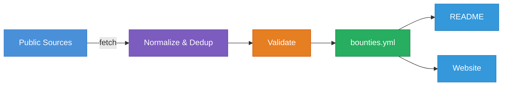

<p align="center">
  <a href="https://bug-bounties.as93.net">
    
  </a>
  <br><br>
  <i>A compiled list of companies who accept responsible disclosure</i><br>
  <a align="center" href="https://bug-bounties.as93.net">🌐 <b>bug-bounties.as93.net</b><br></a>
</p>

<br>

---

## Top Programs

<!-- bounties-start -->
<!-- bounties-end -->

---

## About

The objective of this repo is to provide a centralized place for public bounty programs, along with contact details and rewards.

An aggregated, searchable list of bug bounty and responsible disclosure programs.
Data is pulled from 8 public sources (HackerOne, Bugcrowd, Intigriti, YesWeHack, Federacy, Disclose, ProjectDiscovery, Trickest), normalized, deduplicated, validated against a schema, and merged into [`bounties.yml`](https://github.com/Lissy93/bug-bounties/blob/main/bounties.yml) - the single source of truth.
From there, this readme and the [website](https://bug-bounties.as93.net) are generated automatically.



---

## Usage

Start by clone the repo with `git clone git@github.com:Lissy93/bug-bounties.git && cd bug-bounties`

Then
1. `make install` - Setup environment and install dependencies (from [`requirements.txt`](https://github.com/Lissy93/bug-bounties/blob/main/lib/requirements.txt))
2. `make populate` - Fetch the latest directory of programs, format, and write to `bounties.yml`
3. `make validate` - Verify and validate the [`bounties.yml`](https://github.com/Lissy93/bug-bounties/blob/main/bounties.yml) file against the [`schema.json`](https://github.com/Lissy93/bug-bounties/blob/main/lib/schema.json)
4. `make readme` - Generate and insert a summarized list of programs into the [`README.md`](https://github.com/Lissy93/bug-bounties/blob/main/.github/README.md)

For the website, 
1. `cd web` to navigate into the [`web/`](https://github.com/Lissy93/bug-bounties/tree/main/web) directory
2. `npm i` to install dependencies
3. `npm run dev` to start the development server
4. `npm run build` to build the production site

To deploy the website, either:
- upload the content of `web/dist/` into any web server, static hosting provider or CDN.
- Or, import the project into Vercel, Netlify or a provider of your choice, where it will built and deployed

Alternatively, all the above tasks can be run directly using GitHub Actions. Simply fork the project, and trigger the workflow(s).

---

## Credits

### Supporters
Huge thanks to the following kind people, for their ongoing support in funding this, and other of my projects via GitHub Sponsors

[](https://github.com/sponsors/Lissy93)

### Contributors

[](https://github.com/Lissy93/bug-bounties/graphs/contributors)

### Attributions

#### Data Sources
- [arkadiyt/bounty-targets-data](https://github.com/arkadiyt/bounty-targets-data) - HackerOne, Bugcrowd, Intigriti, YesWeHack, Federacy
- [disclose/diodb](https://github.com/disclose/diodb) - Disclose.io vulnerability disclosure database
- [projectdiscovery/public-bugbounty-programs](https://github.com/projectdiscovery/public-bugbounty-programs) - ProjectDiscovery/Chaos
- [trickest/inventory](https://github.com/trickest/inventory) - Trickest asset inventory

#### Core Dependencies
- [Astro](https://astro.build) + [Svelte](https://svelte.dev) - website
- [PyYAML](https://pyyaml.org) - YAML parsing
- [jsonschema](https://python-jsonschema.readthedocs.io) - schema validation
- [rapidfuzz](https://github.com/rapidfuzz/RapidFuzz) - fuzzy deduplication
- [requests](https://requests.readthedocs.io) - HTTP client

---

## License

> _**[Lissy93/Bug-Bounties](https://github.com/Lissy93/bug-bounties)** is licensed under [MIT](https://github.com/Lissy93/bug-bounties/blob/HEAD/LICENSE) © [Alicia Sykes](https://aliciasykes.com) 2023 - 2026._<br>
> <sup align="right">For information, see <a href="https://tldrlegal.com/license/mit-license">TLDR Legal > MIT</a></sup>

<details>
<summary>Expand License</summary>

```
The MIT License (MIT)
Copyright (c) Alicia Sykes <alicia@omg.com> 

Permission is hereby granted, free of charge, to any person obtaining a copy 
of this software and associated documentation files (the "Software"), to deal 
in the Software without restriction, including without limitation the rights 
to use, copy, modify, merge, publish, distribute, sub-license, and/or sell 
copies of the Software, and to permit persons to whom the Software is furnished 
to do so, subject to the following conditions:

The above copyright notice and this permission notice shall be included install 
copies or substantial portions of the Software.

THE SOFTWARE IS PROVIDED "AS IS", WITHOUT WARRANTY OF ANY KIND, EXPRESS OR IMPLIED,
INCLUDING BUT NOT LIMITED TO THE WARRANTIES OF MERCHANT ABILITY, FITNESS FOR A
PARTICULAR PURPOSE AND NON INFRINGEMENT. IN NO EVENT SHALL THE AUTHORS OR COPYRIGHT
HOLDERS BE LIABLE FOR ANY CLAIM, DAMAGES OR OTHER LIABILITY, WHETHER IN AN ACTION
OF CONTRACT, TORT OR OTHERWISE, ARISING FROM, OUT OF OR IN CONNECTION WITH THE
SOFTWARE OR THE USE OR OTHER DEALINGS IN THE SOFTWARE.
```

</details>

<!-- License + Copyright -->
<p  align="center">
  <i>© <a href="https://aliciasykes.com">Alicia Sykes</a> 2026</i><br>
  <i>Licensed under <a href="https://gist.github.com/Lissy93/143d2ee01ccc5c052a17">MIT</a></i><br>
  <a href="https://github.com/lissy93"></a><br>
  <sup>Thanks for visiting :)</sup>
</p>

<!-- Dinosaurs are Awesome -->
<!-- 
                        . - ~ ~ ~ - .
      ..     _      .-~               ~-.
     //|     \ `..~                      `.
    || |      }  }              /       \  \
(\   \\ \~^..'                 |         }  \
 \`.-~  o      /       }       |        /    \
 (__          |       /        |       /      `.
  `- - ~ ~ -._|      /_ - ~ ~ ^|      /- _      `.
              |     /          |     /     ~-.     ~- _
              |_____|          |_____|         ~ - . _ _~_-_
-->


