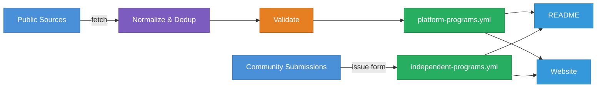

<p align="center">
  <a href="https://bug-bounties.as93.net">
    
  </a>
  <br><br>
  <i>A compiled list of companies who accept responsible disclosure</i><br>
  <a align="center" href="https://bug-bounties.as93.net">🔎 <b>Browse All Programs</b></a> |
  <a align="center" href="https://github.com/Lissy93/bug-bounties/issues/new?template=add.yml">➕ <b>Submit New Program</b><br></a>
</p>

<br>

---

## Top Programs

<!-- bounties-start -->
<details>
<summary><b>Expand List</b></summary>
<sub><b>Key:</b> 💰 = bounty. 🏅 = shout-out. 🎁 = swag.<br>View full list and details at <a href="https://bug-bounties.as93.net/">bug-bounties.as93.net</a></sub>
<details open><summary><h4>A</h4></summary>

-  [AAVE](https://immunefi.com/bug-bounty/aave/) 💰
-  [Abn Amro](https://www.abnamro.nl/en/personal/overabnamro/secure-banking/responsible-disclosure.html) 💰
-  [ABNAMRO BANK](https://personal.rbs.co.uk/personal/fraud-and-security/responsible-disclosure.html) 🏅
-  [Acala](https://immunefi.com/bug-bounty/acala/) 💰
-  [Accellion](https://bugcrowd.com/accellion-public) 💰 🏅
-  [Accredible](https://www.accredible.com/white_hat/) 💰
-  [Achmea](https://www.achmea.nl/en/responsibledisclosure) 🎁
-  [Acorns Grow](https://bugcrowd.com/acorns) 💰
-  [Acorns Grow, Inc.](https://bugcrowd.com/engagements/acorns) 💰
-  [Acorns LLC](https://bugcrowd.com/acorns) 💰
-  [Acquia](https://www.acquia.com/solutions/security) 🏅
-  [Acronis](https://www.acronis.com) 💰
-  [Across Protocol](https://docs.across.to/v/developer-docs/additional-info/bug-bounty) 💰
-  [Actility](https://www.actility.com/security/) 💰
-  [ActiveProspect](https://activeprospect.com/security/) 🏅
-  [Adafruit](https://www.adafruit.com/reportingsecurityissues) 💰
-  [Adobe](https://helpx.adobe.com/security/alertus.html) 💰 🏅
-  [Aera](https://immunefi.com/bug-bounty/aera/) 💰
-  [Aevo](https://immunefi.com/bug-bounty/Aevo/) 💰
-  [Affirm](http://www.affirm.com) 💰
-  [Afterpay Bug Bounty Program](https://bugcrowd.com/engagements/afterpay) 💰
-  [Agicap](https://agicap.com/en/bug-bounty/) 💰
-  [Ahold Delhaize](https://www.aholddelhaize.com/en/security/) 💰 🎁
-  [Aikido Security: Bug Bounty Program](https://www.intigriti.com/programs/aikido/aikido/detail) 💰
-  [Aikido Security: Zen by Aikido](https://www.intigriti.com/programs/aikido/aikidoruntime/detail) 💰
-  [Aion](https://aion.network/terms-bounty/) 💰
-  [Air Miles](https://www.airmiles.nl/responsible-disclosure) 💰
-  [Air Miles Shop](https://www.airmilesshop.nl/responsible-disclosure) 🏅 🎁
-  [Airbnb](https://www.airbnb.com/security) 💰 🏅
-  [Airship](https://www.airship.com/legal/full-disclosure-security-policy/) 🏅
-  [AirSwap](https://blog.airswap.io/airswap-bug-bounty-4d7ec41f3ea7) 💰
-  [Airtable](https://airtable.com/security) 💰
-  [AirVPN](https://airvpn.org/security_policy/) 💰
-  [Aiven](https://www.aven.com/) 💰
-  [Aiven Managed Bug Bounty](https://bugcrowd.com/engagements/aiven-mbb-og) 💰
-  [Alasco GmbH - Bug Bounty Program](https://yeswehack.com/programs/alasco-gmbh-bug-bounty-program) 💰
-  [Alaska Air](https://www.alaskaair.com/content/about-us/site-info/report-site-security-issues) 🏅
-  [Alchemix](https://immunefi.com/bug-bounty/alchemix/) 💰
-  [Alcyon](https://www.alcyon.nl/responsible-disclosure/) 🎁
-  [Aleo](https://immunefi.com/bug-bounty/aleo/) 💰
-  [ALEX](https://immunefi.com/bug-bounty/alex/) 💰
-  [Algemeen Dagblad](https://www.intigriti.com/programs/dpgm/algemeendagblad/detail) 💰
-  [Algolia](https://www.algolia.com/security) 💰 🏅
-  [Algorand](https://bugcrowd.com/algorand) 💰
-  [Alibaba](https://security.alibaba.com/) 💰 🏅
-  [Alienvault](https://cybersecurity.att.com/documentation/usm-appliance/system-overview/how-to-submit-a-security-issue-to-alienvault.htm) 🏅
-  [Aliexpress](https://security.alibaba.com/) 💰 🏅
-  [Aliter Technologies](https://www.aliter.com/vulnerability-disclosure-policy/) 🏅
-  [Allegro](https://hackerone.com/allegro) 💰
-  [Alpen Labs](https://immunefi.com/bug-bounty/alpen-labs/) 💰
-  [Alpha Venture DAO](https://immunefi.com/bug-bounty/AlphaVentureDAO/) 💰
-  [ALSCO](https://alscotoday.com/go/bug) 💰 🏅 🎁
-  [Altera](https://www.intigriti.com/programs/altera/altera/detail) 💰
-  [Altervista](https://en.altervista.org/feedback.php?who=feedback) 🏅
-  [Altilly](https://www.altilly.com/page/security) 💰
-  [AlwaysData](https://www.alwaysdata.com/en/bug-bounty/) 💰
-  [Amara](https://amara.org/en/security) 🏅
-  [Amazon](https://www.amazon.com/gp/help/customer/display.html/ref=hp_left_v4_sib?ie=UTF8&nodeId=201182150) 💰 🎁
-  [Amazon Web Services](https://aws.amazon.com/security/vulnerability-reporting) 💰 🎁
-  [AMD Product Security Bug Bounty Program](https://www.intigriti.com/programs/amd/amd/detail) 💰
-  [AMERICAN SYSTEMS](https://hackerone.com/american_systems_bbp) 💰
-  [Amitree Inc](https://hackerone.com/amitree_inc) 🏅
-  [AmpCode.com](https://ampcode.com/security/) 💰
-  [Android](https://www.google.com/about/appsecurity/android-rewards/) 💰 🏅
-  [Anduril Industries](https://www.anduril.com) 💰 🎁
-  [Ankr](https://immunefi.com/bug-bounty/ankr/) 💰
-  [Ant Group Security Response Center - Bug...](https://yeswehack.com/programs/ant-group-security-response-center-bug-bounty-program) 💰
-  [Antavo Loyalty Management Platform](https://www.hacktify.eu/en/public-programs/) 💰
-  [Ante Finance](https://immunefi.com/bug-bounty/antefinance/) 💰
-  [AnyTask: Freelancer Platform](https://bugcrowd.com/engagements/anytask-mbb-og) 💰
-  [AOL](https://contact.security.aol.com/) 🏅
-  [Apache](https://www.apache.org/security/) 💰
-  [Apache Log4j - Bug Bounty Program](https://yeswehack.com/programs/log4j-bug-bounty-program) 💰
-  [Appcelerator](https://www.appcelerator.com/responsible-disclosure-of-security-vulnerabilities/) 🏅
-  [AppFox](https://bugcrowd.com/engagements/automationconsultants) 💰
-  [Apple](https://developer.apple.com/security-bounty/) 💰 🏅
-  [Apsis](https://www.apsis.com/bug-bounty) 💰
-  [Aqua Security](https://www.aquasec.com/trust/security/responsible-disclosure-program/) 💰
-  [Aragon](https://ark.io/blog/ark-development-and-security-bounty-program-arkio-blog) 💰
-  [Arbitrum](https://immunefi.com/bug-bounty/arbitrum/) 💰
-  [Ark](https://blog.ark.io/ark-github-development-bounty-113806ae9ffe) 💰 🎁
-  [Arkadiko](https://immunefi.com/bug-bounty/arkadiko/) 💰
-  [Arkham](https://immunefi.com/bug-bounty/arkham/) 💰
-  [Arkose Labs](https://www.arkoselabs.com/) 💰
-  [Arlo - Cash Rewards Program](https://bugcrowd.com/arlo) 💰
-  [Arlo Cash Rewards](https://bugcrowd.com/arlo) 💰
-  [Arm](https://developer.arm.com/support/arm-security-updates/report-security-vulnerabilities) 💰
-  [ARM mBed](https://tls.mbed.org/c-library-bug-bounty-program) 💰 🏅
-  [Arrival](https://arrival.com/legal/security#purpose) 🎁
-  [Artsy](https://www.artsy.net/security) 💰
-  [Aruba Networks](https://bugcrowd.com/aruba-public) 💰 🏅
-  [Asana](https://asana.com/bounty) 💰
-  [ASN Bank](https://www.devolksbank.nl/over-ons/kwetsbaarheden-melden) 💰
-  [Aspida](https://immunefi.com/bug-bounty/aspida/) 💰
-  [Assuring Medical Apps](https://digitalhealthcompliance.com/disclosure-en/) 💰
-  [Astar Network](https://immunefi.com/bug-bounty/astarnetwork/) 💰
-  [Aster](https://immunefi.com/bug-bounty/aster/) 💰
-  [Asterisk](https://wiki.asterisk.org/wiki/display/AST/Asterisk+Bug+Bounties) 💰
-  [Astroport](https://immunefi.com/bug-bounty/astroport/) 💰
-  [AT&T](https://bugbounty.att.com/) 💰 🏅
-  [ATG](https://yeswehack.com/programs/atg-public-bug-bounty-program) 💰
-  [ATG Public Bug Bounty Program](https://yeswehack.com/programs/atg-public-bug-bounty-program) 💰
-  [Athento](https://www.athento.com/bug-bounty-program-en/) 💰
-  [Atlassian](https://bugcrowd.com/atlassian) 💰
-  [Atlassian - Opsgenie](https://bugcrowd.com/opsgenie) 💰
-  [Atlassian-Built Apps](https://bugcrowd.com/engagements/atlassianapps) 💰
-  [Audere](https://auderenow.org/security) 🏅
-  [Audible](http://audible.com) 💰
-  [Augur](https://www.augur.net/bounty/) 💰
-  [Aura Finance](https://immunefi.com/bug-bounty/aurafinance/) 💰
-  [Australia Post](https://auspost.com.au/about-us/about-our-site/responsible-disclosure) 🏅
-  [Australian Government Department of Heal...](https://www.health.gov.au/using-our-websites/vulnerability-disclosure-policy) 🏅
-  [Auth0](https://auth0.com/responsible-disclosure-policy/) 🏅
-  [Auth0 by Okta](https://bugcrowd.com/engagements/auth0-okta) 💰
-  [Autodesk](https://www.autodesk.com/trust/incident-response) 🎁
-  [Automata Network](https://www.ata.network/bugbounty) 💰
-  [Automattic](https://automattic.com/security/) 💰 🏅 🎁
-  [Automox](https://www.automox.com/security/responsible-disclosure) 💰
-  [Autonolas](https://immunefi.com/bug-bounty/autonolas/) 💰
-  [Ava Labs](https://immunefi.com/bug-bounty/avalabs/) 💰
-  [Ava Labs Avalanche](https://immunefi.com/bug-bounty/avalanche/) 💰
-  [Avail](https://immunefi.com/bug-bounty/avail/) 💰
-  [Avail Carsharing](https://availcarsharing.com/bug-bounty) 💰
-  [Avalara](https://www.avalara.com/us/en/legal/responsible-disclosure.html) 🏅
-  [Avast!](https://www.avast.com/bug-bounty) 💰
-  [Avira](https://www.avira.com/en/support-vulnerability) 💰 🏅
-  [AVROTROS](https://www.avrotros.nl/privacy/responsible-disclosure/) 🎁
-  [Axel Springer National Media & Tech](https://www.intigriti.com/programs/axelspringerse/nmt/detail) 💰
-  [Axelar Network](https://immunefi.com/bug-bounty/axelarnetwork/) 💰
-  [AXIS OS](https://bugcrowd.com/engagements/axis-os-public) 💰
-  [Ayers Rock Resort](https://www.ayersrockresort.com.au/terms-and-conditions/security) 🏅
-  [Azimo](https://azimo.com/en/lp/responsible-disclosure) 💰

</details>
<details open><summary><h4>B</h4></summary>

-  [Babylon Labs](https://immunefi.com/bug-bounty/babylon-labs/) 💰
-  [Backblaze](https://www.backblaze.com/security.html) 💰
-  [Badoo](https://corp.badoo.com/security) 💰 🏅
-  [Baidu](https://bsrc.baidu.com/v2/#/en) 💰
-  [Balancer](https://immunefi.com/bug-bounty/balancer/) 💰
-  [Balsamiq for Atlassian Products](https://bugcrowd.com/engagements/balsamiq) 💰
-  [Banco Plata](http://platacard.mx) 💰
-  [Base](https://getbase.com/security/) 🏅
-  [Basecamp](https://basecamp.com/about/policies/security/response) 💰 🏅 🎁
-  [BASF](https://www.basf.com/global/en/legal/responsible-disclosure-statement.html) 🏅 🎁
-  [Basilisk](https://immunefi.com/bug-bounty/basilisk/) 💰
-  [Bazaarvoice](https://www.bazaarvoice.com/legal/vulnerability-disclosure-policy/) 🏅
-  [BBC](https://www.bbc.com/backstage/security-disclosure-policy/) 🏅 🎁
-  [Beanstalk](https://support.beanstalkapp.com/article/890-responsible-disclosure-policy) 💰
-  [Beckhoff](https://infosys.beckhoff.com/english.php?content=../content/1033/ipc_security/9007202382327691.html&id=) 🏅
-  [Beefy Finance](https://immunefi.com/bug-bounty/beefyfinance/) 💰
-  [Beets](https://immunefi.com/bug-bounty/beets/) 💰
-  [Beiersdorf](https://www.beiersdorf.com) 🎁
-  [Belvo Technologies Inc.](https://www.federacy.com/belvo-technologies-inc) 💰
-  [BENQI](https://immunefi.com/bug-bounty/benqi/) 💰
-  [Bentley](https://www.bentley.com/responsible_disclosure.pdf) 💰 🏅 🎁
-  [Berachain](https://immunefi.com/bug-bounty/berachain/) 💰
-  [Beradrome](https://immunefi.com/bug-bounty/beradrome/) 💰
-  [Better](https://bugcrowd.com/better) 💰
-  [BiFi](https://immunefi.com/bug-bounty/bifi/) 💰
-  [Bifrost](https://immunefi.com/bug-bounty/bifrostfinance/) 💰
-  [BigBlueButton Bug Bounty Program](https://yeswehack.com/programs/bigbluebutton-bug-bounty-program) 💰
-  [BigCommerce](https://bugcrowd.com/bigcommerce) 💰
-  [Bime](https://www.zendesk.com/company/policies-procedures/#responsible-disclosure-policy) 💰 🏅
-  [Binance](https://bugcrowd.com/binance) 💰
-  [Binary](https://hackerone.com/binary) 💰 🏅
-  [BIND 9 Bug Bounty Program](https://yeswehack.com/programs/bind-bug-bounty-program) 💰
-  [Bitcoin Gold](https://github.com/BTCGPU/Developer-Portal/blob/master/responsible-disclosure.md) 💰
-  [Bitcoin SV](https://immunefi.com/bug-bounty/bitcoinsv/) 💰
-  [BitDefender](https://www.bitdefender.com/bitdefender_vulnerability_disclosure_program.html) 💰
-  [Bitdefender Box v2](https://bugcrowd.com/engagements/bitdefenderbox2) 💰
-  [BitDiscovery](https://bugcrowd.com/bitdiscovery) 💰
-  [Bitfinex](https://www.bitfinex.com/bug-bounty/) 💰
-  [Bitflow](https://immunefi.com/bug-bounty/bitflow/) 💰
-  [Bitgo](https://www.bitgo.com/bug-bounty) 💰 🏅
-  [BitGo Managed Public Bug Bounty Engageme...](https://bugcrowd.com/engagements/bitgo-mbb-og-public) 💰
-  [BitGo Mobile Apps Bug Bounty Engagement](https://bugcrowd.com/engagements/bitgo-mobileapps-mbb-og) 💰
-  [BitMEX](https://www.bitmex.com/app/security) 💰 🎁
-  [BitOasis - Bug Bounty Program](https://yeswehack.com/programs/bitoasis-bug-bounty-program) 💰
-  [Bitpanda Ongoing Bug Bounty](https://bugcrowd.com/engagements/bitpanda-og-bb) 💰
-  [Bitpay](https://support.bitpay.com/hc/en-us/articles/204229369-Does-BitPay-have-a-bug-bounty-program-) 💰
-  [Bitski](https://www.bitski.com/bounty/) 💰
-  [Bitso Managed Bug Bounty Engagement](https://bugcrowd.com/engagements/bitso-mbb-og) 💰
-  [Bitsoffreedom](https://www.bitsoffreedom.nl/coordinated-vulnerability-disclosure-en/) 💰 🏅
-  [Bitwala](https://www.bitwala.com/security/) 💰
-  [BitWall](https://firebounty.com/520-bitwall-security) 🏅
-  [Bitwarden](https://hackerone.com/bitwarden) 🏅
-  [Bizmerlin](https://www.bizmerlin.com/responsible-disclosure-policy/) 🏅
-  [BlaBlaCar](https://yeswehack.com/programs/bug-bounty-program-blablacar) 💰
-  [Blackboard](https://help.blackboard.com/Product_Security) 🏅
-  [Blade Storm](https://bladestorm.zendesk.com/hc/en-us/articles/360010393497-Bug-Bounty-Program) 💰
-  [Blend Labs](https://blend.com) 💰
-  [Block Open Source](https://bugcrowd.com/engagements/blockopensource) 💰
-  [Block Sender](https://blocksender.io/vulnerability-disclosure-policy/) 🏅
-  [Blockchain](https://hackerone.com/blockchain) 💰 🏅
-  [Blockchain.com Managed Bug Bounty Engage...](https://bugcrowd.com/engagements/blockchain-dot-com) 💰
-  [BlockPI Network](https://immunefi.com/bug-bounty/blockpinetwork/) 💰
-  [Blogger](https://www.google.com/about/appsecurity/reward-program/) 💰 🏅
-  [Blue Canvas](https://bluecanvas.io/report-vulnerability) 🏅
-  [Blue Jeans Network](https://bugcrowd.com/bluejeans) 💰
-  [Bluehost](https://bugcrowd.com/endurance-bluehost) 🏅
-  [Bluescape](https://www.bluescape.com/vulnerability-disclosure-policy/) 🏅
-  [Bluesnap](https://home.bluesnap.com/security-bounty/) 💰
-  [BMW](https://www.bmwgroup.com/en/general/Security.html) 🏅
-  [BMW Group](https://hackerone.com/bmwgroup) 💰
-  [BMW Group Automotive](https://www.intigriti.com/programs/bmw/bmwgroup-automotive/detail) 💰
-  [Boba Network](https://immunefi.com/bug-bounty/bobanetwork/) 💰
-  [Bolt Technology OÜ](https://bugcrowd.com/engagements/bolt-og) 💰
-  [BookBeat](https://yeswehack.com/programs/bookbeat) 💰
-  [Booking.com](http://www.booking.com) 💰
-  [Boozt Fashion](https://www.boozt.com) 💰
-  [Bosch](https://psirt.bosch.com/bosch-responsible-disclosure-policy/) 🏅
-  [Bose](https://global.bose.com/en_us/product_security_vulnerability_response.html) 💰
-  [Bpost](https://www.intigriti.com/programs/bpost/dummy/detail) 💰
-  [BProtocol](https://immunefi.com/bug-bounty/bprotocol/) 💰
-  [Braintree](https://www.braintreepayments.com/developers/disclosure) 🏅
-  [Brave](https://hackerone.com/brave?view_policy=true) 💰 🏅 🎁
-  [Brave Software](https://brave.com) 💰 🎁
-  [Braze Public BB](https://bugcrowd.com/engagements/braze-bb) 💰
-  [Braze, Inc.](http://braze.com) 💰
-  [Brisk Infosec](https://www.briskinfosec.com/responsibledisclosure) 🏅
-  [BT Group](https://www.bt.com/about/contact-bt/responsible-disclosure) 🏅
-  [BtcTurk](https://www.btcturk.com/odul-avciligi) 💰
-  [Buddy](https://buddy.works/disclosure-policy) 🏅
-  [Buffer](https://buffer.com/legal#security) 💰 🏅
-  [Bug Bounty Program - BlaBlaCar](https://yeswehack.com/programs/bug-bounty-program-blablacar) 💰
-  [Bug Bounty SNCF Connect](https://yeswehack.com/programs/bug-bounty-sncf-connect-1) 💰
-  [Bugcrowd](https://bugcrowd.com/bugcrowd) 💰 🏅
-  [Bugify](https://bugify.com/security) 🏅
-  [BugPoC](https://bugcrowd.com/bugpoc-mbb) 💰 🏅
-  [Bugv](https://app.bugv.io/researcher/program/0000001/detail) 💰
-  [Bullish](https://bugcrowd.com/bullish) 💰
-  [Bullish Exchange](https://bugcrowd.com/engagements/bullish-exchange) 💰
-  [Bullish.com](https://bugcrowd.com/engagements/bullish) 💰
-  [Bumba](http://bumba.global) 💰
-  [Bumble](https://hackerone.com/bumble) 💰 🏅
-  [Bunq](https://www.bunq.com/assets/media/legal/en/20161114_Responsible_Disclosure_Policy_EN.pdf) 💰 🎁
-  [Burrow](https://immunefi.com/bug-bounty/burrow/) 💰
-  [Buttonwood](https://immunefi.com/bug-bounty/buttonwood/) 💰
-  [Bybit Fintech Ltd](https://www.bybit.com) 💰
-  [Bykea](https://bykea.com) 💰
-  [Bynder](https://www.bynder.com/en/legal/responsible-disclosure-policy/) 🏅
-  [Bytedance](https://security.bytedance.com/media/score-standard/Vulnerability_Rewards_Program.pdf) 💰

</details>
<details open><summary><h4>C</h4></summary>

-  [Caffeine](https://bugcrowd.com/caffeine) 💰
-  [Campaign Monitor](https://www.campaignmonitor.com/trust/report-a-vulnerability/) 💰
-  [Canva](https://www.canva.com/security/bug-bounty/) 💰
-  [Capital One](https://www.capitalone.com/digital/responsible-disclosure/) 💰
-  [Capital.com](https://www.intigriti.com/programs/capitalcom/capitalcom/detail) 💰
-  [CapyFi](https://immunefi.com/bug-bounty/capyfi/) 💰
-  [card.com](https://www.card.com/responsible-disclosure-policy) 🏅
-  [Cardano Foundation](https://immunefi.com/bug-bounty/cardanofoundation/) 💰
-  [CareEvolution](https://careevolution.com/trust/security-research/) 💰
-  [Cash App](https://bugcrowd.com/cashapp) 💰
-  [Casper](https://hackerone.com/casper) 💰 🏅
-  [Cedars-Sinai](http://cedars-sinai.edu) 🎁
-  [Celer](https://immunefi.com/bug-bounty/celer/) 💰
-  [Centers for Medicare & Medicaid Services...](https://bugcrowd.com/engagements/cms-bbpublic) 💰
-  [Centrify](https://bugcrowd.com/centrify) 💰 🏅
-  [CERN](https://security.web.cern.ch/home/en/cvd.shtml) 🏅
-  [CERT/CC](https://vuls.cert.org/confluence/display/Wiki/Vulnerability+Disclosure+Policy) 🏅 🎁
-  [Certinia (formerly FinancialForce)](https://bugcrowd.com/engagements/financialforce) 💰
-  [CFP Time](https://hackerone.com/cfptime) 🏅
-  [Chainlink](https://hackerone.com/chainlink) 💰 🏅
-  [ChainRift](https://medium.com/chainrift/chainrift-launches-bug-bounty-program-6255eb2d518d) 💰
-  [Chalk](https://www.chalk.com/security/) 🏅
-  [Chameleon](https://www.trychameleon.com/security/disclosure) 💰 🏅
-  [Chargezoom](https://bugbounty.chargezoom.com/support/tickets/new) 💰
-  [Charm](https://immunefi.com/bug-bounty/charm/) 💰
-  [Chaturbate](https://hackerone.com/chaturbate) 💰 🏅 🎁
-  [Check](https://checkhq.com/security) 💰
-  [Chia Network](http://chia.net) 💰
-  [Chime](https://hackerone.com/chime) 💰
-  [Chime Managed Bug Bounty Engagement](https://bugcrowd.com/engagements/chime) 💰
-  [Circle](https://www.circle.com/) 💰
-  [CircleCi](https://circleci.com/security) 💰 🎁
-  [Cisco Meraki](https://bugcrowd.com/ciscomeraki) 💰
-  [Cisco ThousandEyes Vulnerability Hunting...](https://bugcrowd.com/engagements/thousandeyes-og) 💰
-  [Citrix](https://www.citrix.com/about/trust-center/vulnerability-process.html) 💰
-  [City of Vienna Managed Bug Bounty](https://bugcrowd.com/engagements/city-of-vienna-mbb-og) 💰
-  [City-Data.com](https://www.city-data.com/bug-bounty.html) 💰 🏅
-  [cLabs](https://app.intigriti.com/programs/clabs/clabs/detail) 💰
-  [Clario](https://hackerone.com/clario) 💰
-  [Claromentis](https://www.claromentis.com/responsible-disclosure-policy/) 🏅
-  [Classdojo](https://www.classdojo.com/securitydisclosureprogram/) 💰
-  [Clause](https://clause.io/security) 💰 🏅
-  [CLEAR](https://www.clearme.com/) 💰
-  [Clenergy](https://clenergy.com/de/cyber-security-policy/?lang=en) 💰
-  [ClickHouse](https://bugcrowd.com/engagements/clickhouse) 💰
-  [Clickup](https://clickup.com/bug-bounty) 💰
-  [Clio](https://support.clio.com/hc/en-us/articles/360001114273-How-do-I-Claim-a-Bug-Bounty-or-Report-a-Vulnerability-) 💰
-  [Clipperz](https://clipperz.is/security_privacy/responsible_disclosure_policy/) 🏅
-  [Cloudapp](https://support.getcloudapp.com/article/260-responsible-disclosure-report-found-vulnerabilities) 🏅
-  [CloudCannon](https://cloudcannon.com/bug-bounty/) 💰
-  [CloudFlare](https://www.cloudflare.com/en-gb/disclosure/) 💰 🏅
-  [Cloudinary](https://bugcrowd.com/cloudinary) 💰
-  [Cloudways](https://bugcrowd.com/cloudways) 💰
-  [Cloudways by DigitalOcean](https://www.intigriti.com/programs/digitalocean/cloudways/detail) 💰
-  [CM.com](https://www.intigriti.com/programs/cmcom/cmcom/detail) 💰
-  [Coalition](https://hackerone.com/coalition) 🏅
-  [Cobalt](https://cobalt.io/security/practices) 🏅
-  [Cobinhood](https://hackerone.com/cobinhood) 💰 🏅
-  [Coda](https://hackerone.com/coda_bbp) 💰
-  [Code Climate](https://codeclimate.com/security) 🏅
-  [Code.org](https://bugcrowd.com/engagements/codeorg) 💰
-  [CodeChef](https://www.codechef.com/bug-bounty-program) 💰
-  [codeclou GmbH](https://bugcrowd.com/engagements/codeclou) 💰
-  [Codefi](https://hackerone.com/codefi_bbp) 💰
-  [codefortynine](https://bugcrowd.com/engagements/codefortynine) 💰
-  [Codeigniter](https://hackerone.com/codeigniter) 🏅
-  [Cofense](https://cofense.com/responsible-disclosure/) 🏅
-  [Coffee & Bagel Brands](https://www.coffeeandbagels.com/responsible-disclosure/) 🏅
-  [Coin Wallet](https://coinapp.zendesk.com/hc/en-us/articles/115001730468-Does-CoinSpace-have-a-bug-bounty-program-) 💰
-  [Coinbase](https://coinbase.com/whitehat) 💰 🏅 🎁
-  [Coindcx](https://yeswehack.com/programs/coindcx-bug-bounty-program#program-description) 💰
-  [Coindcx - Bug Bounty Program](https://yeswehack.com/programs/coindcx-bug-bounty-program) 💰
-  [CoinDesk Data - Data API](https://bugcrowd.com/engagements/CCData-mbb-og) 💰
-  [CoinDesk Mobile](https://bugcrowd.com/engagements/coindesk-mobile-mbb-og) 💰
-  [CoinDesk.com](https://bugcrowd.com/engagements/coindesk-mbb-og) 💰
-  [Coinhako](https://coinhako.com) 💰
-  [CoinJar](https://www.coinjar.com/bounty) 💰
-  [CoinMate.io](https://coinmate.io) 💰
-  [Coinpayments](https://www.coinpayments.net/help-bug-bounty) 💰 🏅
-  [Coinspot](http://coinspot.com.au) 💰
-  [Cointracker](https://www.cointracker.io/security) 💰
-  [Colined](https://bugcrowd.com/engagements/colined) 💰
-  [Comcast Xfinity](https://bugcrowd.com/comcastvdp) 💰
-  [Commonsware](https://commonsware.com/bounty.html) 🎁
-  [Compass](https://www.compass.com/legal/responsible-disclosure/) 💰
-  [Compose](https://www.compose.com/security) 🏅
-  [Compound Finance](https://immunefi.com/bug-bounty/compoundfinance/) 💰
-  [Conclusion](https://www.conclusion.nl/kleine-lettertjes/responsible-disclosure) 🏅 🎁
-  [Concrete CMS](https://www.concretecms.org) 🎁
-  [Concrete5](https://www.concrete5.org/developers/security) 🏅
-  [Connext](https://immunefi.com/bug-bounty/connext/) 💰
-  [Consensus by CoinDesk](https://bugcrowd.com/engagements/consensus-mbb-og) 💰
-  [Consensys](http://consensys.io) 💰
-  [Contentsquare](https://yeswehack.com/programs/contentsquare-bug-bounty-program) 💰
-  [Copper](https://hackerone.com/copper) 🏅
-  [Coreum](https://immunefi.com/bug-bounty/coreum/) 💰
-  [Cornershop](https://hackerone.com/cornershop) 💰
-  [Cosmos](https://cosmoslabs.io) 💰
-  [Council on Foreign Relations](https://bugcrowd.com/engagements/cfr) 💰
-  [Coursera](https://hackerone.com/coursera) 🏅 🎁
-  [Cove](https://immunefi.com/bug-bounty/cove/) 💰
-  [CoW Protocol](https://immunefi.com/bug-bounty/cowprotocol/) 💰
-  [cPanel](https://cpanel.net/cpanel-security-bounty-program/) 💰 🏅
-  [Craft Coders Marketplace Bug Bounty](https://bugcrowd.com/engagements/craftcoders) 💰
-  [Crashtest Security](https://crashtest-security.com/responsible-disclosure/) 🏅
-  [Credit Karma](https://creditkarma.com) 💰
-  [Cross Border Fines](https://www.intigriti.com/programs/bpost/crossborderfines/detail) 💰
-  [Crowdstrike](https://hackerone.com/crowdstrike) 💰 🏅
-  [Crypto.com](https://crypto.com) 💰 🎁
-  [Cryptobox](https://yeswehack.com/programs/cryptobox-bug-bounty) 💰
-  [CS Money](https://cs.money) 💰
-  [Curl](https://hackerone.com/curl) 💰 🏅
-  [Currencycloud](https://www.currencycloud.com/legal/responsible-disclosure/) 🏅
-  [Curve](https://hackerone.com/curve) 💰
-  [Custellence](https://custellence.com/responsible-disclosure.html) 💰
-  [Cuvva](https://hackerone.com/cuvva) 🏅
-  [CyberGhost](https://bugcrowd.com/cyberghost) 💰
-  [CyberGhost - Bug Bounty Program](https://yeswehack.com/programs/cyberghost-bug-bounty-program) 💰
-  [Cybermalveillance.gouv.fr  - sensibiliza...](https://yeswehack.com/programs/cybermalveillance-gouv-fr-sensibilization-prevention-and-support-in-terms-of-cybersecurity) 💰
-  [Cybermarqt](https://cybermarqt.com/responsible-disclosure) 🏅
-  [Cybrary](https://bugcrowd.com/cybrary) 🏅

</details>
<details open><summary><h4>D</h4></summary>

-  [D66](https://d66.nl/responsible-disclosure/) 💰
-  [Dailymotion](https://yeswehack.com/programs/dailymotion-public-bug-bounty) 💰
-  [Dailymotion public bug bounty](https://yeswehack.com/programs/dailymotion-public-bug-bounty) 💰
-  [Daimo Pay](https://immunefi.com/bug-bounty/daimo-pay/) 💰
-  [DANA Bug Bounty Program](https://yeswehack.com/programs/dana-bug-bounty-program) 💰
-  [Danske Bank](https://danskebank.com/responsible-disclosure) 💰
-  [Dashlane](https://hackerone.com/dashlane) 💰 🏅
-  [Databricks](https://databricks.com/) 💰
-  [DataCamp](https://www.intigriti.com/programs/datacamp/datacamp/detail) 💰
-  [DATADOME](https://yeswehack.com/programs/datadome-bug-bounty) 💰
-  [DataDome Bot Bounty](https://yeswehack.com/programs/datadome-bot-bounty) 💰
-  [DataStax](https://hackerone.com/datastax) 💰
-  [Dato Capital](https://en.datocapital.com/report-security-issue.html) 🏅
-  [Datto VDP](https://www.datto.com/legal/vulnerability-disclosure-program) 💰 🎁
-  [DC3](https://www.dc3.mil/Vulnerability-Disclosure/Vulnerability-Disclosure-Program-VDP/) 🏅
-  [De Morgen](https://www.intigriti.com/programs/dpgm/demorgen/detail) 💰
-  [De Rechtspraak](https://www.rechtspraak.nl/English/Contact/Pages/Contact-point-vulnerabilities-responsible-disclosure.aspx) 🎁
-  [De Volksbank](https://hackerone.com/devolksbank) 💰
-  [De Volkskrant](https://www.intigriti.com/programs/dpgm/devolkskrant/detail) 💰
-  [Debricked](https://debricked.com/report-a-vulnerability/) 💰 🏅
-  [deBridge](https://immunefi.com/bug-bounty/debridge/) 💰
-  [DECATHLON](https://yeswehack.com/programs/decathlon) 💰
-  [Decentraland](https://immunefi.com/bug-bounty/decentraland/) 💰
-  [Decred](https://bounty.decred.org/) 💰 🏅
-  [Deezer](https://yeswehack.com/programs/deezer-bug-bounty-program-2019) 💰
-  [DefectDojo](https://hackerone.com/defectdojo) 🏅
-  [DeFi Saver](https://immunefi.com/bug-bounty/defisaver/) 💰
-  [Defibox](https://support.newdex.net/hc/en-us/articles/360046715092-Defibox-launches-bug-bounty-program-officially) 💰
-  [Definity Inc.](https://definityinc.com/bug-bounty-program/) 💰
-  [Delen Private Bank](https://www.intigriti.com/programs/delenprivatebank/privatebankdelen/detail) 💰
-  [delight-im](https://www.federacy.com/delight-im) 💰
-  [Deliveroo](https://hackerone.com/deliveroo) 💰 🏅
-  [Dell Technologies](https://bugcrowd.com/dell-com) 💰
-  [Dell Technologies Application Bug Bounty](https://bugcrowd.com/engagements/dell-com) 💰
-  [Dell Technologies' Products Bug Bounty P...](https://bugcrowd.com/engagements/dell-product) 💰
-  [DeNederlandscheBank](https://www.dnb.nl/en/responsible-disclosure/index.jsp) 💰
-  [DENSO WAVE](https://www.denso-wave.com/en/psirt/) 🏅
-  [Dentrix](https://www.dentrix.com/support/data-security/bug-bounty-program) 💰 🏅
-  [Department Of Defense](https://hackerone.com/deptofdefense) 🏅
-  [Deri Protocol](https://immunefi.com/bug-bounty/deriprotocol/) 💰
-  [Deribit](https://www.deribit.com/pages/information/bug-bounty-program) 💰
-  [Deriv.com](https://www.deriv.com) 💰
-  [DeskPro](https://www.deskpro.com/security/responsible-disclosure/) 💰 🏅
-  [Detectify](https://detectify.com/responsible_disclosure) 🏅
-  [Deutsche Telekom](https://www.telekom.com/en/corporate-responsibility/data-protection-data-security/security/details/closing-security-gaps-360054) 💰 🏅
-  [DeXe Protocol](https://immunefi.com/bug-bounty/dexeprotocol/) 💰
-  [dForce](https://immunefi.com/bug-bounty/dforce/) 💰
-  [dfuse Platform](https://hackerone.com/dfuse) 💰 🏅
-  [DFX Finance](https://immunefi.com/bug-bounty/dfxfinance/) 💰
-  [dHEDGE](https://immunefi.com/bug-bounty/dhedge/) 💰
-  [Digital Asset](https://www.digitalasset.com/responsible-disclosure) 🏅
-  [DigitalOcean](https://hackerone.com/digitalocean) 💰
-  [DINUM - AGORA GOUV - Public Bug Bounty P...](https://yeswehack.com/programs/agora) 💰
-  [DINUM - Démarches Simplifiées - Public B...](https://yeswehack.com/programs/demarches-simplifiees-public) 💰
-  [DINUM - ProConnect Identité - Public Bug...](https://yeswehack.com/programs/proconnect-identite) 💰
-  [DINUM - Tchap - Bug Bounty Program](https://yeswehack.com/programs/tchap-public) 💰
-  [Directly](https://bugcrowd.com/directly) 💰
-  [Discord](https://canary.discord.com/security) 💰
-  [Discourse](https://hackerone.com/discourse) 💰 🏅
-  [Discover Financial Services](https://discover.responsibledisclosure.com/hc/en-us) 💰 🏅
-  [Django](https://hackerone.com/django) 💰 🏅
-  [DJI](https://security.dji.com/policy) 💰 🏅
-  [DNSimple](https://dnsimple.com/security) 🏅
-  [Doctolib](https://yeswehack.com/programs/doctolib-public-bug-bounty-program) 💰
-  [DODO](https://immunefi.com/bug-bounty/dodo/) 💰
-  [Doist](https://todoist.com/help/articles/doist-bug-bounty-policy) 💰
-  [Dokobit](https://www.dokobit.com/compliance/vulnerability-disclosure-policy) 💰
-  [Dominos](https://dominos.responsibledisclosure.com/hc/en-us) 🏅
-  [DoorDash](http://doordash.com) 💰
-  [Doppler](https://www.doppler.com) 💰
-  [Dossier Medical Partagé Bug Bounty Progr...](https://yeswehack.com/programs/dossier-medical-partage-program) 💰
-  [Dovecot](https://hackerone.com/dovecot) 💰 🏅 🎁
-  [Dozuki](https://help.dozuki.com/Info/Responsible_Disclosure) 💰 🏅
-  [DPD](https://getdpd.com/security/) 💰 🏅
-  [DPG Media](https://app.intigriti.com/programs/dpgm/dpgmedia/detail) 💰
-  [DRACOON](https://security.dracoon.com) 💰
-  [DragonEx](https://dragonex.zendesk.com/hc/en-us/articles/360036938832-BUG-Bounty-Program) 💰
-  [Drips](https://immunefi.com/bug-bounty/drips/) 💰
-  [Droom](https://droom.in/bugbounty) 💰 🏅
-  [Dropbox](https://hackerone.com/dropbox) 💰 🏅
-  [Drugs.com](https://www.drugs.com/support/responsible-disclosure-policy.html) 🏅
-  [Drupal](https://www.drupal.org/drupal-security-team) 🏅
-  [Dstny](https://www.intigriti.com/programs/dstny/dstnybugbounty/detail) 💰
-  [DuckDuckGo](https://hackerone.com/duckduckgo) 🏅 🎁
-  [Dutch Tax Office](https://www.belastingdienst.nl/wps/wcm/connect/bldcontenten/standaard_functies/individuals/contact/data-leak-vulnerability-abuse-computer-systems/data-leak-vulnerability-abuse-computer-systems-report) 🎁
-  [Dynamic Labs](http://dynamic.xyz) 💰
-  [Dynatrace](https://dynatrace.com) 💰
-  [Dyson](http://dyson.com) 💰

</details>
<details open><summary><h4>E</h4></summary>

-  [Early Warning](https://www.earlywarning.com/responsible-disclosure-program) 💰
-  [Easyname](https://www.easyname.de/de/support/easyname/253-bug-bounty-programm) 💰
-  [Easyprojects](https://www.easyprojects.net/company/vulnerability-reward-program/) 💰
-  [eazyBI](https://bugcrowd.com/engagements/eazybi) 💰
-  [eBay](https://pages.ebay.com/securitycenter/security_researchers.html) 🏅
-  [EC-Council](https://www.eccouncil.org/bug-bounty/) 💰 🏅
-  [Eclipse](https://www.eclipse.org/security/) 💰
-  [Ecobee](https://hackerone.com/ecobee) 🏅
-  [Ed](https://hackerone.com/ed) 🏅
-  [Edmodo](https://support.edmodo.com/hc/en-us/articles/360035475733-Bug-Bounty-Guidelines) 💰 🎁
-  [Eero](https://eero.com/) 💰
-  [Eggy](https://eggy.com.au/vulnerability-disclosure/) 🏅
-  [eHealth Hub VZN KUL](https://www.intigriti.com/programs/uz%20leuven/ehealthhub%26meta-hubvznkul/detail) 💰
-  [EigenLayer](https://immunefi.com/bug-bounty/eigenlayer/) 💰
-  [Elastic](https://www.elastic.co/cloud/security) 💰
-  [Electroneum Legacy Blockchain: EOL](https://bugcrowd.com/engagements/legacy-blockchain-mbb-og) 💰
-  [Electroneum Smart Chain (ETN-SC) — EVM-C...](https://bugcrowd.com/engagements/smartchain-mbb-og) 💰
-  [Electroneum Wallet: Gateway to the ETN C...](https://bugcrowd.com/engagements/myapp-mbb-og) 💰
-  [Electronic Frontier Foundation](https://www.eff.org/security) 🏅 🎁
-  [Elementor](https://bugcrowd.com/elementor) 💰
-  [Elementor: Bug Bounty Program](https://bugcrowd.com/engagements/elementor) 💰
-  [Eligible](https://eligible.com/responsible_disclosure_program) 💰
-  [Elive](https://www.elvie.com/security-research-and-responsible-disclosure) 🏅
-  [Ellucian](https://www.ellucian.com/responsible-disclosure) 🏅
-  [elmah.io](https://docs.elmah.io/vulnerability-disclosure-program/) 💰
-  [Emma](https://myemma.com/trust/report-a-vulnerability/) 💰
-  [Empower Personal Wealth](https://bugcrowd.com/engagements/personalcapital) 💰
-  [Empuls](https://www.empuls.io/bug-bounty) 💰
-  [Enjin](https://enjin.io) 💰 🎁
-  [ENS](https://docs.ens.domains/bug-bounty-program) 💰
-  [Ensuro](https://immunefi.com/bug-bounty/ensuro/) 💰
-  [Entain Game Logic Flaws Bug Bounty Progr...](https://bugcrowd.com/engagements/entain-glf-mbb-og) 💰
-  [Entain Public Managed Bug Bounty Engagem...](https://bugcrowd.com/engagements/entain-public-mbb-og) 💰
-  [Envato](https://webuild.envato.com/helpful-hacker/) 🏅
-  [Enzyme Blue](https://immunefi.com/bug-bounty/enzymefinance/) 💰
-  [Enzyme Onyx](https://immunefi.com/bug-bounty/enzyme-onyx/) 💰
-  [Eobot](https://hackerone.com/eobotcom) 💰 🏅
-  [EPAM Systems Managed Bug Bounty Program](https://bugcrowd.com/engagements/epam-mbb-og) 💰
-  [Epic Games](https://epicgames.com) 💰 🎁
-  [Equifax](https://hackerone.com/equifax) 🏅 🎁
-  [Eset](https://www.eset.com/int/security-vulnerability-reporting/) 💰
-  [Eslint](https://hackerone.com/eslint) 🏅
-  [Eternal](https://www.eternal.com) 💰
-  [Ethena](https://immunefi.com/bug-bounty/ethena/) 💰
-  [Ether.fi](https://immunefi.com/bug-bounty/etherfi/) 💰
-  [Ethereum Foundation](https://bounty.ethereum.org/) 💰
-  [Etherscan](https://etherscan.io/bugbounty) 💰
-  [eToro](https://hackerone.com/etoro_bbp) 💰
-  [eToro Managed Bug Bounty Engagement](https://bugcrowd.com/engagements/etoro-mbb-og) 💰
-  [Etsy](https://bugcrowd.com/etsy) 💰 🏅
-  [eufy Security](http://eufy.com) 💰
-  [Eurid](https://eurid.eu/lv/other-infomation/eurid-responsible-disclosure-policy/) 💰
-  [Eurofins](https://www.eurofins.com/) 🎁
-  [Eventbrite](https://www.eventbrite.com/security/) 🏅
-  [Evernote](https://evernote.com/security/report-issue) 💰 🏅
-  [Exactly](https://immunefi.com/bug-bounty/exactly/) 💰
-  [Exness](https://www.exness.com) 💰 🎁
-  [Exodus](https://www.exodus.com) 💰
-  [Exoscale Bug Bounty](https://www.intigriti.com/programs/exoscale/excoscalebugbounty/detail) 💰
-  [Expatistan](https://www.expatistan.com/security) 🏅
-  [ExpressionEngine](https://hackerone.com/expressionengine) 🏅
-  [ExpressVPN](https://bugcrowd.com/expressvpn) 💰 🏅
-  [Extra Finance](https://immunefi.com/bug-bounty/extrafinance/) 💰
-  [Ezviz](https://yeswehack.com/programs/ezviz-bug-bounty-program#program-description) 💰
-  [Ezviz - Bug Bounty Program](https://yeswehack.com/programs/ezviz-bug-bounty-program) 💰

</details>
<details open><summary><h4>F</h4></summary>

-  [F Secure](https://www.f-secure.com/en/business/programs/vulnerability-reward-program) 💰
-  [F5 Networks](https://support.f5.com/csp/article/K4602) 💰
-  [Facebook](https://www.facebook.com/BugBounty/) 💰 🏅
-  [Fair](https://www.fair.com/bug-bounty) 💰
-  [FanDuel](https://www.fanduel.com/security) 💰 🏅 🎁
-  [Faraday, Inc.](https://faraday.ai) 💰
-  [Farcaster](https://immunefi.com/bug-bounty/farcaster/) 💰
-  [Fastly](https://www.fastly.com/security/report-security-issue) 🎁
-  [FastMail](https://www.fastmail.com/about/bugbounty.html) 💰 🏅
-  [FBTC](https://immunefi.com/bug-bounty/fbtc/) 💰
-  [FDJ United (Online Betting and Gaming) -...](https://yeswehack.com/programs/fdj-united-online-betting-gaming-bug-bounty-program) 💰
-  [Federacy](https://www.federacy.com/federacy) 💰
-  [Felix](https://immunefi.com/bug-bounty/felix/) 💰
-  [Felix Health Managed Bug Bounty Engageme...](https://bugcrowd.com/engagements/felix-health-mbb-og) 💰
-  [Ferm Rotterdam](https://ferm-rotterdam.nl/nl/responsible-disclosure-statement) 💰
-  [Fertitta Entertainment](https://www.fertittaentertainmentinc.com/) 🎁
-  [Fetlife](https://fetlife.com) 💰
-  [Fiat Chrysler Automobiles](https://bugcrowd.com/fca) 💰 🏅
-  [Fig](https://hackerone.com/fig) 💰
-  [Figma](https://figma.com) 💰
-  [Filecoin](https://security.filecoin.io/bug-bounty/) 💰
-  [Files.com](https://hackerone.com/files) 💰 🏅 🎁
-  [FileZilla](https://hackerone.com/filezilla_h1c) 💰 🏅
-  [Fing Bug Bounty Program](https://www.intigriti.com/programs/lansweeper/fing/detail) 💰
-  [Firebase](https://firebase.google.com/support/contact/) 🎁
-  [Fireblocks MPC Managed Bug Bounty Engage...](https://bugcrowd.com/engagements/fireblocks-mbb-og2) 💰
-  [Firedancer](https://immunefi.com/bug-bounty/firedancer/) 💰
-  [Fireeye](https://www.fireeye.com/company/security.html) 🏅
-  [First](https://www.first.org/about/bugs) 🏅
-  [FIS](https://bugcrowd.com/engagements/fis) 💰
-  [Fitbit](https://bugcrowd.com/fitbit) 💰 🏅
-  [Fivetran](https://bugcrowd.com/engagements/fivetran-mbb-og) 💰
-  [Flamingo Finance](https://immunefi.com/bug-bounty/flamingofinance/) 💰
-  [Flare FAssets](https://immunefi.com/bug-bounty/fassets/) 💰
-  [Flare Network](https://immunefi.com/bug-bounty/flarenetwork/) 💰
-  [Flickr](https://hackerone.com/flickr) 💰 🏅
-  [Flipkart](https://www.flipkart.com/pages/security) 💰
-  [Flo](https://flo.health/responsible-vulnerability-disclosure-program) 💰
-  [FloorDAO](https://docs.floor.xyz/v/en/protocol/bug-bounty) 💰
-  [FloQast](https://floqast.com) 💰 🎁
-  [Flourish](https://bugcrowd.com/flourish) 💰
-  [Flutter UK&I](https://www.flutter.com/our-business/our-divisions) 💰
-  [Flux Finance](https://immunefi.com/bug-bounty/fluxfinance/) 💰
-  [Fluxiom](https://www.fluxiom.com/security) 🏅
-  [FOIL](https://immunefi.com/bug-bounty/foil/) 💰
-  [Folks Finance](https://immunefi.com/bug-bounty/folksfinance/) 💰
-  [Fondy](https://docs.fondy.eu/en/docs/page/bug-bounty-program) 💰
-  [Fontys](https://fontys.edu/About-Fontys-4/Responsible-disclosure.htm) 🏅
-  [Forage](https://www.theforage.com/security/disclosure) 🏅
-  [Ford](https://hackerone.com/ford) 💰 🏅 🎁
-  [ForeScout Technologies](https://hackerone.com/forescout_technologies) 💰 🏅
-  [FormAssembly](https://hackerone.com/formassembly) 🏅 🎁
-  [Forta Network](https://immunefi.com/bug-bounty/forta/) 💰
-  [Fountain](https://www.fountain.com/security) 🏅
-  [Foursquare](https://foursquare.com/about/security) 🏅
-  [FoxyCart](https://bugcrowd.com/foxycart) 💰
-  [FranceConnect / FranceConnect+ - DINUM](https://yeswehack.com/programs/franceconnect-proconnect-public) 💰
-  [Frax Finance](https://docs.frax.finance/smart-contracts/miscellaneous) 💰
-  [Free Law Project](https://free.law/vulnerability-disclosure-policy/) 🏅
-  [Freelancer](https://www.freelancer.com/about/security) 🏅
-  [Freshbooks](https://www.freshbooks.com/policies/responsible-disclosure) 🏅
-  [Freshworks](https://www.freshworks.com/security/responsible-disclosure/) 💰 🏅
-  [Front](https://frontapp.com) 💰
-  [Frontegg](http://www.frontegg.com) 💰
-  [Fuga](https://fuga.cloud/responsible-disclosure-policy/) 🏅 🎁
-  [Fullstory](https://fullstory.responsibledisclosure.com/hc/en-us) 🏅
-  [FUSION](https://www.fusion.org/developers/bug-bounty#bugs) 💰 🏅

</details>
<details open><summary><h4>G</h4></summary>

-  [g.cn](https://g.co/vrp) 💰
-  [Gains Network](https://immunefi.com/bug-bounty/gainsnetwork/) 💰
-  [Gala Games](https://immunefi.com/bug-bounty/galagames/) 💰
-  [Gamma](https://www.gamma.nl/klantenservice/veiligheid-privacy/responsible-disclosure) 💰 🏅
-  [GammaSwap](https://immunefi.com/bug-bounty/gammaswap/) 💰
-  [Gcore](https://gcore.com/bug-bounty-program/) 💰
-  [Gear](https://immunefi.com/bug-bounty/gear/) 💰
-  [Gearbox](https://immunefi.com/bug-bounty/gearbox/) 💰
-  [Gearset: Managed Bug Bounty](https://bugcrowd.com/engagements/gearset-mbb) 💰
-  [General Motors Company](https://hackerone.com/gm) 🏅
-  [Genetec](https://www.genetec.com/trust-cybersecurity/bug-bounty) 💰
-  [Geniebelt](https://www.letsbuild.com/responsible-disclosure) 🏅 🎁
-  [Geotab](https://www.geotab.com/security/) 💰 🏅
-  [GetAmbassador](https://blog.getambassador.io/security-in-ambassador-a-risk-based-approach-fd24e364ea84) 🎁
-  [Getbase](https://bugbounty.getbase.com/) 🏅
-  [Ghostscript](https://ghostscript.com/Bug_bounty_program.html) 💰
-  [Gitcoin](https://docs.gitcoin.co/mk_securitybounty/) 💰
-  [Github](https://bounty.github.com/) 💰 🏅
-  [Gitlab](https://about.gitlab.com/security/disclosure/) 💰 🏅
-  [Glassdoor](https://www.glassdoor.com/) 💰
-  [Glean Technologies Public Engagement](https://bugcrowd.com/engagements/glean-technologies-public) 💰
-  [Glo Dollar](https://immunefi.com/bug-bounty/glodollar/) 💰
-  [Global](https://global.com/bug-bounty-policy/) 💰
-  [GMX](https://immunefi.com/bug-bounty/gmx/) 💰
-  [Gnosis Chain](https://immunefi.com/bug-bounty/gnosischain/) 💰
-  [GO-JEK](https://bugcrowd.com/gojek) 💰
-  [gocardless.com](https://gocardless.com) 💰
-  [GoGoPool](https://immunefi.com/bug-bounty/gogopool/) 💰
-  [GOJEK](https://hackerone.com/gojek) 💰
-  [GOJEK - Public Bounty Program](https://yeswehack.com/programs/gojek-bug-bounty-program) 💰
-  [Goldman Sachs](https://www.goldmansachs.com/privacy-and-cookies/global-privacy-policy.html) 💰 🏅 🎁
-  [GoodRx](https://www.goodrx.com) 💰
-  [Google](https://www.google.com/about/appsecurity/) 💰
-  [Google Chrome](https://www.google.com/about/appsecurity/chrome-rewards/) 💰 🏅
-  [Google PRP](https://www.google.com/about/appsecurity/patch-rewards/index.html) 💰
-  [GoTo Financial - Public Bounty Program](https://yeswehack.com/programs/goto-financial-public-bounty-program) 💰
-  [GovTech](https://yeswehack.com/programs/govtech-vulnerability-disclosure-programme-policy) 💰
-  [Govtech Singapore](https://www.tech.gov.sg/report_vulnerability) 🏅
-  [Grab](https://hackerone.com/grab) 💰 🏅
-  [Grafana Labs](https://www.intigriti.com/programs/grafanalabs/grafanaossbbp/detail) 💰
-  [Grammarly](https://hackerone.com/grammarly) 💰 🏅
-  [Granite Protocol](https://immunefi.com/bug-bounty/granite-protocol/) 💰
-  [Greenhouse.io](https://hackerone.com/greenhouse) 💰 🏅
-  [Grindr](https://www.grindr.com) 💰
-  [Grofers](https://grofers.com/bug-bounty) 💰 🏅
-  [Grok Learning](https://groklearning.com/policies/security/) 🏅
-  [Groww](https://groww.in/p/security/) 💰
-  [GRW Trading FZE - Open Bug Bounty Progra...](https://yeswehack.com/programs/grw-trading-fze-bug-bounty-program) 💰
-  [GSMA](https://www.gsma.com/security/gsma-coordinated-vulnerability-disclosure-programme/) 🏅
-  [Guilded](https://support.guilded.gg/hc/en-us/articles/360039728333-Contact) 🎁
-  [Gusto](https://bugcrowd.com/gusto) 💰 🏅

</details>
<details open><summary><h4>H</h4></summary>

-  [H&M Group](https://www2.hm.com/security.txt) 💰
-  [Hack Me!](https://bugcrowd.com/hackme) 🏅
-  [Hack The Box](https://www.hackthebox.com/) 🎁
-  [Hackchecks Infosec Solutions](https://hackchecks.in/responsible-disclosure/) 🏅
-  [Hackerone](https://hackerone.com/security) 💰 🏅
-  [HackerRank](https://www.hackerrank.com/trust/security/) 🎁
-  [Hacking-Lab](https://bugbounty.compass-security.com/bug-bounties/compass-bug-bounty) 💰
-  [Hake Finance](https://immunefi.com/bounty/hakkafinance/) 💰
-  [Halodoc](https://www.halodoc.com/security) 💰 🏅
-  [halp.com](https://www.atlassian.com/trust/security/report-a-vulnerability) 💰
-  [HARMAN International](https://yeswehack.com/programs/harman-international-web-applications) 💰
-  [HARMAN International - Web Applications](https://yeswehack.com/programs/harman-international-web-applications) 💰
-  [Harman International Lifestyle Products ...](https://yeswehack.com/programs/harman-international-public-bug-bounty) 💰
-  [Harmony](https://get.harmonyapp.com/security/) 🏅
-  [Harvest](https://hackerone.com/harvest) 💰 🏅
-  [Harvest Finance](https://immunefi.com/bug-bounty/harvest/) 💰
-  [Hashflow](https://immunefi.com/bug-bounty/hashflow/) 💰
-  [Hathor Network](https://immunefi.com/bug-bounty/hathornetwork/) 💰
-  [Haven1](https://immunefi.com/bug-bounty/haven1/) 💰
-  [Hedera](https://immunefi.com/bug-bounty/hedera/) 💰
-  [Helium](http://www.helium.com) 💰
-  [Hellosign](https://www.hellosign.com/legal/security) 💰
-  [Here Technologies](https://www.intigriti.com/programs/heretechnologies/heretechnologies/detail) 💰
-  [Heroku](https://www.heroku.com/policy/security) 💰 🏅 🎁
-  [Het Laatste Nieuws](https://www.intigriti.com/programs/dpgm/hetlaatstenieuws/detail) 💰
-  [Het Parool](https://www.intigriti.com/programs/dpgm/hetparool/detail) 💰
-  [Hex-Rays](https://www.hex-rays.com/bugbounty/) 💰
-  [Hibachi](https://immunefi.com/bug-bounty/hibachi/) 💰
-  [HID](https://www.hidglobal.com/security-center) 🏅
-  [Hike](https://bugbase.in/programs/bugbase) 💰 🎁
-  [Hilton](http://hilton.com) 💰 🎁
-  [Hilton Bounty](https://hackerone.com/hilton) 💰
-  [Hitachi](https://www.hitachi.com/hirt/) 🏅
-  [HitBTC](https://hitbtc.com/bug-report) 💰
-  [Hiver](https://hiverhq.com/disclosure) 🏅
-  [Holland Controls](https://www.holland-controls.com/responsible-disclosure) 🏅
-  [Honest](https://honest.co.id/vulnerability-disclosure-policy) 💰
-  [Honeywell](https://www.honeywell.com/us/en/product-security) 🏅
-  [Hootsuite](https://hootsuite.com/security/response) 💰 🏅 🎁
-  [Horizen](https://immunefi.com/bug-bounty/horizen/) 💰
-  [HostGator LATAM Bug Bounty](https://bugcrowd.com/engagements/hostgator-latam-bb) 💰
-  [Hostinger](https://www.hostinger.com/responsible-disclosure-policy) 💰
-  [HotDoc](https://bugcrowd.com/engagements/hotdoc) 💰
-  [hoteis.com](https://www.expediagroup.com/about/privacy-data-handling-requirements/) 💰
-  [Hourglass](https://immunefi.com/bug-bounty/hourglass/) 💰
-  [Housing Application (huisvestingsapp) Bu...](https://www.intigriti.com/programs/kuleuven/huisvesting/detail) 💰
-  [HPE Aruba Networking Product Public Prog...](https://bugcrowd.com/engagements/hpe-networking-product-public) 💰
-  [HPE Networking Product Public Program](https://bugcrowd.com/engagements/hpe-networking-product-public) 💰
-  [HTC](https://www.htc.com/us/terms/product-security/) 💰
-  [HubSpot](https://bugcrowd.com/hubspot) 💰 🏅
-  [Humble Bundle](https://bugcrowd.com/humblebundle) 🏅
-  [Humo](https://www.intigriti.com/programs/dpgm/humo/detail) 💰
-  [Hunter.io](https://hunter.io/security-bounty-program) 💰 🏅
-  [Hyatt](https://hackerone.com/hyatt) 💰 🏅
-  [Hyatt Hotels](http://www.hyatt.com) 💰
-  [Hydration](https://immunefi.com/bug-bounty/hydration/) 💰
-  [Hyperlane](https://immunefi.com/bug-bounty/hyperlane/) 💰
-  [Hyperledger](https://hackerone.com/hyperledger) 💰 🏅
-  [HYPR](https://www.hypr.com) 💰

</details>
<details open><summary><h4>I</h4></summary>

-  [IBM](https://www.ibm.com/security/secure-engineering/report.html) 🏅
-  [Ibotta](https://bugcrowd.com/ibotta) 💰
-  [Iceline Hosting](https://iceline-hosting.com/bug-bounty) 🏅 🎁
-  [Ichi](https://immunefi.com/bug-bounty/ichi/) 💰
-  [ICI PARIS XL](https://www.intigriti.com/programs/aswatson/iciparisxl/detail) 💰
-  [IconFinder](https://support.iconfinder.com/en/articles/18178-responsible-disclosure-of-security-vulnerabilities) 🏅
-  [Iconloop](https://hackerone.com/iconloop_inc) 💰 🏅
-  [Idena](https://www.idena.io/contribute#contribute-3-1) 💰
-  [iFixit](https://www.ifixit.com/Info/Responsible_Disclosure) 🏅
-  [iFood: Bug Bounty Program](https://bugcrowd.com/ifood-og) 💰
-  [IHC](https://www.royalihc.com/en/responsible-disclosure-policy) 🏅
-  [Ikea](https://www.ikea.com/ms/en_ES/responsible-disclosure/responsible_disclosure.html) 💰
-  [Imgur](https://hackerone.com/imgur) 💰 🏅 🎁
-  [Immunefi](https://immunefi.com/bug-bounty/immunefi/) 💰
-  [Immutable Bug Bounty](https://bugcrowd.com/immutable-og) 💰
-  [ImmutableSoft](https://immutablesoft.github.io/ImmutableEcosystem/) 💰
-  [IMOU Public Bug Bounty Program](https://yeswehack.com/programs/imou-public-bug-bounty-program) 💰
-  [ImpactGuru](https://www.impactguru.com/bug-bounty) 💰
-  [Imperva - Thales Bug Bounty](https://bugcrowd.com/engagements/imperva-mbb) 💰
-  [Impossible Cloud Network](https://immunefi.com/bug-bounty/impossible-cloud-network/) 💰
-  [Impossible Finance](https://immunefi.com/bug-bounty/impossiblefinance/) 💰
-  [Indeed](https://bugcrowd.com/indeed) 💰 🏅
-  [Independer](https://www.independer.nl/algemeen/info/responsible-disclosure.aspx) 💰
-  [Index Coop](https://immunefi.com/bug-bounty/indexcoop/) 💰
-  [Inditex](https://www.inditex.com/) 💰
-  [INDmoney](https://www.indmoney.com/page/bug-bounty) 💰
-  [inDrive](https://indrive.com/) 💰
-  [Infinex](https://immunefi.com/bug-bounty/infinex/) 💰
-  [Infinite Athlete](https://bugcrowd.com/engagements/tempusex-public-mbb-og) 💰
-  [Inflectra](https://www.inflectra.com/company/responsible-disclosure.aspx) 🏅
-  [Infomaniak](https://yeswehack.com/programs/infomaniak-bug-bounty-program) 💰
-  [Informatica](https://hackerone.com/informatica) 🏅 🎁
-  [InfStones](https://infstones.com/blog/education/introducing-the-blocguardians-bug-bounty-program-654e723bd9afaf003e44fdea) 💰
-  [Ing](https://www.ing.com/ING.com-Security.htm) 💰
-  [ING Bank](https://hackerone.com/ing) 💰
-  [ING NL](https://www.ing.nl/de-ing/veilig-bankieren/fraude-melden/meldpunt-kwetsbaarheden/index.html) 💰
-  [Ingenico](https://www.ingenico.com/responsible-disclosure-program) 🏅
-  [Injective](https://immunefi.com/bug-bounty/injective/) 💰
-  [InnoGames](https://hackerone.com/innogames) 💰 🏅
-  [Insightly](http://insightly.com) 💰
-  [Insolar](https://hackerone.com/insolar) 💰
-  [Inspectorio](http://inspectorio.com) 💰
-  [Instacart](https://hackerone.com/instacart) 💰 🏅
-  [Instadapp](https://immunefi.com/bug-bounty/instadapp/) 💰
-  [Instamojo](https://support.instamojo.com/hc/en-us/articles/207758769-Instamojo-Bug-Bounty-Policy) 💰
-  [Instructure](https://www.instructure.com/canvas/blog/instructures-proven-security-vulnerability-disclosure-program) 💰 🏅
-  [Integral](https://immunefi.com/bug-bounty/integral/) 💰
-  [IntegraXor (SCADA)](https://www.integraxor.com/integraxor-hmi-scada-bug-bounty-program/) 💰 🏅 🎁
-  [Intel](https://www.intel.com/content/www/us/en/security-center/default.html) 💰 🏅
-  [Intercom](https://bugcrowd.com/intercom) 💰 🏅
-  [Intergamma](https://www.intigriti.com/programs/intergamma/intergamma/detail) 💰
-  [Interlay](https://immunefi.com/bug-bounty/interlay/) 💰
-  [Internet Brands Public](https://bugcrowd.com/engagements/internetbrands-public) 💰
-  [Internet Bug Bounty](https://www.hackerone.com/internet-bug-bounty) 💰
-  [Internetwache](https://en.internetwache.org/security/) 🏅
-  [Intigriti](https://app.intigriti.com/programs/intigriti/intigriti/detail) 💰
-  [INTMAX](https://immunefi.com/bug-bounty/intmax/) 💰
-  [Inverse Finance](https://immunefi.com/bug-bounty/inversefinance/) 💰
-  [InVision](https://bugcrowd.com/invision) 💰 🏅
-  [Invision Power Services, Inc.](http://www.invisioncommunity.com) 💰
-  [IOTA](https://bugcrowd.com/iota) 💰 🏅
-  [IOVLabs](https://hackerone.com/iovlabs) 💰
-  [iPaidThat](https://ipaidthat.io/en/faq/safety/vulnerability-disclosure-program/) 🏅
-  [IPOR](https://immunefi.com/bug-bounty/ipor/) 💰
-  [IpSwitch](https://www.ipswitch.com/vulnerability-disclosure-policy) 🏅
-  [IRCCloud](https://hackerone.com/irccloud) 💰 🏅
-  [Iris Automation](https://www.irisonboard.com/responsible-disclosure/) 🏅
-  [iRobot](https://bugcrowd.com/irobot) 💰 🏅
-  [IronCore Labs](https://ironcorelabs.com/trust-center/bug-bounty-program) 💰
-  [Issuu](https://issuu.com/responsible-disclosure) 🏅 🎁
-  [Itslearning](https://itslearning.com/global/your-data-matters/responsible-disclosure/) 💰
-  [Ivanti](https://www.ivanti.com/support/contact-security) 🎁
-  [Izymes](https://bugcrowd.com/engagements/izymes) 💰

</details>
<details open><summary><h4>J</h4></summary>

-  [Jamieweb](https://www.jamieweb.net/contact/) 🏅
-  [Jazz Networks](https://www.jazznetworks.com/security/) 🏅
-  [JD Services](https://jd-services.eu/vdp/) 💰 🏅
-  [JD.COM](https://hackerone.com/jd_com) 💰
-  [Jenkins](https://www.jenkins.io/security/reporting/) 💰
-  [JetBrains](https://www.jetbrains.com/legal/terms/coordinated-disclosure.html) 💰
-  [Jisc](https://www.jisc.ac.uk/contact/vulnerability-disclosure-policy) 🏅
-  [Jito](https://immunefi.com/bug-bounty/jito/) 💰
-  [Jito - BAM Client](https://immunefi.com/bug-bounty/jito-bam-client/) 💰
-  [Jivochat](https://jivochat.com/bugbounty/) 💰
-  [John Deere](https://www.deere.com/en/digital-security/responsible-disclosure/) 🏅 🎁
-  [Jora](https://bugcrowd.com/jora) 💰
-  [Judge.me](https://judge.me) 💰 🎁
-  [Jumbo Privacy](https://bugcrowd.com/jumboprivacy) 💰 🏅
-  [Jumo](https://www.jumo.world/responsible-disclosure/) 🏅
-  [JumpleAd](https://jumplead.com/about/security) 💰 🏅
-  [Just Eat Takeaway.com](https://bugcrowd.com/justeattakeaway) 💰
-  [JustLend DAO](https://immunefi.com/bug-bounty/justlenddao/) 💰

</details>
<details open><summary><h4>K</h4></summary>

-  [K15t](https://bugcrowd.com/engagements/k15t) 💰
-  [Kaleido](https://bugcrowd.com/kaleido) 💰
-  [Kamino](https://immunefi.com/bug-bounty/kamino/) 💰
-  [Kaspersky](https://support.kaspersky.com/vulnerability) 💰 🏅
-  [Kayak](https://www.kayak.co.in/security) 💰 🎁
-  [Kayesa](https://www.kaseya.com/legal/vulnerability-disclosure-policy) 🏅
-  [Keeper Security](https://bugcrowd.com/keepersecurity) 💰 🏅
-  [Keeper Security Public Bounty Program](https://bugcrowd.com/engagements/keepersecurity) 💰
-  [Kelp DAO](https://immunefi.com/bug-bounty/kelp-dao/) 💰
-  [Kenna Security](https://bugcrowd.com/kennasecurity) 💰
-  [Keycloak](https://yeswehack.com/programs/keycloak-bug-bounty-program) 💰
-  [KFC](https://kfc.responsibledisclosure.com/hc/en-us) 💰 🏅
-  [Khan Academy](https://hackerone.com/khanacademy) 🏅
-  [KHealth](https://www.khealth.com) 💰
-  [Kiln (dApp/Infra)](https://immunefi.com/bug-bounty/kiln-webapp/) 💰
-  [Kiln DeFi](https://immunefi.com/bug-bounty/kiln-defi/) 💰
-  [Kiln On-Chain v1](https://immunefi.com/bug-bounty/kiln-on-chain-v1/) 💰
-  [Kindred Group](https://hackerone.com/kindred_group) 💰
-  [Kinepolis Group](https://www.intigriti.com/programs/kinepolis/website/detail) 💰
-  [Kissflow](https://kissflow.com/responsible-disclosure/) 💰 🏅 🎁
-  [Kiteworks](https://security.kiteworks.com) 💰
-  [Kiwi.com](https://www.kiwi.com/us/pages/security) 💰 🎁
-  [Klarna](https://www.klarna.com/responsible-disclosure/) 💰
-  [Klenty](https://www.klenty.com/responsible-disclosure) 🏅
-  [KNB NL](https://www.knb.nl/english/responsible-disclosure) 🏅
-  [Knowledgeowl](https://www.knowledgeowl.com/home/vulnerability-disclosure-policy) 🏅
-  [Kohl's](https://bugcrowd.com/engagements/kohls) 💰
-  [Koho](https://koho.ca) 💰
-  [KOMOJU - Public Bug Bounty Program](https://yeswehack.com/programs/komoju-public-bug-bounty-program) 💰
-  [Kong](http://konghq.com) 💰
-  [Kraden](https://hackerone.com/kraden) 💰
-  [Kraken](https://www.kraken.com/security/bug-bounty) 💰 🏅
-  [Krisp](https://krisp.ai) 💰
-  [Kruidvat](https://www.intigriti.com/programs/aswatson/kruidvat/detail) 💰
-  [Kubernetes](https://kubernetes.io/security) 💰 🏅
-  [KuCoin Managed Bug Bounty Program](https://bugcrowd.com/engagements/kucoin) 💰

</details>
<details open><summary><h4>L</h4></summary>

-  [Lansweeper](https://www.intigriti.com/programs/lansweeper/lansweeper1/detail) 💰
-  [Larksuite](https://hackerone.com/lark_technologies) 💰
-  [LastPass](https://bugcrowd.com/lastpass) 💰 🏅
-  [Latitude Financial Services Bug Bounty](https://bugcrowd.com/engagements/latitude-financial-service-bugbounty) 💰
-  [LaunchDarkly](https://launchdarkly.com) 💰
-  [LayerZero](https://layerzero.gitbook.io/docs/bug-bounty/bug-bounty-program) 💰
-  [Leantime.io](https://leantime.io/responsible-disclosure-policy/) 🏅
-  [Ledger DonJon](https://donjon.ledger.com/bounty/) 🏅
-  [Leetcode](https://leetcode.com/bugbounty/) 💰
-  [Legal Robot](https://hackerone.com/legalrobot) 💰
-  [Lenova](https://www.lenovo.com/us/en/product-security/vulnerability-disclosure-policy) 🏅
-  [Letsbuild](https://letsbuild.com/responsible-disclosure) 🎁 🏅
-  [Libelle](https://www.intigriti.com/programs/dpgm/libelle/detail) 💰
-  [Liberapay](https://hackerone.com/liberapay) 💰 🏅
-  [Librato](https://metrics.librato.com/vulnerability) 🏅
-  [Lido](https://immunefi.com/bug-bounty/lido/) 💰
-  [Lido Finance](https://immunefi.com/bounty/lido/) 💰
-  [LifeOmic](https://hackerone.com/lifeomic) 💰 🏅 🎁
-  [Liferay](https://www.liferay.com/security) 🏅
-  [Light Protocol](https://immunefi.com/bug-bounty/light-protocol/) 💰
-  [Lightspark BBP](http://lightspark.com) 💰
-  [Lightspeed Hospitality](https://bugcrowd.com/engagements/lightspeed-hospitality) 💰
-  [Lightspeed Retail](https://bugcrowd.com/engagements/lightspeed-retail) 💰
-  [Lime](https://bugcrowd.com/lime) 💰 🏅
-  [LINE](https://bugbounty.linecorp.com/en/) 💰 🏅
-  [Linkedin](https://security.linkedin.com/vulnerabilty-disclosure) 💰
-  [Linksys](https://www.belkin.com/us/security/) 🏅
-  [Linktree](https://bugcrowd.com/linktree-mbb-og) 💰
-  [Liquid Web](https://www.liquidweb.com/about-us/policies/bug-bounty-program/) 💰
-  [Lisk](https://lisk.io/bug-bounty-program) 💰
-  [Lista DAO](https://immunefi.com/bug-bounty/listadao/) 💰
-  [Liveclicker](https://www.liveclicker.com/trust/report-a-vulnerability/) 💰
-  [Livepeer](https://immunefi.com/bug-bounty/livepeer/) 💰
-  [Livesport](https://bugbounty.livesport.eu/docs/Vulnerability%20Disclosure%20Policy.pdf) 💰
-  [Livestream](https://hackerone.com/livestream) 💰 🏅
-  [Lob](https://hackerone.com/lob) 💰 🏅
-  [Localize](https://hackerone.com/localizejs) 💰
-  [LocalTapiola](https://hackerone.com/localtapiola) 💰 🏅
-  [Logentries](https://logentries.com/doc/security/) 🏅
-  [LoginRadius](https://www.loginradius.com/bug-bounty/) 💰
-  [Logitech](https://www.logitech.com/en-us/legal/security-vulnerability-reporting.html) 💰
-  [LogMeOnce](https://www.logmeonce.com/vulnerability-disclosure-policy/) 💰
-  [Lombard Finance](https://immunefi.com/bug-bounty/lombard-finance/) 💰
-  [Looker](https://looker.com/product/security/disclosure) 🏅
-  [Louis Vuitton Malletier - Public Bug Bou...](https://yeswehack.com/programs/louis-vuitton-malletier-public-bug-bounty-program) 💰
-  [Lululemon](https://bugcrowd.com/lululemon) 💰
-  [Luminor](http://www.luminor.lv) 🎁
-  [Luno](https://bugcrowd.com/luno-og) 💰 🏅
-  [Lyft](https://www.lyft.com/security) 💰
-  [Lyra](https://immunefi.com/bug-bounty/lyra/) 💰
-  [Lyst](https://hackerone.com/lyst) 💰 🏅

</details>
<details open><summary><h4>M</h4></summary>

-  [M-Pesa Africa Limited](https://www.m-pesa.africa) 💰
-  [Magento](https://hackerone.com/magento) 💰 🏅
-  [Magic Eden](http://magiceden.io) 💰
-  [Magic Labs Managed Bug Bounty Engagement](https://bugcrowd.com/engagements/magiclabs-mbb-og) 💰
-  [Magic Leap Cloud](https://bugcrowd.com/magicleapcloud) 💰 🏅
-  [MagicLeap Device](https://bugcrowd.com/magicleapdevice) 💰 🏅
-  [Magisto](https://hackerone.com/magisto) 💰
-  [Magix AG](https://research.magix.com/) 🏅
-  [MagpieXYZ](https://immunefi.com/bug-bounty/magpiexyz/) 💰
-  [Mailgun](https://bugcrowd.com/mailgun) 💰 🏅
-  [Majid Al Futtaim](https://www.majidalfuttaim.com/en/responsible-disclosure-policy) 💰
-  [Majid Al Futtaim Entertainment](https://bugcrowd.com/engagements/vox) 💰
-  [Majid Al Futtaim Lifestyle](https://bugcrowd.com/engagements/maffashion) 💰
-  [Majid Al Futtaim Loyalty Program (Share ...](https://bugcrowd.com/engagements/majidalfuttaim-loyalty) 💰
-  [Majid Al Futtaim Properties](https://bugcrowd.com/engagements/mallofemirates) 💰
-  [Majid Al Futtaim Retail](https://bugcrowd.com/engagements/carrefour) 💰
-  [Make](https://www.make.com/en/bounty) 💰
-  [MakeMyTrip](https://www.makemytrip.com/pwa-hlp/mmtbb/report) 💰
-  [Maker Ecosystem Growth Holdings](https://hackerone.com/makerdao_bbp) 💰
-  [MakerDAO Ecosystem](https://immunefi.com/bounty/makerdao/) 💰
-  [Malwarebytes](https://www.malwarebytes.org/secure/) 💰 🏅
-  [ManageWP](https://managewp.com/white-hat-reward) 💰 🏅
-  [Mapbox](https://hackerone.com/mapbox) 💰 🏅
-  [Maple](https://immunefi.com/bug-bounty/maple/) 💰
-  [MariaDB](https://hackerone.com/mariadb) 🏅
-  [Marinade](https://immunefi.com/bug-bounty/marinade/) 💰
-  [Marionnaud](https://www.intigriti.com/programs/aswatson/marionnaud/detail) 💰
-  [Marktplaats](https://www.marktplaats.nl/i/help/veilig-en-succesvol/responsible-disclosure-program.dot.html) 💰
-  [Marriott](https://hackerone.com/marriott) 💰 🏅 🎁
-  [Mars Ecosystem](https://immunefi.com/bug-bounty/marsecosystem/) 💰
-  [Massachusetts Institute of Technology](https://bounty.mit.edu/) 💰 🏅
-  [Mastercard](https://bugcrowd.com/mastercard) 💰 🏅
-  [Mastercard Public Bug Bounty](https://bugcrowd.com/engagements/mastercard) 💰
-  [Matomo](https://hackerone.com/matomo) 💰 🏅 🎁
-  [Mattermost](https://about.mattermost.com/report-security-issue/) 💰 🏅
-  [Mattermost Public Bug Bounty Engagement](https://bugcrowd.com/engagements/mattermost-mbb-public) 💰
-  [Maximum](https://hackerone.com/maximum) 💰 🏅
-  [Maya - Public Bug Bounty Program](https://yeswehack.com/programs/maya-public-bug-bounty-program) 💰
-  [Maya Protocol](https://immunefi.com/bug-bounty/mayaprotocol/) 💰
-  [McDelivery](https://mcdelivery.co.in/bug-bounty) 💰
-  [McKinsey](https://mckinsey.responsibledisclosure.com/hc/en-us) 🏅
-  [Mediamarktsaturn](https://hackerone.com/mediamarktsaturn) 💰 🏅
-  [Medium](https://help.medium.com/hc/en-us/articles/213481308-Bug-Bounty-Disclosure-Program) 💰 🏅
-  [Meesho](https://meesho.com) 💰
-  [Meet Fabric](https://meetfabric.com/legal/security-policy) 🏅
-  [Mega.co.nz](https://mega.co.nz/#blog_6) 💰
-  [Meituan](https://security.meituan.com/) 💰
-  [Memento - Public Bug Bounty Program](https://yeswehack.com/programs/memento-bug-bounty-program) 💰
-  [MercadoLibre](https://www.mercadolibre.com) 💰
-  [Mergify](http://mergify.com) 💰 🎁
-  [MetaMask](https://metamask.io/) 💰 🎁
-  [MetaStreet](https://immunefi.com/bug-bounty/metastreet/) 💰
-  [mETH Protocol](https://immunefi.com/bug-bounty/mETH/) 💰
-  [Metronome](https://immunefi.com/bug-bounty/metronome/) 💰
-  [MGM China Holdings Limited Managed Bug B...](https://bugcrowd.com/engagements/mgmmacau-mbb-og) 💰
-  [Microsoft (Online Services)](https://technet.microsoft.com/en-us/security/dn800983) 🏅
-  [MicroStrategy](https://www.microstrategy.com/us/bug-bounty-program) 💰
-  [Microweber](https://microweber.org/list-of-contributors) 🏅
-  [Mimecast](https://www.mimecast.com/responsible-disclosure/) 🏅
-  [Ministry of Defence](https://www.gov.uk/guidance/report-a-vulnerability-on-an-mod-system) 🎁
-  [Mitsubishi Electric](https://www.mitsubishielectric.com/en/psirt/disclosurepolicy/index.html) 🏅
-  [Mobikwik](https://www.mobikwik.com/bug-bounty) 💰 🏅
-  [Mobile Vikings](https://hackerone.com/mobilevikings) 💰 🏅 🎁
-  [Modern Treasury](https://www.moderntreasury.com/security) 💰
-  [Mollie](https://www.mollie.com/en/responsible-disclosure) 💰 🏅
-  [MON ESPACE SANTÉ](https://yeswehack.com/programs/mon-espace-sante-mes) 💰
-  [Monash MBB](https://bugcrowd.com/monash-mbb) 💰
-  [Monash University](https://www.monash.edu/cybersecurity/about/mon-csirt) 💰
-  [Monero](https://hackerone.com/monero) 🏅 🎁
-  [monero-oxide](https://immunefi.com/bug-bounty/monero-oxide/) 💰
-  [Monetha](https://www.monetha.io/bounty) 💰 🏅
-  [Money on Chain](https://immunefi.com/bug-bounty/moneyonchain/) 💰
-  [Moneybird](https://www.moneybird.nl/security/) 💰 🏅
-  [Moneybox Bug Bounty](https://yeswehack.com/programs/moneybox-bug-bounty) 💰
-  [Moneytree KK](https://bugcrowd.com/moneytreekkog) 💰 🏅
-  [MongoDB](https://www.mongodb.com/security) 💰 🏅
-  [Monolith](https://hackerone.com/monolith) 💰
-  [Monzo Public Bug Bounty Program](https://www.intigriti.com/programs/monzobank/monzopublicbugbountyprogram/detail) 💰
-  [Moodle](https://docs.moodle.org/dev/Moodle_security_procedures) 🏅
-  [Moonbeam Network](https://immunefi.com/bug-bounty/moonbeamnetwork/) 💰
-  [MoonPay](https://moonpay.com) 💰
-  [Moovit Managed Bug Bounty Program](https://bugcrowd.com/engagements/moovit-mbb-og) 💰
-  [Motorola Mobility Hardware Engagement](https://bugcrowd.com/engagements/motorolamobility-iot) 💰
-  [MovieXchange](https://moviexchange.com/responsible-disclosure-policy/) 🏅
-  [Mozilla](https://www.mozilla.org/en-US/security/bug-bounty/) 💰 🏅 🎁
-  [Mt Pelerin](https://www.mtpelerin.com/responsible-disclosure-policy) 💰 🏅
-  [MTN Group](https://hackerone.com/mtn_group) 🏅
-  [MuJS](https://mujs.com/security.html) 💰 🏅
-  [Multichain](https://docs.multichain.org/security/bug-bounty) 💰
-  [Mural](https://www.mural.co/security/vdp) 💰 🏅
-  [MUX](https://immunefi.com/bug-bounty/mux/) 💰
-  [MyFitnessPal Managed Bug Bounty](https://bugcrowd.com/engagements/myfitnesspal-mbb) 💰
-  [Myntra](https://www.myntra.com/security/whitehat) 🏅
-  [Myob](https://www.myob.com/au/about/security/report-security-vulnerability) 🏅
-  [MyStuff2 App](https://www.maddysoft.com/iphone/mystuff/bounty.php) 🎁 🏅

</details>
<details open><summary><h4>N</h4></summary>

-  [N26](https://n26.com/en-eu/bug-bounty-program) 💰
-  [Narkasa](https://support.narkasa.com/hc/en-us/articles/360011019458-Bug-Bounty) 💰
-  [Nasdaq](https://nasdaq.responsibledisclosure.com/hc/en-us) 🏅
-  [Naspers](https://bugcrowd.com/naspers) 🏅
-  [National Australia Bank](https://bugcrowd.com/nationalaustraliabankog) 🏅
-  [National Cyber Security Center (Netherla...](https://www.ncsc.nl/security) 💰 🎁
-  [National Oilwell Varco](https://nov.responsibledisclosure.com/hc/en-us) 🏅
-  [Navan](https://bugcrowd.com/engagements/navan) 💰
-  [Naver Whale](https://bugbounty.whale.naver.com/) 💰 🏅
-  [NBA Public Bug Bounty](https://www.nba.com) 💰
-  [NBX](https://nbxsupport.zendesk.com/hc/en-us/articles/360044264592-NBX-Responsible-Disclosure-Policy) 💰
-  [NCSC UK](https://hackerone.com/ncsc_uk) 🏅
-  [NCSC-NL](https://www.ncsc.nl/security) 💰 🎁
-  [NEOGOV Public Assets](https://bugcrowd.com/engagements/neohrms) 💰
-  [Neon](http://neon.tech) 💰
-  [Neophotonics](https://bugcrowd.com/neophotonics) 💰 🏅
-  [Netflix](https://help.netflix.com/en/node/6657) 💰 🏅
-  [Netgear](https://bugcrowd.com/netgear) 💰
-  [NETGEAR Cash Rewards](https://bugcrowd.com/netgear) 💰 🏅
-  [NETGEAR Kudos Rewards](https://bugcrowd.com/netgearkudos) 🏅
-  [Netlify](https://www.netlify.com) 💰 🎁
-  [NetScaler Public Program](https://hackerone.com/netscaler_public_program) 💰
-  [Neutron](https://immunefi.com/bug-bounty/neutron/) 💰
-  [New Blue Website (NBW) - VWFS Bug Bounty...](https://bugcrowd.com/engagements/volkswagen-vwfs-mbb-og) 💰
-  [New Relic](https://hackerone.com/newrelic) 💰 🏅
-  [New Relic Public Bug Bounty Program](https://bugcrowd.com/engagements/newrelic-mbb-og-public) 💰
-  [Newegg](https://newegg.com) 💰
-  [Nextcloud](https://hackerone.com/nextcloud) 💰 🏅
-  [Nextiva](https://www.nextiva.com/security-policy.html) 💰
-  [Nextup.ai](https://bugcrowd.com/engagements/nextupai) 💰
-  [Nexus Mutual](https://immunefi.com/bug-bounty/nexusmutual/) 💰
-  [Nexuzhealth](https://www.intigriti.com/public/project/uz%20leuven/nexuzhealthwebpacs) 💰
-  [Nexuzhealth Web PACS](https://www.intigriti.com/programs/uz%20leuven/nexuzhealthwebpacs/detail) 💰
-  [NFTfi](https://immunefi.com/bug-bounty/nftfi/) 💰
-  [Nginx](https://nginx.org/en/security_advisories.html) 💰 🏅
-  [ngrok](https://ngrok.com/security/disclosure-and-reward-program) 💰
-  [Ninja Kiwi](https://hackerone.com/ninja-kiwi) 💰
-  [Ninja Kiwi Games](https://www.intigriti.com/programs/ninjakiwigames/ninjakiwigames/detail) 💰
-  [Nintendo](https://hackerone.com/nintendo) 💰 🏅
-  [no.de](https://nodejs.org/en/security/) 💰
-  [Nokia](https://www.nokia.com/responsible-disclosure/) 🏅
-  [Nord Security](https://nordsecurity.com/) 💰
-  [NordVPN](https://hackerone.com/nordsecurity) 💰
-  [Northwestern Mutual](https://www.northwesternmutual.com/responsible-disclosure-policy/) 🏅
-  [Northwestern Mutual - Public Bug Bounty](https://bugcrowd.com/engagements/northwestern-mutual-mbb-og) 💰
-  [NOS](https://over.nos.nl/organisatie/regelgeving/) 💰
-  [Notepad++](https://hackerone.com/notepad-plus-plus) 🏅
-  [Notion](https://www.notion.so/Responsible-Disclosure-Policy-5f18bb6b86804eaf989c006131778b9c) 💰
-  [NOWPayments](https://nowpayments.io/doc/NOWPayments_BugBounty_program.pdf) 💰
-  [Nozbe](https://nozbe.com/bug-bounty/) 💰
-  [ntpd-rs Bug Bounty Program](https://yeswehack.com/programs/pendulum-bug-bounty-program) 💰
-  [Nubank](https://hackerone.com/nubank) 💰
-  [Nubank Brasil Managed Bug Bounty Program](https://bugcrowd.com/engagements/nubank) 💰
-  [Nucleus](https://immunefi.com/bug-bounty/nucleus/) 💰
-  [Nutshell](https://www.nutshell.com/security/) 🏅
-  [Nvidia](https://www.nvidia.com/object/submit-security-vulnerability.html) 💰 🏅
-  [NWB Bank](https://www.nwbbank.com/en/responsible-disclosure) 💰 🏅
-  [Nykaa](https://www.nykaa.com/responsible-disclosure) 🏅

</details>
<details open><summary><h4>O</h4></summary>

-  [Oasis](https://immunefi.com/bug-bounty/oasis/) 💰
-  [Observu](https://observu.com/security.php) 🏅
-  [Obyte](https://immunefi.com/bug-bounty/obyte/) 💰
-  [Octopus](https://bugcrowd.com/octopus-og) 💰 🏅
-  [Octopus Deploy](https://octopus.com/security/disclosure) 💰 🎁
-  [Oda](https://www.intigriti.com/programs/oda/oda/detail) 💰
-  [Offensive Security](https://www.offensive-security.com/bug-bounty-program/) 💰 🏅
-  [OFZA](https://immunefi.com/bug-bounty/ofza-1/) 💰
-  [OKG](https://hackerone.com/okg) 💰
-  [Okta](https://bugcrowd.com/okta) 💰 🏅
-  [Okto](https://yeswehack.com/programs/okto-bug-bounty-program) 💰
-  [Okto - Bug Bounty Program](https://yeswehack.com/programs/okto-bug-bounty-program) 💰
-  [OLA](https://www.olacabs.com/whitehat?) 💰
-  [OLAcabs](https://www.olacabs.com/whitehat) 💰 🏅
-  [Olark](https://www.olark.com/customer/portal/articles/1237352) 💰 🏅 🎁
-  [Olx](https://hackerone.com/olx) 🏅
-  [Olympus](https://medical.olympusamerica.com/customer-resources/product-security) 💰
-  [Omise](https://hackerone.com/omise) 💰 🏅
-  [Omron](https://immunefi.com/bug-bounty/omron/) 💰
-  [ON2IT](https://on2it.net/responsible-disclosure/) 💰
-  [Ondeck](https://www.ondeck.com/security-policy) 🏅
-  [Ondo Finance](https://immunefi.com/bug-bounty/ondofinance/) 💰
-  [One Identity](https://support.oneidentity.com/contact-us/report-security-vulnerability) 🏅
-  [One Plus](https://security.oneplus.com/noticedetails.html?noticeId=20191565338585128) 💰 🎁
-  [OneDoc](https://yeswehack.com/programs/onedoc-sa-bug-bounty-program) 💰
-  [OneLogin](https://www.onelogin.com/security) 🏅
-  [OneTrust](https://bugcrowd.com/onetrust) 💰
-  [Onfido](https://onfido.com/company/responsible-disclosure/) 🎁
-  [Onfo](https://onfo.zendesk.com/hc/en-us/articles/360025769031-Bug-Bounty-Program) 💰
-  [Online enrollment for students Bug Bount...](https://www.intigriti.com/programs/kuleuven/onlineinschrijvingenbetalingstoepassing/detail) 💰
-  [Online Seminar](https://www.onlineseminar.com/security/) 💰 🏅
-  [OOCRP](https://www.occrp.org/en/responsible-disclosure) 🏅
-  [Ooredoo QPSC - Customer Portal Bug Bount...](https://yeswehack.com/programs/ooredoo-qpsc-bug-bounty-program) 💰
-  [Open Source University](https://medium.com/the-os-university-blog/os-university-smart-contracts-are-live-edu-token-bug-bounty-reward-awaits-you-27c1de006249) 💰
-  [Open Technology Fund](https://hackerone.com/otf) 💰
-  [Open-Xchange](https://hackerone.com/open-xchange) 💰
-  [OpenAI](https://bugcrowd.com/openai) 💰
-  [OpenPGP.js Bug Bounty Program](https://yeswehack.com/programs/openpgp-js-bug-bounty-program) 💰
-  [OpenSea](https://hackerone.com/opensea) 💰
-  [OpenSea Managed Bug Bounty Program](https://bugcrowd.com/engagements/opensea) 💰
-  [OpenSSL](https://www.openssl.org/community/#securityreports) 💰 🏅
-  [OpenText](https://opentext.com/2/global/company/security-acknowledgements.htm) 🏅
-  [OpenZeppelin](https://immunefi.com/bug-bounty/openzeppelin/) 💰
-  [OpenZeppelin on Stellar](https://immunefi.com/bug-bounty/openzeppelin-stellar/) 💰
-  [Opera](https://security.opera.com/report-security-issue/) 🏅
-  [Opera Public Bug Bounty](https://bugcrowd.com/opera) 💰
-  [Opire](https://opire.dev) 💰
-  [Oppo](https://security.oppo.com/en/) 💰 🎁
-  [Opsgenie](https://bugcrowd.com/opsgenie) 💰
-  [Optimism](https://immunefi.com/bug-bounty/optimism/) 💰
-  [Optimizely](https://bugcrowd.com/optimizely) 💰 🏅
-  [Optus Managed Bug Bounty](https://bugcrowd.com/engagements/optus-mbb-og) 💰
-  [Orange Cyberdefense](https://www.orangecyberdefense.com/de/vulnerability-disclosure-policy) 🏅
-  [Orca](https://immunefi.com/bug-bounty/orca/) 💰
-  [Orderly Network](https://immunefi.com/bug-bounty/orderlynetwork/) 💰
-  [Orderly Network Public Managed Bug Bount...](https://bugcrowd.com/engagements/orderlynetwork-mbb-og2) 💰
-  [Orderly Network: Bug Bounty Program](https://bugcrowd.com/engagements/orderlynetwork-mbb-og) 💰
-  [Origin Energy](https://bugcrowd.com/originenergy-og1) 💰
-  [Origin Protocol](https://immunefi.com/bug-bounty/originprotocol/) 💰
-  [Orion Health](https://orionhealth.com/us/support/responsible-disclosure/) 🏅
-  [Orkut](https://www.google.com/about/appsecurity/reward-program/) 💰 🏅
-  [Oro](https://oroinc.com/bug-bounty/) 💰
-  [OSL Managed Public Bug Bounty Engagement](https://bugcrowd.com/engagements/osl-mbb-og1) 💰
-  [OSLO BORS](https://www.oslobors.no/ob_eng/Oslo-Boers/About-Oslo-Boers/Responsible-Disclosure) 🏅
-  [OTTO.DE Bug Bounty](https://yeswehack.com/programs/otto-de-bug-bounty) 💰
-  [OurFabriq](https://www.ourfabriq.com/responsible-disclosure-policy) 🏅
-  [Overstock](https://bugcrowd.com/overstockvdp) 🏅
-  [OVH](https://bountyfactory.io/hunter/submit/program/42) 💰
-  [OVHcloud](https://yeswehack.com/programs/ovh) 💰
-  [OWASP CSRFGuard](https://bugcrowd.com/owaspcrsfguard) 🏅
-  [OWASP Java Encoder](https://bugcrowd.com/owaspjavaencoder) 🏅
-  [OWASP Java HTML Sanitizer](https://bugcrowd.com/owaspjavasanitizer) 🏅
-  [OWASP ZAP](https://bugcrowd.com/owaspzap) 💰 🏅
-  [OwnCloud](https://security.owncloud.com) 💰
-  [OX App Suite](https://yeswehack.com/programs/app-suite) 💰

</details>
<details open><summary><h4>P</h4></summary>

-  [Paddle.com Public Bug Bounty Program](https://yeswehack.com/programs/paddle-com-public-bug-bounty-program) 💰
-  [Paddy Power Betfair](https://hackerone.com/flutteruki) 💰
-  [Pagerduty](https://www.pagerduty.com/security/disclosure/) 🎁
-  [Paladin](https://www.meetpaladin.com/post/our-commitment-to-security) 💰
-  [Paladin Cyber Bug Bounty](https://www.federacy.com/paladin-cyber-bug-bounty) 💰
-  [Palantir](https://www.palantir.com/responsible-disclosure/) 💰 🎁
-  [PancakeSwap](https://immunefi.com/bug-bounty/pancakeswap/) 💰
-  [Pantheon](https://bugcrowd.com/pantheon) 💰 🏅
-  [Panther Labs](https://hackerone.com/panther_labs) 💰
-  [Pantos](https://immunefi.com/bug-bounty/pantos/) 💰
-  [Panzura](https://panzura.com/support/panzura-security-policy/) 🏅
-  [Parabol](https://www.parabol.co/security-disclosure) 💰
-  [Paradex](https://immunefi.com/bug-bounty/paradex/) 💰
-  [Parallel](https://immunefi.com/bug-bounty/parallel/) 💰
-  [Pareto Credit](https://immunefi.com/bug-bounty/pareto/) 💰
-  [Paribus](https://immunefi.com/bug-bounty/paribus/) 💰
-  [Parity](https://www.parity.io/bug-bounty/) 💰
-  [Parrot Sec](https://hackerone.com/parrot_sec) 🏅
-  [Passit](https://hackerone.com/passit) 🏅
-  [PasteCoin](https://www.pastecoin.com/bug_bounty) 💰 🏅
-  [Pathao](https://pathao.com/bug-bounty/) 💰
-  [Paychoice](https://www.paychoice.com.au/security/#security-researchers) 🏅
-  [Paymill](https://developers.paymill.com/guides/security/security-standards) 🏅
-  [Payoneer](http://payoneer.com) 💰
-  [Paypal](https://www.paypal.com/us/webapps/mpp/security-tools/reporting-security-issues) 💰 🏅 🎁
-  [PayTm](https://bugbounty.paytm.com/) 💰 🏅
-  [PC Extreme](https://www.pcextreme.com/policies/responsible-disclosure) 💰
-  [PDQ bug bounty program](https://www.intigriti.com/programs/pdq/pdqcomprivate/detail) 💰
-  [Pepperfry](https://www.pepperfry.com/whitehat.html) 🏅
-  [Perennial](https://immunefi.com/bug-bounty/perennial/) 💰
-  [Perl](https://perldoc.perl.org/perlsec.html#SECURITY-VULNERABILITY-CONTACT-INFORMATION) 💰 🏅
-  [PERL (Bug Bounty)](https://hackerone.com/ibb-perl) 💰 🏅
-  [Perpetual](https://immunefi.com/bug-bounty/perpetual/) 💰
-  [Personal Capital](https://www.personalcapital.com/responsible-disclosure/) 💰
-  [Personio](https://www.intigriti.com/programs/personio/personio/detail) 💰
-  [Pexels](https://bugcrowd.com/pexels) 💰
-  [Pfizer](https://www.pfizer.com/cybersecurity) 🎁
-  [PGGM](https://www.pggm.nl/en/responsible-disclosure) 💰
-  [Phabricator](https://hackerone.com/phabricator) 💰 🏅
-  [Philips](https://www.philips.com/a-w/security/coordinated-vulnerability-disclosure.html) 🏅
-  [PHP](https://bugs.php.net/report.php?bug_type=Security) 💰 🏅
-  [PHP (Bug Bounty)](https://hackerone.com/ibb-php) 💰 🏅
-  [Picky Assist](https://pickyassist.com/blog/bug-bounty-program-bug-beacon/) 💰
-  [Pillar](https://immunefi.com/bug-bounty/pillar/) 💰
-  [Pine Labs Bug Bounty Program](https://yeswehack.com/programs/pine-labs-bug-bounty-program) 💰
-  [Ping](https://www.pingidentity.com/en/company/security-at-ping-identity.html) 💰
-  [Pinterest](https://bugcrowd.com/pinterest/) 💰 🏅
-  [Pinto](https://immunefi.com/bug-bounty/pinto/) 💰
-  [Piwik](https://piwik.org/security/) 🏅
-  [Pixabay](https://bugcrowd.com/pixabay) 💰
-  [Pixiv](https://www.pixiv.net) 💰
-  [Plaid](https://hackerone.com/plaid) 💰 🏅
-  [Planet Labs](http://planet.com) 🎁
-  [PlanetHoster](https://bugcrowd.com/planethosterinc) 💰 🏅
-  [Playstation](https://www.playstation.com) 💰 🎁
-  [Playtika](https://www.playtika.com) 💰
-  [Plisio](https://plisio.net/bug-bounty) 💰
-  [Plusgrade Loyalty Public Program](https://bugcrowd.com/engagements/plusgrade-mbb-public) 💰
-  [pm.me](https://protonmail.com/blog/protonmail-bug-bounty-program/) 💰
-  [PNI Media - Bug Bounty](https://bugcrowd.com/engagements/pnimedia-bb) 💰
-  [Polar SSL](https://tls.mbed.org/bug-bounty-program) 💰
-  [Polkastarter](https://immunefi.com/bug-bounty/polkastarter/) 💰
-  [Polygon](https://immunefi.com/bug-bounty/polygon/) 💰
-  [Polygon Technology](https://polygon.technology) 💰
-  [Polymarket](https://immunefi.com/bug-bounty/polymarket/) 💰
-  [Pon Cat](https://www.pon-cat.com/en/responsible-disclosure) 💰
-  [Porkbun](https://porkbun.com/products/bug_bounty) 💰
-  [PornBox](https://pornbox.com) 💰
-  [Pornhub](https://hackerone.com/pornhub) 💰 🏅
-  [Port of Antwerp-Bruges](https://www.intigriti.com/programs/portofantwerp/portofantwerp/detail) 💰
-  [PortSwigger Web Security](https://hackerone.com/portswigger) 💰 🏅 🎁
-  [Postmark](https://postmarkapp.com/support/article/779-responsible-disclosure-policy) 🏅 🎁
-  [Postmates](https://hackerone.com/postmates) 💰 🏅
-  [PostNL](https://www.postnl.nl/en/responsible-disclosure/) 🏅 🎁
-  [PowerDNS](https://hackerone.com/powerdns) 💰 🏅
-  [Practo](https://www.practo.com/company/responsible-disclosure-policy) 🏅
-  [Pragma Oracle](https://immunefi.com/bug-bounty/pragmaoracle/) 💰
-  [Prezi](https://bugbounty.prezi.com/) 💰
-  [Priceline](https://hackerone.com/priceline) 💰 🏅
-  [Private Internet Access](https://bugcrowd.com/privateinternetaccess) 💰
-  [Private Internet Access - Bug Bounty Pro...](https://yeswehack.com/programs/private-internet-access-bug-bounty-program) 💰
-  [Privy (Bounty)](http://privy.io) 💰 🎁
-  [Productboard](https://www.productboard.com/product/security/#application-security) 💰
-  [Programme de prime aux bogues du Gouvern...](https://yeswehack.com/programs/programmes-de-primes-aux-bogues-du-gouvernement-du-quebec-cgcd) 💰
-  [ProjectBalm](https://bugcrowd.com/engagements/projectbalm) 💰
-  [Proofpoint](https://www.proofpoint.com/us/security) 🏅
-  [Prosus](https://bugcrowd.com/engagements/prosus-og) 💰
-  [Proton](https://proton.me/blog/responsible-vulnerability-disclosure) 💰
-  [ProtonVPN](https://protonvpn.com/blog/bug-bounty-program/) 💰
-  [PTC](https://www.ptc.com/en/documents/security/coordinated-vulnerability-disclosure) 🏅
-  [PUBG](https://pubg.com/en/main) 🎁
-  [Puppet](https://puppet.com/blog/responsible-disclosure-of-security-vulnerabilities) 🏅
-  [Puppet Labs](https://puppet.com/security) 🏅
-  [PureVPN](https://bugcrowd.com/purevpn) 💰 🏅
-  [Push Protocol](https://immunefi.com/bug-bounty/pushprotocol/) 💰
-  [Pyth Network](https://immunefi.com/bug-bounty/pythnetwork/) 💰
-  [Python](https://www.python.org/news/security/) 💰 🏅

</details>
<details open><summary><h4>Q</h4></summary>

-  [Q Blockchain](https://immunefi.com/bug-bounty/qblockchain/) 💰
-  [Qiwi](https://www.qiwi.ru/page/hack.action) 💰
-  [Qmail](https://cr.yp.to/qmail/guarantee.html) 💰
-  [Qtrade](https://qtrade.io/bug_bounty) 💰
-  [Qualcomm](https://www.qualcomm.com/connect/contact/security/product-security) 💰 🏅
-  [Quandency](https://support.quadency.com/en/articles/2869964-bug-bounty-program) 💰
-  [Quantopian](https://hackerone.com/quantopian) 💰 🏅
-  [QuantStamp](https://quantstamp.com/legal/responsible-disclosure) 💰
-  [QuintoAndar Managed Bug Bounty Engagemen...](https://bugcrowd.com/engagements/quintoandar) 💰
-  [Quizlet](https://bugcrowd.com/quizlet) 💰
-  [Quora](https://hackerone.com/quora) 💰 🏅
-  [QWANT](https://yeswehack.com/programs/qwant) 💰 🏅

</details>
<details open><summary><h4>R</h4></summary>

-  [Rabobank](https://hackerone.com/rabobank) 💰
-  [Rackspace](https://www.rackspace.com/information/legal/rsdp) 🏅
-  [raidboxes.io](https://raidboxes.io/vulnerability-disclosure-program/) 🏅
-  [Range](https://www.range.co/security/bounty) 💰 🏅
-  [Rapyd](https://bugcrowd.com/rapyd) 💰 🏅
-  [Rarible](https://bugcrowd.com/rarible-ogmbb) 💰
-  [Ratelimited](https://hackerone.com/ratelimited) 🏅
-  [Raydium](https://immunefi.com/bug-bounty/raydium/) 💰
-  [Razer](https://www.razer.com/security/bug-bounty-program) 💰
-  [Razorpay](https://razorpay.com/responsible-disclosure/) 💰 🏅 🎁
-  [RBS Help](https://personal.rbs.co.uk/personal/security-centre/responsible-disclosure.html) 💰 🏅
-  [REA Group | realestate.com.au, realcomme...](https://bugcrowd.com/engagements/rea-mbb-og) 💰
-  [RealSelf](https://bugcrowd.com/realself) 💰 🏅
-  [Reaper Farm](https://immunefi.com/bug-bounty/reaperfarm/) 💰
-  [Rec Room Video Games](https://bugcrowd.com/engagements/recroom-og) 💰
-  [Recargapay](https://hackerone.com/recargapay) 💰 🏅
-  [Recorded Future](https://www.recordedfuture.com/security/) 💰 🏅 🎁
-  [Recorded Future Public Managed Bug Bount...](https://bugcrowd.com/engagements/recorded-future-mbb-og) 💰
-  [Reddit](https://code.reddit.com/wiki/help/whitehat) 💰 🏅
-  [RedHat](https://access.redhat.com/articles/66234) 🏅
-  [Redox](https://bugcrowd.com/redox) 💰 🏅
-  [Ref Finance](https://immunefi.com/bug-bounty/reffinance/) 💰
-  [Refereum](https://hackerone.com/refereum) 💰 🏅
-  [REI BBP](http://rei.com) 💰
-  [Relaso](https://www.relaso.com/disclosure/) 💰
-  [Remitano](https://security.remitano.com/) 💰
-  [Remitly](https://www.remitly.com) 💰 🎁
-  [RenoFi](https://www.renofi.com/security/) 💰
-  [Renzo Protocol](https://immunefi.com/bug-bounty/renzoprotocol/) 💰
-  [Repl.it](https://docs.repl.it/misc/security) 🏅
-  [ReportGarden](https://reportgarden.com/responsible-disclosure/) 💰
-  [Research Gate](https://explore.researchgate.net/display/support/Security+and+vulnerability) 💰
-  [Reserve](https://immunefi.com/bug-bounty/reserve/) 💰
-  [Resmed](https://www.resmed.com/en-us/security/) 🎁
-  [Resolv](https://immunefi.com/bug-bounty/resolv/) 💰
-  [Resonate](https://immunefi.com/bug-bounty/resonate/) 💰
-  [REVE Antivirus](https://www.reveantivirus.com/in/bug-bounty-program) 🎁
-  [RevenueCat](https://www.federacy.com/revenuecat) 💰 🏅
-  [Revest](https://immunefi.com/bug-bounty/revest/) 💰
-  [Revive Adserver](https://hackerone.com/revive_adserver) 🏅
-  [Rhino.fi](https://immunefi.com/bug-bounty/rhinofi/) 💰
-  [Ribose](https://www.ribose.com/feedback/security) 🏅 🎁
-  [Ricoh](https://www.ricoh.ca/en/about-us/vulnerability-disclosure-policy) 💰
-  [Ring](http://ring.com) 💰
-  [Riot Games](https://www.riotgames.com/riot-games-security) 💰 🏅
-  [Ripe NCC](https://www.ripe.net/support/contact/responsible-disclosure-policy) 💰 🏅
-  [Ripio](http://ripio.com) 💰
-  [Ripple](https://ripple.com/bug-bounty/) 💰
-  [Riskalyze](https://www.riskalyze.com/security-response) 🏅
-  [Rivian Bug Bounty](https://www.intigriti.com/programs/rivian/rivianbugbounty/detail) 💰
-  [Roadie](https://roadie.io/security/responsible-disclosure/) 🎁
-  [Robinhood Markets](http://robinhood.com) 💰
-  [Roblox](https://www.roblox.com) 💰
-  [Rocket Pool](https://immunefi.com/bug-bounty/rocketpool/) 💰
-  [Rocket.Chat](https://rocket.chat/docs/contributing/security/responsible-disclosure-policy/) 🏅 🎁
-  [Rockset](https://rockset.com/legal/responsible-disclosure-policy/) 💰
-  [Rockstar Games](http://www.rockstargames.com/) 💰
-  [Royal Bank of Scotland](https://personal.rbs.co.uk/personal/security-centre/responsible-disclosure.html) 🏅
-  [RSK](https://developers.rsk.co/contribute/bug-bounty-program/) 💰 🏅
-  [Rubic](https://immunefi.com/bug-bounty/rubic/) 💰
-  [Rubrik](https://rubrik.responsibledisclosure.com/hc/en-us) 🏅
-  [Ruby](https://hackerone.com/ruby) 💰 🏅
-  [Ruby on Rails](https://hackerone.com/rails) 💰 🏅
-  [RubyGems](https://hackerone.com/rubygems) 💰 🏅
-  [RupiahToken](https://rupiahtoken.com/blog/bug-bounty-program) 💰

</details>
<details open><summary><h4>S</h4></summary>

-  [S-Pankki](https://www.s-pankki.fi) 💰
-  [Safety Bug Bounty](https://bugcrowd.com/engagements/openai-safety) 💰
-  [Sailthru](https://www.sailthru.com/trust/report-a-vulnerability/) 💰
-  [Salesforce](https://trust.salesforce.com/en/security/responsible-disclosure-policy/) 🏅
-  [Salt Mobile SA - Bug Bounty Program](https://yeswehack.com/programs/salt-mobile-sa-bug-bounty-program) 💰
-  [Samsung Mobile](https://security.samsungmobile.com/securityReporting.smsb) 💰
-  [Samsung SmartTV](https://samsungtvbounty.com/ReportBug.aspx) 💰
-  [Santé Publique France Bug Bounty Program](https://yeswehack.com/programs/sante-publique-france-bugbounty-public-program) 💰
-  [SAP](https://wiki.scn.sap.com/wiki/display/PSR/Disclosure+Guidelines+for+SAP+Security+Advisories) 🏅
-  [SAP Concur](https://bugcrowd.com/concur) 🏅
-  [SAP Invitational Bug Bounty Program](https://bugcrowd.com/engagements/sap-private-invite) 💰
-  [SaveDroid](https://hackerone.com/savedroid) 💰 🏅
-  [Say Technologies](https://hackerone.com/saytechnologies) 💰
-  [SBAB](https://www.sbab.se/1/sidfotsmeny_2/sakerhet/responsible_disclosure.html) 🏅
-  [SBB - Swiss Federal Railways](https://app.intigriti.com/programs/sbb/sbbglobal/detail) 💰
-  [Scholar Fund](https://www.scholarfundwa.org/bug-bounty) 💰
-  [Scopely](https://scopely.com) 💰
-  [Scraping Hub](https://scrapinghub.com/responsible-disclosure-policy/) 💰 🏅
-  [Scroll](https://immunefi.com/bug-bounty/scroll/) 💰
-  [SecNews](https://hackerone.com/secnews) 💰
-  [SecPoint Penetrator](https://bugcrowd.com/secpoint) 💰
-  [Sector Finance](https://immunefi.com/bug-bounty/sectorfinance/) 💰
-  [Secura](https://www.secura.com/ResponsibleDisclosure) 🏅
-  [Secure Cyber Future](https://www.securecyberfuture.com/responsible-disclosure) 💰 🏅
-  [SecureDrop](https://bugcrowd.com/freedomofpress) 💰 🏅
-  [SecureFlag Marketplace Bug Bounty](https://bugcrowd.com/engagements/secureflag-mbb-market) 💰
-  [SEEK](https://bugcrowd.com/seek) 💰 🏅
-  [Seek.com](https://bugcrowd.com/engagements/seek-com) 💰
-  [Segment](https://bugcrowd.com/segment) 💰 🏅
-  [Segment Finance](https://immunefi.com/bug-bounty/segmentfinance/) 💰
-  [Sei](https://immunefi.com/bug-bounty/sei/) 💰
-  [Selify](https://sellfy.com/security/) 🏅
-  [Selz](https://help.selz.com/article/217-security-escalation) 💰
-  [Semmle](https://hackerone.com/semmle) 💰 🏅
-  [SEMRush](https://hackerone.com/semrush) 💰 🏅 🎁
-  [Sendbird](https://bugcrowd.com/engagements/sendbird-mbb) 💰
-  [Sendcloud](https://www.sendcloud.com/bug-bounty-program/) 💰
-  [SendSafely](https://www.sendsafely.com/security/bug-bounty) 💰 🏅
-  [Sentry](https://sentry.io/security/) 🏅
-  [Sequoia PGP Bug Bounty Program](https://yeswehack.com/programs/sequoia-pgp-bug-bounty-program) 💰
-  [Serai](https://immunefi.com/bug-bounty/serai/) 💰
-  [SerenityOS](https://www.serenityos.org/bounty/) 💰
-  [ServiceNow](https://www.servicenow.com/company/trust/responsible-disclosure.html) 🎁
-  [Shakepay](https://legal.shakepay.com/bug-bounty-program) 💰
-  [Shape Security](https://www.shapesecurity.com/report-a-vulnerability) 💰
-  [Shapeshift](https://corp.shapeshift.io/responsible-disclosure-program/) 💰 🏅
-  [Sheer](https://www.sheer.com/) 💰
-  [SHEIN](http://shein.com) 💰
-  [Sherlock](https://immunefi.com/bug-bounty/sherlock/) 💰
-  [Shieldox Security LTD](https://hackerone.com/shieldox_security) 🏅
-  [Shift Crypto](https://shiftcrypto.ch/policies/bug-bounty-policy/) 🏅
-  [Shipt](https://hackerone.com/shipt) 💰 🏅
-  [Shopify](https://hackerone.com/shopify) 💰 🏅 🎁
-  [Shoppingcart](https://bugcrowd.com/shoppingcart) 💰
-  [Showmax](https://hackerone.com/showmax) 💰 🏅
-  [Sidefx](https://www.sidefx.com/responsible-disclosure-program/) 💰 🏅
-  [sidn](https://www.sidn.nl/en/cybersecurity/reporting-a-security-breach) 🎁
-  [Siemens](https://new.siemens.com/global/en/products/services/cert/vulnerability-process.html) 🏅
-  [Signal](https://support.signal.org/hc/en-us/articles/360007320791-How-can-I-report-a-security-vulnerability-) 💰
-  [SignalFX](https://www.signalfx.com/trust/security/responsible-disclosure) 💰 🏅
-  [Signup](https://signup.com/responsible-disclosure-policy) 🏅
-  [Signup.com](https://signup.com/responsible-disclosure-policy) 🏅
-  [Silo Finance V2](https://immunefi.com/bug-bounty/silofinance-v2/) 💰
-  [Silvergoldbull](https://silvergoldbull.com/bug-bounty/) 💰
-  [Simple](https://bugcrowd.com/simple) 💰 🏅
-  [Simplerisk](https://www.simplerisk.com/responsible_disclosure_policy) 🏅
-  [SimpliSafe Managed Bug Bounty Engagement](https://bugcrowd.com/engagements/simplisafe) 💰
-  [SimScale](https://www.intigriti.com/programs/simscale/simscale/detail) 💰
-  [SIX Group](https://six-group.com) 💰
-  [SkateFi](https://immunefi.com/bug-bounty/skatefi/) 💰
-  [Sketch App](https://www.sketch.com/security/disclosure/) 🎁
-  [SkilledHub](https://skilledhub.com/responsible-disclosure-policy) 🏅
-  [Skoda Auto Bug Bounty Program](https://www.intigriti.com/programs/skodaauto/skodaautoprivatebugbountyprogram/detail) 💰
-  [Skroutz Public Managed Bug Bounty](https://bugcrowd.com/engagements/skroutz) 💰
-  [Sky](https://immunefi.com/bug-bounty/sky/) 💰
-  [Sky DACH Vulnerability Disclosure Progra...](https://bugcrowd.com/engagements/sky-plc-mbb-og2) 💰
-  [Sky Italy Vulnerability Disclosure Progr...](https://bugcrowd.com/engagements/sky-plc-mbb-og1) 💰
-  [Sky TV](https://skytv.custhelp.com/app/answers/detail/a_id/1797/~/responsible-disclosure-guidelines) 🏅
-  [Sky UK/ROI Vulnerability Disclosure Prog...](https://bugcrowd.com/engagements/sky-plc-mbb-og) 💰
-  [Skyscanner](https://bugcrowd.com/skyscanner) 💰 🏅
-  [Slack](https://slack.com/report-vulnerability) 💰 🏅
-  [Smartling](https://help.smartling.com/hc/en-us/articles/360008147833-Bug-Bounty-Policy) 💰
-  [Smartmockups](https://bugcrowd.com/smartmockups) 💰
-  [Smartsheet](https://hackerone.com/smartsheet) 💰 🏅
-  [SmartThings](https://bugcrowd.com/smartthings) 🏅
-  [Smokescreen](https://www.smokescreen.io/responsible-disclosure-policy/) 💰
-  [SMTP2GO](http://smtp2go.com) 💰
-  [Smule](https://hackerone.com/smule) 🏅
-  [Snapchat](https://hackerone.com/snapchat) 💰 🏅
-  [SnapNames VDP](https://bugcrowd.com/snapnames-vdp) 💰
-  [SNS Bank](https://www.devolksbank.nl/veiligheid.html) 💰
-  [Snyk](https://snyk.io/docs/security) 💰 🏅
-  [Social Deal](https://www.intigriti.com/programs/socialdeal/socialdeal/detail) 💰
-  [Socrata](https://bugcrowd.com/socrata) 💰 🏅
-  [Sogexia](https://yeswehack.com/programs/sogexia) 💰
-  [SolarEdge](https://www.solaredge.com/us/cyber-security-policy) 💰 🏅
-  [Solidus](https://hackerone.com/solidus) 🏅
-  [Sony](https://hackerone.com/sony) 🏅 🎁
-  [Sophos](https://bugcrowd.com/sophos) 💰 🏅
-  [SORA](https://immunefi.com/bug-bounty/sora/) 💰
-  [Sorare](https://sorare.com) 💰
-  [Soteri Marketplace Bug Bounty](https://bugcrowd.com/engagements/soteri) 💰
-  [SoundCloud](https://bugcrowd.com/soundcloud) 💰 🏅
-  [Spacelift](https://www.federacy.com/spacelift) 💰
-  [Spacelift.io - Bug Bounty Program](https://yeswehack.com/programs/spacelift-io-bug-bounty-program) 💰
-  [SpaceX](https://bugcrowd.com/spacex) 💰
-  [SpaceX/Starlink](https://bugcrowd.com/engagements/spacex) 💰
-  [Spark](https://immunefi.com/bug-bounty/sparklend/) 💰
-  [Sphero](https://support.sphero.com/article/5drs94lhk5-vulnerability-disclosure-program) 💰 🎁
-  [Splendid Data](https://www.splendiddata.com/responsible-disclosure-policy/) 💰
-  [Splitwise](https://blog.splitwise.com/about/responsible-disclosure-special-thanks/) 🏅
-  [Spokeo](https://www.spokeo.com/security) 💰 🏅 🎁
-  [Sportradar VAIX Managed Bug Bounty Engag...](https://bugcrowd.com/engagements/sportradar-vaix-mbb-og) 💰
-  [SPOT](https://immunefi.com/bug-bounty/spot/) 💰
-  [Spotify](https://www.spotify.com/us/bounty/) 💰 🏅
-  [Spreaker](https://www.spreaker.com/security) 💰
-  [Sprout Social](https://bugcrowd.com/sproutsocial) 🏅
-  [Sqills](https://www.sqills.com/responsible-disclosure-policy/) 🏅
-  [Square](https://bugcrowd.com/square) 💰 🏅
-  [Square Open Source](https://bugcrowd.com/squareopensource) 💰 🏅
-  [Squid Cache (IBB)](https://hackerone.com/ibb-squid-cache) 💰 🏅
-  [SSV Network](https://immunefi.com/bug-bounty/ssvnetwork/) 💰
-  [Stack Exchange](https://stackexchange.com/about/security) 🏅
-  [StackingDAO](https://immunefi.com/bug-bounty/stackingdao/) 💰
-  [StackPath](https://bugcrowd.com/stackpath) 🏅
-  [Stacks](https://immunefi.com/bug-bounty/stacks/) 💰
-  [Stader for BNB](https://immunefi.com/bug-bounty/staderforbnb/) 💰
-  [Stader for ETH](https://immunefi.com/bug-bounty/staderforeth/) 💰
-  [Stader for Polygon](https://immunefi.com/bug-bounty/StaderforPolygon/) 💰
-  [stake.link](https://immunefi.com/bug-bounty/stakelink/) 💰
-  [Staked](https://staked.us/bug-bounty/) 💰
-  [StakeEasy](https://immunefi.com/bug-bounty/stakeeasy/) 💰
-  [StakeStone](https://immunefi.com/bug-bounty/stakestone/) 💰
-  [StakeWise Mainnet](https://immunefi.com/bug-bounty/stakewise/) 💰
-  [Standard](https://www.standard.com/about-standard/responsible-disclosure-program) 🏅
-  [Stanford University](https://uit.stanford.edu/security/report-incident) 💰
-  [Starbucks](https://www.starbucks.com/whitehat) 💰 🏅
-  [Stargate](https://immunefi.com/bug-bounty/stargate/) 💰
-  [StarkEx](https://immunefi.com/bug-bounty/starkex/) 💰
-  [StarkNet](https://immunefi.com/bug-bounty/starknet/) 💰
-  [Starknet Staking](https://immunefi.com/bug-bounty/starknet-staking/) 💰
-  [StarLeaf](https://www.starleaf.com/c/bug-bounty-program/) 💰
-  [Starling Bank Limited](https://hackerone.com/starling_bank) 🏅
-  [starlingbank.com](https://starlingbank.com) 🎁
-  [Starlink](https://bugcrowd.com/spacex) 💰 🏅
-  [Statuspage](https://bugcrowd.com/statuspage) 💰
-  [StatusPage.io](https://bugcrowd.com/statuspage) 💰 🎁 🏅
-  [Stellantis](https://bugcrowd.com/stellantis) 💰
-  [Stellar](https://www.stellar.org/bug-bounty-program/) 💰 🏅 🎁
-  [StellaSwap](https://immunefi.com/bug-bounty/stellaswap/) 💰
-  [Stiltsoft](https://bugcrowd.com/engagements/stiltsoft) 💰
-  [Strala](https://www.strala.com/responsible-disclosure) 🏅
-  [Stripchat](https://stripchat.com) 💰
-  [Stripe](https://stripe.com/docs/security/stripe) 💰
-  [Studo](https://studo.com/at/security) 💰
-  [Superbet](https://superbet.ro) 💰
-  [Superdrug](https://www.intigriti.com/programs/aswatson/superdrug/detail) 💰
-  [Superform (v1 SuperVaults)](https://immunefi.com/bug-bounty/superform/) 💰
-  [Superhuman (formerly Grammarly)](https://superhuman.com/) 💰
-  [SureVine](https://www.surevine.com/responsible-disclosure-policy/) 🏅
-  [Surf](https://www.surf.nl/en/responsible-disclosure) 🎁
-  [SushiSwap](https://immunefi.com/bug-bounty/sushiswap/) 💰
-  [Swapcard](https://yeswehack.com/programs/swapcard) 💰
-  [Sweat Economy](https://immunefi.com/bug-bounty/sweateconomy/) 💰
-  [Sweatco](https://hackerone.com/sweatco_ltd) 🏅
-  [Swell](https://immunefi.com/bug-bounty/swell/) 💰
-  [Swiggy](https://www.swiggy.com/bug-bounty) 💰
-  [Swiss Post](https://yeswehack.com/programs/swiss-post) 💰
-  [Swiss Post - E-Voting](https://yeswehack.com/programs/swiss-post-evoting) 💰
-  [Swisscom](https://www.swisscom.ch/en/about/company/portrait/network/security/bug-bounty.html) 💰
-  [Syfe](https://syfe.com) 💰
-  [Symbiosis](https://immunefi.com/bug-bounty/symbiosis/) 💰
-  [Symbiotic](https://immunefi.com/bug-bounty/symbiotic/) 💰
-  [Synack](https://synack.responsibledisclosure.com/hc/en-us) 🏅
-  [Synology](https://www.synology.com/de-de/security/bounty_program#scope_and_reward) 💰 🏅
-  [Synthetix](https://immunefi.com/bug-bounty/synthetix/) 💰
-  [systemd Bug Bounty Program](https://yeswehack.com/programs/systemd-bug-bounty-program) 💰
-  [szns](https://docs.szns.io/smart-contracts/bug-bounty) 💰

</details>
<details open><summary><h4>T</h4></summary>

-  [T-Mobile](https://bugcrowd.com/t-mobile) 💰
-  [T-Mobile CZ](https://www.t-mobile.cz/bug-bounty) 💰
-  [Takeaway.com](https://bugcrowd.com/takeaway) 💰 🏅
-  [Tamedia](https://bugcrowd.com/engagements/tamedia) 💰
-  [Tarsnap](https://www.tarsnap.com/bugbounty.html) 💰
-  [TD Bank](https://www.td.com/ca/en/about-td/privacy-and-security/report-vulnerability) 🎁
-  [Teahouse Finance](https://immunefi.com/bug-bounty/teahousefinance/) 💰
-  [TeamViewer - Bounty Program](https://yeswehack.com/programs/teamviewer-bounty-program) 💰
-  [TechGig](https://www.techgig.com/bugbounty) 🏅 🎁
-  [TECNO](https://security.tecno.com/dashboard) 💰 🎁
-  [Tele2](https://www.tele2.nl/thuis/internet/veilig-internetten/stappenplan/) 🏅
-  [Telefónica Germany](https://bugcrowd.com/telefonicavdp) 🏅
-  [Telegram](https://telegram.org/faq#q-what-if-my-hacker-friend-says-they-could-decipher-telegram-mes) 💰
-  [Telekom](https://www.telekom.com/en/corporate-responsibility/data-protection-data-security/security/security/closing-security-gaps-360054) 💰 🏅
-  [Telenet](https://www.intigriti.com/public/project/telenet/telenet) 💰 🏅
-  [Telenor](https://yeswehack.com/programs/telenor-sweden-public-bug-bounty-program) 💰
-  [Telenor Sweden Public Bug Bounty Program](https://yeswehack.com/programs/telenor-sweden-public-bug-bounty-program) 💰
-  [Teleport](https://hackerone.com/teleport) 💰
-  [Temu](https://temu.com) 💰
-  [Tenable](https://www.tenable.com/security/report) 🏅
-  [Tencent](https://en.security.tencent.com/) 💰
-  [TermMax](https://immunefi.com/bug-bounty/termstructurelabs/) 💰
-  [Tesla](https://bugcrowd.com/tesla) 💰 🏅
-  [Tetu](https://immunefi.com/bug-bounty/tetu/) 💰
-  [Texas Instruments](https://www.ti.com/technologies/security/report-product-security-vulnerabilities.html) 🏅
-  [Thala Protocol](https://immunefi.com/bug-bounty/thala-protocol/) 💰
-  [The Browser Company of NYC](http://thebrowser.company) 💰
-  [The Dutch Security Cluster](https://www.thehaguesecuritydelta.com/responsible-disclosure) 🏅
-  [The Hut Group: Public Managed Bug Bounty...](https://bugcrowd.com/engagements/hutgroup-public) 💰
-  [The Perfume Shop](https://www.intigriti.com/programs/aswatson/theperfumeshop/detail) 💰
-  [The Plugin People](https://bugcrowd.com/engagements/plugin-people) 💰
-  [The Sandbox](https://immunefi.com/bug-bounty/thesandbox/) 💰
-  [The Standard](https://www.standard.com/about-standard/responsible-disclosure-program) 🏅
-  [The Things Network](https://www.thethingsnetwork.org/responsible-disclosure) 🏅
-  [The Trade Desk](https://bugcrowd.com/engagements/thetradedesk-mbb) 💰
-  [TheFork - B2B - TFM3](https://bugcrowd.com/engagements/lafourchette) 💰
-  [TheFork - B2C - WNG](https://bugcrowd.com/engagements/thefork-b2c-wng) 💰
-  [TheFork Managed Bug Bounty Engagement](https://bugcrowd.com/engagements/thefork-mbb-og) 💰
-  [Thinkful](https://www.thinkful.com/responsible-disclosure/) 🏅
-  [Threema](https://gobugfree.com/programs/fidentity) 💰
-  [Threshold Network](https://immunefi.com/bug-bounty/thresholdnetwork/) 💰
-  [Thumbtack](https://help.thumbtack.com/article/responsible-disclosure-policy) 🏅
-  [Thüringer Aufbaubank Bug Bounty Program](https://yeswehack.com/programs/thuringer-aufbaubank-bug-bounty-program) 💰
-  [TIAA](https://tiaa.responsibledisclosure.com/hc/en-us) 🏅
-  [TicketSwap](https://www.ticketswap.com/content/responsible-disclosure) 🏅
-  [TIDAL](https://bugcrowd.com/tidal-bugbounty) 💰
-  [Tide](https://hackerone.com/tide) 💰
-  [TikTok](http://tiktok.com) 💰
-  [Tinder](https://www.gotinder.com/security) 💰
-  [Tinyman](https://immunefi.com/bug-bounty/tinyman/) 💰
-  [Tlon Corp](https://www.tinfoilsecurity.com/security) 💰 🏅
-  [Tokopedia](https://bounty.tokopedia.net/rules) 💰
-  [Tomorrowland](https://www.intigriti.com/programs/tomorrowland/tomorrowland/detail) 💰
-  [TomTom](https://hackerone.com/tomtom) 🏅 🎁
-  [Tools for Humanity](https://toolsforhumanity.com) 💰
-  [toom Baumarkt GmbH - Bug Bounty Program ...](https://yeswehack.com/programs/toom-baumarkt-gmbh-bug-bounty-program) 💰
-  [toom Baumarkt GmbH - Webshop](https://yeswehack.com/programs/toom-baumarkt-gmbh-bug-bounty-program) 💰
-  [Tor](https://hackerone.com/torproject) 💰 🏅 🎁
-  [Torfs](https://app.intigriti.com/programs/torfs/torfs/detail) 💰
-  [Touch Incentive Marketing](https://touchincentive.com/responsible-disclosure/) 💰
-  [Toyota](https://hackerone.com/toyota) 🏅
-  [Trade Republic](https://hackerone.com/trade-republic-bbp) 💰
-  [Trader Joe](https://immunefi.com/bug-bounty/traderjoe/) 💰
-  [TradingView](https://www.tradingview.com/bounty/) 💰
-  [Tranchess](https://immunefi.com/bug-bounty/tranchess/) 💰
-  [TransferWise](https://bugcrowd.com/transferwise) 💰 🏅
-  [TransIP](https://www.transip.eu/legal-and-security/security) 🏅
-  [Transloadit](https://transloadit.com/security/) 🏅
-  [Traveloka](https://www.traveloka.com/en-id/bugs) 💰
-  [Trello](https://bugcrowd.com/trello) 💰 🏅
-  [Trend Micro](https://success.trendmicro.com/vulnerability-response) 🏅
-  [Trendyol](https://hackerone.com/trendyol) 💰
-  [Trezor](https://trezor.io/security/) 💰 🏅
-  [Trint Ltd](https://hackerone.com/trint) 🏅
-  [Trip Advisor](https://bugcrowd.com/tripadvisor-vdp) 🏅
-  [Trip.com](http://trip.com) 💰
-  [TripAdvisor](https://bugcrowd.com/tripadvisor-bb-og) 💰
-  [TRM Labs Public Bug Bounty Engagement](https://bugcrowd.com/engagements/trm-labs-public-mbb) 💰
-  [Tron Foundation](https://tron.network/findBug) 💰
-  [Tropykus](https://immunefi.com/bug-bounty/tropykus/) 💰
-  [Trouw](https://www.intigriti.com/programs/dpgm/trouw/detail) 💰
-  [Trovisio](https://app.trovisio.com/legal?disclosure=disclosure) 🏅
-  [Truecaller](https://www.truecaller.com) 💰 🎁
-  [TrueLayer](https://www.intigriti.com/programs/truelayer/truelayer/detail) 💰
-  [TruFin](https://immunefi.com/bug-bounty/trufin/) 💰
-  [Trusted Firmware](https://www.intigriti.com/programs/arm/trustedfirmware/detail) 💰
-  [Trustpilot](https://hackerone.com/trustpilot) 💰 🏅
-  [TryHackMe](https://help.tryhackme.com/en/articles/6495946-the-bug-bounty-program) 💰 🎁
-  [TTS](https://github.com/18F/vulnerability-disclosure-policy/blob/master/vulnerability-disclosure-policy.md) 💰 🏅 🎁
-  [Tube8](https://hackerone.com/tube8) 💰 🏅
-  [Tuenti](https://corporate.tuenti.com/en/dev/security) 🏅
-  [Tumblr](https://tumblr.zendesk.com/hc/en-us/articles/234583348-Bug-Bounty-Program) 💰 🏅
-  [Tuple](https://www.federacy.com/tuple) 💰
-  [Tweakers](https://app.intigriti.com/programs/dpgm/tweakers/detail) 💰
-  [Twilio](https://bugcrowd.com/twilio) 💰 🏅
-  [Twintech Solutions](https://twintechsolutions.in/security-research/vulnerability-disclosure/) 🏅
-  [Twitch](https://www.twitch.tv/p/security) 🏅
-  [Twitter](https://hackerone.com/twitter) 💰 🏅
-  [Twizo](https://www.twizo.com/twizo-responsible-disclosure-policy/) 🏅
-  [Tyler Technologies Data & Insights – Tyl...](https://bugcrowd.com/engagements/tyler-tech-data-insights) 💰
-  [tZERO](https://bugcrowd.com/tzero-vdp) 🏅

</details>
<details open><summary><h4>U</h4></summary>

-  [Uber](https://hackerone.com/uber) 💰 🏅
-  [Ubiquiti](https://ui.com) 💰 🎁
-  [Ubiquiti Networks](https://hackerone.com/ui) 💰 🏅
-  [Udemy](https://support.udemy.com/hc/en-us/articles/229232627-Report-a-Security-Vulnerability) 💰
-  [UiPath](https://hackerone.com/uipath) 🏅
-  [Ultra Mobile Public Bug Bounty Engagemen...](https://bugcrowd.com/engagements/ultramobile-public) 💰
-  [Ultra Mobile Public ECOMM 2025 Bug Bount...](https://bugcrowd.com/engagements/ultramobile-ecomm) 💰
-  [Ultra Mobile Retailer Portal Bug Bounty ...](https://bugcrowd.com/engagements/ultramobile-retailer-portal) 💰
-  [UMA Project](https://hackerone.com/uma_project) 💰 🏅
-  [Umbraco](https://umbraco.com/products/umbraco-cms/security/) 🏅
-  [UNDER ARMOUR](https://bugcrowd.com/underarmour) 💰 🏅
-  [Under Armour Corporate](https://bugcrowd.com/engagements/underarmour-corp) 💰
-  [Under Armour Product Security](https://bugcrowd.com/engagements/underarmour) 💰
-  [Unico IDtech](http://unico.io) 💰
-  [Unikrn](https://hackerone.com/unikrn) 💰 🏅
-  [Unilever](https://bugcrowd.com/unilever-vdp) 🏅
-  [UnionPay](https://security.unionpay.com/) 💰 🎁
-  [Uniswap on zkSync](https://immunefi.com/bug-bounty/uniswaponzksync/) 💰
-  [United Airlines](https://www.united.com/web/en-US/content/contact/bugbounty.aspx) 💰
-  [United Nations](https://unite.un.org/content/hall-fame) 🏅
-  [Unity Technologies](https://bugcrowd.com/engagements/unity) 💰
-  [University of Twente](https://www.utwente.nl/en/cyber-safety/responsible/) 🏅
-  [University of York](https://www.york.ac.uk/it-services/security/vulnerability-disclosure/) 🏅
-  [Unstoppable Wallet](https://immunefi.com/bug-bounty/unstoppablewallet/) 💰
-  [Upfort](https://www.federacy.com/upfort) 💰
-  [Upgrade](https://hackerone.com/upgrade) 🏅
-  [Uphold](https://app.intigriti.com/programs/Uphold/upholdcom/detail) 💰
-  [Upserve](https://upserve.com/security/) 💰 🏅
-  [Upstox](https://upstox.com/bug-bounty/) 💰
-  [Upwork](https://bugcrowd.com/upwork) 💰 🏅
-  [Urban Company](https://www.urbancompany.com) 💰 🎁
-  [Urban Dictionary](https://hackerone.com/urbandictionary) 🏅
-  [USAA](https://bugcrowd.com/usaa) 💰 🏅
-  [UsabilityHub](https://app.usabilityhub.com/security/responsible_disclosure) 💰
-  [USDN](https://immunefi.com/bug-bounty/usdn/) 💰
-  [USDT0](https://immunefi.com/bug-bounty/usdt0/) 💰
-  [USX](https://immunefi.com/bug-bounty/usx/) 💰
-  [Utix](https://immunefi.com/bug-bounty/utix/) 💰
-  [UXCam](https://uxcam.com/bug-bounty) 💰
-  [UZ Leuven](https://www.intigriti.com/programs/uz%20leuven/uzleuven/detail) 💰

</details>
<details open><summary><h4>V</h4></summary>

-  [Valve](https://hackerone.com/valve) 💰 🏅 🎁
-  [Valve Software](https://hackerone.com/valve) 💰
-  [Vanilla](https://hackerone.com/vanilla) 💰 🏅
-  [VeChain](https://immunefi.com/bug-bounty/vechain/) 💰
-  [Velodrome Finance](https://immunefi.com/bug-bounty/velodromefinance/) 💰
-  [Velvet Capital](https://immunefi.com/bug-bounty/velvetcapital/) 💰
-  [Venly](https://www.intigriti.com/programs/arkane/arkanenetwork/detail) 💰
-  [Veracode](https://www.veracode.com/legal-privacy/responsible-disclosure-policy) 🏅
-  [Vercel Open Source](https://vercel.com/) 💰
-  [Verily Life Sciences](http://verily.com) 💰
-  [Verisign](https://bugcrowd.com/verisign) 💰
-  [Vesper](https://immunefi.com/bug-bounty/vesper/) 💰
-  [Vesu](https://immunefi.com/bug-bounty/vesu/) 💰
-  [Vfs](https://yeswehack.com/programs/vfs-global-bug-bounty-program) 💰
-  [VFS Global Bug Bounty Program](https://yeswehack.com/programs/vfs-global-bug-bounty-program) 💰
-  [VHX](https://hackerone.com/vhx) 💰 🏅
-  [VI Company](https://www.vicompany.nl/legal/responsible-disclosure) 💰
-  [Via](https://ridewithvia.com) 💰
-  [Viadeo](https://www.viadeo.com/en/securite) 🏅
-  [Viator](https://bugcrowd.com/viator) 💰 🏅
-  [VICE](https://www.vice.com/en_us/page/vice-responsible-disclosure-policy) 🏅
-  [VidaXL Holding - Open Bug Bounty Program](https://yeswehack.com/programs/vidaxl-holding-open-bug-bounty-program) 💰
-  [vidaXL Services - Open Bug Bounty Progra...](https://yeswehack.com/programs/vidaxl-services-open-bug-bounty-program) 💰
-  [Vimeo](https://hackerone.com/vimeo) 💰 🏅
-  [VINCI SA - Public program](https://yeswehack.com/programs/vincisa-public-program) 💰
-  [Vinted - Bug Bounty Program](https://www.intigriti.com/programs/vinted/vinted-bugbountyprogram/detail) 💰
-  [Virtru](https://www.virtru.com/responsible-disclosure/) 🏅
-  [Visma](https://www.visma.com/trust-centre/smb/security-and-privacy/operational/responsible-disclosure/) 💰 🏅
-  [Visma Public](https://app.intigriti.com/researcher/programs/visma/visma/detail) 💰
-  [Vista Entertainment Solutions](https://vista.co/responsible-disclosure-policy/) 🏅
-  [Vivo](https://security.vivo.com.cn/#/home) 💰
-  [Vivy](https://hackerone.com/vivy) 🏅
-  [Vodafone Oman](http://www.vodafone.om) 💰
-  [Voi Scooters](https://www.intigriti.com/programs/voi/voiscooters/detail) 💰
-  [Volkis](https://www.volkis.com.au/vulnerability-disclosure/) 💰 🎁
-  [Volkswagen](https://bugcrowd.com/engagements/volkswagen-og) 💰
-  [Vonage](https://bugcrowd.com/vonage) 🏅
-  [Voys](https://www.voys.nl/security-responsible-disclosure/#rd) 🏅
-  [VPNArea](https://vpnarea.com/front/home/bugbounty) 💰
-  [VRT](https://www.vrt.be/en/responsible-disclosure-policy-english-version/) 💰
-  [VTM GO](https://www.intigriti.com/programs/dpgm/vtmgo/detail) 💰
-  [Vultr](https://www.vultr.com/bug-bounty/) 💰
-  [Vyond](https://help.vyond.com/hc/en-us/articles/360000497723-How-do-I-Report-a-Security-Vulnerability-) 🏅

</details>
<details open><summary><h4>W</h4></summary>

-  [Wagwalking](https://wagwalking.com/responsible-disclosure) 💰 🏅 🎁
-  [Wakatime](https://hackerone.com/wakatime) 🏅
-  [Walla! Communication](https://www.walla.co.il/.well-know/security.txt) 💰
-  [Wallet on Telegram](https://wallet.tg/) 💰
-  [WalletConnect](https://walletconnect.com/.well-known/security.txt) 💰
-  [Walmart](https://corporate.walmart.com/privacy-security) 💰
-  [Wamba](https://corp.wamba.com/en/developer/security/#form) 💰
-  [Water-Link](https://www.intigriti.com/programs/waterlink/water-link/detail) 💰
-  [Watsons](https://www.intigriti.com/programs/aswatson/watsons/detail) 💰
-  [Wealthsimple](https://www.wealthsimple.com) 💰
-  [Web.com VDP](https://bugcrowd.com/webdotcom-vdp) 💰
-  [WEB.DE](https://bugbounty.web.de/english.html) 💰
-  [web3 foundation](https://web3.foundation/security-report/) 💰
-  [Webconverger](https://webconverger.org/security/) 🏅
-  [Weblate](https://hackerone.com/weblate) 🏅
-  [Websitebuilder.com](https://bugcrowd.com/endurance-builder) 🏅
-  [Wedbio](https://wedbio.com/report-incident) 🏅
-  [Wefact](https://www.wefact.nl/security/) 💰 🏅
-  [Wells Fargo](https://www.wellsfargo.com/privacy-security/fraud/responsible-disclosure-program/) 💰
-  [WePiggy](https://immunefi.com/bug-bounty/wepiggy/) 💰
-  [Western Union](https://bugcrowd.com/westernunion) 💰 🏅
-  [Westjet](https://bugcrowd.com/westjet-disclose) 🏅
-  [WeTransfer](https://wetransfer.com/legal/disclosure) 💰
-  [WeVPN](https://wevpn.com/responsible-disclosure) 💰
-  [weweave UG Marketplace Bug Bounty](https://bugcrowd.com/engagements/we-weave) 💰
-  [WGR Industries - Open Bug Bounty Program](https://yeswehack.com/programs/wgr-industries-holding-open-bug-bounty-program) 💰
-  [Whatbox](https://whatbox.ca/policies/security) 💰
-  [Whatnot](https://www.whatnot.com) 💰
-  [Whmcs](https://bugcrowd.com/whmcs) 💰 🏅
-  [Whoop Bug Bounty](https://www.whoop.com) 💰
-  [Wickr](https://wickr.com/security/bug-bounty/) 💰
-  [Wikimint](https://www.wikimint.com/legal#security-hall-of-fame) 🏅
-  [Wildcat Protocol](https://immunefi.com/bug-bounty/wildcatprotocol/) 💰
-  [Winni](https://www.winni.in/bug-bounty) 💰 🏅
-  [WisdomTree, Inc.](https://www.wisdomtree.com) 💰
-  [Wise](https://bugcrowd.com/wise) 💰
-  [Withings](https://yeswehack.com/programs/withings-public-program) 💰
-  [Wolt](https://www.intigriti.com/programs/wolt/wolt/detail) 💰
-  [Wombat Exchange](https://immunefi.com/bug-bounty/wombatexchange/) 💰
-  [WOOFi](https://immunefi.com/bug-bounty/woofi/) 💰
-  [Wordfence](https://www.wordfence.com/security/) 💰
-  [Wordpress](https://wordpress.org/about/security/) 💰
-  [Wormhole](https://immunefi.com/bug-bounty/wormhole/) 💰
-  [WP Engine](https://bugcrowd.com/wpengine) 💰 🏅
-  [Wyze Bug Bounty](https://bugcrowd.com/engagements/wyze) 💰

</details>
<details open><summary><h4>X</h4></summary>

-  [X / xAI](https://x.com) 💰 🎁
-  [Xelians - Blackbox program](https://yeswehack.com/programs/xelians-blackbox-program) 💰
-  [Xfinity Home & xFi](https://bugcrowd.com/xfinity-home) 💰
-  [Xiaomi](http://www.mi.com) 💰
-  [Xilinx](https://hackerone.com/xilinx) 🏅
-  [XION](https://immunefi.com/bug-bounty/xion/) 💰
-  [XOXNO](https://immunefi.com/bug-bounty/xoxno/) 💰
-  [XT](https://hackenproof.com/1inch/1inch-smart-contract) 💰 🎁
-  [Xterio](https://immunefi.com/bug-bounty/xterio/) 💰
-  [XVIDEOS](https://www.xvideos.com) 💰

</details>
<details open><summary><h4>Y</h4></summary>

-  [Yahoo Bug Bounty](https://www.intigriti.com/programs/yahoo/yahoobugbounty/detail) 💰
-  [Yahoo!](https://app.intigriti.com/programs/yahoo/yahoobugbounty/detail) 💰
-  [Yammer](https://technet.microsoft.com/en-us/security/dn800983) 💰
-  [Yandex](https://yandex.com/bugbounty/report/) 💰 🏅
-  [YATRA](https://www.yatra.com/online/bug-bounty) 💰 🏅
-  [Yearn Finance](https://immunefi.com/bug-bounty/yearnfinance/) 💰
-  [yelay.io](https://immunefi.com/bug-bounty/yelay/) 💰
-  [Yelp](https://hackerone.com/yelp) 💰 🏅
-  [Yes We Hack](https://yeswehack.com/programs/yes-we-hack) 💰
-  [Yesware](https://www.yesware.com/security/) 🏅
-  [YesWeHack](https://yeswehack.com/programs/yes-we-hack) 💰
-  [YNAB](https://bugcrowd.com/ynab) 💰
-  [YO Protocol](https://immunefi.com/bug-bounty/yo-protocol/) 💰
-  [Yoti](http://www.yoti.com) 💰
-  [You Need a Budget (YNAB)](https://bugcrowd.com/ynab) 💰 🏅
-  [Yuga Labs](https://hackerone.com/yuga_labs) 💰

</details>
<details open><summary><h4>Z</h4></summary>

-  [Zabbix](https://zabbix.com) 💰 🎁
-  [Zaful](https://www.zaful.com/report-security-issues) 💰
-  [Zano](https://immunefi.com/bug-bounty/zano/) 💰
-  [Zapier](https://zapier.com/engineering/bug-bounty-program/) 💰 🏅
-  [ZECIBLE PUBLIC BUG BOUNTY PROGRAM](https://yeswehack.com/programs/zecible-public-bug-bounty-program) 💰
-  [ZEIT](https://hackerone.com/zeit) 🏅
-  [Zendesk](https://www.zendesk.de/company/policies-procedures/responsible-disclosure-policy/) 💰 🏅
-  [Zenlink](https://immunefi.com/bug-bounty/zenlink/) 💰
-  [Zenly](https://hackerone.com/zenly) 💰
-  [Zerion](https://immunefi.com/bug-bounty/zerion/) 💰
-  [ZeroBounce](https://www.zerobounce.net) 💰
-  [Zerocopter](https://www.zerocopter.com/en/responsible-disclosure) 💰
-  [Zerodha](https://zerodha.com/bug-bounty/) 💰
-  [Zest Protocol](https://immunefi.com/bug-bounty/zestprotocol/) 💰
-  [Zilliqa](https://bugcrowd.com/zilliqa) 💰 🏅
-  [Zimbra](https://wiki.zimbra.com/wiki/Zimbra_Responsible_Disclosure_Policy) 🏅
-  [Zivver](https://security.zivver.com/p/Policy) 💰
-  [zkSync](https://zksync.io/dev/bug-bounty.html) 💰
-  [ZKsync Era](https://immunefi.com/bug-bounty/zksyncera/) 💰
-  [ZKsync Lite](https://immunefi.com/bug-bounty/zksync/) 💰
-  [ZKsync OS](https://immunefi.com/bug-bounty/zksync-os/) 💰
-  [zkVerify](https://immunefi.com/bug-bounty/zkverify/) 💰
-  [Zoho](https://bugbounty.zoho.com/bb/info#guide) 💰 🏅
-  [Zola Managed Bug Bounty](https://bugcrowd.com/engagements/zola-mbb-og) 💰
-  [Zomato](https://www.zomato.com/security) 💰 🏅
-  [Zoom](https://zoom.us/docs/en-us/vulnerability-disclosure-policy.html) 💰 🏅
-  [Zooplus](http://zooplus.de) 💰
-  [ZTE](https://www.zte.com.cn/global/about/trust-center/ztepsirt.html) 💰 🏅
-  [Zynga Whitehat](https://bugcrowd.com/zynga-vdp) 🏅

</details>
<details open><summary><h4>#</h4></summary>

-  [.nz Registry](https://registry.internetnz.nz/about/vulnerability-disclosure-policy/) 🏅
-  [0x](https://docs.0x.org/developer-resources/bounties) 💰
-  [0x Project](https://blog.0xproject.com/announcing-the-0x-protocol-bug-bounty-b0559d2738c) 💰
-  [123 Contact Form](https://www.123contactform.com/security-acknowledgements.htm) 🏅
-  [1Password - CTF](http://1password.com) 💰
-  [1Password Game](https://bugcrowd.com/agilebits) 💰
-  [1win](https://1win.com) 💰
-  [20 Minuten](https://bugcrowd.com/engagements/twentyminuten) 💰
-  [23andme](https://www.23andme.com/security-report/) 💰
-  [24sessions](https://www.24sessions.com/responsible-disclosure) 💰 🏅
-  [3CX](https://www.3cx.com) 💰
-  [3DS OUTSCALE](https://en.outscale.com/reporting-vulnerabilities/) 💰
-  [4chan](https://www.4chan.org/security) 🏅 🎁
-  [84codes](https://www.84codes.com/security) 💰
-  [88mphV3](https://immunefi.com/bug-bounty/88mphv3/) 💰
-  [8x8](https://www.8x8.com) 💰
-  [98 Point 6](https://www.98point6.com/responsible-disclosure-policy/) 🏅
-  [98point6](https://www.98point6.com/responsible-disclosure-policy/) 🏅

</details>
</details>

<!-- bounties-end -->

---

## About

The objective of this repo is to provide a centralized place for public bounty programs, along with contact details and rewards.

We maintain a directory of independently-run programs in [`independent-programs.yml`](https://github.com/Lissy93/bug-bounties/blob/main/independent-programs.yml), and we also aggregate data from public sources (such as HackerOne, Bugcrowd, Intigriti, YesWeHack, Federacy, Disclose, etc), which is then normalized, deduplicated, validated against a schema, and merged into [`platform-programs.yml`](https://github.com/Lissy93/bug-bounties/blob/main/platform-programs.yml).

From these files, this readme and the [website](https://bug-bounties.as93.net) are generated automatically.



---


## Submitting a Program

To include a new self-managed CVD or bug bounty program to the website, add it to [`independent-programs.yml`](https://github.com/Lissy93/bug-bounties/blob/main/independent-programs.yml) (in alphabetical order by company name).
Either, fork the repo add you entry(s) and then open a PR, or just [fill in this form](https://github.com/Lissy93/bug-bounties/issues/new?template=add.yml), and we will add it for you.

<details><summary><b>Fields reference</b></summary>

Required fields are `company` and `url`, all others are optional

| Field | Type | Required | Description |
|---|---|---:|---|
| `company` | string | Yes | Company or program owner name |
| `url` | URL | Yes | Canonical program or security page URL |
| `contact` | string | No | Contact URL (`mailto:` or `https://`) |
| `rewards` | array | No | Reward types: `*bounty`, `*recognition`, `*swag` |
| `description` | string | No | Short program description (max 500 chars) |
| `program_type` | enum | No | `bounty`, `vdp`, or `hybrid` |
| `status` | enum | No | `active` or `paused` |
| **Scope** |  |  |  |
| `domains` | array | No | In-scope domains (flat list shorthand) |
| `scope` | array | No | Structured targets: `{target, type}` where `type` is one of `web`, `mobile`, `api`, `hardware`, `iot`, `network`, `cloud`, `desktop`, `other` |
| `out_of_scope` | array | No | Explicitly excluded targets or categories |
| **Payouts** |  |  |  |
| `min_payout` | number | No | Minimum payout amount |
| `max_payout` | number | No | Maximum payout amount |
| `currency` | string | No | Payout currency code (for example `USD`) |
| `payout_table` | object | No | Per-severity max amounts: `{critical, high, medium, low}` |
| **Rules** |  |  |  |
| `testing_policy_url` | URL | No | Link to full testing rules |
| `excluded_methods` | array | No | Forbidden techniques such as `dos`, `social_engineering`, `phishing`, `physical_access`, `automated_scanning` |
| `requires_account` | boolean | No | Whether testing requires an account |
| **Disclosure** |  |  |  |
| `safe_harbor` | enum | No | `full` or `partial` |
| `allows_disclosure` | boolean | No | Whether researchers may publish findings |
| `disclosure_timeline_days` | number | No | Coordinated disclosure window in days |
| `response_sla_days` | number | No | Committed acknowledgment time in business days |
| **Legal & Recognition** |  |  |  |
| `legal_terms_url` | URL | No | Link to participation terms |
| `hall_of_fame_url` | URL | No | Link to researcher acknowledgments page |
| `swag_details` | string | No | Description of swag offered (max 200 chars) |
| `reporting_url` | URL | No | Submission endpoint if different from `url` |
| **Communication** |  |  |  |
| `pgp_key` | string | No | URL to PGP key |
| `preferred_languages` | string | No | Preferred report languages |
| `standards` | array | No | Standards followed, for example `ISO 29147`, `disclose.io` |

</details>


<details><summary><b>Example entry</b></summary>

**Bare Minimum:**
```yaml
- company: Example Corp
  url: https://example.com/security
```

**Full:**
```yaml
- company: Example Corp
  url: https://example.com/security
  contact: mailto:security@example.com
  rewards:
  - '*bounty'
  program_type: bounty
  status: active
  min_payout: 100
  max_payout: 10000
  currency: USD
  payout_table:
    critical: 10000
    high: 5000
    medium: 1000
    low: 100
  safe_harbor: full
  allows_disclosure: true
  disclosure_timeline_days: 90
  response_sla_days: 3
  scope:
  - target: '*.example.com'
    type: web
  - target: Example Mobile App
    type: mobile
  out_of_scope:
  - Third-party services
  - Staging environments
  excluded_methods:
  - dos
  - social_engineering
  - phishing
  hall_of_fame_url: https://example.com/security/thanks
  preferred_languages: English
  standards:
  - ISO 29147
  description: Short description of the program scope and rules.
```

</details>

---

## Developer Usage

Start by clone the repo with `git clone git@github.com:Lissy93/bug-bounties.git && cd bug-bounties`

#### Data Aggregation
1. `make install` - Setup environment and install dependencies (from [`requirements.txt`](https://github.com/Lissy93/bug-bounties/blob/main/lib/requirements.txt))
2. `make populate` - Fetch the latest directory of programs, format, and write to `platform-programs.yml`
3. `make validate` - Verify and validate [`platform-programs.yml`](https://github.com/Lissy93/bug-bounties/blob/main/platform-programs.yml) and [`independent-programs.yml`](https://github.com/Lissy93/bug-bounties/blob/main/independent-programs.yml) against the [`schema.json`](https://github.com/Lissy93/bug-bounties/blob/main/lib/schema.json)
4. `make readme` - Generate and insert a summarized list of programs into the [`README.md`](https://github.com/Lissy93/bug-bounties/blob/main/.github/README.md)

#### Website
1. `cd web` to navigate into the [`web/`](https://github.com/Lissy93/bug-bounties/tree/main/web) directory
2. `npm i` to install dependencies
3. `npm run dev` to start the development server
4. `npm run build` to build the production site

#### Deployment
- Option 1) Upload the content of `web/dist/` into any web server, static hosting provider or CDN
- Option 2) Import the project into Vercel or Netlify directly, where it will be automatically deployed
- Option 3) For Docker, run `docker run -p 8080:8080 ghcr.io/lissy93/bug-bounties:latest`

Alternatively, all the above tasks can be run directly using GitHub Actions. Simply fork the project, and trigger the workflow(s).

---

## Mirror

A mirror of this repo and all data is published to CodeBerg, at: **[codeberg.org/alicia/bug-bounties](https://codeberg.org/alicia/bug-bounties)**

---

## Credits

### Sponsors
Huge thanks to the following kind people, for their ongoing support in funding this, and other of my projects via [GitHub Sponsors](https://github.com/sponsors/lissy93)

[](https://github.com/sponsors/Lissy93)

### Contributors

[](https://github.com/Lissy93/bug-bounties/graphs/contributors)

### Attributions

#### Data Sources
- [arkadiyt/bounty-targets-data](https://github.com/arkadiyt/bounty-targets-data) - HackerOne, Bugcrowd, Intigriti, YesWeHack, Federacy
- [disclose/diodb](https://github.com/disclose/diodb) - Disclose.io vulnerability disclosure database
- [projectdiscovery/public-bugbounty-programs](https://github.com/projectdiscovery/public-bugbounty-programs) - ProjectDiscovery/Chaos
- [trickest/inventory](https://github.com/trickest/inventory) - Trickest asset inventory

#### Core Dependencies
- [Astro](https://astro.build) + [Svelte](https://svelte.dev) - website
- [PyYAML](https://pyyaml.org) - YAML parsing
- [jsonschema](https://python-jsonschema.readthedocs.io) - schema validation
- [rapidfuzz](https://github.com/rapidfuzz/RapidFuzz) - fuzzy deduplication
- [requests](https://requests.readthedocs.io) - HTTP client

---

## License

> _**[Lissy93/Bug-Bounties](https://github.com/Lissy93/bug-bounties)** is licensed under [MIT](https://github.com/Lissy93/bug-bounties/blob/HEAD/LICENSE) © [Alicia Sykes](https://aliciasykes.com) 2023 - 2026._<br>
> <sup align="right">For information, see <a href="https://tldrlegal.com/license/mit-license">TLDR Legal > MIT</a></sup>

<details>
<summary>Expand License</summary>

```
The MIT License (MIT)
Copyright (c) Alicia Sykes <alicia@omg.com> 

Permission is hereby granted, free of charge, to any person obtaining a copy 
of this software and associated documentation files (the "Software"), to deal 
in the Software without restriction, including without limitation the rights 
to use, copy, modify, merge, publish, distribute, sub-license, and/or sell 
copies of the Software, and to permit persons to whom the Software is furnished 
to do so, subject to the following conditions:

The above copyright notice and this permission notice shall be included install 
copies or substantial portions of the Software.

THE SOFTWARE IS PROVIDED "AS IS", WITHOUT WARRANTY OF ANY KIND, EXPRESS OR IMPLIED,
INCLUDING BUT NOT LIMITED TO THE WARRANTIES OF MERCHANT ABILITY, FITNESS FOR A
PARTICULAR PURPOSE AND NON INFRINGEMENT. IN NO EVENT SHALL THE AUTHORS OR COPYRIGHT
HOLDERS BE LIABLE FOR ANY CLAIM, DAMAGES OR OTHER LIABILITY, WHETHER IN AN ACTION
OF CONTRACT, TORT OR OTHERWISE, ARISING FROM, OUT OF OR IN CONNECTION WITH THE
SOFTWARE OR THE USE OR OTHER DEALINGS IN THE SOFTWARE.
```

</details>

<!-- License + Copyright -->
<p  align="center">
  <i>© <a href="https://aliciasykes.com">Alicia Sykes</a> 2026</i><br>
  <i>Licensed under <a href="https://gist.github.com/Lissy93/143d2ee01ccc5c052a17">MIT</a></i><br>
  <a href="https://github.com/lissy93"></a><br>
  <sup>Thanks for visiting :)</sup>
</p>

<!-- Dinosaurs are Awesome -->
<!-- 
                        . - ~ ~ ~ - .
      ..     _      .-~               ~-.
     //|     \ `..~                      `.
    || |      }  }              /       \  \
(\   \\ \~^..'                 |         }  \
 \`.-~  o      /       }       |        /    \
 (__          |       /        |       /      `.
  `- - ~ ~ -._|      /_ - ~ ~ ^|      /- _      `.
              |     /          |     /     ~-.     ~- _
              |_____|          |_____|         ~ - . _ _~_-_
-->

