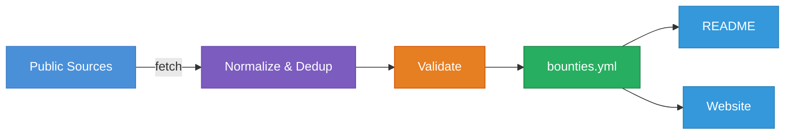

<p align="center">
  <a href="https://bug-bounties.as93.net">
    
  </a>
  <br><br>
  <i>A compiled list of companies who accept responsible disclosure</i><br>
  <a align="center" href="https://bug-bounties.as93.net">🌐 <b>bug-bounties.as93.net</b><br></a>
</p>

<br>

---

## Top Programs

<!-- bounties-start -->
Company | Rewards | Submission
---|---|---
<a href='https://registry.internetnz.nz/about/vulnerability-disclosure-policy/' title='.nz Registry'> .nz Registry</a> |  | [🖃 Submit](mailto:security@internetnz.net.nz)
<a href='https://docs.0x.org/developer-resources/bounties' title='0x'> 0x</a> |  | [🖃 Submit](mailto:security@0x.org)
<a href='https://blog.0xproject.com/announcing-the-0x-protocol-bug-bounty-b0559d2738c' title='0x Project'> 0x Project</a> |  | [🖃 Submit](mailto:team@0xproject.com)
<a href='https://www.123contactform.com/security-acknowledgements.htm' title='123 Contact Form'> 123 Contact Form</a> |  | [🌐 Submit](https://www.123formbuilder.com/contactus.html)
<a href='http://1password.com' title='1Password - CTF'> 1Password - CTF</a> |  | [🌐 Submit](https://hackerone.com/1password_ctf)
<a href='https://bugcrowd.com/agilebits' title='1Password Game'> 1Password Game</a> |  | [🌐 Submit](https://bugcrowd.com/agilebits/report)
<a href='https://bugcrowd.com/engagements/twentyminuten' title='20 Minuten'> 20 Minuten</a> |  | [🌐 Submit](https://bugcrowd.com/engagements/twentyminuten)
<a href='https://www.23andme.com/security-report/' title='23andme'> 23andme</a> |  | [🌐 Submit](https://www.23andme.com/security-report/)
<a href='https://www.24sessions.com/responsible-disclosure' title='24sessions'> 24sessions</a> |   | [🖃 Submit](mailto:security@24sessions.com)
<a href='https://www.3cx.com' title='3CX'> 3CX</a> |  | [🌐 Submit](https://hackerone.com/3cx)
<a href='https://en.outscale.com/reporting-vulnerabilities/' title='3DS OUTSCALE'> 3DS OUTSCALE</a> |  | [🖃 Submit](mailto:bugbounty@outscale.com)
<a href='https://www.4chan.org/security' title='4chan'> 4chan</a> |   | [🖃 Submit](mailto:security@4chan.org)
<a href='https://www.84codes.com/security' title='84codes'> 84codes</a> |  | [🖃 Submit](mailto:security@84codes.com)
<a href='https://www.8x8.com' title='8x8'> 8x8</a> |  | [🌐 Submit](https://hackerone.com/8x8)
<a href='https://www.98point6.com/responsible-disclosure-policy/' title='98 Point 6'> 98 Point 6</a> |  | [🖃 Submit](mailto:security@98point6.com)
<a href='https://www.98point6.com/responsible-disclosure-policy/' title='98point6'> 98point6</a> |  | [🖃 Submit](mailto:security@98point6.com)
<a href='https://www.abnamro.nl/en/personal/overabnamro/secure-banking/responsible-disclosure.html' title='Abn Amro'> Abn Amro</a> |  | [🖃 Submit](mailto:responsible.disclosure@nl.abnamro.com)
<a href='https://personal.rbs.co.uk/personal/fraud-and-security/responsible-disclosure.html' title='ABNAMRO BANK'> ABNAMRO BANK</a> |  | [🖃 Submit](mailto:security.disclosures@rbs.co.uk)
<a href='https://bugcrowd.com/accellion-public' title='Accellion'> Accellion</a> |   | [🌐 Submit](https://bugcrowd.com/accellion-public/report)
<a href='https://www.accredible.com/white_hat/' title='Accredible'> Accredible</a> |  | [🖃 Submit](mailto:security@accredible.com)
<a href='https://www.achmea.nl/en/responsibledisclosure' title='Achmea'> Achmea</a> |  | [🌐 Submit](https://www.achmea.nl/en/responsibledisclosure)
<a href='https://bugcrowd.com/acorns' title='Acorns Grow'> Acorns Grow</a> |  | [🌐 Submit](https://bugcrowd.com/acorns)
<a href='https://bugcrowd.com/acorns' title='Acorns LLC'> Acorns LLC</a> |  | [🌐 Submit](https://bugcrowd.com/acorns/report)
<a href='https://www.acquia.com/solutions/security' title='Acquia'> Acquia</a> |  | [🖃 Submit](mailto:security@acquia.com)
<a href='https://www.acronis.com' title='Acronis'> Acronis</a> |  | [🌐 Submit](https://hackerone.com/acronis)
<a href='https://docs.across.to/v/developer-docs/additional-info/bug-bounty' title='Across Protocol'> Across Protocol</a> |  | [🖃 Submit](mailto:bugs@umaproject.org)
<a href='https://www.actility.com/security/' title='Actility'> Actility</a> |  | [🌐 Submit](https://app.yogosha.com/)
<a href='https://activeprospect.com/security/' title='ActiveProspect'> ActiveProspect</a> |  | [🖃 Submit](mailto:security@activeprospect.com)
<a href='https://www.adafruit.com/reportingsecurityissues' title='Adafruit'> Adafruit</a> |  | [🖃 Submit](mailto:security@adafruit.com)
<a href='https://helpx.adobe.com/security/alertus.html' title='Adobe'> Adobe</a> |   | [🖃 Submit](mailto:PSIRT@adobe.com)
<a href='http://www.affirm.com' title='Affirm'> Affirm</a> |  | [🌐 Submit](https://hackerone.com/affirm)
<a href='https://bugcrowd.com/engagements/afterpay' title='Afterpay Bug Bounty Program'> Afterpay Bug Bounty Program</a> |  | [🌐 Submit](https://bugcrowd.com/engagements/afterpay)
<a href='https://agicap.com/en/bug-bounty/' title='Agicap'> Agicap</a> |  | [🌐 Submit](https://agicap.com/en/bug-bounty/)
<a href='https://www.aholddelhaize.com/en/security/' title='Ahold Delhaize'> Ahold Delhaize</a> |   | [🖃 Submit](mailto:ad.itsecurity.group@aholddelhaize.com)
<a href='https://www.intigriti.com/programs/aikido/aikido/detail' title='Aikido Security: Bug Bounty Program'> Aikido Security: Bug Bounty Program</a> |  | [🌐 Submit](https://www.intigriti.com/programs/aikido/aikido/detail)
<a href='https://aion.network/terms-bounty/' title='Aion'> Aion</a> |  | [🖃 Submit](mailto:secure@Aion.network)
<a href='https://www.airmiles.nl/responsible-disclosure' title='Air Miles'> Air Miles</a> |  | [🖃 Submit](mailto:security.privacy@airmiles.nl)
<a href='https://www.airmilesshop.nl/responsible-disclosure' title='Air Miles Shop'> Air Miles Shop</a> |   | [🖃 Submit](mailto:klantenservice@airmilesshop.nl)
<a href='https://www.airbnb.com/security' title='Airbnb'> Airbnb</a> |   | [🌐 Submit](https://hackerone.com/airbnb/)
<a href='https://www.airship.com/legal/full-disclosure-security-policy/' title='Airship'> Airship</a> |  | [🖃 Submit](mailto:security@airship.com)
<a href='https://blog.airswap.io/airswap-bug-bounty-4d7ec41f3ea7' title='AirSwap'> AirSwap</a> |  | [🖃 Submit](mailto:bounty@airswap.io)
<a href='https://airtable.com/security' title='Airtable'> Airtable</a> |  | [🖃 Submit](mailto:security@airtable.com)
<a href='https://airvpn.org/security_policy/' title='AirVPN'> AirVPN</a> |  | [🖃 Submit](mailto:security@airvpn.org)
<a href='https://www.aven.com/' title='Aiven'> Aiven</a> |  | [🌐 Submit](https://hackerone.com/aiven_ltd)
<a href='https://bugcrowd.com/engagements/aiven-mbb-og' title='Aiven Managed Bug Bounty'> Aiven Managed Bug Bounty</a> |  | [🌐 Submit](https://bugcrowd.com/engagements/aiven-mbb-og)
<a href='https://yeswehack.com/programs/alasco-gmbh-bug-bounty-program' title='Alasco GmbH - Bug Bounty Program'> Alasco GmbH - Bug Bounty Program</a> |  | [🌐 Submit](https://yeswehack.com/programs/alasco-gmbh-bug-bounty-program)
<a href='https://www.alaskaair.com/content/about-us/site-info/report-site-security-issues' title='Alaska Air'> Alaska Air</a> |  | [🌐 Submit](https://www.alaskaair.com/content/about-us/site-info/report-site-security-issues)
<a href='https://www.alcyon.nl/responsible-disclosure/' title='Alcyon'> Alcyon</a> |  | [🖃 Submit](mailto:security@alcyon.nl)
<a href='https://www.intigriti.com/programs/dpgm/algemeendagblad/detail' title='Algemeen Dagblad'> Algemeen Dagblad</a> |  | [🌐 Submit](https://www.intigriti.com/programs/dpgm/algemeendagblad/detail)
<a href='https://www.algolia.com/security' title='Algolia'> Algolia</a> |   | [🌐 Submit](https://hackerone.com/algolia/reports/new)
<a href='https://bugcrowd.com/algorand' title='Algorand'> Algorand</a> |  | [🌐 Submit](https://bugcrowd.com/algorand/report)
<a href='https://security.alibaba.com/' title='Alibaba'> Alibaba</a> |   | [🖃 Submit](mailto:security@service.alibaba.com)
<a href='https://cybersecurity.att.com/documentation/usm-appliance/system-overview/how-to-submit-a-security-issue-to-alienvault.htm' title='Alienvault'> Alienvault</a> |  | [🌐 Submit](https://hackerone.com/alienvault_security)
<a href='https://security.alibaba.com/' title='Aliexpress'> Aliexpress</a> |   | [🖃 Submit](mailto:security@service.alibaba.com)
<a href='https://www.aliter.com/vulnerability-disclosure-policy/' title='Aliter Technologies'> Aliter Technologies</a> |  | [🖃 Submit](mailto:vulnerability@aliter.com)
<a href='https://hackerone.com/allegro' title='Allegro'> Allegro</a> |  | [🌐 Submit](https://hackerone.com/allegro)
<a href='https://alscotoday.com/go/bug' title='ALSCO'> ALSCO</a> |    | [🌐 Submit](https://alscotoday.com/go/bug)
<a href='https://www.intigriti.com/programs/altera/altera/detail' title='Altera'> Altera</a> |  | [🌐 Submit](https://www.intigriti.com/programs/altera/altera/detail)
<a href='https://en.altervista.org/feedback.php?who=feedback' title='Altervista'> Altervista</a> |  | [🌐 Submit](https://en.altervista.org/feedback.php?who=feedback)
<a href='https://www.altilly.com/page/security' title='Altilly'> Altilly</a> |  | [🌐 Submit](https://www.altilly.com/page/security)
<a href='https://www.alwaysdata.com/en/bug-bounty/' title='AlwaysData'> AlwaysData</a> |  | [🌐 Submit](https://admin.alwaysdata.com/support/)
<a href='https://amara.org/en/security' title='Amara'> Amara</a> |  | [🖃 Submit](mailto:security@amara.org)
<a href='https://www.amazon.com/gp/help/customer/display.html/ref=hp_left_v4_sib?ie=UTF8&nodeId=201182150' title='Amazon'> Amazon</a> |   | [🌐 Submit](https://www.amazon.com/gp/help/customer/display.html/ref=hp_left_v4_sib?ie=UTF8&nodeId=201182150)
<a href='https://aws.amazon.com/security/vulnerability-reporting' title='Amazon Web Services'> Amazon Web Services</a> |   | [🖃 Submit](mailto:aws-security@amazon.com)
<a href='https://www.intigriti.com/programs/amd/amd/detail' title='AMD Product Security Bug Bounty Program'> AMD Product Security Bug Bounty Program</a> |  | [🌐 Submit](https://www.intigriti.com/programs/amd/amd/detail)
<a href='https://hackerone.com/american_systems_bbp' title='AMERICAN SYSTEMS'> AMERICAN SYSTEMS</a> |  | [🌐 Submit](https://hackerone.com/american_systems_bbp)
<a href='https://hackerone.com/amitree_inc' title='Amitree Inc'> Amitree Inc</a> |  | [🌐 Submit](https://hackerone.com/amitree_inc)
<a href='https://ampcode.com/security/' title='AmpCode.com'> AmpCode.com</a> |  | [🖃 Submit](mailto:security@sourcegraph.com)
<a href='https://www.google.com/about/appsecurity/android-rewards/' title='Android'> Android</a> |   | [🌐 Submit](https://www.google.com/appserve/security-bugs/m2/new)
<a href='https://www.anduril.com' title='Anduril Industries'> Anduril Industries</a> |   | [🌐 Submit](https://hackerone.com/anduril_industries)
<a href='https://yeswehack.com/programs/ant-group-security-response-center-bug-bounty-program' title='Ant Group Security Response Center - Bug Bounty Program'> Ant Group Security Response Center - Bug...</a> |  | [🌐 Submit](https://yeswehack.com/programs/ant-group-security-response-center-bug-bounty-program)
<a href='https://www.hacktify.eu/en/public-programs/' title='Antavo Loyalty Management Platform'> Antavo Loyalty Management Platform</a> |  | [🌐 Submit](https://app.hacktify.eu/en/login/)
<a href='https://bugcrowd.com/engagements/anytask-mbb-og' title='AnyTask: Freelancer Platform'> AnyTask: Freelancer Platform</a> |  | [🌐 Submit](https://bugcrowd.com/engagements/anytask-mbb-og)
<a href='https://contact.security.aol.com/' title='AOL'> AOL</a> |  | [🖃 Submit](mailto:secvuln@teamaol.com)
<a href='https://www.apache.org/security/' title='Apache'> Apache</a> |  | [🖃 Submit](mailto:security@apache.org)
<a href='https://yeswehack.com/programs/log4j-bug-bounty-program' title='Apache Log4j - Bug Bounty Program'> Apache Log4j - Bug Bounty Program</a> |  | [🌐 Submit](https://yeswehack.com/programs/log4j-bug-bounty-program)
<a href='https://www.appcelerator.com/responsible-disclosure-of-security-vulnerabilities/' title='Appcelerator'> Appcelerator</a> |  | [🖃 Submit](mailto:appc.support@axway.com)
<a href='https://bugcrowd.com/engagements/automationconsultants' title='AppFox'> AppFox</a> |  | [🌐 Submit](https://bugcrowd.com/engagements/automationconsultants)
<a href='https://developer.apple.com/security-bounty/' title='Apple'> Apple</a> |   | [🖃 Submit](mailto:product-security@apple.com)
<a href='https://www.apsis.com/bug-bounty' title='Apsis'> Apsis</a> |  | [🌐 Submit](https://www.apsis.com/bug-bounty)
<a href='https://www.aquasec.com/trust/security/responsible-disclosure-program/' title='Aqua Security'> Aqua Security</a> |  | [🖃 Submit](mailto:psirt@aquasec.com)
<a href='https://ark.io/blog/ark-development-and-security-bounty-program-arkio-blog' title='Aragon'> Aragon</a> |  | [🖃 Submit](mailto:security@aragon.one)
<a href='https://blog.ark.io/ark-github-development-bounty-113806ae9ffe' title='Ark'> Ark</a> |   | [🖃 Submit](mailto:security@ark.io)
<a href='https://www.arkoselabs.com/' title='Arkose Labs'> Arkose Labs</a> |  | [🌐 Submit](https://bugcrowd.com/arkose-labs/report)
<a href='https://bugcrowd.com/arlo' title='Arlo - Cash Rewards Program'> Arlo - Cash Rewards Program</a> |  | [🌐 Submit](https://bugcrowd.com/arlo/report)
<a href='https://bugcrowd.com/arlo' title='Arlo Cash Rewards'> Arlo Cash Rewards</a> |  | [🌐 Submit](https://bugcrowd.com/arlo)
<a href='https://developer.arm.com/support/arm-security-updates/report-security-vulnerabilities' title='Arm'> Arm</a> |  | [🖃 Submit](mailto:arm-security@arm.com)
<a href='https://tls.mbed.org/c-library-bug-bounty-program' title='ARM mBed'> ARM mBed</a> |   | [🖃 Submit](mailto:Support.mbedtls@arm.com)
<a href='https://arrival.com/legal/security#purpose' title='Arrival'> Arrival</a> |  | [🌐 Submit](https://arrival.com/legal/security#purpose)
<a href='https://www.artsy.net/security' title='Artsy'> Artsy</a> |  | [🖃 Submit](mailto:security@artsy.net)
<a href='https://bugcrowd.com/aruba-public' title='Aruba Networks'> Aruba Networks</a> |   | [🌐 Submit](https://bugcrowd.com/aruba-public/report)
<a href='https://asana.com/bounty' title='Asana'> Asana</a> |  | [🌐 Submit](https://bugcrowd.com/asana)
<a href='https://www.devolksbank.nl/over-ons/kwetsbaarheden-melden' title='ASN Bank'> ASN Bank</a> |  | [🖃 Submit](mailto:responsible-disclosure@devolksbank.nl)
<a href='https://digitalhealthcompliance.com/disclosure-en/' title='Assuring Medical Apps'> Assuring Medical Apps</a> |  | [🌐 Submit](https://digitalhealthcompliance.com/contact-2/)
<a href='https://wiki.asterisk.org/wiki/display/AST/Asterisk+Bug+Bounties' title='Asterisk'> Asterisk</a> |  | [🌐 Submit](https://lists.digium.com/mailman/listinfo/asterisk-dev)
<a href='https://bugbounty.att.com/' title='AT&T'> AT&T</a> |   | [🌐 Submit](https://bugbounty.att.com/)
<a href='https://yeswehack.com/programs/atg-public-bug-bounty-program' title='ATG'> ATG</a> |  | [🌐 Submit](https://yeswehack.com/programs/atg-public-bug-bounty-program)
<a href='https://yeswehack.com/programs/atg-public-bug-bounty-program' title='ATG Public Bug Bounty Program'> ATG Public Bug Bounty Program</a> |  | [🌐 Submit](https://yeswehack.com/programs/atg-public-bug-bounty-program)
<a href='https://www.athento.com/bug-bounty-program-en/' title='Athento'> Athento</a> |  | [🖃 Submit](mailto:support@athento.com)
<a href='https://bugcrowd.com/atlassian' title='Atlassian'> Atlassian</a> |  | [🌐 Submit](https://bugcrowd.com/atlassian)
<a href='https://bugcrowd.com/opsgenie' title='Atlassian - Opsgenie'> Atlassian - Opsgenie</a> |  | [🌐 Submit](https://bugcrowd.com/opsgenie/report)
<a href='https://bugcrowd.com/engagements/atlassianapps' title='Atlassian-Built Apps'> Atlassian-Built Apps</a> |  | [🌐 Submit](https://bugcrowd.com/engagements/atlassianapps)
<a href='https://auderenow.org/security' title='Audere'> Audere</a> |  | [🖃 Submit](mailto:security@auderenow.org)
<a href='http://audible.com' title='Audible'> Audible</a> |  | [🌐 Submit](https://hackerone.com/audible)
<a href='https://www.augur.net/bounty/' title='Augur'> Augur</a> |  | [🌐 Submit](https://augur.net/blog/v2-bug-bounty)
<a href='https://auspost.com.au/about-us/about-our-site/responsible-disclosure' title='Australia Post'> Australia Post</a> |  | [🖃 Submit](mailto:security@auspost.com.au)
<a href='https://www.health.gov.au/using-our-websites/vulnerability-disclosure-policy' title='Australian Government Department of Health'> Australian Government Department of Heal...</a> |  | [🖃 Submit](mailto:vulnerabilitydisclosure@health.gov.au)
<a href='https://auth0.com/responsible-disclosure-policy/' title='Auth0'> Auth0</a> |  | [🌐 Submit](https://auth0.com/responsible-disclosure-policy/)
<a href='https://bugcrowd.com/engagements/auth0-okta' title='Auth0 by Okta'> Auth0 by Okta</a> |  | [🌐 Submit](https://bugcrowd.com/engagements/auth0-okta)
<a href='https://www.autodesk.com/trust/incident-response' title='Autodesk'> Autodesk</a> |  | [🌐 Submit](https://www.autodesk.com/trust/contact-us)
<a href='https://www.ata.network/bugbounty' title='Automata Network'> Automata Network</a> |  | [🌐 Submit](https://www.ata.network/bugbounty)
<a href='https://automattic.com/security/' title='Automattic'> Automattic</a> |    | [🌐 Submit](https://hackerone.com/automattic)
<a href='https://www.automox.com/security/responsible-disclosure' title='Automox'> Automox</a> |  | [🖃 Submit](mailto:disclosures@automox.com)
<a href='https://availcarsharing.com/bug-bounty' title='Avail Carsharing'> Avail Carsharing</a> |  | [🌐 Submit](https://availcarsharing.com/bug-bounty)
<a href='https://www.avalara.com/us/en/legal/responsible-disclosure.html' title='Avalara'> Avalara</a> |  | [🖃 Submit](mailto:information.security@avalara.com)
<a href='https://www.avast.com/bug-bounty' title='Avast!'> Avast!</a> |  | [🌐 Submit](https://www.avast.com/bug-report)
<a href='https://www.avira.com/en/support-vulnerability' title='Avira'> Avira</a> |   | [🖃 Submit](mailto:vulnerabilities@avira.com)
<a href='https://www.avrotros.nl/privacy/responsible-disclosure/' title='AVROTROS'> AVROTROS</a> |  | [🌐 Submit](https://www.avrotros.nl/privacy/responsible-disclosure/)
<a href='https://www.intigriti.com/programs/axelspringerse/nmt/detail' title='Axel Springer National Media & Tech'> Axel Springer National Media & Tech</a> |  | [🌐 Submit](https://www.intigriti.com/programs/axelspringerse/nmt/detail)
<a href='https://bugcrowd.com/engagements/axis-os-public' title='AXIS OS'> AXIS OS</a> |  | [🌐 Submit](https://bugcrowd.com/engagements/axis-os-public)
<a href='https://www.ayersrockresort.com.au/terms-and-conditions/security' title='Ayers Rock Resort'> Ayers Rock Resort</a> |  | [🖃 Submit](mailto:vulnerability@voyages.com.au)
<a href='https://azimo.com/en/lp/responsible-disclosure' title='Azimo'> Azimo</a> |  | [🖃 Submit](mailto:security@azimo.com)
<a href='https://www.backblaze.com/security.html' title='Backblaze'> Backblaze</a> |  | [🖃 Submit](mailto:bounty@backblaze.com)
<a href='https://corp.badoo.com/security' title='Badoo'> Badoo</a> |   | [🌐 Submit](https://hackerone.com/badoo)
<a href='https://bsrc.baidu.com/v2/#/en' title='Baidu'> Baidu</a> |  | [🌐 Submit](https://bsrc.baidu.com/v2/#/en)
<a href='https://bugcrowd.com/engagements/balsamiq' title='Balsamiq for Atlassian Products'> Balsamiq for Atlassian Products</a> |  | [🌐 Submit](https://bugcrowd.com/engagements/balsamiq)
<a href='http://platacard.mx' title='Banco Plata'> Banco Plata</a> |  | [🌐 Submit](https://hackerone.com/banco_plata)
<a href='https://getbase.com/security/' title='Base'> Base</a> |  | [🌐 Submit](https://bugbounty.getbase.com/)
<a href='https://basecamp.com/about/policies/security/response' title='Basecamp'> Basecamp</a> |    | [🖃 Submit](mailto:security@basecamp.com)
<a href='https://www.basf.com/global/en/legal/responsible-disclosure-statement.html' title='BASF'> BASF</a> |   | [🖃 Submit](mailto:securemail@basf.com)
<a href='https://www.bazaarvoice.com/legal/vulnerability-disclosure-policy/' title='Bazaarvoice'> Bazaarvoice</a> |  | [🖃 Submit](mailto:security@bazaarvoice.com)
<a href='https://www.bbc.com/backstage/security-disclosure-policy/' title='BBC'> BBC</a> |   | [🖃 Submit](mailto:mailo:security@bbc.co.uk)
<a href='https://infosys.beckhoff.com/english.php?content=../content/1033/ipc_security/9007202382327691.html&id=' title='Beckhoff'> Beckhoff</a> |  | [🌐 Submit](https://infosys.beckhoff.com/content/1033/ipc_security/4253485067.html)
<a href='https://www.beiersdorf.com' title='Beiersdorf'> Beiersdorf</a> |  | [🌐 Submit](https://hackerone.com/beiersdorf)
<a href='https://www.bentley.com/responsible_disclosure.pdf' title='Bentley'> Bentley</a> |    | [🌐 Submit](https://www.bentley.com/en/about-us/contact-us/contact-us-form?topic=11)
<a href='https://bugcrowd.com/better' title='Better'> Better</a> |  | [🌐 Submit](https://bugcrowd.com/better/report)
<a href='https://yeswehack.com/programs/bigbluebutton-bug-bounty-program' title='BigBlueButton Bug Bounty Program'> BigBlueButton Bug Bounty Program</a> |  | [🌐 Submit](https://yeswehack.com/programs/bigbluebutton-bug-bounty-program)
<a href='https://bugcrowd.com/bigcommerce' title='BigCommerce'> BigCommerce</a> |  | [🌐 Submit](https://bugcrowd.com/bigcommerce)
<a href='https://www.zendesk.com/company/policies-procedures/#responsible-disclosure-policy' title='Bime'> Bime</a> |   | [🌐 Submit](https://hackerone.com/bime)
<a href='https://bugcrowd.com/binance' title='Binance'> Binance</a> |  | [🌐 Submit](https://bugcrowd.com/binance)
<a href='https://yeswehack.com/programs/bind-bug-bounty-program' title='BIND 9 Bug Bounty Program'> BIND 9 Bug Bounty Program</a> |  | [🌐 Submit](https://yeswehack.com/programs/bind-bug-bounty-program)
<a href='https://github.com/BTCGPU/Developer-Portal/blob/master/responsible-disclosure.md' title='Bitcoin Gold'> Bitcoin Gold</a> |  | [🖃 Submit](mailto:admin@bitcoingold.org)
<a href='https://www.bitdefender.com/bitdefender_vulnerability_disclosure_program.html' title='BitDefender'> BitDefender</a> |  | [🖃 Submit](mailto:bugbounty@bitdefender.com)
<a href='https://bugcrowd.com/engagements/bitdefenderbox2' title='Bitdefender Box v2'> Bitdefender Box v2</a> |  | [🌐 Submit](https://bugcrowd.com/engagements/bitdefenderbox2)
<a href='https://bugcrowd.com/bitdiscovery' title='BitDiscovery'> BitDiscovery</a> |  | [🌐 Submit](https://bugcrowd.com/bitdiscovery)
<a href='https://www.bitfinex.com/bug-bounty/' title='Bitfinex'> Bitfinex</a> |  | [🌐 Submit](https://www.bitfinex.com/bug-bounty/)
<a href='https://www.bitgo.com/bug-bounty' title='Bitgo'> Bitgo</a> |   | [🖃 Submit](mailto:bugbounty@bitgo.com)
<a href='https://bugcrowd.com/engagements/bitgo-mbb-og-public' title='BitGo Managed Public Bug Bounty Engagement'> BitGo Managed Public Bug Bounty Engageme...</a> |  | [🌐 Submit](https://bugcrowd.com/engagements/bitgo-mbb-og-public)
<a href='https://bugcrowd.com/engagements/bitgo-mobileapps-mbb-og' title='BitGo Mobile Apps Bug Bounty Engagement'> BitGo Mobile Apps Bug Bounty Engagement</a> |  | [🌐 Submit](https://bugcrowd.com/engagements/bitgo-mobileapps-mbb-og)
<a href='https://www.bitmex.com/app/security' title='BitMEX'> BitMEX</a> |   | [🖃 Submit](mailto:support@bitmex.com)
<a href='https://yeswehack.com/programs/bitoasis-bug-bounty-program' title='BitOasis - Bug Bounty Program'> BitOasis - Bug Bounty Program</a> |  | [🌐 Submit](https://yeswehack.com/programs/bitoasis-bug-bounty-program)
<a href='https://bugcrowd.com/engagements/bitpanda-og-bb' title='Bitpanda Ongoing Bug Bounty'> Bitpanda Ongoing Bug Bounty</a> |  | [🌐 Submit](https://bugcrowd.com/engagements/bitpanda-og-bb)
<a href='https://support.bitpay.com/hc/en-us/articles/204229369-Does-BitPay-have-a-bug-bounty-program-' title='Bitpay'> Bitpay</a> |  | [🖃 Submit](mailto:disclosure@bitpay.com)
<a href='https://www.bitski.com/bounty/' title='Bitski'> Bitski</a> |  | [🌐 Submit](https://www.federacy.com/bitski?tab=Awards)
<a href='https://bugcrowd.com/engagements/bitso-mbb-og' title='Bitso Managed Bug Bounty Engagement'> Bitso Managed Bug Bounty Engagement</a> |  | [🌐 Submit](https://bugcrowd.com/engagements/aurory-mbb-og2)
<a href='https://www.bitsoffreedom.nl/coordinated-vulnerability-disclosure-en/' title='Bitsoffreedom'> Bitsoffreedom</a> |   | [🖃 Submit](mailto:security@bof.nl)
<a href='https://www.bitwala.com/security/' title='Bitwala'> Bitwala</a> |  | [🖃 Submit](mailto:security@bitwala.com)
<a href='https://firebounty.com/520-bitwall-security' title='BitWall'> BitWall</a> |  | [🖃 Submit](mailto:request@bitwall.io)
<a href='https://www.bizmerlin.com/responsible-disclosure-policy/' title='Bizmerlin'> Bizmerlin</a> |  | [🌐 Submit](https://bizmerlin.freshdesk.com/support/login)
<a href='https://yeswehack.com/programs/bug-bounty-program-blablacar' title='BlaBlaCar'> BlaBlaCar</a> |  | [🌐 Submit](https://yeswehack.com/programs/bug-bounty-program-blablacar)
<a href='https://help.blackboard.com/Product_Security' title='Blackboard'> Blackboard</a> |  | [🌐 Submit](https://help.blackboard.com/Product_Security/Submit_Vulnerability)
<a href='https://bladestorm.zendesk.com/hc/en-us/articles/360010393497-Bug-Bounty-Program' title='Blade Storm'> Blade Storm</a> |  | [🖃 Submit](mailto:security@bladestorm.org)
<a href='https://blend.com' title='Blend Labs'> Blend Labs</a> |  | [🌐 Submit](https://hackerone.com/blend-labs)
<a href='https://bugcrowd.com/engagements/blockopensource' title='Block Open Source'> Block Open Source</a> |  | [🌐 Submit](https://bugcrowd.com/engagements/blockopensource)
<a href='https://blocksender.io/vulnerability-disclosure-policy/' title='Block Sender'> Block Sender</a> |  | [🖃 Submit](mailto:support@blocksender.io)
<a href='https://bugcrowd.com/engagements/blockchain-dot-com' title='Blockchain.com Managed Bug Bounty Engagement'> Blockchain.com Managed Bug Bounty Engage...</a> |  | [🌐 Submit](https://bugcrowd.com/engagements/blockchain-dot-com)
<a href='https://www.google.com/about/appsecurity/reward-program/' title='Blogger'> Blogger</a> |   | [🌐 Submit](https://www.google.com/appserve/security-bugs/m2/new?rl=&key=)
<a href='https://bluecanvas.io/report-vulnerability' title='Blue Canvas'> Blue Canvas</a> |  | [🖃 Submit](mailto:security@bluecanvas.io)
<a href='https://bugcrowd.com/bluejeans' title='Blue Jeans Network'> Blue Jeans Network</a> |  | [🌐 Submit](https://bugcrowd.com/bluejeans)
<a href='https://bugcrowd.com/endurance-bluehost' title='Bluehost'> Bluehost</a> |  | [🌐 Submit](https://bugcrowd.com/endurance-bluehost/report)
<a href='https://www.bluescape.com/vulnerability-disclosure-policy/' title='Bluescape'> Bluescape</a> |  | [🖃 Submit](mailto:security@Bluescape.com)
<a href='https://home.bluesnap.com/security-bounty/' title='Bluesnap'> Bluesnap</a> |  | [🖃 Submit](mailto:bounty@bluesnap.com)
<a href='https://www.bmwgroup.com/en/general/Security.html' title='BMW'> BMW</a> |  | [🖃 Submit](mailto:report-vulnerabilities@bmwgroup.com)
<a href='https://hackerone.com/bmwgroup' title='BMW Group'> BMW Group</a> |  | [🌐 Submit](https://hackerone.com/bmwgroup)
<a href='https://www.intigriti.com/programs/bmw/bmwgroup-automotive/detail' title='BMW Group Automotive'> BMW Group Automotive</a> |  | [🌐 Submit](https://www.intigriti.com/programs/bmw/bmwgroup-automotive/detail)
<a href='https://bugcrowd.com/engagements/bolt-og' title='Bolt Technology OÜ'> Bolt Technology OÜ</a> |  | [🌐 Submit](https://bugcrowd.com/engagements/bolt-og)
<a href='https://yeswehack.com/programs/bookbeat' title='BookBeat'> BookBeat</a> |  | [🌐 Submit](https://yeswehack.com/programs/bookbeat)
<a href='http://www.booking.com' title='Booking.com'> Booking.com</a> |  | [🌐 Submit](https://hackerone.com/bookingcom)
<a href='https://www.boozt.com' title='Boozt Fashion'> Boozt Fashion</a> |  | [🌐 Submit](https://hackerone.com/boozt)
<a href='https://psirt.bosch.com/bosch-responsible-disclosure-policy/' title='Bosch'> Bosch</a> |  | [🌐 Submit](https://psirt.bosch.com/report-a-vulnerability/)
<a href='https://global.bose.com/en_us/product_security_vulnerability_response.html' title='Bose'> Bose</a> |  | [🖃 Submit](mailto:privacyandsecurity@bose.com)
<a href='https://www.intigriti.com/programs/bpost/dummy/detail' title='Bpost'> Bpost</a> |  | [🌐 Submit](https://www.intigriti.com/programs/bpost/dummy/detail)
<a href='https://www.braintreepayments.com/developers/disclosure' title='Braintree'> Braintree</a> |  | [🖃 Submit](mailto:ppbugbounty@paypal.com)
<a href='https://hackerone.com/brave?view_policy=true' title='Brave'> Brave</a> |    | [🌐 Submit](https://hackerone.com/brave/reports/new)
<a href='https://brave.com' title='Brave Software'> Brave Software</a> |   | [🌐 Submit](https://hackerone.com/brave)
<a href='https://bugcrowd.com/engagements/braze-bb' title='Braze Public BB'> Braze Public BB</a> |  | [🌐 Submit](https://bugcrowd.com/engagements/braze-bb)
<a href='http://braze.com' title='Braze, Inc.'> Braze, Inc.</a> |  | [🌐 Submit](https://hackerone.com/braze_inc)
<a href='https://www.briskinfosec.com/responsibledisclosure' title='Brisk Infosec'> Brisk Infosec</a> |  | [🖃 Submit](mailto:contact@briskinfosec.com)
<a href='https://www.btcturk.com/odul-avciligi' title='BtcTurk'> BtcTurk</a> |  | [🌐 Submit](https://www.btcturk.com/odul-avciligi)
<a href='https://buddy.works/disclosure-policy' title='Buddy'> Buddy</a> |  | [🖃 Submit](mailto:security@buddy.works)
<a href='https://buffer.com/legal#security' title='Buffer'> Buffer</a> |   | [🖃 Submit](mailto:security@buffer.com)
<a href='https://yeswehack.com/programs/bug-bounty-program-blablacar' title='Bug Bounty Program - BlaBlaCar'> Bug Bounty Program - BlaBlaCar</a> |  | [🌐 Submit](https://yeswehack.com/programs/bug-bounty-program-blablacar)
<a href='https://yeswehack.com/programs/bug-bounty-sncf-connect-1' title='Bug Bounty SNCF Connect'> Bug Bounty SNCF Connect</a> |  | [🌐 Submit](https://yeswehack.com/programs/bug-bounty-sncf-connect-1)
<a href='https://bugcrowd.com/bugcrowd' title='Bugcrowd'> Bugcrowd</a> |   | [🌐 Submit](https://bugcrowd.com/bugcrowd/report)
<a href='https://bugify.com/security' title='Bugify'> Bugify</a> |  | [🖃 Submit](mailto:security@bugify.com)
<a href='https://bugcrowd.com/bugpoc-mbb' title='BugPoC'> BugPoC</a> |   | [🌐 Submit](https://bugcrowd.com/bugpoc-mbb/report)
<a href='https://app.bugv.io/researcher/program/0000001/detail' title='Bugv'> Bugv</a> |  | [🌐 Submit](https://app.bugv.io/researcher/program/0000001/detail)
<a href='https://bugcrowd.com/bullish' title='Bullish'> Bullish</a> |  | [🌐 Submit](https://bugcrowd.com/bullish)
<a href='https://bugcrowd.com/engagements/bullish-exchange' title='Bullish Exchange'> Bullish Exchange</a> |  | [🌐 Submit](https://bugcrowd.com/engagements/bullish-exchange)
<a href='https://bugcrowd.com/engagements/bullish' title='Bullish.com'> Bullish.com</a> |  | [🌐 Submit](https://bugcrowd.com/engagements/bullish)
<a href='http://bumba.global' title='Bumba'> Bumba</a> |  | [🌐 Submit](https://hackerone.com/bumba_bbp)
<a href='https://www.bunq.com/assets/media/legal/en/20161114_Responsible_Disclosure_Policy_EN.pdf' title='Bunq'> Bunq</a> |   | [🖃 Submit](mailto:responsible-disclosure@bunq.com)
<a href='https://www.bybit.com' title='Bybit Fintech Ltd'> Bybit Fintech Ltd</a> |  | [🌐 Submit](https://hackerone.com/bybit_fintech)
<a href='https://bykea.com' title='Bykea'> Bykea</a> |  | [🌐 Submit](https://hackerone.com/bykea)
<a href='https://www.bynder.com/en/legal/responsible-disclosure-policy/' title='Bynder'> Bynder</a> |  | [🖃 Submit](mailto:security@bynder.com)
<a href='https://security.bytedance.com/media/score-standard/Vulnerability_Rewards_Program.pdf' title='Bytedance'> Bytedance</a> |  | [🌐 Submit](https://security.bytedance.com/en/submit/)
<a href='https://bugcrowd.com/caffeine' title='Caffeine'> Caffeine</a> |  | [🌐 Submit](https://bugcrowd.com/caffeine)
<a href='https://www.campaignmonitor.com/trust/report-a-vulnerability/' title='Campaign Monitor'> Campaign Monitor</a> |  | [🌐 Submit](https://www.campaignmonitor.com/trust/report-a-vulnerability/)
<a href='https://www.canva.com/security/bug-bounty/' title='Canva'> Canva</a> |  | [🌐 Submit](https://www.canva.com/security/bug-bounty/)
<a href='https://www.capitalone.com/digital/responsible-disclosure/' title='Capital One'> Capital One</a> |  | [🌐 Submit](https://hackerone.com/capital-one)
<a href='https://www.intigriti.com/programs/capitalcom/capitalcom/detail' title='Capital.com'> Capital.com</a> |  | [🌐 Submit](https://www.intigriti.com/programs/capitalcom/capitalcom/detail)
<a href='https://www.card.com/responsible-disclosure-policy' title='card.com'> card.com</a> |  | [🖃 Submit](mailto:security@card.com)
<a href='https://careevolution.com/trust/security-research/' title='CareEvolution'> CareEvolution</a> |  | [🌐 Submit](https://mydatahelps.org/e/KLKCCW?surveyName=Vulnerability%20Reporting%20Form)
<a href='https://bugcrowd.com/cashapp' title='Cash App'> Cash App</a> |  | [🌐 Submit](https://bugcrowd.com/cashapp)
<a href='https://hackerone.com/casper' title='Casper'> Casper</a> |   | [🌐 Submit](https://hackerone.com/casper/reports/new?type=team&report_type=vulnerability)
<a href='http://cedars-sinai.edu' title='Cedars-Sinai'> Cedars-Sinai</a> |  | [🌐 Submit](https://hackerone.com/cedars-sinai)
<a href='https://bugcrowd.com/centrify' title='Centrify'> Centrify</a> |   | [🌐 Submit](https://bugcrowd.com/centrify/report)
<a href='https://vuls.cert.org/confluence/display/Wiki/Vulnerability+Disclosure+Policy' title='CERT/CC'> CERT/CC</a> |   | [🌐 Submit](https://www.kb.cert.org/vuls/report/)
<a href='https://bugcrowd.com/engagements/financialforce' title='Certinia (formerly FinancialForce)'> Certinia (formerly FinancialForce)</a> |  | [🌐 Submit](https://bugcrowd.com/engagements/financialforce)
<a href='https://hackerone.com/chainlink' title='Chainlink'> Chainlink</a> |   | [🌐 Submit](https://hackerone.com/chainlink)
<a href='https://medium.com/chainrift/chainrift-launches-bug-bounty-program-6255eb2d518d' title='ChainRift'> ChainRift</a> |  | [🖃 Submit](mailto:support@chainrift.com)
<a href='https://www.chalk.com/security/' title='Chalk'> Chalk</a> |  | [🖃 Submit](mailto:security@chalk.com)
<a href='https://www.trychameleon.com/security/disclosure' title='Chameleon'> Chameleon</a> |   | [🌐 Submit](https://www.trychameleon.com/security/disclosure)
<a href='https://bugbounty.chargezoom.com/support/tickets/new' title='Chargezoom'> Chargezoom</a> |  | [🌐 Submit](https://bugbounty.chargezoom.com/support/tickets/new)
<a href='https://checkhq.com/security' title='Check'> Check</a> |  | [ Submit](rhttps://www.federacy.com/check)
<a href='http://chia.net' title='Chia Network'> Chia Network</a> |  | [🌐 Submit](https://hackerone.com/chia_network)
<a href='https://hackerone.com/chime' title='Chime'> Chime</a> |  | [🌐 Submit](https://hackerone.com/chime)
<a href='https://bugcrowd.com/engagements/chime' title='Chime Managed Bug Bounty Engagement'> Chime Managed Bug Bounty Engagement</a> |  | [🌐 Submit](https://bugcrowd.com/engagements/chime)
<a href='https://www.circle.com/' title='Circle'> Circle</a> |  | [🌐 Submit](https://circleci.com/security/#concerns)
<a href='https://circleci.com/security' title='CircleCi'> CircleCi</a> |  | [🌐 Submit](https://circleci.com/security/#concerns)
<a href='https://bugcrowd.com/ciscomeraki' title='Cisco Meraki'> Cisco Meraki</a> |  | [🌐 Submit](https://bugcrowd.com/ciscomeraki)
<a href='https://bugcrowd.com/engagements/thousandeyes-og' title='Cisco ThousandEyes Vulnerability Hunting aka Bug Bounty'> Cisco ThousandEyes Vulnerability Hunting...</a> |  | [🌐 Submit](https://bugcrowd.com/engagements/thousandeyes-og)
<a href='https://www.citrix.com/about/trust-center/vulnerability-process.html' title='Citrix'> Citrix</a> |  | [🌐 Submit](https://www.citrix.com/about/trust-center/vulnerability-process.html#lightbox-38764)
<a href='https://bugcrowd.com/engagements/city-of-vienna-mbb-og' title='City of Vienna Managed Bug Bounty'> City of Vienna Managed Bug Bounty</a> |  | [🌐 Submit](https://bugcrowd.com/engagements/city-of-vienna-mbb-og)
<a href='https://www.city-data.com/bug-bounty.html' title='City-Data.com'> City-Data.com</a> |   | [🌐 Submit](https://www.city-data.com/bug-bounty-report.php)
<a href='https://app.intigriti.com/programs/clabs/clabs/detail' title='cLabs'> cLabs</a> |  | [🌐 Submit](https://app.intigriti.com/programs/clabs/clabs/detail)
<a href='https://hackerone.com/clario' title='Clario'> Clario</a> |  | [🌐 Submit](https://hackerone.com/clario/reports/new)
<a href='https://www.claromentis.com/responsible-disclosure-policy/' title='Claromentis'> Claromentis</a> |  | [🖃 Submit](mailto:security@claromentis.com)
<a href='https://www.classdojo.com/securitydisclosureprogram/' title='Classdojo'> Classdojo</a> |  | [🖃 Submit](mailto:security@classdojo.com)
<a href='https://clause.io/security' title='Clause'> Clause</a> |   | [🖃 Submit](mailto:security@clause.io)
<a href='https://clenergy.com/de/cyber-security-policy/?lang=en' title='Clenergy'> Clenergy</a> |  | [🖃 Submit](mailto:HWBugBounty@Clenergy.com)
<a href='https://bugcrowd.com/engagements/clickhouse' title='ClickHouse'> ClickHouse</a> |  | [🌐 Submit](https://bugcrowd.com/engagements/clickhouse)
<a href='https://clickup.com/bug-bounty' title='Clickup'> Clickup</a> |  | [🌐 Submit](https://clickup.com/bug-bounty)
<a href='https://support.clio.com/hc/en-us/articles/360001114273-How-do-I-Claim-a-Bug-Bounty-or-Report-a-Vulnerability-' title='Clio'> Clio</a> |  | [🌐 Submit](https://support.clio.com/hc/en-us/articles/360001114273-How-do-I-Claim-a-Bug-Bounty-or-Report-a-Vulnerability-)
<a href='https://clipperz.is/security_privacy/responsible_disclosure_policy/' title='Clipperz'> Clipperz</a> |  | [🖃 Submit](mailto:security@clipperz.is)
<a href='https://support.getcloudapp.com/article/260-responsible-disclosure-report-found-vulnerabilities' title='Cloudapp'> Cloudapp</a> |  | [🖃 Submit](mailto:support@getcloudapp.com)
<a href='https://cloudcannon.com/bug-bounty/' title='CloudCannon'> CloudCannon</a> |  | [🌐 Submit](https://cloudcannon.com/bug-bounty/)
<a href='https://www.cloudflare.com/en-gb/disclosure/' title='CloudFlare'> CloudFlare</a> |   | [🌐 Submit](https://hackerone.com/cloudflare)
<a href='https://bugcrowd.com/cloudinary' title='Cloudinary'> Cloudinary</a> |  | [🌐 Submit](https://bugcrowd.com/cloudinary)
<a href='https://bugcrowd.com/cloudways' title='Cloudways'> Cloudways</a> |  | [🌐 Submit](https://bugcrowd.com/cloudways)
<a href='https://www.intigriti.com/programs/digitalocean/cloudways/detail' title='Cloudways by DigitalOcean'> Cloudways by DigitalOcean</a> |  | [🌐 Submit](https://www.intigriti.com/programs/digitalocean/cloudways/detail)
<a href='https://www.intigriti.com/programs/cmcom/cmcom/detail' title='CM.com'> CM.com</a> |  | [🌐 Submit](https://www.intigriti.com/programs/cmcom/cmcom/detail)
<a href='https://cobalt.io/security/practices' title='Cobalt'> Cobalt</a> |  | [🖃 Submit](mailto:security@cobalt.io)
<a href='https://codeclimate.com/security' title='Code Climate'> Code Climate</a> |  | [🖃 Submit](mailto:security@codeclimate.com)
<a href='https://bugcrowd.com/engagements/codeorg' title='Code.org'> Code.org</a> |  | [🌐 Submit](https://bugcrowd.com/engagements/codeorg)
<a href='https://www.codechef.com/bug-bounty-program' title='CodeChef'> CodeChef</a> |  | [🌐 Submit](https://www.codechef.com/bug-bounty-program)
<a href='https://bugcrowd.com/engagements/codeclou' title='codeclou GmbH'> codeclou GmbH</a> |  | [🌐 Submit](https://bugcrowd.com/engagements/codeclou)
<a href='https://hackerone.com/codefi_bbp' title='Codefi'> Codefi</a> |  | [🌐 Submit](https://hackerone.com/codefi_bbp)
<a href='https://bugcrowd.com/engagements/codefortynine' title='codefortynine'> codefortynine</a> |  | [🌐 Submit](https://bugcrowd.com/engagements/codefortynine)
<a href='https://cofense.com/responsible-disclosure/' title='Cofense'> Cofense</a> |  | [🖃 Submit](mailto:security@cofense.com)
<a href='https://www.coffeeandbagels.com/responsible-disclosure/' title='Coffee & Bagel Brands'> Coffee & Bagel Brands</a> |  | [🖃 Submit](mailto:infosec@coffeeandbagels.com)
<a href='https://coinapp.zendesk.com/hc/en-us/articles/115001730468-Does-CoinSpace-have-a-bug-bounty-program-' title='Coin Wallet'> Coin Wallet</a> |  | [🖃 Submit](mailto:support@Coin.Space)
<a href='https://coinbase.com/whitehat' title='Coinbase'> Coinbase</a> |    | [🌐 Submit](https://hackerone.com/coinbase)
<a href='https://yeswehack.com/programs/coindcx-bug-bounty-program#program-description' title='Coindcx'> Coindcx</a> |  | [🌐 Submit](https://yeswehack.com/programs/coindcx-bug-bounty-program#program-description)
<a href='https://bugcrowd.com/engagements/CCData-mbb-og' title='CoinDesk Data - Data API'> CoinDesk Data - Data API</a> |  | [🌐 Submit](https://bugcrowd.com/engagements/CCData-mbb-og)
<a href='https://bugcrowd.com/engagements/coindesk-mobile-mbb-og' title='CoinDesk Mobile'> CoinDesk Mobile</a> |  | [🌐 Submit](https://bugcrowd.com/engagements/coindesk-mobile-mbb-og)
<a href='https://bugcrowd.com/engagements/coindesk-mbb-og' title='CoinDesk.com'> CoinDesk.com</a> |  | [🌐 Submit](https://bugcrowd.com/engagements/coindesk-mbb-og)
<a href='https://coinhako.com' title='Coinhako'> Coinhako</a> |  | [🌐 Submit](https://hackerone.com/coinhako)
<a href='https://www.coinjar.com/bounty' title='CoinJar'> CoinJar</a> |  | [🖃 Submit](mailto:security@coinjar.com)
<a href='https://www.coinpayments.net/help-bug-bounty' title='Coinpayments'> Coinpayments</a> |   | [🖃 Submit](mailto:security@coinpayments.net)
<a href='http://coinspot.com.au' title='Coinspot'> Coinspot</a> |  | [🌐 Submit](https://hackerone.com/coinspot?type=team)
<a href='https://www.cointracker.io/security' title='Cointracker'> Cointracker</a> |  | [🖃 Submit](mailto:security@cointracker.io)
<a href='https://bugcrowd.com/comcastvdp' title='Comcast Xfinity'> Comcast Xfinity</a> |  | [🌐 Submit](https://bugcrowd.com/comcastvdp)
<a href='https://commonsware.com/bounty.html' title='Commonsware'> Commonsware</a> |  | [🖃 Submit](mailto:ummmmm-hi@commonsware.com)
<a href='https://www.compass.com/legal/responsible-disclosure/' title='Compass'> Compass</a> |  | [🖃 Submit](mailto:security-reports@compass.com)
<a href='https://www.compose.com/security' title='Compose'> Compose</a> |  | [🖃 Submit](mailto:security@compose.com)
<a href='https://www.conclusion.nl/kleine-lettertjes/responsible-disclosure' title='Conclusion'> Conclusion</a> |   | [🖃 Submit](mailto:cvd@conclusion.nl)
<a href='https://www.concretecms.org' title='Concrete CMS'> Concrete CMS</a> |  | [🌐 Submit](https://hackerone.com/concretecms)
<a href='https://www.concrete5.org/developers/security' title='Concrete5'> Concrete5</a> |  | [🖃 Submit](mailto:security@concrete5.org)
<a href='https://bugcrowd.com/engagements/consensus-mbb-og' title='Consensus by CoinDesk'> Consensus by CoinDesk</a> |  | [🌐 Submit](https://bugcrowd.com/engagements/consensus-mbb-og)
<a href='http://consensys.io' title='Consensys'> Consensys</a> |  | [🌐 Submit](https://hackerone.com/consensys)
<a href='https://yeswehack.com/programs/contentsquare-bug-bounty-program' title='Contentsquare'> Contentsquare</a> |  | [🌐 Submit](https://yeswehack.com/programs/contentsquare-bug-bounty-program)
<a href='https://hackerone.com/copper' title='Copper'> Copper</a> |  | [🌐 Submit](https://hackerone.com/copper)
<a href='https://hackerone.com/cornershop' title='Cornershop'> Cornershop</a> |  | [🌐 Submit](https://hackerone.com/cornershop)
<a href='https://cosmoslabs.io' title='Cosmos'> Cosmos</a> |  | [🌐 Submit](https://hackerone.com/cosmos)
<a href='https://bugcrowd.com/engagements/cfr' title='Council on Foreign Relations'> Council on Foreign Relations</a> |  | [🌐 Submit](https://bugcrowd.com/engagements/cfr)
<a href='https://cpanel.net/cpanel-security-bounty-program/' title='cPanel'> cPanel</a> |   | [🖃 Submit](mailto:security@cpanel.net)
<a href='https://bugcrowd.com/engagements/craftcoders' title='Craft Coders Marketplace Bug Bounty'> Craft Coders Marketplace Bug Bounty</a> |  | [🌐 Submit](https://bugcrowd.com/engagements/craftcoders)
<a href='https://crashtest-security.com/responsible-disclosure/' title='Crashtest Security'> Crashtest Security</a> |  | [🖃 Submit](mailto:security@crashtest-security.com)
<a href='https://creditkarma.com' title='Credit Karma'> Credit Karma</a> |  | [🌐 Submit](https://hackerone.com/creditkarma)
<a href='https://www.intigriti.com/programs/bpost/crossborderfines/detail' title='Cross Border Fines'> Cross Border Fines</a> |  | [🌐 Submit](https://www.intigriti.com/programs/bpost/crossborderfines/detail)
<a href='https://crypto.com' title='Crypto.com'> Crypto.com</a> |   | [🌐 Submit](https://hackerone.com/crypto)
<a href='https://yeswehack.com/programs/cryptobox-bug-bounty' title='Cryptobox'> Cryptobox</a> |  | [🌐 Submit](https://yeswehack.com/programs/cryptobox-bug-bounty)
<a href='https://cs.money' title='CS Money'> CS Money</a> |  | [🌐 Submit](https://hackerone.com/cs_money)
<a href='https://hackerone.com/curl' title='Curl'> Curl</a> |   | [🌐 Submit](https://hackerone.com/curl)
<a href='https://www.currencycloud.com/legal/responsible-disclosure/' title='Currencycloud'> Currencycloud</a> |  | [🖃 Submit](mailto:security@currencycloud.com)
<a href='https://hackerone.com/curve' title='Curve'> Curve</a> |  | [🌐 Submit](https://hackerone.com/curve)
<a href='https://custellence.com/responsible-disclosure.html' title='Custellence'> Custellence</a> |  | [🌐 Submit](https://custellence.com/responsible-disclosure.html)
<a href='https://bugcrowd.com/cyberghost' title='CyberGhost'> CyberGhost</a> |  | [🌐 Submit](https://bugcrowd.com/cyberghost)
<a href='https://yeswehack.com/programs/cybermalveillance-gouv-fr-sensibilization-prevention-and-support-in-terms-of-cybersecurity' title='Cybermalveillance.gouv.fr  - sensibilization, prevention and support in terms of cybersecurity'> Cybermalveillance.gouv.fr  - sensibiliza...</a> |  | [🌐 Submit](https://yeswehack.com/programs/cybermalveillance-gouv-fr-sensibilization-prevention-and-support-in-terms-of-cybersecurity)
<a href='https://cybermarqt.com/responsible-disclosure' title='Cybermarqt'> Cybermarqt</a> |  | [🖃 Submit](mailto:info@cybermarqt.com)
<a href='https://bugcrowd.com/cybrary' title='Cybrary'> Cybrary</a> |  | [🌐 Submit](https://bugcrowd.com/cybrary/report)
<a href='https://d66.nl/responsible-disclosure/' title='D66'> D66</a> |  | [🌐 Submit](https://d66.nl/responsible-disclosure/)
<a href='https://yeswehack.com/programs/dailymotion-public-bug-bounty' title='Dailymotion'> Dailymotion</a> |  | [🌐 Submit](https://yeswehack.com/programs/dailymotion-public-bug-bounty/create-report)
<a href='https://yeswehack.com/programs/dailymotion-public-bug-bounty' title='Dailymotion public bug bounty'> Dailymotion public bug bounty</a> |  | [🌐 Submit](https://yeswehack.com/programs/dailymotion-public-bug-bounty)
<a href='https://yeswehack.com/programs/dana-bug-bounty-program' title='DANA Bug Bounty Program'> DANA Bug Bounty Program</a> |  | [🌐 Submit](https://yeswehack.com/programs/dana-bug-bounty-program)
<a href='https://danskebank.com/responsible-disclosure' title='Danske Bank'> Danske Bank</a> |  | [🖃 Submit](mailto:soc_itops@danskebank.com)
<a href='https://databricks.com/' title='Databricks'> Databricks</a> |  | [🌐 Submit](https://hackerone.com/databricks)
<a href='https://www.intigriti.com/programs/datacamp/datacamp/detail' title='DataCamp'> DataCamp</a> |  | [🌐 Submit](https://www.intigriti.com/programs/datacamp/datacamp/detail)
<a href='https://yeswehack.com/programs/datadome-bug-bounty' title='DATADOME'> DATADOME</a> |  | [🌐 Submit](https://yeswehack.com/programs/datadome-bug-bounty)
<a href='https://yeswehack.com/programs/datadome-bot-bounty' title='DataDome Bot Bounty'> DataDome Bot Bounty</a> |  | [🌐 Submit](https://yeswehack.com/programs/datadome-bot-bounty)
<a href='https://hackerone.com/datastax' title='DataStax'> DataStax</a> |  | [🌐 Submit](https://hackerone.com/datastax)
<a href='https://en.datocapital.com/report-security-issue.html' title='Dato Capital'> Dato Capital</a> |  | [🖃 Submit](mailto:security@datocapital.com)
<a href='https://www.datto.com/legal/vulnerability-disclosure-program' title='Datto VDP'> Datto VDP</a> |   | [🌐 Submit](https://www.datto.com/legal/vulnerability-disclosure-program)
<a href='https://www.dc3.mil/Vulnerability-Disclosure/Vulnerability-Disclosure-Program-VDP/' title='DC3'> DC3</a> |  | [🌐 Submit](https://hackerone.com/deptofdefense?type=team)
<a href='https://www.intigriti.com/programs/dpgm/demorgen/detail' title='De Morgen'> De Morgen</a> |  | [🌐 Submit](https://www.intigriti.com/programs/dpgm/demorgen/detail)
<a href='https://www.rechtspraak.nl/English/Contact/Pages/Contact-point-vulnerabilities-responsible-disclosure.aspx' title='De Rechtspraak'> De Rechtspraak</a> |  | [🌐 Submit](https://www.rechtspraak.nl/English/Contact/Pages/Contact-point-vulnerabilities-responsible-disclosure.aspx)
<a href='https://hackerone.com/devolksbank' title='De Volksbank'> De Volksbank</a> |  | [🌐 Submit](https://hackerone.com/devolksbank)
<a href='https://www.intigriti.com/programs/dpgm/devolkskrant/detail' title='De Volkskrant'> De Volkskrant</a> |  | [🌐 Submit](https://www.intigriti.com/programs/dpgm/devolkskrant/detail)
<a href='https://debricked.com/report-a-vulnerability/' title='Debricked'> Debricked</a> |   | [🖃 Submit](mailto:security@debricked.com)
<a href='https://yeswehack.com/programs/decathlon' title='DECATHLON'> DECATHLON</a> |  | [🌐 Submit](https://yeswehack.com/programs/decathlon)
<a href='https://bounty.decred.org/' title='Decred'> Decred</a> |   | [🌐 Submit](https://bounty.decred.org/)
<a href='https://yeswehack.com/programs/deezer-bug-bounty-program-2019' title='Deezer'> Deezer</a> |  | [🌐 Submit](https://yeswehack.com/programs/deezer-bug-bounty-program-2019)
<a href='https://hackerone.com/defectdojo' title='DefectDojo'> DefectDojo</a> |  | [🌐 Submit](https://hackerone.com/defectdojo)
<a href='https://support.newdex.net/hc/en-us/articles/360046715092-Defibox-launches-bug-bounty-program-officially' title='Defibox'> Defibox</a> |  | [🖃 Submit](mailto:bounty@defibox.io)
<a href='https://definityinc.com/bug-bounty-program/' title='Definity Inc.'> Definity Inc.</a> |  | [🖃 Submit](mailto:security@definityinc.com)
<a href='https://www.intigriti.com/programs/delenprivatebank/privatebankdelen/detail' title='Delen Private Bank'> Delen Private Bank</a> |  | [🌐 Submit](https://www.intigriti.com/programs/delenprivatebank/privatebankdelen/detail)
<a href='https://www.federacy.com/delight-im' title='delight-im'> delight-im</a> |  | [🌐 Submit](https://www.federacy.com/delight-im)
<a href='https://bugcrowd.com/dell-com' title='Dell Technologies'> Dell Technologies</a> |  | [🌐 Submit](https://www.federacy.com/belvo-technologies-inc)
<a href='https://bugcrowd.com/engagements/dell-com' title='Dell Technologies Application Bug Bounty'> Dell Technologies Application Bug Bounty</a> |  | [🌐 Submit](https://bugcrowd.com/engagements/dell-com)
<a href='https://bugcrowd.com/engagements/dell-product' title='Dell Technologies' Products Bug Bounty Program'> Dell Technologies' Products Bug Bounty P...</a> |  | [🌐 Submit](https://bugcrowd.com/engagements/dell-product)
<a href='https://www.dnb.nl/en/responsible-disclosure/index.jsp' title='DeNederlandscheBank'> DeNederlandscheBank</a> |  | [🖃 Submit](mailto:cvd@dnb.nl)
<a href='https://www.dentrix.com/support/data-security/bug-bounty-program' title='Dentrix'> Dentrix</a> |   | [🌐 Submit](https://www.dentrix.com/support/data-security/bug-bounty-program)
<a href='https://hackerone.com/deptofdefense' title='Department Of Defense'> Department Of Defense</a> |  | [🌐 Submit](https://hackerone.com/deptofdefense/reports/new)
<a href='https://www.deribit.com/pages/information/bug-bounty-program' title='Deribit'> Deribit</a> |  | [🌐 Submit](https://hackerone.com/deribit)
<a href='https://www.deriv.com' title='Deriv.com'> Deriv.com</a> |  | [🌐 Submit](https://hackerone.com/deriv)
<a href='https://www.deskpro.com/security/responsible-disclosure/' title='DeskPro'> DeskPro</a> |   | [🖃 Submit](mailto:security@deskpro.com)
<a href='https://detectify.com/responsible_disclosure' title='Detectify'> Detectify</a> |  | [🖃 Submit](mailto:disclosure@detectify.com)
<a href='https://www.telekom.com/en/corporate-responsibility/data-protection-data-security/security/details/closing-security-gaps-360054' title='Deutsche Telekom'> Deutsche Telekom</a> |   | [🖃 Submit](mailto:bugbounty@t-mobile.cz)
<a href='https://hackerone.com/dfuse' title='dfuse Platform'> dfuse Platform</a> |   | [🌐 Submit](https://hackerone.com/dfuse)
<a href='https://www.digitalasset.com/responsible-disclosure' title='Digital Asset'> Digital Asset</a> |  | [🖃 Submit](mailto:security@digitalasset.com)
<a href='https://hackerone.com/digitalocean' title='DigitalOcean'> DigitalOcean</a> |  | [🌐 Submit](https://hackerone.com/digitalocean)
<a href='https://yeswehack.com/programs/agora' title='DINUM - AGORA GOUV - Public Bug Bounty Program'> DINUM - AGORA GOUV - Public Bug Bounty P...</a> |  | [🌐 Submit](https://yeswehack.com/programs/agora)
<a href='https://yeswehack.com/programs/demarches-simplifiees-public' title='DINUM - Démarches Simplifiées - Public Bug Bounty Program'> DINUM - Démarches Simplifiées - Public B...</a> |  | [🌐 Submit](https://yeswehack.com/programs/demarches-simplifiees-public)
<a href='https://yeswehack.com/programs/proconnect-identite' title='DINUM - ProConnect Identité - Public Bug Bounty Program'> DINUM - ProConnect Identité - Public Bug...</a> |  | [🌐 Submit](https://yeswehack.com/programs/proconnect-identite)
<a href='https://yeswehack.com/programs/tchap-public' title='DINUM - Tchap - Bug Bounty Program'> DINUM - Tchap - Bug Bounty Program</a> |  | [🌐 Submit](https://yeswehack.com/programs/tchap-public)
<a href='https://bugcrowd.com/directly' title='Directly'> Directly</a> |  | [🌐 Submit](https://bugcrowd.com/directly)
<a href='https://canary.discord.com/security' title='Discord'> Discord</a> |  | [🌐 Submit](https://canary.discord.com/security)
<a href='https://hackerone.com/discourse' title='Discourse'> Discourse</a> |   | [🌐 Submit](https://hackerone.com/discourse)
<a href='https://discover.responsibledisclosure.com/hc/en-us' title='Discover Financial Services'> Discover Financial Services</a> |   | [🌐 Submit](https://discover.responsibledisclosure.com/hc/en-us/requests/new)
<a href='https://security.dji.com/policy' title='DJI'> DJI</a> |   | [🌐 Submit](https://security.dji.com/report)
<a href='https://dnsimple.com/security' title='DNSimple'> DNSimple</a> |  | [🖃 Submit](mailto:security@dnsimple.com)
<a href='https://yeswehack.com/programs/doctolib-public-bug-bounty-program' title='Doctolib'> Doctolib</a> |  | [🌐 Submit](https://yeswehack.com/programs/doctolib-public-bug-bounty-program)
<a href='https://todoist.com/help/articles/doist-bug-bounty-policy' title='Doist'> Doist</a> |  | [🌐 Submit](https://todoist.com/help/articles/doist-bug-bounty-policy)
<a href='https://www.dokobit.com/compliance/vulnerability-disclosure-policy' title='Dokobit'> Dokobit</a> |  | [🌐 Submit](https://www.dokobit.com/compliance/vulnerability-disclosure-policy)
<a href='https://dominos.responsibledisclosure.com/hc/en-us' title='Dominos'> Dominos</a> |  | [🌐 Submit](https://dominos.responsibledisclosure.com/hc/en-us/requests/new)
<a href='http://doordash.com' title='DoorDash'> DoorDash</a> |  | [🌐 Submit](https://hackerone.com/doordash)
<a href='https://www.doppler.com' title='Doppler'> Doppler</a> |  | [🌐 Submit](https://hackerone.com/doppler)
<a href='https://help.dozuki.com/Info/Responsible_Disclosure' title='Dozuki'> Dozuki</a> |   | [🖃 Submit](mailto:security@ifixit.com)
<a href='https://getdpd.com/security/' title='DPD'> DPD</a> |   | [🖃 Submit](mailto:security@dpd.zendesk.com)
<a href='https://app.intigriti.com/programs/dpgm/dpgmedia/detail' title='DPG Media'> DPG Media</a> |  | [🌐 Submit](https://app.intigriti.com/programs/dpgm/dpgmedia/detail)
<a href='https://security.dracoon.com' title='DRACOON'> DRACOON</a> |  | [🌐 Submit](https://yeswehack.com/programs/dracoon-bug-bounty-program)
<a href='https://dragonex.zendesk.com/hc/en-us/articles/360036938832-BUG-Bounty-Program' title='DragonEx'> DragonEx</a> |  | [🖃 Submit](mailto:service@dragonex.io)
<a href='https://droom.in/bugbounty' title='Droom'> Droom</a> |   | [🖃 Submit](mailto:Bugbounty@droom.in)
<a href='https://www.drugs.com/support/responsible-disclosure-policy.html' title='Drugs.com'> Drugs.com</a> |  | [🖃 Submit](mailto:security@drugs.com)
<a href='https://www.drupal.org/drupal-security-team' title='Drupal'> Drupal</a> |  | [🖃 Submit](mailto:security@drupal.org)
<a href='https://www.intigriti.com/programs/dstny/dstnybugbounty/detail' title='Dstny'> Dstny</a> |  | [🌐 Submit](https://www.intigriti.com/programs/dstny/dstnybugbounty/detail)
<a href='https://hackerone.com/duckduckgo' title='DuckDuckGo'> DuckDuckGo</a> |   | [🌐 Submit](https://hackerone.com/duckduckgo)
<a href='https://www.belastingdienst.nl/wps/wcm/connect/bldcontenten/standaard_functies/individuals/contact/data-leak-vulnerability-abuse-computer-systems/data-leak-vulnerability-abuse-computer-systems-report' title='Dutch Tax Office'> Dutch Tax Office</a> |  | [🌐 Submit](https://www.belastingdienst.nl/wps/wcm/connect/bldcontenten/standaard_functies/individuals/contact/data-leak-vulnerability-abuse-computer-systems/data-leak-vulnerability-abuse-computer-systems-report)
<a href='http://dynamic.xyz' title='Dynamic Labs'> Dynamic Labs</a> |  | [🌐 Submit](https://hackerone.com/dynamic_labs)
<a href='https://dynatrace.com' title='Dynatrace'> Dynatrace</a> |  | [🌐 Submit](https://hackerone.com/dynatrace)
<a href='http://dyson.com' title='Dyson'> Dyson</a> |  | [🌐 Submit](https://hackerone.com/dyson)
<a href='https://www.earlywarning.com/responsible-disclosure-program' title='Early Warning'> Early Warning</a> |  | [🖃 Submit](mailto:bugbounty@earlywarning.com)
<a href='https://www.easyname.de/de/support/easyname/253-bug-bounty-programm' title='Easyname'> Easyname</a> |  | [🌐 Submit](https://www.easyname.de/de/support/easyname/253-bug-bounty-programm)
<a href='https://www.easyprojects.net/company/vulnerability-reward-program/' title='Easyprojects'> Easyprojects</a> |  | [🌐 Submit](https://www.easyprojects.net/company/vulnerability-reward-program/)
<a href='https://bugcrowd.com/engagements/eazybi' title='eazyBI'> eazyBI</a> |  | [🌐 Submit](https://bugcrowd.com/engagements/eazybi)
<a href='https://pages.ebay.com/securitycenter/security_researchers.html' title='eBay'> eBay</a> |  | [🌐 Submit](https://pages.ebay.com/securitycenter/security_researchers_report_form.html)
<a href='https://www.eccouncil.org/bug-bounty/' title='EC-Council'> EC-Council</a> |   | [🌐 Submit](https://eccouncil.zendesk.com/anonymous_requests/new)
<a href='https://hackerone.com/ecobee' title='Ecobee'> Ecobee</a> |  | [🌐 Submit](https://hackerone.com/ecobee)
<a href='https://support.edmodo.com/hc/en-us/articles/360035475733-Bug-Bounty-Guidelines' title='Edmodo'> Edmodo</a> |   | [🖃 Submit](mailto:privacy@edmodo.com)
<a href='https://eero.com/' title='Eero'> Eero</a> |  | [🌐 Submit](https://bugcrowd.com/eero/report)
<a href='https://eggy.com.au/vulnerability-disclosure/' title='Eggy'> Eggy</a> |  | [🖃 Submit](mailto:security@eggy.com.au)
<a href='https://www.intigriti.com/programs/uz%20leuven/ehealthhub%26meta-hubvznkul/detail' title='eHealth Hub VZN KUL'> eHealth Hub VZN KUL</a> |  | [🌐 Submit](https://www.intigriti.com/programs/uz%20leuven/ehealthhub%26meta-hubvznkul/detail)
<a href='https://www.elastic.co/cloud/security' title='Elastic'> Elastic</a> |  | [🖃 Submit](mailto:security@elastic.co)
<a href='https://bugcrowd.com/engagements/legacy-blockchain-mbb-og' title='Electroneum Legacy Blockchain: EOL'> Electroneum Legacy Blockchain: EOL</a> |  | [🌐 Submit](https://bugcrowd.com/engagements/legacy-blockchain-mbb-og)
<a href='https://bugcrowd.com/engagements/smartchain-mbb-og' title='Electroneum Smart Chain (ETN-SC) — EVM-Compatible Blockchain'> Electroneum Smart Chain (ETN-SC) — EVM-C...</a> |  | [🌐 Submit](https://bugcrowd.com/engagements/smartchain-mbb-og)
<a href='https://bugcrowd.com/engagements/myapp-mbb-og' title='Electroneum Wallet: Gateway to the ETN Cryptocurrency'> Electroneum Wallet: Gateway to the ETN C...</a> |  | [🌐 Submit](https://bugcrowd.com/engagements/myapp-mbb-og)
<a href='https://www.eff.org/security' title='Electronic Frontier Foundation'> Electronic Frontier Foundation</a> |   | [🖃 Submit](mailto:vulnerabilities@eff.org)
<a href='https://bugcrowd.com/elementor' title='Elementor'> Elementor</a> |  | [🌐 Submit](https://bugcrowd.com/elementor)
<a href='https://eligible.com/responsible_disclosure_program' title='Eligible'> Eligible</a> |  | [🖃 Submit](mailto:security@eligible.com)
<a href='https://www.elvie.com/security-research-and-responsible-disclosure' title='Elive'> Elive</a> |  | [🖃 Submit](mailto:security@elvie.com)
<a href='https://www.ellucian.com/responsible-disclosure' title='Ellucian'> Ellucian</a> |  | [🖃 Submit](mailto:disclosure@ellucian.com)
<a href='https://docs.elmah.io/vulnerability-disclosure-program/' title='elmah.io'> elmah.io</a> |  | [🖃 Submit](mailto:info@elmah.io)
<a href='https://myemma.com/trust/report-a-vulnerability/' title='Emma'> Emma</a> |  | [🖃 Submit](mailto:responsibledisclosure@eneco.com)
<a href='https://bugcrowd.com/engagements/personalcapital' title='Empower Personal Wealth'> Empower Personal Wealth</a> |  | [🌐 Submit](https://bugcrowd.com/engagements/personalcapital)
<a href='https://www.empuls.io/bug-bounty' title='Empuls'> Empuls</a> |  | [🌐 Submit](https://www.empuls.io/bug-bounty)
<a href='https://docs.ens.domains/bug-bounty-program' title='ENS'> ENS</a> |  | [🖃 Submit](mailto:bugs@ens.domains)
<a href='https://bugcrowd.com/engagements/entain-glf-mbb-og' title='Entain Game Logic Flaws Bug Bounty Program'> Entain Game Logic Flaws Bug Bounty Progr...</a> |  | [🌐 Submit](https://bugcrowd.com/engagements/entain-glf-mbb-og)
<a href='https://bugcrowd.com/engagements/entain-public-mbb-og' title='Entain Public Managed Bug Bounty Engagement 2024'> Entain Public Managed Bug Bounty Engagem...</a> |  | [🌐 Submit](https://bugcrowd.com/engagements/entain-public-mbb-og)
<a href='https://webuild.envato.com/helpful-hacker/' title='Envato'> Envato</a> |  | [🌐 Submit](https://help.market.envato.com/hc/en-us/requests/new?ticket_form_id=38490)
<a href='https://bugcrowd.com/engagements/epam-mbb-og' title='EPAM Systems Managed Bug Bounty Program'> EPAM Systems Managed Bug Bounty Program</a> |  | [🌐 Submit](https://bugcrowd.com/engagements/epam-mbb-og)
<a href='https://epicgames.com' title='Epic Games'> Epic Games</a> |   | [🌐 Submit](https://hackerone.com/epicgames)
<a href='https://hackerone.com/equifax' title='Equifax'> Equifax</a> |   | [🌐 Submit](https://hackerone.com/equifax)
<a href='https://www.eset.com/int/security-vulnerability-reporting/' title='Eset'> Eset</a> |  | [🖃 Submit](mailto:security@eset.com)
<a href='https://www.eternal.com' title='Eternal'> Eternal</a> |  | [🌐 Submit](https://hackerone.com/eternal)
<a href='https://bounty.ethereum.org/' title='Ethereum Foundation'> Ethereum Foundation</a> |  | [🖃 Submit](mailto:security@ethereum.org)
<a href='https://etherscan.io/bugbounty' title='Etherscan'> Etherscan</a> |  | [🖃 Submit](mailto:info@EtherScan.io)
<a href='https://hackerone.com/etoro_bbp' title='eToro'> eToro</a> |  | [🌐 Submit](https://hackerone.com/etoro_bbp)
<a href='https://bugcrowd.com/etsy' title='Etsy'> Etsy</a> |   | [🌐 Submit](https://bugcrowd.com/etsy/report)
<a href='http://eufy.com' title='eufy Security'> eufy Security</a> |  | [🌐 Submit](https://hackerone.com/eufy_security)
<a href='https://eurid.eu/lv/other-infomation/eurid-responsible-disclosure-policy/' title='Eurid'> Eurid</a> |  | [🖃 Submit](mailto:security.office@eurid.eu)
<a href='https://www.eurofins.com/' title='Eurofins'> Eurofins</a> |  | [🌐 Submit](https://hackerone.com/eurofins)
<a href='https://www.eventbrite.com/security/' title='Eventbrite'> Eventbrite</a> |  | [🖃 Submit](mailto:security@eventbrite.com)
<a href='https://evernote.com/security/report-issue' title='Evernote'> Evernote</a> |   | [🖃 Submit](mailto:security@evernote.com)
<a href='https://www.exness.com' title='Exness'> Exness</a> |   | [🌐 Submit](https://hackerone.com/exness)
<a href='https://www.exodus.com' title='Exodus'> Exodus</a> |  | [🌐 Submit](https://hackerone.com/exodus)
<a href='https://www.intigriti.com/programs/exoscale/excoscalebugbounty/detail' title='Exoscale Bug Bounty'> Exoscale Bug Bounty</a> |  | [🌐 Submit](https://www.intigriti.com/programs/exoscale/excoscalebugbounty/detail)
<a href='https://www.expatistan.com/security' title='Expatistan'> Expatistan</a> |  | [🖃 Submit](mailto:gerardo@expatistan.com)
<a href='https://bugcrowd.com/expressvpn' title='ExpressVPN'> ExpressVPN</a> |   | [🌐 Submit](https://bugcrowd.com/expressvpn/report)
<a href='https://yeswehack.com/programs/ezviz-bug-bounty-program#program-description' title='Ezviz'> Ezviz</a> |  | [🌐 Submit](https://yeswehack.com/programs/ezviz-bug-bounty-program#program-description)
<a href='https://yeswehack.com/programs/ezviz-bug-bounty-program' title='Ezviz - Bug Bounty Program'> Ezviz - Bug Bounty Program</a> |  | [🌐 Submit](https://yeswehack.com/programs/ezviz-bug-bounty-program)
<a href='https://www.f-secure.com/en/business/programs/vulnerability-reward-program' title='F Secure'> F Secure</a> |  | [🖃 Submit](mailto:security@f-secure.com)
<a href='https://support.f5.com/csp/article/K4602' title='F5 Networks'> F5 Networks</a> |  | [🖃 Submit](mailto:f5sirt@f5.com)
<a href='https://www.facebook.com/BugBounty/' title='Facebook'> Facebook</a> |   | [🌐 Submit](https://www.facebook.com/BugBounty/)
<a href='https://www.fair.com/bug-bounty' title='Fair'> Fair</a> |  | [🖃 Submit](mailto:security@fair.com)
<a href='https://www.fanduel.com/security' title='FanDuel'> FanDuel</a> |    | [🌐 Submit](https://hackerone.com/fanduel)
<a href='https://faraday.ai' title='Faraday, Inc.'> Faraday, Inc.</a> |  | [🌐 Submit](https://hackerone.com/faraday_inc)
<a href='https://www.fastly.com/security/report-security-issue' title='Fastly'> Fastly</a> |  | [🌐 Submit](https://fastly.zendesk.com/hc/en-us/requests/new)
<a href='https://www.fastmail.com/about/bugbounty.html' title='FastMail'> FastMail</a> |   | [🖃 Submit](mailto:bugreport@fastmail.com)
<a href='https://yeswehack.com/programs/fdj-united-online-betting-gaming-bug-bounty-program' title='FDJ United (Online Betting and Gaming) - Bug Bounty program'> FDJ United (Online Betting and Gaming) -...</a> |  | [🌐 Submit](https://yeswehack.com/programs/fdj-united-online-betting-gaming-bug-bounty-program)
<a href='https://www.federacy.com/federacy' title='Federacy'> Federacy</a> |  | [🌐 Submit](https://www.federacy.com/federacy)
<a href='https://ferm-rotterdam.nl/nl/responsible-disclosure-statement' title='Ferm Rotterdam'> Ferm Rotterdam</a> |  | [🌐 Submit](https://app.zerocopter.com/nl/rd/9abb2c09-6993-4390-9277-4212e7ef402a)
<a href='https://www.fertittaentertainmentinc.com/' title='Fertitta Entertainment'> Fertitta Entertainment</a> |  | [🌐 Submit](https://hackerone.com/fertitta_entertainment)
<a href='https://fetlife.com' title='Fetlife'> Fetlife</a> |  | [🌐 Submit](https://hackerone.com/fetlife)
<a href='https://bugcrowd.com/fca' title='Fiat Chrysler Automobiles'> Fiat Chrysler Automobiles</a> |   | [🌐 Submit](https://bugcrowd.com/fca/report)
<a href='https://hackerone.com/fig' title='Fig'> Fig</a> |  | [🌐 Submit](https://hackerone.com/fig)
<a href='https://figma.com' title='Figma'> Figma</a> |  | [🌐 Submit](https://hackerone.com/figma)
<a href='https://security.filecoin.io/bug-bounty/' title='Filecoin'> Filecoin</a> |  | [🖃 Submit](mailto:security@filecoin.org)
<a href='https://hackerone.com/files' title='Files.com'> Files.com</a> |    | [🌐 Submit](https://hackerone.com/files/reports)
<a href='https://hackerone.com/filezilla_h1c' title='FileZilla'> FileZilla</a> |   | [🌐 Submit](https://hackerone.com/filezilla_h1c)
<a href='https://firebase.google.com/support/contact/' title='Firebase'> Firebase</a> |  | [🌐 Submit](https://firebase.google.com/support/contact/)
<a href='https://bugcrowd.com/engagements/fireblocks-mbb-og2' title='Fireblocks MPC Managed Bug Bounty Engagement'> Fireblocks MPC Managed Bug Bounty Engage...</a> |  | [🌐 Submit](https://bugcrowd.com/engagements/fireblocks-mbb-og2)
<a href='https://www.fireeye.com/company/security.html' title='Fireeye'> Fireeye</a> |  | [🖃 Submit](mailto:security@fireeye.com)
<a href='https://www.first.org/about/bugs' title='First'> First</a> |  | [🖃 Submit](mailto:bugs@first.org)
<a href='https://bugcrowd.com/engagements/fis' title='FIS'> FIS</a> |  | [🌐 Submit](https://bugcrowd.com/engagements/fis)
<a href='https://bugcrowd.com/fitbit' title='Fitbit'> Fitbit</a> |   | [🌐 Submit](https://bugcrowd.com/fitbit/report)
<a href='https://bugcrowd.com/engagements/fivetran-mbb-og' title='Fivetran'> Fivetran</a> |  | [🌐 Submit](https://bugcrowd.com/engagements/fivetran-mbb-og)
<a href='https://www.flipkart.com/pages/security' title='Flipkart'> Flipkart</a> |  | [🌐 Submit](https://www.flipkart.com/pages/security)
<a href='https://flo.health/responsible-vulnerability-disclosure-program' title='Flo'> Flo</a> |  | [🖃 Submit](mailto:security@flo.health)
<a href='https://docs.floor.xyz/v/en/protocol/bug-bounty' title='FloorDAO'> FloorDAO</a> |  | [🌐 Submit](https://discord.gg/3n5Qay5NPS)
<a href='https://floqast.com' title='FloQast'> FloQast</a> |   | [🌐 Submit](https://hackerone.com/floqast)
<a href='https://bugcrowd.com/flourish' title='Flourish'> Flourish</a> |  | [🌐 Submit](https://bugcrowd.com/flourish)
<a href='https://www.flutter.com/our-business/our-divisions' title='Flutter UK&I'> Flutter UK&I</a> |  | [🌐 Submit](https://hackerone.com/flutteruki)
<a href='https://www.fluxiom.com/security' title='Fluxiom'> Fluxiom</a> |  | [🖃 Submit](mailto:security@fluxiom.com)
<a href='https://docs.fondy.eu/en/docs/page/bug-bounty-program' title='Fondy'> Fondy</a> |  | [🌐 Submit](https://docs.fondy.eu/en/docs/page/bug-bounty-program)
<a href='https://fontys.edu/About-Fontys-4/Responsible-disclosure.htm' title='Fontys'> Fontys</a> |  | [🌐 Submit](https://fontys.edu/About-Fontys-4/Reporting-Form-Responsible-Disclosure.htm)
<a href='https://www.theforage.com/security/disclosure' title='Forage'> Forage</a> |  | [🖃 Submit](mailto:security@theforage.com)
<a href='https://hackerone.com/ford' title='Ford'> Ford</a> |    | [🌐 Submit](https://hackerone.com/ford)
<a href='https://hackerone.com/forescout_technologies' title='ForeScout Technologies'> ForeScout Technologies</a> |   | [🌐 Submit](https://hackerone.com/forescout_technologies)
<a href='https://www.fountain.com/security' title='Fountain'> Fountain</a> |  | [🖃 Submit](mailto:security@fountain.com)
<a href='https://foursquare.com/about/security' title='Foursquare'> Foursquare</a> |  | [🖃 Submit](mailto:security@foursquare.com)
<a href='https://bugcrowd.com/foxycart' title='FoxyCart'> FoxyCart</a> |  | [🌐 Submit](https://bugcrowd.com/foxycart)
<a href='https://yeswehack.com/programs/franceconnect-proconnect-public' title='FranceConnect / FranceConnect+ - DINUM'> FranceConnect / FranceConnect+ - DINUM</a> |  | [🌐 Submit](https://yeswehack.com/programs/franceconnect-proconnect-public)
<a href='https://docs.frax.finance/smart-contracts/miscellaneous' title='Frax Finance'> Frax Finance</a> |  | [🌐 Submit](https://docs.frax.finance/smart-contracts/miscellaneous)
<a href='https://free.law/vulnerability-disclosure-policy/' title='Free Law Project'> Free Law Project</a> |  | [🖃 Submit](mailto:security@free.law)
<a href='https://www.freelancer.com/about/security' title='Freelancer'> Freelancer</a> |  | [🖃 Submit](mailto:security-reporting@freelancer.com)
<a href='https://www.freshbooks.com/policies/responsible-disclosure' title='Freshbooks'> Freshbooks</a> |  | [🖃 Submit](mailto:security@freshbooks.com)
<a href='https://www.freshworks.com/security/responsible-disclosure/' title='Freshworks'> Freshworks</a> |   | [🖃 Submit](mailto:bughunt@freshworks.com)
<a href='https://frontapp.com' title='Front'> Front</a> |  | [🌐 Submit](https://hackerone.com/fronthq)
<a href='http://www.frontegg.com' title='Frontegg'> Frontegg</a> |  | [🌐 Submit](https://hackerone.com/frontegg)
<a href='https://fuga.cloud/responsible-disclosure-policy/' title='Fuga'> Fuga</a> |   | [🖃 Submit](mailto:abuse@fuga.cloud)
<a href='https://fullstory.responsibledisclosure.com/hc/en-us' title='Fullstory'> Fullstory</a> |  | [🌐 Submit](https://fullstory.responsibledisclosure.com/hc/en-us/requests/new)
<a href='https://www.fusion.org/developers/bug-bounty#bugs' title='FUSION'> FUSION</a> |   | [🌐 Submit](https://fusionnetworks.zendesk.com/hc/en-us/articles/360026344794-Bug-and-Content-Bounty)
<a href='https://g.co/vrp' title='g.cn'> g.cn</a> |  | [🌐 Submit](https://g.co/vulnz)
<a href='https://www.gamma.nl/klantenservice/veiligheid-privacy/responsible-disclosure' title='Gamma'> Gamma</a> |   | [🖃 Submit](mailto:security-alert@intergamma.nl)
<a href='https://gcore.com/bug-bounty-program/' title='Gcore'> Gcore</a> |  | [🖃 Submit](mailto:bugbounty@gcore.com)
<a href='https://bugcrowd.com/engagements/gearset-mbb' title='Gearset: Managed Bug Bounty'> Gearset: Managed Bug Bounty</a> |  | [🌐 Submit](https://bugcrowd.com/engagements/gearset-mbb)
<a href='https://hackerone.com/gm' title='General Motors Company'> General Motors Company</a> |  | [🌐 Submit](https://hackerone.com/gm)
<a href='https://www.genetec.com/trust-cybersecurity/bug-bounty' title='Genetec'> Genetec</a> |  | [🌐 Submit](https://www.genetec.com/trust-cybersecurity/bug-bounty)
<a href='https://www.letsbuild.com/responsible-disclosure' title='Geniebelt'> Geniebelt</a> |   | [🖃 Submit](mailto:security@letsbuild.com)
<a href='https://www.geotab.com/security/' title='Geotab'> Geotab</a> |   | [🌐 Submit](https://www.geotab.com/security/)
<a href='https://blog.getambassador.io/security-in-ambassador-a-risk-based-approach-fd24e364ea84' title='GetAmbassador'> GetAmbassador</a> |  | [🖃 Submit](mailto:secalert@datawire.io)
<a href='https://bugbounty.getbase.com/' title='Getbase'> Getbase</a> |  | [🌐 Submit](https://bugbounty.getbase.com/)
<a href='https://ghostscript.com/Bug_bounty_program.html' title='Ghostscript'> Ghostscript</a> |  | [🌐 Submit](https://artifex.com/legal/security/)
<a href='https://docs.gitcoin.co/mk_securitybounty/' title='Gitcoin'> Gitcoin</a> |  | [🖃 Submit](mailto:engineering@gitcoin.co)
<a href='https://bounty.github.com/' title='Github'> Github</a> |   | [🌐 Submit](https://hackerone.com/github)
<a href='https://about.gitlab.com/security/disclosure/' title='Gitlab'> Gitlab</a> |   | [🖃 Submit](mailto:security@gitlab.com)
<a href='https://www.glassdoor.com/' title='Glassdoor'> Glassdoor</a> |  | [🌐 Submit](https://hackerone.com/glassdoor)
<a href='https://bugcrowd.com/engagements/glean-technologies-public' title='Glean Technologies Public Engagement'> Glean Technologies Public Engagement</a> |  | [🌐 Submit](https://bugcrowd.com/engagements/glean-technologies-public)
<a href='https://global.com/bug-bounty-policy/' title='Global'> Global</a> |  | [🖃 Submit](mailto:bugbounty@global.com)
<a href='https://gocardless.com' title='gocardless.com'> gocardless.com</a> |  | [🖃 Submit](mailto:vuln-disc@gocardless.com)
<a href='https://hackerone.com/gojek' title='GOJEK'> GOJEK</a> |  | [🌐 Submit](https://bugcrowd.com/gojek/report)
<a href='https://yeswehack.com/programs/gojek-bug-bounty-program' title='GOJEK - Public Bounty Program'> GOJEK - Public Bounty Program</a> |  | [🌐 Submit](https://yeswehack.com/programs/gojek-bug-bounty-program)
<a href='https://www.goldmansachs.com/privacy-and-cookies/global-privacy-policy.html' title='Goldman Sachs'> Goldman Sachs</a> |   | [🌐 Submit](https://hackerone.com/goldmansachs)
<a href='https://www.goodrx.com' title='GoodRx'> GoodRx</a> |  | [🌐 Submit](https://hackerone.com/goodrx)
<a href='https://www.google.com/about/appsecurity/' title='Google'> Google</a> |  | [🌐 Submit](https://www.google.com/appserve/security-bugs/m2/new?rl=&key=)
<a href='https://www.google.com/about/appsecurity/chrome-rewards/' title='Google Chrome'> Google Chrome</a> |   | [🌐 Submit](https://code.google.com/p/chromium/issues/entry?template=Security%20Bug)
<a href='https://www.google.com/about/appsecurity/patch-rewards/index.html' title='Google PRP'> Google PRP</a> |  | [🌐 Submit](https://docs.google.com/forms/d/e/1FAIpQLSd5TlIXAiWRmbsHtPDR-8aDYKAZVgkJ5tcn6Dh-ym79r4iUxA/viewform)
<a href='https://yeswehack.com/programs/goto-financial-public-bounty-program' title='GoTo Financial - Public Bounty Program'> GoTo Financial - Public Bounty Program</a> |  | [🌐 Submit](https://yeswehack.com/programs/goto-financial-public-bounty-program)
<a href='https://yeswehack.com/programs/govtech-vulnerability-disclosure-programme-policy' title='GovTech'> GovTech</a> |  | [🌐 Submit](https://yeswehack.com/programs/govtech-vulnerability-disclosure-programme-policy)
<a href='https://www.tech.gov.sg/report_vulnerability' title='Govtech Singapore'> Govtech Singapore</a> |  | [🖃 Submit](mailto:vulnerability_disclosure@tech.gov.sg)
<a href='https://www.grindr.com' title='Grindr'> Grindr</a> |  | [🌐 Submit](https://hackerone.com/grindr)
<a href='https://grofers.com/bug-bounty' title='Grofers'> Grofers</a> |   | [🖃 Submit](mailto:responsible-disclosure@grofers.com)
<a href='https://groklearning.com/policies/security/' title='Grok Learning'> Grok Learning</a> |  | [🖃 Submit](mailto:security@groklearning.com)
<a href='https://groww.in/p/security/' title='Groww'> Groww</a> |  | [🌐 Submit](https://groww.in/p/security/)
<a href='https://yeswehack.com/programs/grw-trading-fze-bug-bounty-program' title='GRW Trading FZE - Open Bug Bounty Program'> GRW Trading FZE - Open Bug Bounty Progra...</a> |  | [🌐 Submit](https://yeswehack.com/programs/grw-trading-fze-bug-bounty-program)
<a href='https://www.gsma.com/security/gsma-coordinated-vulnerability-disclosure-programme/' title='GSMA'> GSMA</a> |  | [🖃 Submit](mailto:security@gsma.com)
<a href='https://support.guilded.gg/hc/en-us/articles/360039728333-Contact' title='Guilded'> Guilded</a> |  | [🖃 Submit](mailto:security@guilded.gg)
<a href='https://bugcrowd.com/gusto' title='Gusto'> Gusto</a> |   | [🌐 Submit](https://bugcrowd.com/gusto/report)
<a href='https://www2.hm.com/security.txt' title='H&M Group'> H&M Group</a> |  | [🌐 Submit](https://www2.hm.com/security.txt)
<a href='https://bugcrowd.com/hackme' title='Hack Me!'> Hack Me!</a> |  | [🌐 Submit](https://bugcrowd.com/hackme/report)
<a href='https://www.hackthebox.com/' title='Hack The Box'> Hack The Box</a> |  | [🌐 Submit](https://hackerone.com/hack_the_box)
<a href='https://hackchecks.in/responsible-disclosure/' title='Hackchecks Infosec Solutions'> Hackchecks Infosec Solutions</a> |  | [🖃 Submit](mailto:security@hackchecks.in)
<a href='https://www.hackerrank.com/trust/security/' title='HackerRank'> HackerRank</a> |  | [🖃 Submit](mailto:security@hackerrank.com)
<a href='https://bugbounty.compass-security.com/bug-bounties/compass-bug-bounty' title='Hacking-Lab'> Hacking-Lab</a> |  | [🌐 Submit](https://bugbounty.compass-security.com/bug-bounties/compass-bug-bounty)
<a href='https://immunefi.com/bounty/hakkafinance/' title='Hake Finance'> Hake Finance</a> |  | [🌐 Submit](https://immunefi.com/bounty/hakkafinance/)
<a href='https://www.halodoc.com/security' title='Halodoc'> Halodoc</a> |   | [🖃 Submit](mailto:security@halodoc.com)
<a href='https://www.atlassian.com/trust/security/report-a-vulnerability' title='halp.com'> halp.com</a> |  | [🌐 Submit](https://www.atlassian.com/trust/security/report-a-vulnerability)
<a href='https://yeswehack.com/programs/harman-international-web-applications' title='HARMAN International'> HARMAN International</a> |  | [🌐 Submit](https://yeswehack.com/programs/harman-international-web-applications)
<a href='https://get.harmonyapp.com/security/' title='Harmony'> Harmony</a> |  | [🖃 Submit](mailto:security@collectiveidea.com)
<a href='http://www.helium.com' title='Helium'> Helium</a> |  | [🌐 Submit](https://hackerone.com/helium)
<a href='https://www.hellosign.com/legal/security' title='Hellosign'> Hellosign</a> |  | [🌐 Submit](https://www.hellosign.com/trust/security)
<a href='https://www.intigriti.com/programs/heretechnologies/heretechnologies/detail' title='Here Technologies'> Here Technologies</a> |  | [🌐 Submit](https://www.intigriti.com/programs/heretechnologies/heretechnologies/detail)
<a href='https://www.heroku.com/policy/security' title='Heroku'> Heroku</a> |    | [🖃 Submit](mailto:bugbountymanager@salesforce.com)
<a href='https://www.intigriti.com/programs/dpgm/hetlaatstenieuws/detail' title='Het Laatste Nieuws'> Het Laatste Nieuws</a> |  | [🌐 Submit](https://www.intigriti.com/programs/dpgm/hetlaatstenieuws/detail)
<a href='https://www.intigriti.com/programs/dpgm/hetparool/detail' title='Het Parool'> Het Parool</a> |  | [🌐 Submit](https://www.intigriti.com/programs/dpgm/hetparool/detail)
<a href='https://www.hex-rays.com/bugbounty/' title='Hex-Rays'> Hex-Rays</a> |  | [🖃 Submit](mailto:bugbounty@hex-rays.com)
<a href='https://www.hidglobal.com/security-center' title='HID'> HID</a> |  | [🖃 Submit](mailto:secure@hidglobal.com)
<a href='https://bugbase.in/programs/bugbase' title='Hike'> Hike</a> |   | [🌐 Submit](https://bugbase.in/programs/bugbase)
<a href='http://hilton.com' title='Hilton'> Hilton</a> |   | [🌐 Submit](https://hackerone.com/hilton)
<a href='https://hackerone.com/hilton' title='Hilton Bounty'> Hilton Bounty</a> |  | [🌐 Submit](https://hackerone.com/hilton)
<a href='https://hitbtc.com/bug-report' title='HitBTC'> HitBTC</a> |  | [🌐 Submit](https://hitbtc.com/bug-report)
<a href='https://hiverhq.com/disclosure' title='Hiver'> Hiver</a> |  | [🖃 Submit](mailto:security@hiverhq.com)
<a href='https://www.holland-controls.com/responsible-disclosure' title='Holland Controls'> Holland Controls</a> |  | [🖃 Submit](mailto:security@holland-controls.com)
<a href='https://honest.co.id/vulnerability-disclosure-policy' title='Honest'> Honest</a> |  | [🖃 Submit](mailto:vulnerability-disclosure@honestbank.com)
<a href='https://www.honeywell.com/us/en/product-security' title='Honeywell'> Honeywell</a> |  | [🌐 Submit](https://www.honeywell.com/us/en/product-security#language2/)
<a href='https://hootsuite.com/security/response' title='Hootsuite'> Hootsuite</a> |    | [🖃 Submit](mailto:security@hootsuite.com)
<a href='https://bugcrowd.com/engagements/hostgator-latam-bb' title='HostGator LATAM Bug Bounty'> HostGator LATAM Bug Bounty</a> |  | [🌐 Submit](https://bugcrowd.com/engagements/hostgator-latam-bb)
<a href='https://www.hostinger.com/responsible-disclosure-policy' title='Hostinger'> Hostinger</a> |  | [🖃 Submit](mailto:abuse@hostinger.com)
<a href='https://bugcrowd.com/engagements/hotdoc' title='HotDoc'> HotDoc</a> |  | [🌐 Submit](https://bugcrowd.com/engagements/hotdoc)
<a href='https://www.expediagroup.com/about/privacy-data-handling-requirements/' title='hoteis.com'> hoteis.com</a> |  | [🖃 Submit](mailto:RespDisc@expedia.com)
<a href='https://www.intigriti.com/programs/kuleuven/huisvesting/detail' title='Housing Application (huisvestingsapp) Bug Bounty Program'> Housing Application (huisvestingsapp) Bu...</a> |  | [🌐 Submit](https://www.intigriti.com/programs/kuleuven/huisvesting/detail)
<a href='https://bugcrowd.com/engagements/hpe-networking-product-public' title='HPE Aruba Networking Product Public Program'> HPE Aruba Networking Product Public Prog...</a> |  | [🌐 Submit](https://bugcrowd.com/engagements/hpe-networking-product-public)
<a href='https://www.htc.com/us/terms/product-security/' title='HTC'> HTC</a> |  | [🖃 Submit](mailto:security@htc.com)
<a href='https://bugcrowd.com/hubspot' title='HubSpot'> HubSpot</a> |   | [🌐 Submit](https://bugcrowd.com/hubspot/report)
<a href='https://bugcrowd.com/humblebundle' title='Humble Bundle'> Humble Bundle</a> |  | [🌐 Submit](https://bugcrowd.com/humblebundle/report)
<a href='https://www.intigriti.com/programs/dpgm/humo/detail' title='Humo'> Humo</a> |  | [🌐 Submit](https://www.intigriti.com/programs/dpgm/humo/detail)
<a href='https://hunter.io/security-bounty-program' title='Hunter.io'> Hunter.io</a> |   | [🖃 Submit](mailto:support@hunter.io)
<a href='https://hackerone.com/hyatt' title='Hyatt'> Hyatt</a> |   | [🌐 Submit](https://hackerone.com/hyatt)
<a href='http://www.hyatt.com' title='Hyatt Hotels'> Hyatt Hotels</a> |  | [🌐 Submit](https://hackerone.com/hyatt)
<a href='https://www.hypr.com' title='HYPR'> HYPR</a> |  | [🌐 Submit](https://hackerone.com/hypr-corp)
<a href='https://www.ibm.com/security/secure-engineering/report.html' title='IBM'> IBM</a> |  | [🌐 Submit](https://hackerone.com/ibm)
<a href='https://bugcrowd.com/ibotta' title='Ibotta'> Ibotta</a> |  | [🌐 Submit](https://bugcrowd.com/ibotta)
<a href='https://www.intigriti.com/programs/aswatson/iciparisxl/detail' title='ICI PARIS XL'> ICI PARIS XL</a> |  | [🌐 Submit](https://www.intigriti.com/programs/aswatson/iciparisxl/detail)
<a href='https://support.iconfinder.com/en/articles/18178-responsible-disclosure-of-security-vulnerabilities' title='IconFinder'> IconFinder</a> |  | [🖃 Submit](mailto:support@iconfinder.com)
<a href='https://hackerone.com/iconloop_inc' title='Iconloop'> Iconloop</a> |   | [🌐 Submit](https://hackerone.com/iconloop_inc)
<a href='https://www.idena.io/contribute#contribute-3-1' title='Idena'> Idena</a> |  | [🖃 Submit](mailto:info@idena.io)
<a href='https://www.ifixit.com/Info/Responsible_Disclosure' title='iFixit'> iFixit</a> |  | [🖃 Submit](mailto:security@ifixit.com)
<a href='https://bugcrowd.com/ifood-og' title='iFood: Bug Bounty Program'> iFood: Bug Bounty Program</a> |  | [🌐 Submit](https://bugcrowd.com/ifood-og)
<a href='https://www.royalihc.com/en/responsible-disclosure-policy' title='IHC'> IHC</a> |  | [🖃 Submit](mailto:ITSecurity@royalihc.com)
<a href='https://www.ikea.com/ms/en_ES/responsible-disclosure/responsible_disclosure.html' title='Ikea'> Ikea</a> |  | [🌐 Submit](https://bugs.ikea.com/)
<a href='https://bugcrowd.com/immutable-og' title='Immutable Bug Bounty'> Immutable Bug Bounty</a> |  | [🌐 Submit](https://bugcrowd.com/immutable-og)
<a href='https://immutablesoft.github.io/ImmutableEcosystem/' title='ImmutableSoft'> ImmutableSoft</a> |  | [🌐 Submit](https://github.com/ImmutableSoft/ImmutableEcosystem/issues)
<a href='https://yeswehack.com/programs/imou-public-bug-bounty-program' title='IMOU Public Bug Bounty Program'> IMOU Public Bug Bounty Program</a> |  | [🌐 Submit](https://yeswehack.com/programs/imou-public-bug-bounty-program)
<a href='https://www.impactguru.com/bug-bounty' title='ImpactGuru'> ImpactGuru</a> |  | [🌐 Submit](https://www.impactguru.com/bug-bounty)
<a href='https://bugcrowd.com/engagements/imperva-mbb' title='Imperva - Thales Bug Bounty'> Imperva - Thales Bug Bounty</a> |  | [🌐 Submit](https://bugcrowd.com/engagements/imperva-mbb)
<a href='https://bugcrowd.com/indeed' title='Indeed'> Indeed</a> |   | [🌐 Submit](https://bugcrowd.com/indeed/report)
<a href='https://www.independer.nl/algemeen/info/responsible-disclosure.aspx' title='Independer'> Independer</a> |  | [🖃 Submit](mailto:beveiliging@independer.nl)
<a href='https://www.inditex.com/' title='Inditex'> Inditex</a> |  | [🌐 Submit](https://hackerone.com/inditex/reports/new)
<a href='https://www.indmoney.com/page/bug-bounty' title='INDmoney'> INDmoney</a> |  | [🌐 Submit](https://www.indmoney.com/page/bug-bounty)
<a href='https://indrive.com/' title='inDrive'> inDrive</a> |  | [🌐 Submit](https://hackerone.com/indrive)
<a href='https://bugcrowd.com/engagements/tempusex-public-mbb-og' title='Infinite Athlete'> Infinite Athlete</a> |  | [🌐 Submit](https://bugcrowd.com/engagements/tempusex-public-mbb-og)
<a href='https://www.inflectra.com/company/responsible-disclosure.aspx' title='Inflectra'> Inflectra</a> |  | [🖃 Submit](mailto:support@inflectra.com)
<a href='https://yeswehack.com/programs/infomaniak-bug-bounty-program' title='Infomaniak'> Infomaniak</a> |  | [🌐 Submit](https://yeswehack.com/programs/infomaniak-bug-bounty-program)
<a href='https://infstones.com/blog/education/introducing-the-blocguardians-bug-bounty-program-654e723bd9afaf003e44fdea' title='InfStones'> InfStones</a> |  | [🌐 Submit](https://infstones.com/blog/education/introducing-the-blocguardians-bug-bounty-program-654e723bd9afaf003e44fdea)
<a href='https://www.ing.com/ING.com-Security.htm' title='Ing'> Ing</a> |  | [🖃 Submit](mailto:responsible-disclosure@ing.com)
<a href='https://hackerone.com/ing' title='ING Bank'> ING Bank</a> |  | [🌐 Submit](https://hackerone.com/ing)
<a href='https://www.ing.nl/de-ing/veilig-bankieren/fraude-melden/meldpunt-kwetsbaarheden/index.html' title='ING NL'> ING NL</a> |  | [🖃 Submit](mailto:responsible-disclosure@ing.com)
<a href='https://www.ingenico.com/responsible-disclosure-program' title='Ingenico'> Ingenico</a> |  | [🖃 Submit](mailto:responsibledisclosure@ingenico.com)
<a href='https://hackerone.com/innogames' title='InnoGames'> InnoGames</a> |   | [🌐 Submit](https://hackerone.com/innogames)
<a href='http://insightly.com' title='Insightly'> Insightly</a> |  | [🌐 Submit](https://hackerone.com/insightly)
<a href='https://hackerone.com/insolar' title='Insolar'> Insolar</a> |  | [🌐 Submit](https://hackerone.com/insolar)
<a href='http://inspectorio.com' title='Inspectorio'> Inspectorio</a> |  | [🌐 Submit](https://hackerone.com/inspectorio)
<a href='https://support.instamojo.com/hc/en-us/articles/207758769-Instamojo-Bug-Bounty-Policy' title='Instamojo'> Instamojo</a> |  | [🌐 Submit](https://support.instamojo.com/hc/en-us/articles/207758769-Instamojo-Bug-Bounty-Policy)
<a href='https://www.instructure.com/canvas/blog/instructures-proven-security-vulnerability-disclosure-program' title='Instructure'> Instructure</a> |   | [🖃 Submit](mailto:security@instructure.com)
<a href='https://www.integraxor.com/integraxor-hmi-scada-bug-bounty-program/' title='IntegraXor (SCADA)'> IntegraXor (SCADA)</a> |    | [🌐 Submit](https://www.integraxor.com/support/)
<a href='https://www.intel.com/content/www/us/en/security-center/default.html' title='Intel'> Intel</a> |   | [🖃 Submit](mailto:secure@intel.com)
<a href='https://bugcrowd.com/intercom' title='Intercom'> Intercom</a> |   | [🌐 Submit](https://bugcrowd.com/intercom/report)
<a href='https://www.intigriti.com/programs/intergamma/intergamma/detail' title='Intergamma'> Intergamma</a> |  | [🌐 Submit](https://www.intigriti.com/programs/intergamma/intergamma/detail)
<a href='https://bugcrowd.com/engagements/internetbrands-public' title='Internet Brands Public'> Internet Brands Public</a> |  | [🌐 Submit](https://bugcrowd.com/engagements/internetbrands-public)
<a href='https://www.hackerone.com/internet-bug-bounty' title='Internet Bug Bounty'> Internet Bug Bounty</a> |  | [🌐 Submit](https://hackerone.com/ibb)
<a href='https://en.internetwache.org/security/' title='Internetwache'> Internetwache</a> |  | [🖃 Submit](mailto:security@internetwache.org)
<a href='https://app.intigriti.com/programs/intigriti/intigriti/detail' title='Intigriti'> Intigriti</a> |  | [🌐 Submit](https://app.intigriti.com/programs/intigriti/intigriti/detail)
<a href='https://bugcrowd.com/invision' title='InVision'> InVision</a> |   | [🌐 Submit](https://bugcrowd.com/invision/report)
<a href='https://bugcrowd.com/iota' title='IOTA'> IOTA</a> |   | [🌐 Submit](https://bugcrowd.com/iota/report)
<a href='https://hackerone.com/iovlabs' title='IOVLabs'> IOVLabs</a> |  | [🌐 Submit](https://hackerone.com/iovlabs)
<a href='https://ipaidthat.io/en/faq/safety/vulnerability-disclosure-program/' title='iPaidThat'> iPaidThat</a> |  | [🖃 Submit](mailto:security@ipaidthat.io)
<a href='https://www.ipswitch.com/vulnerability-disclosure-policy' title='IpSwitch'> IpSwitch</a> |  | [🖃 Submit](mailto:security@ipswitch.com)
<a href='https://www.irisonboard.com/responsible-disclosure/' title='Iris Automation'> Iris Automation</a> |  | [🖃 Submit](mailto:security@irisonboard.com)
<a href='https://bugcrowd.com/irobot' title='iRobot'> iRobot</a> |   | [🌐 Submit](https://bugcrowd.com/irobot/report)
<a href='https://ironcorelabs.com/trust-center/bug-bounty-program' title='IronCore Labs'> IronCore Labs</a> |  | [🌐 Submit](https://docs.google.com/a/ironcorelabs.com/forms/d/e/1FAIpQLSdYRImlBTxBv70H73ytOpjg9Te-CXv5PYxK7RxE1TwWgJwuTg/viewform)
<a href='https://issuu.com/responsible-disclosure' title='Issuu'> Issuu</a> |   | [🌐 Submit](https://help.issuu.com/hc/en-us/requests/new?ticket_form_id=114093960194)
<a href='https://itslearning.com/global/your-data-matters/responsible-disclosure/' title='Itslearning'> Itslearning</a> |  | [🌐 Submit](https://itslearning.com/global/your-data-matters/responsible-disclosure/)
<a href='https://www.ivanti.com/support/contact-security' title='Ivanti'> Ivanti</a> |  | [🖃 Submit](mailto:responsible.disclosure@ivanti.com)
<a href='https://www.jamieweb.net/contact/' title='Jamieweb'> Jamieweb</a> |  | [🖃 Submit](mailto:security@jamieweb.net)
<a href='https://www.jazznetworks.com/security/' title='Jazz Networks'> Jazz Networks</a> |  | [🖃 Submit](mailto:security@jazznetworks.com)
<a href='https://jd-services.eu/vdp/' title='JD Services'> JD Services</a> |   | [ Submit](soporte-b@jd-services.eu.)
<a href='https://hackerone.com/jd_com' title='JD.COM'> JD.COM</a> |  | [🌐 Submit](https://hackerone.com/jd_com)
<a href='https://www.jenkins.io/security/reporting/' title='Jenkins'> Jenkins</a> |  | [🌐 Submit](https://issues.jenkins.io/browse/SECURITY)
<a href='https://www.jetbrains.com/legal/terms/coordinated-disclosure.html' title='JetBrains'> JetBrains</a> |  | [🖃 Submit](mailto:security@jetbrains.com)
<a href='https://www.jisc.ac.uk/contact/vulnerability-disclosure-policy' title='Jisc'> Jisc</a> |  | [🖃 Submit](mailto:vulnerability@jisc.ac.uk)
<a href='https://jivochat.com/bugbounty/' title='Jivochat'> Jivochat</a> |  | [🌐 Submit](https://jivochat.com/bugbounty/)
<a href='https://www.deere.com/en/digital-security/responsible-disclosure/' title='John Deere'> John Deere</a> |   | [🌐 Submit](https://hackerone.com/john-deere)
<a href='https://bugcrowd.com/jora' title='Jora'> Jora</a> |  | [🌐 Submit](https://bugcrowd.com/jora)
<a href='https://judge.me' title='Judge.me'> Judge.me</a> |   | [🌐 Submit](https://hackerone.com/judgeme)
<a href='https://bugcrowd.com/jumboprivacy' title='Jumbo Privacy'> Jumbo Privacy</a> |   | [🌐 Submit](https://bugcrowd.com/jumboprivacy/report)
<a href='https://www.jumo.world/responsible-disclosure/' title='Jumo'> Jumo</a> |  | [🖃 Submit](mailto:responsibledisclosure@jumo.world.)
<a href='https://jumplead.com/about/security' title='JumpleAd'> JumpleAd</a> |   | [🌐 Submit](https://jumplead.com/about/security)
<a href='https://bugcrowd.com/justeattakeaway' title='Just Eat Takeaway.com'> Just Eat Takeaway.com</a> |  | [🌐 Submit](https://bugcrowd.com/justeattakeaway)
<a href='https://bugcrowd.com/engagements/k15t' title='K15t'> K15t</a> |  | [🌐 Submit](https://bugcrowd.com/engagements/k15t)
<a href='https://bugcrowd.com/kaleido' title='Kaleido'> Kaleido</a> |  | [🌐 Submit](https://bugcrowd.com/kaleido)
<a href='https://support.kaspersky.com/vulnerability' title='Kaspersky'> Kaspersky</a> |   | [🌐 Submit](https://support.kaspersky.com/vulnerability.aspx?el=12429#block1)
<a href='https://www.kayak.co.in/security' title='Kayak'> Kayak</a> |   | [🖃 Submit](mailto:security@kayak.com)
<a href='https://www.kaseya.com/legal/vulnerability-disclosure-policy' title='Kayesa'> Kayesa</a> |  | [🖃 Submit](mailto:security@kaseya.com)
<a href='https://bugcrowd.com/keepersecurity' title='Keeper Security'> Keeper Security</a> |   | [🌐 Submit](https://bugcrowd.com/keepersecurity/report)
<a href='https://bugcrowd.com/engagements/keepersecurity' title='Keeper Security Public Bounty Program'> Keeper Security Public Bounty Program</a> |  | [🌐 Submit](https://bugcrowd.com/engagements/keepersecurity)
<a href='https://bugcrowd.com/kennasecurity' title='Kenna Security'> Kenna Security</a> |  | [🌐 Submit](https://bugcrowd.com/kennasecurity)
<a href='https://yeswehack.com/programs/keycloak-bug-bounty-program' title='Keycloak'> Keycloak</a> |  | [🌐 Submit](https://yeswehack.com/programs/keycloak-bug-bounty-program)
<a href='https://kfc.responsibledisclosure.com/hc/en-us' title='KFC'> KFC</a> |   | [🌐 Submit](https://kfc.responsibledisclosure.com/hc/en-us/requests/new)
<a href='https://www.khealth.com' title='KHealth'> KHealth</a> |  | [🌐 Submit](https://hackerone.com/khealth)
<a href='https://hackerone.com/kindred_group' title='Kindred Group'> Kindred Group</a> |  | [🌐 Submit](https://hackerone.com/kindred_group)
<a href='https://www.intigriti.com/programs/kinepolis/website/detail' title='Kinepolis Group'> Kinepolis Group</a> |  | [🌐 Submit](https://www.intigriti.com/programs/kinepolis/website/detail)
<a href='https://kissflow.com/responsible-disclosure/' title='Kissflow'> Kissflow</a> |    | [🖃 Submit](mailto:security@kissflow.com)
<a href='https://security.kiteworks.com' title='Kiteworks'> Kiteworks</a> |  | [🌐 Submit](https://bugcrowd.com/engagements/kiteworks-public)
<a href='https://www.kiwi.com/us/pages/security' title='Kiwi.com'> Kiwi.com</a> |   | [🖃 Submit](mailto:security@kiwi.com)
<a href='https://www.klarna.com/responsible-disclosure/' title='Klarna'> Klarna</a> |  | [🖃 Submit](mailto:responsible-disclosure@klarna.com)
<a href='https://www.klenty.com/responsible-disclosure' title='Klenty'> Klenty</a> |  | [🖃 Submit](mailto:security@klenty.com)
<a href='https://www.knb.nl/english/responsible-disclosure' title='KNB NL'> KNB NL</a> |  | [🖃 Submit](mailto:responsible-disclosure@knb.nl)
<a href='https://www.knowledgeowl.com/home/vulnerability-disclosure-policy' title='Knowledgeowl'> Knowledgeowl</a> |  | [🖃 Submit](mailto:security@knowledgeowl.com)
<a href='https://bugcrowd.com/engagements/kohls' title='Kohl's'> Kohl's</a> |  | [🌐 Submit](https://bugcrowd.com/engagements/kohls)
<a href='https://koho.ca' title='Koho'> Koho</a> |  | [🌐 Submit](https://hackerone.com/koho)
<a href='https://yeswehack.com/programs/komoju-public-bug-bounty-program' title='KOMOJU - Public Bug Bounty Program'> KOMOJU - Public Bug Bounty Program</a> |  | [🌐 Submit](https://yeswehack.com/programs/komoju-public-bug-bounty-program)
<a href='http://konghq.com' title='Kong'> Kong</a> |  | [🌐 Submit](https://hackerone.com/kong)
<a href='https://hackerone.com/kraden' title='Kraden'> Kraden</a> |  | [🌐 Submit](https://hackerone.com/kraden)
<a href='https://www.kraken.com/security/bug-bounty' title='Kraken'> Kraken</a> |   | [🖃 Submit](mailto:bugbounty@kraken.com)
<a href='https://krisp.ai' title='Krisp'> Krisp</a> |  | [🖃 Submit](mailto:security@krisp.ai)
<a href='https://www.intigriti.com/programs/aswatson/kruidvat/detail' title='Kruidvat'> Kruidvat</a> |  | [🌐 Submit](https://www.intigriti.com/programs/aswatson/kruidvat/detail)
<a href='https://kubernetes.io/security' title='Kubernetes'> Kubernetes</a> |   | [🌐 Submit](https://hackerone.com/kubernetes)
<a href='https://bugcrowd.com/engagements/kucoin' title='KuCoin Managed Bug Bounty Program'> KuCoin Managed Bug Bounty Program</a> |  | [🌐 Submit](https://bugcrowd.com/engagements/kucoin)
<a href='https://www.intigriti.com/programs/lansweeper/lansweeper1/detail' title='Lansweeper'> Lansweeper</a> |  | [🌐 Submit](https://www.intigriti.com/programs/lansweeper/lansweeper1/detail)
<a href='https://hackerone.com/lark_technologies' title='Larksuite'> Larksuite</a> |  | [🌐 Submit](https://hackerone.com/lark_technologies)
<a href='https://bugcrowd.com/lastpass' title='LastPass'> LastPass</a> |   | [🌐 Submit](https://bugcrowd.com/lastpass/report)
<a href='https://bugcrowd.com/engagements/latitude-financial-service-bugbounty' title='Latitude Financial Services Bug Bounty'> Latitude Financial Services Bug Bounty</a> |  | [🌐 Submit](https://bugcrowd.com/engagements/latitude-financial-service-bugbounty)
<a href='https://launchdarkly.com' title='LaunchDarkly'> LaunchDarkly</a> |  | [🌐 Submit](https://hackerone.com/launchdarkly)
<a href='https://layerzero.gitbook.io/docs/bug-bounty/bug-bounty-program' title='LayerZero'> LayerZero</a> |  | [🖃 Submit](mailto:bounty@layerzerolabs.org)
<a href='https://leantime.io/responsible-disclosure-policy/' title='Leantime.io'> Leantime.io</a> |  | [🖃 Submit](mailto:security@leantime.io)
<a href='https://donjon.ledger.com/bounty/' title='Ledger DonJon'> Ledger DonJon</a> |  | [🖃 Submit](mailto:bounty@ledger.fr)
<a href='https://leetcode.com/bugbounty/' title='Leetcode'> Leetcode</a> |  | [🖃 Submit](mailto:support@leetcode.com)
<a href='https://hackerone.com/legalrobot' title='Legal Robot'> Legal Robot</a> |  | [🌐 Submit](https://hackerone.com/legalrobot)
<a href='https://www.lenovo.com/us/en/product-security/vulnerability-disclosure-policy' title='Lenova'> Lenova</a> |  | [🖃 Submit](mailto:psirt@lenovo.com)
<a href='https://letsbuild.com/responsible-disclosure' title='Letsbuild'> Letsbuild</a> |   | [🖃 Submit](mailto:security@letsbuild.com)
<a href='https://www.intigriti.com/programs/dpgm/libelle/detail' title='Libelle'> Libelle</a> |  | [🌐 Submit](https://www.intigriti.com/programs/dpgm/libelle/detail)
<a href='https://hackerone.com/liberapay' title='Liberapay'> Liberapay</a> |   | [🌐 Submit](https://hackerone.com/liberapay)
<a href='https://metrics.librato.com/vulnerability' title='Librato'> Librato</a> |  | [🖃 Submit](mailto:psirt@solarwinds.com)
<a href='https://www.liferay.com/security' title='Liferay'> Liferay</a> |  | [🖃 Submit](mailto:security@liferay.com)
<a href='http://lightspark.com' title='Lightspark BBP'> Lightspark BBP</a> |  | [🌐 Submit](https://hackerone.com/lightspark_bbp)
<a href='https://bugcrowd.com/engagements/lightspeed-hospitality' title='Lightspeed Hospitality'> Lightspeed Hospitality</a> |  | [🌐 Submit](https://bugcrowd.com/engagements/lightspeed-hospitality)
<a href='https://bugcrowd.com/engagements/lightspeed-retail' title='Lightspeed Retail'> Lightspeed Retail</a> |  | [🌐 Submit](https://bugcrowd.com/engagements/lightspeed-retail)
<a href='https://bugcrowd.com/lime' title='Lime'> Lime</a> |   | [🌐 Submit](https://bugcrowd.com/lime/report)
<a href='https://bugbounty.linecorp.com/en/' title='LINE'> LINE</a> |   | [🌐 Submit](https://bugbounty.linecorp.com/en/)
<a href='https://security.linkedin.com/vulnerabilty-disclosure' title='Linkedin'> Linkedin</a> |  | [🖃 Submit](mailto:security@linkedin.com)
<a href='https://www.belkin.com/us/security/' title='Linksys'> Linksys</a> |  | [🖃 Submit](mailto:security@linksys.com)
<a href='https://bugcrowd.com/linktree-mbb-og' title='Linktree'> Linktree</a> |  | [🌐 Submit](https://bugcrowd.com/linktree-mbb-og)
<a href='https://www.liquidweb.com/about-us/policies/bug-bounty-program/' title='Liquid Web'> Liquid Web</a> |  | [🖃 Submit](mailto:bugbounty@liquidweb.com)
<a href='https://lisk.io/bug-bounty-program' title='Lisk'> Lisk</a> |  | [🌐 Submit](https://lisk.io/contact/ive-found-bug/form)
<a href='https://www.liveclicker.com/trust/report-a-vulnerability/' title='Liveclicker'> Liveclicker</a> |  | [🌐 Submit](https://www.liveclicker.com/trust/report-a-vulnerability/)
<a href='https://bugbounty.livesport.eu/docs/Vulnerability%20Disclosure%20Policy.pdf' title='Livesport'> Livesport</a> |  | [🌐 Submit](https://bugbounty.livesport.eu/)
<a href='https://hackerone.com/livestream' title='Livestream'> Livestream</a> |   | [🌐 Submit](https://hackerone.com/livestream)
<a href='https://hackerone.com/lob' title='Lob'> Lob</a> |   | [🌐 Submit](https://hackerone.com/lob)
<a href='https://hackerone.com/localizejs' title='Localize'> Localize</a> |  | [🌐 Submit](https://hackerone.com/localizejs)
<a href='https://logentries.com/doc/security/' title='Logentries'> Logentries</a> |  | [🖃 Submit](mailto:security@logentries.com)
<a href='https://www.loginradius.com/bug-bounty/' title='LoginRadius'> LoginRadius</a> |  | [🖃 Submit](mailto:security@loginradius.com)
<a href='https://www.logitech.com/en-us/legal/security-vulnerability-reporting.html' title='Logitech'> Logitech</a> |  | [🌐 Submit](https://www.logitech.com/en-us/legal/security-vulnerability-reporting.html)
<a href='https://www.logmeonce.com/vulnerability-disclosure-policy/' title='LogMeOnce'> LogMeOnce</a> |  | [🌐 Submit](https://www.logmeonce.com/vulnerability-disclosure-policy/)
<a href='https://looker.com/product/security/disclosure' title='Looker'> Looker</a> |  | [🖃 Submit](mailto:security@looker.com)
<a href='https://yeswehack.com/programs/louis-vuitton-malletier-public-bug-bounty-program' title='Louis Vuitton Malletier - Public Bug Bounty Program'> Louis Vuitton Malletier - Public Bug Bou...</a> |  | [🌐 Submit](https://yeswehack.com/programs/louis-vuitton-malletier-public-bug-bounty-program)
<a href='https://bugcrowd.com/lululemon' title='Lululemon'> Lululemon</a> |  | [🌐 Submit](https://bugcrowd.com/lululemon)
<a href='https://bugcrowd.com/luno-og' title='Luno'> Luno</a> |   | [🖃 Submit](mailto:luno-esf@submit.bugcrowd.com)
<a href='https://www.lyft.com/security' title='Lyft'> Lyft</a> |  | [🌐 Submit](https://www.lyft.com/security)
<a href='https://www.m-pesa.africa' title='M-Pesa Africa Limited'> M-Pesa Africa Limited</a> |  | [🌐 Submit](https://hackerone.com/mpesa)
<a href='https://hackerone.com/magento' title='Magento'> Magento</a> |   | [🌐 Submit](https://hackerone.com/magento)
<a href='http://magiceden.io' title='Magic Eden'> Magic Eden</a> |  | [🌐 Submit](https://hackerone.com/magic-eden)
<a href='https://bugcrowd.com/engagements/magiclabs-mbb-og' title='Magic Labs Managed Bug Bounty Engagement'> Magic Labs Managed Bug Bounty Engagement</a> |  | [🌐 Submit](https://bugcrowd.com/engagements/magiclabs-mbb-og)
<a href='https://bugcrowd.com/magicleapcloud' title='Magic Leap Cloud'> Magic Leap Cloud</a> |   | [🌐 Submit](https://bugcrowd.com/magicleapcloud/report)
<a href='https://bugcrowd.com/magicleapdevice' title='MagicLeap Device'> MagicLeap Device</a> |   | [🌐 Submit](https://bugcrowd.com/magicleapdevice/report)
<a href='https://hackerone.com/magisto' title='Magisto'> Magisto</a> |  | [🌐 Submit](https://hackerone.com/magisto)
<a href='https://research.magix.com/' title='Magix AG'> Magix AG</a> |  | [🖃 Submit](mailto:security@magix.net)
<a href='https://bugcrowd.com/mailgun' title='Mailgun'> Mailgun</a> |   | [🌐 Submit](https://bugcrowd.com/mailgun/report)
<a href='https://www.majidalfuttaim.com/en/responsible-disclosure-policy' title='Majid Al Futtaim'> Majid Al Futtaim</a> |  | [🌐 Submit](https://www.majidalfuttaim.com/en/responsible-disclosure-policy)
<a href='https://bugcrowd.com/engagements/vox' title='Majid Al Futtaim Entertainment'> Majid Al Futtaim Entertainment</a> |  | [🌐 Submit](https://bugcrowd.com/engagements/vox)
<a href='https://bugcrowd.com/engagements/maffashion' title='Majid Al Futtaim Lifestyle'> Majid Al Futtaim Lifestyle</a> |  | [🌐 Submit](https://bugcrowd.com/engagements/maffashion)
<a href='https://bugcrowd.com/engagements/majidalfuttaim-loyalty' title='Majid Al Futtaim Loyalty Program (Share Rewards)'> Majid Al Futtaim Loyalty Program (Share ...</a> |  | [🌐 Submit](https://bugcrowd.com/engagements/majidalfuttaim-loyalty)
<a href='https://bugcrowd.com/engagements/mallofemirates' title='Majid Al Futtaim Properties'> Majid Al Futtaim Properties</a> |  | [🌐 Submit](https://bugcrowd.com/engagements/mallofemirates)
<a href='https://bugcrowd.com/engagements/carrefour' title='Majid Al Futtaim Retail'> Majid Al Futtaim Retail</a> |  | [🌐 Submit](https://bugcrowd.com/engagements/carrefour)
<a href='https://www.make.com/en/bounty' title='Make'> Make</a> |  | [🌐 Submit](https://www.make.com/en/bounty)
<a href='https://www.makemytrip.com/pwa-hlp/mmtbb/report' title='MakeMyTrip'> MakeMyTrip</a> |  | [🌐 Submit](https://www.makemytrip.com/pwa-hlp/mmtbb/report)
<a href='https://hackerone.com/makerdao_bbp' title='Maker Ecosystem Growth Holdings'> Maker Ecosystem Growth Holdings</a> |  | [🌐 Submit](https://hackerone.com/makerdao_bbp)
<a href='https://www.malwarebytes.org/secure/' title='Malwarebytes'> Malwarebytes</a> |   | [🖃 Submit](mailto:bug-bounty@malwarebytes.com)
<a href='https://managewp.com/white-hat-reward' title='ManageWP'> ManageWP</a> |   | [🌐 Submit](https://managewp.com/white-hat-reward)
<a href='https://www.intigriti.com/programs/aswatson/marionnaud/detail' title='Marionnaud'> Marionnaud</a> |  | [🌐 Submit](https://www.intigriti.com/programs/aswatson/marionnaud/detail)
<a href='https://www.marktplaats.nl/i/help/veilig-en-succesvol/responsible-disclosure-program.dot.html' title='Marktplaats'> Marktplaats</a> |  | [🌐 Submit](https://app.zerocopter.com/en/rd/0d37aefa-0c1f-4d3e-a4c5-d4879460d595)
<a href='https://hackerone.com/marriott' title='Marriott'> Marriott</a> |    | [🌐 Submit](https://hackerone.com/clario/reports/new)
<a href='https://bounty.mit.edu/' title='Massachusetts Institute of Technology'> Massachusetts Institute of Technology</a> |   | [🌐 Submit](https://bounty.mit.edu/)
<a href='https://bugcrowd.com/mastercard' title='Mastercard'> Mastercard</a> |   | [🌐 Submit](https://bugcrowd.com/mastercard/report)
<a href='https://bugcrowd.com/engagements/mastercard' title='Mastercard Public Bug Bounty'> Mastercard Public Bug Bounty</a> |  | [🌐 Submit](https://bugcrowd.com/engagements/mastercard)
<a href='https://about.mattermost.com/report-security-issue/' title='Mattermost'> Mattermost</a> |   | [🌐 Submit](https://mattermost.com/security-vulnerability-report/)
<a href='https://bugcrowd.com/engagements/mattermost-mbb-public' title='Mattermost Public Bug Bounty Engagement'> Mattermost Public Bug Bounty Engagement</a> |  | [🌐 Submit](https://bugcrowd.com/engagements/mattermost-mbb-public)
<a href='https://yeswehack.com/programs/maya-public-bug-bounty-program' title='Maya - Public Bug Bounty Program'> Maya - Public Bug Bounty Program</a> |  | [🌐 Submit](https://yeswehack.com/programs/maya-public-bug-bounty-program)
<a href='https://mcdelivery.co.in/bug-bounty' title='McDelivery'> McDelivery</a> |  | [🌐 Submit](https://mcdelivery.co.in/bug-bounty)
<a href='https://mckinsey.responsibledisclosure.com/hc/en-us' title='McKinsey'> McKinsey</a> |  | [🌐 Submit](https://mckinsey.responsibledisclosure.com/hc/en-us/requests/new)
<a href='https://help.medium.com/hc/en-us/articles/213481308-Bug-Bounty-Disclosure-Program' title='Medium'> Medium</a> |   | [🖃 Submit](mailto:security@medium.com)
<a href='https://meesho.com' title='Meesho'> Meesho</a> |  | [🌐 Submit](https://hackerone.com/meesho_bbp)
<a href='https://meetfabric.com/legal/security-policy' title='Meet Fabric'> Meet Fabric</a> |  | [🖃 Submit](mailto:security@meetfabric.com)
<a href='https://mega.co.nz/#blog_6' title='Mega.co.nz'> Mega.co.nz</a> |  | [🖃 Submit](mailto:bugs@mega.co.nz)
<a href='https://security.meituan.com/' title='Meituan'> Meituan</a> |  | [🌐 Submit](https://security.meituan.com/)
<a href='https://yeswehack.com/programs/memento-bug-bounty-program' title='Memento - Public Bug Bounty Program'> Memento - Public Bug Bounty Program</a> |  | [🌐 Submit](https://yeswehack.com/programs/memento-bug-bounty-program)
<a href='https://www.mercadolibre.com' title='MercadoLibre'> MercadoLibre</a> |  | [🌐 Submit](https://hackerone.com/mercadolibre)
<a href='http://mergify.com' title='Mergify'> Mergify</a> |   | [🌐 Submit](https://hackerone.com/mergify)
<a href='https://bugcrowd.com/engagements/mgmmacau-mbb-og' title='MGM China Holdings Limited Managed Bug Bounty Program'> MGM China Holdings Limited Managed Bug B...</a> |  | [🌐 Submit](https://bugcrowd.com/engagements/mgmmacau-mbb-og)
<a href='https://technet.microsoft.com/en-us/security/dn800983' title='Microsoft (Online Services)'> Microsoft (Online Services)</a> |  | [🖃 Submit](mailto:secure@microsoft.com)
<a href='https://www.microstrategy.com/us/bug-bounty-program' title='MicroStrategy'> MicroStrategy</a> |  | [🌐 Submit](https://share.microstrategy.com/filedrop/vulnerabilityreporting)
<a href='https://microweber.org/list-of-contributors' title='Microweber'> Microweber</a> |  | [🌐 Submit](https://microweber.com/contact-us)
<a href='https://www.mimecast.com/responsible-disclosure/' title='Mimecast'> Mimecast</a> |  | [🖃 Submit](mailto:disclosure@mimecast.com)
<a href='https://www.gov.uk/guidance/report-a-vulnerability-on-an-mod-system' title='Ministry of Defence'> Ministry of Defence</a> |  | [🌐 Submit](https://www.gov.uk/guidance/report-a-vulnerability-on-an-mod-system)
<a href='https://www.mobikwik.com/bug-bounty' title='Mobikwik'> Mobikwik</a> |   | [🖃 Submit](mailto:infosec@mobikwik.com)
<a href='https://www.moderntreasury.com/security' title='Modern Treasury'> Modern Treasury</a> |  | [🌐 Submit](https://www.federacy.com/federacy)
<a href='https://www.mollie.com/en/responsible-disclosure' title='Mollie'> Mollie</a> |   | [🖃 Submit](mailto:security@mollie.com)
<a href='https://yeswehack.com/programs/mon-espace-sante-mes' title='MON ESPACE SANTÉ'> MON ESPACE SANTÉ</a> |  | [🌐 Submit](https://yeswehack.com/programs/mon-espace-sante-mes)
<a href='https://bugcrowd.com/monash-mbb' title='Monash MBB'> Monash MBB</a> |  | [🌐 Submit](https://bugcrowd.com/monash-mbb)
<a href='https://www.monash.edu/cybersecurity/about/mon-csirt' title='Monash University'> Monash University</a> |  | [🖃 Submit](mailto:cyberteam+disclosure@monash.edu)
<a href='https://www.monetha.io/bounty' title='Monetha'> Monetha</a> |   | [🌐 Submit](https://docs.google.com/forms/d/e/1FAIpQLSepEDPWlHn2CVFHHaOlrE_YSnQo7Uj-mV051SmrXZ0t85SYBg/viewform)
<a href='https://www.moneybird.nl/security/' title='Moneybird'> Moneybird</a> |   | [🌐 Submit](https://hackerone.com/moneybird)
<a href='https://yeswehack.com/programs/moneybox-bug-bounty' title='Moneybox Bug Bounty'> Moneybox Bug Bounty</a> |  | [🌐 Submit](https://yeswehack.com/programs/moneybox-bug-bounty)
<a href='https://bugcrowd.com/moneytreekkog' title='Moneytree KK'> Moneytree KK</a> |   | [🌐 Submit](https://bugcrowd.com/moneytreekkog/report)
<a href='https://www.mongodb.com/security' title='MongoDB'> MongoDB</a> |   | [🖃 Submit](mailto:security@mongodb.com)
<a href='https://hackerone.com/monolith' title='Monolith'> Monolith</a> |  | [🌐 Submit](https://hackerone.com/monolith)
<a href='https://www.intigriti.com/programs/monzobank/monzopublicbugbountyprogram/detail' title='Monzo Public Bug Bounty Program'> Monzo Public Bug Bounty Program</a> |  | [🌐 Submit](https://www.intigriti.com/programs/monzobank/monzopublicbugbountyprogram/detail)
<a href='https://docs.moodle.org/dev/Moodle_security_procedures' title='Moodle'> Moodle</a> |  | [🖃 Submit](mailto:security@moodle.org)
<a href='https://moonpay.com' title='MoonPay'> MoonPay</a> |  | [🌐 Submit](https://hackerone.com/moonpay)
<a href='https://bugcrowd.com/engagements/moovit-mbb-og' title='Moovit Managed Bug Bounty Program'> Moovit Managed Bug Bounty Program</a> |  | [🌐 Submit](https://bugcrowd.com/engagements/moovit-mbb-og)
<a href='https://bugcrowd.com/engagements/motorolamobility-iot' title='Motorola Mobility Hardware Engagement'> Motorola Mobility Hardware Engagement</a> |  | [🌐 Submit](https://bugcrowd.com/engagements/motorolamobility-iot)
<a href='https://moviexchange.com/responsible-disclosure-policy/' title='MovieXchange'> MovieXchange</a> |  | [🖃 Submit](mailto:security@movieXchange.com)
<a href='https://moviexchange.com/responsible-disclosure-policy/' title='movieXchange'> movieXchange</a> |  | [🖃 Submit](mailto:mailtto:security@movieXchange.com)
<a href='https://www.mozilla.org/en-US/security/bug-bounty/' title='Mozilla'> Mozilla</a> |    | [🖃 Submit](mailto:security@mozilla.org)
<a href='https://www.mtpelerin.com/responsible-disclosure-policy' title='Mt Pelerin'> Mt Pelerin</a> |  | [🖃 Submit](mailto:security@mtpelerin.com)
<a href='https://hackerone.com/mtn_group' title='MTN Group'> MTN Group</a> |  | [🌐 Submit](https://hackerone.com/mtn_group/reports/new)
<a href='https://mujs.com/security.html' title='MuJS'> MuJS</a> |   | [🌐 Submit](https://bugs.ghostscript.com/enter_bug.cgi?product=Security%20-%20MuPDF%2FMuJS)
<a href='https://docs.multichain.org/security/bug-bounty' title='Multichain'> Multichain</a> |  | [🖃 Submit](mailto:security@multichain.org)
<a href='https://www.mural.co/security/vdp' title='Mural'> Mural</a> |   | [🖃 Submit](mailto:security@mural.co)
<a href='https://bugcrowd.com/engagements/myfitnesspal-mbb' title='MyFitnessPal Managed Bug Bounty'> MyFitnessPal Managed Bug Bounty</a> |  | [🌐 Submit](https://bugcrowd.com/engagements/myfitnesspal-mbb)
<a href='https://www.myntra.com/security/whitehat' title='Myntra'> Myntra</a> |  | [🖃 Submit](mailto:security@myntra.com)
<a href='https://www.myob.com/au/about/security/report-security-vulnerability' title='Myob'> Myob</a> |  | [🖃 Submit](mailto:securityteam@myob.com)
<a href='https://www.maddysoft.com/iphone/mystuff/bounty.php' title='MyStuff2 App'> MyStuff2 App</a> |   | [🖃 Submit](mailto:rmaddy@maddysoft.com)
<a href='https://n26.com/en-eu/bug-bounty-program' title='N26'> N26</a> |  | [🌐 Submit](https://n26.com/en-eu/bug-bounty-program)
<a href='https://support.narkasa.com/hc/en-us/articles/360011019458-Bug-Bounty' title='Narkasa'> Narkasa</a> |  | [🌐 Submit](https://support.narkasa.com/hc/en-us/articles/360011019458-Bug-Bounty)
<a href='https://nasdaq.responsibledisclosure.com/hc/en-us' title='Nasdaq'> Nasdaq</a> |  | [🌐 Submit](https://nasdaq.responsibledisclosure.com/hc/en-us/requests/new)
<a href='https://bugcrowd.com/naspers' title='Naspers'> Naspers</a> |  | [🌐 Submit](https://bugcrowd.com/naspers/report)
<a href='https://bugcrowd.com/nationalaustraliabankog' title='National Australia Bank'> National Australia Bank</a> |  | [🌐 Submit](https://bugcrowd.com/nationalaustraliabankog/hall-of-fame)
<a href='https://www.ncsc.nl/security' title='National Cyber Security Center (Netherlands)'> National Cyber Security Center (Netherla...</a> |   | [🖃 Submit](mailto:ert@ncsc.nl)
<a href='https://nov.responsibledisclosure.com/hc/en-us' title='National Oilwell Varco'> National Oilwell Varco</a> |  | [🌐 Submit](https://nov.responsibledisclosure.com/hc/en-us/requests/new)
<a href='https://bugcrowd.com/engagements/navan' title='Navan'> Navan</a> |  | [🌐 Submit](https://bugcrowd.com/engagements/navan)
<a href='https://bugbounty.whale.naver.com/' title='Naver Whale'> Naver Whale</a> |   | [🌐 Submit](https://bugbounty.whale.naver.com/en/)
<a href='https://www.nba.com' title='NBA Public Bug Bounty'> NBA Public Bug Bounty</a> |  | [🌐 Submit](https://hackerone.com/nba-public)
<a href='https://nbxsupport.zendesk.com/hc/en-us/articles/360044264592-NBX-Responsible-Disclosure-Policy' title='NBX'> NBX</a> |  | [🖃 Submit](mailto:disclosure@nbx.com)
<a href='https://hackerone.com/ncsc_uk' title='NCSC UK'> NCSC UK</a> |  | [🌐 Submit](https://hackerone.com/ncsc_uk)
<a href='https://www.ncsc.nl/security' title='NCSC-NL'> NCSC-NL</a> |   | [🖃 Submit](mailto:cert@ncsc.nl)
<a href='https://bugcrowd.com/engagements/neohrms' title='NEOGOV Public Assets'> NEOGOV Public Assets</a> |  | [🌐 Submit](https://bugcrowd.com/engagements/neohrms)
<a href='http://neon.tech' title='Neon'> Neon</a> |  | [🌐 Submit](https://hackerone.com/neon_bbp)
<a href='https://bugcrowd.com/neophotonics' title='Neophotonics'> Neophotonics</a> |   | [🌐 Submit](https://bugcrowd.com/neophotonics/programs)
<a href='https://help.netflix.com/en/node/6657' title='Netflix'> Netflix</a> |   | [🌐 Submit](https://bugcrowd.com/netflix/report)
<a href='https://bugcrowd.com/netgear' title='Netgear'> Netgear</a> |  | [🌐 Submit](https://bugcrowd.com/netgear)
<a href='https://bugcrowd.com/netgear' title='NETGEAR Cash Rewards'> NETGEAR Cash Rewards</a> |   | [🌐 Submit](https://bugcrowd.com/netgear/report)
<a href='https://bugcrowd.com/netgearkudos' title='NETGEAR Kudos Rewards'> NETGEAR Kudos Rewards</a> |  | [🌐 Submit](https://bugcrowd.com/netgearkudos/report)
<a href='https://www.netlify.com' title='Netlify'> Netlify</a> |   | [🌐 Submit](https://hackerone.com/netlify)
<a href='https://hackerone.com/netscaler_public_program' title='NetScaler Public Program'> NetScaler Public Program</a> |  | [🌐 Submit](https://hackerone.com/netscaler_public_program)
<a href='https://bugcrowd.com/engagements/volkswagen-vwfs-mbb-og' title='New Blue Website (NBW) - VWFS Bug Bounty Program'> New Blue Website (NBW) - VWFS Bug Bounty...</a> |  | [🌐 Submit](https://bugcrowd.com/engagements/volkswagen-vwfs-mbb-og)
<a href='https://bugcrowd.com/engagements/newrelic-mbb-og-public' title='New Relic Public Bug Bounty Program'> New Relic Public Bug Bounty Program</a> |  | [🌐 Submit](https://bugcrowd.com/engagements/newrelic-mbb-og-public)
<a href='https://newegg.com' title='Newegg'> Newegg</a> |  | [🌐 Submit](https://hackerone.com/newegg)
<a href='https://www.nextiva.com/security-policy.html' title='Nextiva'> Nextiva</a> |  | [🌐 Submit](https://www.nextiva.com/security-policy.html)
<a href='https://bugcrowd.com/engagements/nextupai' title='Nextup.ai'> Nextup.ai</a> |  | [🌐 Submit](https://bugcrowd.com/engagements/nextupai)
<a href='https://www.intigriti.com/public/project/uz%20leuven/nexuzhealthwebpacs' title='Nexuzhealth'> Nexuzhealth</a> |  | [🌐 Submit](https://www.intigriti.com/public/project/uz%20leuven/nexuzhealthwebpacs)
<a href='https://www.intigriti.com/programs/uz%20leuven/nexuzhealthwebpacs/detail' title='Nexuzhealth Web PACS'> Nexuzhealth Web PACS</a> |  | [🌐 Submit](https://www.intigriti.com/programs/uz%20leuven/nexuzhealthwebpacs/detail)
<a href='https://nginx.org/en/security_advisories.html' title='Nginx'> Nginx</a> |   | [🖃 Submit](mailto:security-alert@nginx.org)
<a href='https://ngrok.com/security/disclosure-and-reward-program' title='ngrok'> ngrok</a> |  | [🌐 Submit](https://ngrok.com/security/disclosure-and-reward-program)
<a href='https://hackerone.com/ninja-kiwi' title='Ninja Kiwi'> Ninja Kiwi</a> |  | [🌐 Submit](https://hackerone.com/ninja-kiwi)
<a href='https://www.intigriti.com/programs/ninjakiwigames/ninjakiwigames/detail' title='Ninja Kiwi Games'> Ninja Kiwi Games</a> |  | [🌐 Submit](https://www.intigriti.com/programs/ninjakiwigames/ninjakiwigames/detail)
<a href='https://nodejs.org/en/security/' title='no.de'> no.de</a> |  | [🖃 Submit](mailto:security@nodejs.org)
<a href='https://www.nokia.com/responsible-disclosure/' title='Nokia'> Nokia</a> |  | [🖃 Submit](mailto:security-alert@nokia.com)
<a href='https://nordsecurity.com/' title='Nord Security'> Nord Security</a> |  | [🌐 Submit](https://hackerone.com/nordsecurity)
<a href='https://hackerone.com/nordsecurity' title='NordVPN'> NordVPN</a> |  | [🌐 Submit](https://hackerone.com/nordsecurity)
<a href='https://www.northwesternmutual.com/responsible-disclosure-policy/' title='Northwestern Mutual'> Northwestern Mutual</a> |  | [🖃 Submit](mailto:security@northwesternmutual.com)
<a href='https://bugcrowd.com/engagements/northwestern-mutual-mbb-og' title='Northwestern Mutual - Public Bug Bounty'> Northwestern Mutual - Public Bug Bounty</a> |  | [🌐 Submit](https://bugcrowd.com/engagements/northwestern-mutual-mbb-og)
<a href='https://over.nos.nl/organisatie/regelgeving/' title='NOS'> NOS</a> |  | [🌐 Submit](https://over.nos.nl/organisatie/regelgeving/)
<a href='https://hackerone.com/notepad-plus-plus' title='Notepad++'> Notepad++</a> |  | [🌐 Submit](https://hackerone.com/notepad-plus-plus)
<a href='https://www.notion.so/Responsible-Disclosure-Policy-5f18bb6b86804eaf989c006131778b9c' title='Notion'> Notion</a> |  | [🖃 Submit](mailto:security@makenotion.com)
<a href='https://nowpayments.io/doc/NOWPayments_BugBounty_program.pdf' title='NOWPayments'> NOWPayments</a> |  | [🌐 Submit](https://nowpayments.io/contact-us)
<a href='https://nozbe.com/bug-bounty/' title='Nozbe'> Nozbe</a> |  | [🌐 Submit](https://nozbe.com/bug-bounty/)
<a href='https://yeswehack.com/programs/pendulum-bug-bounty-program' title='ntpd-rs Bug Bounty Program'> ntpd-rs Bug Bounty Program</a> |  | [🌐 Submit](https://yeswehack.com/programs/pendulum-bug-bounty-program)
<a href='https://hackerone.com/nubank' title='Nubank'> Nubank</a> |  | [🌐 Submit](https://hackerone.com/nubank)
<a href='https://bugcrowd.com/engagements/nubank' title='Nubank Brasil Managed Bug Bounty Program'> Nubank Brasil Managed Bug Bounty Program</a> |  | [🌐 Submit](https://bugcrowd.com/engagements/nubank)
<a href='https://www.nutshell.com/security/' title='Nutshell'> Nutshell</a> |  | [🖃 Submit](mailto:security@nutshell.com)
<a href='https://www.nvidia.com/object/submit-security-vulnerability.html' title='Nvidia'> Nvidia</a> |   | [🌐 Submit](https://www.nvidia.com/object/submit-security-vulnerability.html)
<a href='https://www.nwbbank.com/en/responsible-disclosure' title='NWB Bank'> NWB Bank</a> |   | [🖃 Submit](mailto:info@nwbbank.com)
<a href='https://www.nykaa.com/responsible-disclosure' title='Nykaa'> Nykaa</a> |  | [🖃 Submit](mailto:it-security@nykaa.com)
<a href='https://observu.com/security.php' title='Observu'> Observu</a> |  | [🖃 Submit](mailto:info@observu.com)
<a href='https://bugcrowd.com/octopus-og' title='Octopus'> Octopus</a> |   | [🌐 Submit](https://bugcrowd.com/octopus-og/report)
<a href='https://octopus.com/security/disclosure' title='Octopus Deploy'> Octopus Deploy</a> |   | [🌐 Submit](https://octopus.com/security/disclosure)
<a href='https://www.intigriti.com/programs/oda/oda/detail' title='Oda'> Oda</a> |  | [🌐 Submit](https://hackerone.com/coda_bbp)
<a href='https://www.offensive-security.com/bug-bounty-program/' title='Offensive Security'> Offensive Security</a> |   | [🖃 Submit](mailto:security@offensive-security.com)
<a href='https://hackerone.com/okg' title='OKG'> OKG</a> |  | [🌐 Submit](https://hackerone.com/okg)
<a href='https://bugcrowd.com/okta' title='Okta'> Okta</a> |   | [🌐 Submit](https://bugcrowd.com/okta/report)
<a href='https://yeswehack.com/programs/okto-bug-bounty-program' title='Okto'> Okto</a> |  | [🌐 Submit](https://yeswehack.com/programs/okto-bug-bounty-program)
<a href='https://yeswehack.com/programs/okto-bug-bounty-program' title='Okto - Bug Bounty Program'> Okto - Bug Bounty Program</a> |  | [🌐 Submit](https://yeswehack.com/programs/okto-bug-bounty-program)
<a href='https://www.olacabs.com/whitehat?' title='OLA'> OLA</a> |  | [🌐 Submit](https://www.olacabs.com/whitehat?page=reportIssue)
<a href='https://www.olacabs.com/whitehat' title='OLAcabs'> OLAcabs</a> |   | [🌐 Submit](https://www.olacabs.com/whitehat?page=reportIssue)
<a href='https://www.olark.com/customer/portal/articles/1237352' title='Olark'> Olark</a> |    | [🖃 Submit](mailto:support+security@olark.com)
<a href='https://hackerone.com/omise' title='Omise'> Omise</a> |   | [🌐 Submit](https://hackerone.com/omise)
<a href='https://on2it.net/responsible-disclosure/' title='ON2IT'> ON2IT</a> |  | [🖃 Submit](mailto:responsibledisclosure@on2it.net)
<a href='https://www.ondeck.com/security-policy' title='Ondeck'> Ondeck</a> |  | [🖃 Submit](mailto:security@ondeck.com)
<a href='https://support.oneidentity.com/contact-us/report-security-vulnerability' title='One Identity'> One Identity</a> |  | [🌐 Submit](https://support.oneidentity.com/contact-us/report-security-vulnerability)
<a href='https://security.oneplus.com/noticedetails.html?noticeId=20191565338585128' title='One Plus'> One Plus</a> |   | [🌐 Submit](https://security.oneplus.com/add.html)
<a href='https://yeswehack.com/programs/onedoc-sa-bug-bounty-program' title='OneDoc'> OneDoc</a> |  | [🌐 Submit](https://yeswehack.com/programs/onedoc-sa-bug-bounty-program)
<a href='https://www.onelogin.com/security' title='OneLogin'> OneLogin</a> |  | [🖃 Submit](mailto:security@onelogin.com)
<a href='https://bugcrowd.com/onetrust' title='OneTrust'> OneTrust</a> |  | [🌐 Submit](https://bugcrowd.com/onetrust)
<a href='https://onfido.com/company/responsible-disclosure/' title='Onfido'> Onfido</a> |  | [🌐 Submit](https://onfido.com/company/responsible-disclosure/)
<a href='https://onfo.zendesk.com/hc/en-us/articles/360025769031-Bug-Bounty-Program' title='Onfo'> Onfo</a> |  | [🖃 Submit](mailto:drew@onfocoin.com)
<a href='https://www.intigriti.com/programs/kuleuven/onlineinschrijvingenbetalingstoepassing/detail' title='Online enrollment for students Bug Bounty Program'> Online enrollment for students Bug Bount...</a> |  | [🌐 Submit](https://www.intigriti.com/programs/kuleuven/onlineinschrijvingenbetalingstoepassing/detail)
<a href='https://www.onlineseminar.com/security/' title='Online Seminar'> Online Seminar</a> |   | [🖃 Submit](mailto:security@onlineseminar.nl)
<a href='https://www.occrp.org/en/responsible-disclosure' title='OOCRP'> OOCRP</a> |  | [🖃 Submit](mailto:security@occrp.org)
<a href='https://yeswehack.com/programs/ooredoo-qpsc-bug-bounty-program' title='Ooredoo QPSC - Customer Portal Bug Bounty Program'> Ooredoo QPSC - Customer Portal Bug Bount...</a> |  | [🌐 Submit](https://yeswehack.com/programs/ooredoo-qpsc-bug-bounty-program)
<a href='https://medium.com/the-os-university-blog/os-university-smart-contracts-are-live-edu-token-bug-bounty-reward-awaits-you-27c1de006249' title='Open Source University'> Open Source University</a> |  | [🖃 Submit](mailto:security@os.university)
<a href='https://hackerone.com/otf' title='Open Technology Fund'> Open Technology Fund</a> |  | [🌐 Submit](https://hackerone.com/otf)
<a href='https://hackerone.com/open-xchange' title='Open-Xchange'> Open-Xchange</a> |  | [🌐 Submit](https://hackerone.com/open-xchange)
<a href='https://bugcrowd.com/openai' title='OpenAI'> OpenAI</a> |  | [🌐 Submit](https://bugcrowd.com/openai)
<a href='https://yeswehack.com/programs/openpgp-js-bug-bounty-program' title='OpenPGP.js Bug Bounty Program'> OpenPGP.js Bug Bounty Program</a> |  | [🌐 Submit](https://yeswehack.com/programs/openpgp-js-bug-bounty-program)
<a href='https://hackerone.com/opensea' title='OpenSea'> OpenSea</a> |  | [🌐 Submit](https://hackerone.com/opensea)
<a href='https://bugcrowd.com/engagements/opensea' title='OpenSea Managed Bug Bounty Program'> OpenSea Managed Bug Bounty Program</a> |  | [🌐 Submit](https://bugcrowd.com/engagements/opensea)
<a href='https://www.openssl.org/community/#securityreports' title='OpenSSL'> OpenSSL</a> |   | [🖃 Submit](mailto:openssl-security@openssl.org)
<a href='https://opentext.com/2/global/company/security-acknowledgements.htm' title='OpenText'> OpenText</a> |  | [🌐 Submit](https://www.opentext.com/about/contact-us/contact-opentext)
<a href='https://security.opera.com/report-security-issue/' title='Opera'> Opera</a> |  | [🌐 Submit](https://security.opera.com/report-security-issue/)
<a href='https://bugcrowd.com/opera' title='Opera Public Bug Bounty'> Opera Public Bug Bounty</a> |  | [🌐 Submit](https://bugcrowd.com/opera)
<a href='https://opire.dev' title='Opire'> Opire</a> |  | [🌐 Submit](https://opire.dev)
<a href='https://security.oppo.com/en/' title='Oppo'> Oppo</a> |   | [🌐 Submit](https://security.oppo.com/en/)
<a href='https://bugcrowd.com/opsgenie' title='Opsgenie'> Opsgenie</a> |  | [🌐 Submit](https://bugcrowd.com/opsgenie)
<a href='https://bugcrowd.com/optimizely' title='Optimizely'> Optimizely</a> |   | [🌐 Submit](https://bugcrowd.com/optimizely/report)
<a href='https://bugcrowd.com/engagements/optus-mbb-og' title='Optus Managed Bug Bounty'> Optus Managed Bug Bounty</a> |  | [🌐 Submit](https://bugcrowd.com/engagements/optus-mbb-og)
<a href='https://bugcrowd.com/engagements/orderlynetwork-mbb-og2' title='Orderly Network Public Managed Bug Bounty Engagement'> Orderly Network Public Managed Bug Bount...</a> |  | [🌐 Submit](https://bugcrowd.com/engagements/orderlynetwork-mbb-og2)
<a href='https://bugcrowd.com/engagements/orderlynetwork-mbb-og' title='Orderly Network: Bug Bounty Program'> Orderly Network: Bug Bounty Program</a> |  | [🌐 Submit](https://bugcrowd.com/engagements/orderlynetwork-mbb-og)
<a href='https://bugcrowd.com/originenergy-og1' title='Origin Energy'> Origin Energy</a> |  | [🌐 Submit](https://bugcrowd.com/originenergy-og1)
<a href='https://orionhealth.com/us/support/responsible-disclosure/' title='Orion Health'> Orion Health</a> |  | [🌐 Submit](https://web.orionhealth.com/General-Enquiries-Form-US.html)
<a href='https://www.google.com/about/appsecurity/reward-program/' title='Orkut'> Orkut</a> |   | [🌐 Submit](https://www.google.com/appserve/security-bugs/m2/new?rl=&key=)
<a href='https://oroinc.com/bug-bounty/' title='Oro'> Oro</a> |  | [🌐 Submit](https://oroinc.com/bug-bounty/)
<a href='https://www.oslobors.no/ob_eng/Oslo-Boers/About-Oslo-Boers/Responsible-Disclosure' title='OSLO BORS'> OSLO BORS</a> |  | [🖃 Submit](mailto:security@oslobors.no)
<a href='https://yeswehack.com/programs/otto-de-bug-bounty' title='OTTO.DE Bug Bounty'> OTTO.DE Bug Bounty</a> |  | [🌐 Submit](https://yeswehack.com/programs/otto-de-bug-bounty)
<a href='https://www.ourfabriq.com/responsible-disclosure-policy' title='OurFabriq'> OurFabriq</a> |  | [🖃 Submit](mailto:hello@ourfabriq.com)
<a href='https://bugcrowd.com/overstockvdp' title='Overstock'> Overstock</a> |  | [🌐 Submit](https://bugcrowd.com/overstockvdp/report)
<a href='https://bountyfactory.io/hunter/submit/program/42' title='OVH'> OVH</a> |  | [🌐 Submit](https://bountyfactory.io/hunter/submit/program/42)
<a href='https://yeswehack.com/programs/ovh' title='OVHcloud'> OVHcloud</a> |  | [🌐 Submit](https://yeswehack.com/programs/ovh)
<a href='https://bugcrowd.com/owaspcrsfguard' title='OWASP CSRFGuard'> OWASP CSRFGuard</a> |  | [🌐 Submit](https://bugcrowd.com/owaspcrsfguard/report)
<a href='https://bugcrowd.com/owaspjavaencoder' title='OWASP Java Encoder'> OWASP Java Encoder</a> |  | [🌐 Submit](https://bugcrowd.com/owaspjavaencoder/report)
<a href='https://bugcrowd.com/owaspjavasanitizer' title='OWASP Java HTML Sanitizer'> OWASP Java HTML Sanitizer</a> |  | [🌐 Submit](https://bugcrowd.com/owaspjavasanitizer/report)
<a href='https://bugcrowd.com/owaspzap' title='OWASP ZAP'> OWASP ZAP</a> |   | [🌐 Submit](https://bugcrowd.com/owaspzap/report)
<a href='https://security.owncloud.com' title='OwnCloud'> OwnCloud</a> |  | [🌐 Submit](https://hackerone.com/owncloud)
<a href='https://yeswehack.com/programs/app-suite' title='OX App Suite'> OX App Suite</a> |  | [🌐 Submit](https://yeswehack.com/programs/app-suite)
<a href='https://yeswehack.com/programs/paddle-com-public-bug-bounty-program' title='Paddle.com Public Bug Bounty Program'> Paddle.com Public Bug Bounty Program</a> |  | [🌐 Submit](https://yeswehack.com/programs/paddle-com-public-bug-bounty-program)
<a href='https://hackerone.com/flutteruki' title='Paddy Power Betfair'> Paddy Power Betfair</a> |  | [🌐 Submit](https://hackerone.com/flutteruki)
<a href='https://www.pagerduty.com/security/disclosure/' title='Pagerduty'> Pagerduty</a> |  | [🖃 Submit](mailto:security@pagerduty.com)
<a href='https://www.meetpaladin.com/post/our-commitment-to-security' title='Paladin'> Paladin</a> |  | [🌐 Submit](https://www.federacy.com/paladin-cyber-bug-bounty?tab=Awards)
<a href='https://www.federacy.com/paladin-cyber-bug-bounty' title='Paladin Cyber Bug Bounty'> Paladin Cyber Bug Bounty</a> |  | [🌐 Submit](https://www.federacy.com/paladin-cyber-bug-bounty)
<a href='https://www.palantir.com/responsible-disclosure/' title='Palantir'> Palantir</a> |   | [🖃 Submit](mailto:cirt@palantir.com)
<a href='https://bugcrowd.com/pantheon' title='Pantheon'> Pantheon</a> |   | [🌐 Submit](https://bugcrowd.com/pantheon/report)
<a href='https://hackerone.com/panther_labs' title='Panther Labs'> Panther Labs</a> |  | [🌐 Submit](https://hackerone.com/panther_labs)
<a href='https://panzura.com/support/panzura-security-policy/' title='Panzura'> Panzura</a> |  | [🖃 Submit](mailto:security@panzura.com)
<a href='https://www.parabol.co/security-disclosure' title='Parabol'> Parabol</a> |  | [🌐 Submit](https://www.parabol.co/contact?hsCtaTracking=e7fec906-9ba2-482f-855e-364e58b9f452%7C49e2f596-5bd3-4ad6-9a20-1e1aa8056dbf)
<a href='https://www.parity.io/bug-bounty/' title='Parity'> Parity</a> |  | [🖃 Submit](mailto:bugbounty@parity.io)
<a href='https://www.pastecoin.com/bug_bounty' title='PasteCoin'> PasteCoin</a> |   | [🖃 Submit](mailto:support@pastecoin.com)
<a href='https://pathao.com/bug-bounty/' title='Pathao'> Pathao</a> |  | [🖃 Submit](mailto:security@pathao.com)
<a href='https://www.paychoice.com.au/security/#security-researchers' title='Paychoice'> Paychoice</a> |  | [🖃 Submit](mailto:security@paychoice.com.au)
<a href='https://developers.paymill.com/guides/security/security-standards' title='Paymill'> Paymill</a> |  | [🖃 Submit](mailto:security@paymill.com)
<a href='http://payoneer.com' title='Payoneer'> Payoneer</a> |  | [🌐 Submit](https://hackerone.com/payoneer)
<a href='https://www.paypal.com/us/webapps/mpp/security-tools/reporting-security-issues' title='Paypal'> Paypal</a> |    | [🌐 Submit](https://www.hackerone.com/)
<a href='https://bugbounty.paytm.com/' title='PayTm'> PayTm</a> |   | [🌐 Submit](https://bugbounty.paytm.com/report)
<a href='https://www.pcextreme.com/policies/responsible-disclosure' title='PC Extreme'> PC Extreme</a> |  | [🖃 Submit](mailto:security@pcextreme.nl)
<a href='https://www.intigriti.com/programs/pdq/pdqcomprivate/detail' title='PDQ bug bounty program'> PDQ bug bounty program</a> |  | [🌐 Submit](https://www.intigriti.com/programs/pdq/pdqcomprivate/detail)
<a href='https://www.pepperfry.com/whitehat.html' title='Pepperfry'> Pepperfry</a> |  | [🖃 Submit](mailto:security@pepperfry.com)
<a href='https://perldoc.perl.org/perlsec.html#SECURITY-VULNERABILITY-CONTACT-INFORMATION' title='Perl'> Perl</a> |   | [🖃 Submit](mailto:perl5-security-report@perl.org)
<a href='https://www.personalcapital.com/responsible-disclosure/' title='Personal Capital'> Personal Capital</a> |  | [🌐 Submit](https://www.personalcapital.com/responsible-disclosure/)
<a href='https://www.intigriti.com/programs/personio/personio/detail' title='Personio'> Personio</a> |  | [🌐 Submit](https://www.intigriti.com/programs/personio/personio/detail)
<a href='https://bugcrowd.com/pexels' title='Pexels'> Pexels</a> |  | [🌐 Submit](https://bugcrowd.com/pexels)
<a href='https://www.pfizer.com/cybersecurity' title='Pfizer'> Pfizer</a> |  | [🖃 Submit](mailto:responsible.disclosure@pfizer.com)
<a href='https://www.pggm.nl/en/responsible-disclosure' title='PGGM'> PGGM</a> |  | [🌐 Submit](https://www.pggm.nl/en/responsible-disclosure)
<a href='https://www.philips.com/a-w/security/coordinated-vulnerability-disclosure.html' title='Philips'> Philips</a> |  | [🖃 Submit](mailto:productsecurity@philips.com)
<a href='https://bugs.php.net/report.php?bug_type=Security' title='PHP'> PHP</a> |   | [🖃 Submit](mailto:security@php.net)
<a href='https://pickyassist.com/blog/bug-bounty-program-bug-beacon/' title='Picky Assist'> Picky Assist</a> |  | [🌐 Submit](https://pickyassist.com/blog/bug-bounty-program-bug-beacon/)
<a href='https://yeswehack.com/programs/pine-labs-bug-bounty-program' title='Pine Labs Bug Bounty Program'> Pine Labs Bug Bounty Program</a> |  | [🌐 Submit](https://yeswehack.com/programs/pine-labs-bug-bounty-program)
<a href='https://www.pingidentity.com/en/company/security-at-ping-identity.html' title='Ping'> Ping</a> |  | [🌐 Submit](https://support.pingidentity.com/s/security-vulnerability)
<a href='https://bugcrowd.com/pinterest/' title='Pinterest'> Pinterest</a> |   | [🌐 Submit](https://bugcrowd.com/pinterest/report)
<a href='https://piwik.org/security/' title='Piwik'> Piwik</a> |  | [🖃 Submit](mailto:security@matomo.org)
<a href='https://bugcrowd.com/pixabay' title='Pixabay'> Pixabay</a> |  | [🌐 Submit](https://bugcrowd.com/pixabay)
<a href='https://www.pixiv.net' title='Pixiv'> Pixiv</a> |  | [🌐 Submit](https://hackerone.com/pixiv)
<a href='http://planet.com' title='Planet Labs'> Planet Labs</a> |  | [🌐 Submit](https://hackerone.com/planet-labs)
<a href='https://bugcrowd.com/planethosterinc' title='PlanetHoster'> PlanetHoster</a> |   | [🌐 Submit](https://bugcrowd.com/planethosterinc/report)
<a href='https://www.playstation.com' title='Playstation'> Playstation</a> |   | [🌐 Submit](https://hackerone.com/playstation)
<a href='https://www.playtika.com' title='Playtika'> Playtika</a> |  | [🌐 Submit](https://hackerone.com/playtika)
<a href='https://bugcrowd.com/engagements/plusgrade-mbb-public' title='Plusgrade Loyalty Public Program'> Plusgrade Loyalty Public Program</a> |  | [🌐 Submit](https://bugcrowd.com/engagements/plusgrade-mbb-public)
<a href='https://bugcrowd.com/engagements/pnimedia-bb' title='PNI Media - Bug Bounty'> PNI Media - Bug Bounty</a> |  | [🌐 Submit](https://bugcrowd.com/engagements/pnimedia-bb)
<a href='https://tls.mbed.org/bug-bounty-program' title='Polar SSL'> Polar SSL</a> |  | [🖃 Submit](mailto:support.mbedtls@arm.com)
<a href='https://www.pon-cat.com/en/responsible-disclosure' title='Pon Cat'> Pon Cat</a> |  | [🖃 Submit](mailto:rd@pon.com)
<a href='https://porkbun.com/products/bug_bounty' title='Porkbun'> Porkbun</a> |  | [🌐 Submit](https://porkbun.com/products/bug_bounty)
<a href='https://pornbox.com' title='PornBox'> PornBox</a> |  | [🌐 Submit](https://hackerone.com/pornbox)
<a href='https://www.intigriti.com/programs/portofantwerp/portofantwerp/detail' title='Port of Antwerp-Bruges'> Port of Antwerp-Bruges</a> |  | [🌐 Submit](https://www.intigriti.com/programs/portofantwerp/portofantwerp/detail)
<a href='https://postmarkapp.com/support/article/779-responsible-disclosure-policy' title='Postmark'> Postmark</a> |   | [🌐 Submit](https://wildbit.wufoo.com/forms/wildbit-security-response/)
<a href='https://hackerone.com/postmates' title='Postmates'> Postmates</a> |   | [🌐 Submit](https://hackerone.com/postmates)
<a href='https://www.postnl.nl/en/responsible-disclosure/' title='PostNL'> PostNL</a> |   | [🌐 Submit](https://app.zerocopter.com/rd/caff4c53-e588-440b-9b07-c54b8e877c83)
<a href='https://www.practo.com/company/responsible-disclosure-policy' title='Practo'> Practo</a> |  | [🖃 Submit](mailto:secure@practo.com)
<a href='https://bugbounty.prezi.com/' title='Prezi'> Prezi</a> |  | [🖃 Submit](mailto:security@infogr.am)
<a href='https://hackerone.com/priceline' title='Priceline'> Priceline</a> |   | [🌐 Submit](https://hackerone.com/priceline)
<a href='https://bugcrowd.com/privateinternetaccess' title='Private Internet Access'> Private Internet Access</a> |  | [🌐 Submit](https://bugcrowd.com/privateinternetaccess)
<a href='http://privy.io' title='Privy (Bounty)'> Privy (Bounty)</a> |   | [🌐 Submit](https://hackerone.com/privy-bbp)
<a href='https://www.productboard.com/product/security/#application-security' title='Productboard'> Productboard</a> |  | [🌐 Submit](https://www.productboard.com/product/security/#application-security)
<a href='https://yeswehack.com/programs/programmes-de-primes-aux-bogues-du-gouvernement-du-quebec-cgcd' title='Programme de prime aux bogues du Gouvernement du Québec'> Programme de prime aux bogues du Gouvern...</a> |  | [🌐 Submit](https://yeswehack.com/programs/programmes-de-primes-aux-bogues-du-gouvernement-du-quebec-cgcd)
<a href='https://www.proofpoint.com/us/security' title='Proofpoint'> Proofpoint</a> |  | [🖃 Submit](mailto:security@proofpoint.com)
<a href='https://bugcrowd.com/engagements/prosus-og' title='Prosus'> Prosus</a> |  | [🌐 Submit](https://bugcrowd.com/engagements/prosus-og)
<a href='https://proton.me/blog/responsible-vulnerability-disclosure' title='Proton'> Proton</a> |  | [🖃 Submit](mailto:security@protonmail.com)
<a href='https://protonvpn.com/blog/bug-bounty-program/' title='ProtonVPN'> ProtonVPN</a> |  | [🌐 Submit](https://protonvpn.com/blog/bug-bounty-program/)
<a href='https://www.ptc.com/en/documents/security/coordinated-vulnerability-disclosure' title='PTC'> PTC</a> |  | [🖃 Submit](mailto:cvd@ptc.com)
<a href='https://pubg.com/en/main' title='PUBG'> PUBG</a> |  | [🌐 Submit](https://hackerone.com/pubg)
<a href='https://puppet.com/blog/responsible-disclosure-of-security-vulnerabilities' title='Puppet'> Puppet</a> |  | [🖃 Submit](mailto:security@puppetlabs.com)
<a href='https://puppet.com/security' title='Puppet Labs'> Puppet Labs</a> |  | [🖃 Submit](mailto:security-infrastructure@puppet.com)
<a href='https://bugcrowd.com/purevpn' title='PureVPN'> PureVPN</a> |   | [🌐 Submit](https://bugcrowd.com/purevpn/report)
<a href='https://www.python.org/news/security/' title='Python'> Python</a> |   | [🖃 Submit](mailto:security@python.org)
<a href='https://www.qiwi.ru/page/hack.action' title='Qiwi'> Qiwi</a> |  | [🌐 Submit](https://hackerone.com/qiwi)
<a href='https://cr.yp.to/qmail/guarantee.html' title='Qmail'> Qmail</a> |  | [🌐 Submit](https://cr.yp.to/qmail/guarantee.html)
<a href='https://qtrade.io/bug_bounty' title='Qtrade'> Qtrade</a> |  | [🖃 Submit](mailto:security@qtrade.io)
<a href='https://www.qualcomm.com/connect/contact/security/product-security' title='Qualcomm'> Qualcomm</a> |   | [🖃 Submit](mailto:product-security@qualcomm.com)
<a href='https://support.quadency.com/en/articles/2869964-bug-bounty-program' title='Quandency'> Quandency</a> |  | [🖃 Submit](mailto:security@quadency.com)
<a href='https://hackerone.com/quantopian' title='Quantopian'> Quantopian</a> |   | [🌐 Submit](https://hackerone.com/quantopian)
<a href='https://quantstamp.com/legal/responsible-disclosure' title='QuantStamp'> QuantStamp</a> |  | [🖃 Submit](mailto:security@quantstamp.com)
<a href='https://bugcrowd.com/engagements/quintoandar' title='QuintoAndar Managed Bug Bounty Engagement'> QuintoAndar Managed Bug Bounty Engagemen...</a> |  | [🌐 Submit](https://bugcrowd.com/engagements/quintoandar)
<a href='https://bugcrowd.com/quizlet' title='Quizlet'> Quizlet</a> |  | [🌐 Submit](https://bugcrowd.com/quizlet)
<a href='https://yeswehack.com/programs/qwant' title='QWANT'> QWANT</a> |   | [🌐 Submit](https://yeswehack.com/programs/qwant)
<a href='https://hackerone.com/rabobank' title='Rabobank'> Rabobank</a> |  | [🌐 Submit](https://hackerone.com/rabobank)
<a href='https://www.rackspace.com/information/legal/rsdp' title='Rackspace'> Rackspace</a> |  | [🖃 Submit](mailto:security@rackspace.com)
<a href='https://raidboxes.io/vulnerability-disclosure-program/' title='raidboxes.io'> raidboxes.io</a> |  | [🖃 Submit](mailto:security@raidboxes.io)
<a href='https://www.range.co/security/bounty' title='Range'> Range</a> |   | [🖃 Submit](mailto:security@range.co)
<a href='https://bugcrowd.com/rapyd' title='Rapyd'> Rapyd</a> |   | [🌐 Submit](https://bugcrowd.com/rapyd)
<a href='https://bugcrowd.com/rarible-ogmbb' title='Rarible'> Rarible</a> |  | [🌐 Submit](https://bugcrowd.com/rarible-ogmbb)
<a href='https://www.razer.com/security/bug-bounty-program' title='Razer'> Razer</a> |  | [🌐 Submit](https://www.razer.com/security/bug-bounty-program)
<a href='https://razorpay.com/responsible-disclosure/' title='Razorpay'> Razorpay</a> |    | [🖃 Submit](mailto:security@razorpay.com)
<a href='https://personal.rbs.co.uk/personal/security-centre/responsible-disclosure.html' title='RBS Help'> RBS Help</a> |   | [🖃 Submit](mailto:security.disclosures@rbs.co.uk)
<a href='https://bugcrowd.com/engagements/rea-mbb-og' title='REA Group | realestate.com.au, realcommercial.com.au, property.com.au'> REA Group | realestate.com.au, realcomme...</a> |  | [🌐 Submit](https://bugcrowd.com/engagements/rea-mbb-og)
<a href='https://bugcrowd.com/realself' title='RealSelf'> RealSelf</a> |   | [🌐 Submit](https://bugcrowd.com/realself)
<a href='https://bugcrowd.com/engagements/recroom-og' title='Rec Room Video Games'> Rec Room Video Games</a> |  | [🌐 Submit](https://bugcrowd.com/engagements/recroom-og)
<a href='https://www.recordedfuture.com/security/' title='Recorded Future'> Recorded Future</a> |    | [🖃 Submit](mailto:security@recordedfuture.com)
<a href='https://code.reddit.com/wiki/help/whitehat' title='Reddit'> Reddit</a> |   | [🖃 Submit](mailto:security@reddit.com)
<a href='https://access.redhat.com/articles/66234' title='RedHat'> RedHat</a> |  | [🖃 Submit](mailto:site-security@redhat.com)
<a href='https://bugcrowd.com/redox' title='Redox'> Redox</a> |   | [🌐 Submit](https://bugcrowd.com/redox/report)
<a href='https://hackerone.com/refereum' title='Refereum'> Refereum</a> |   | [🌐 Submit](https://hackerone.com/refereum)
<a href='http://rei.com' title='REI BBP'> REI BBP</a> |  | [🌐 Submit](https://hackerone.com/rei_bbp)
<a href='https://www.relaso.com/disclosure/' title='Relaso'> Relaso</a> |  | [🖃 Submit](mailto:security@relaso.com)
<a href='https://security.remitano.com/' title='Remitano'> Remitano</a> |  | [🖃 Submit](mailto:support@remitano.com)
<a href='https://www.remitly.com' title='Remitly'> Remitly</a> |   | [🌐 Submit](https://hackerone.com/remitly)
<a href='https://www.renofi.com/security/' title='RenoFi'> RenoFi</a> |  | [🌐 Submit](https://www.federacy.com/renofi)
<a href='https://docs.repl.it/misc/security' title='Repl.it'> Repl.it</a> |  | [🖃 Submit](mailto:security@repl.it)
<a href='https://reportgarden.com/responsible-disclosure/' title='ReportGarden'> ReportGarden</a> |  | [🖃 Submit](mailto:devops@reportgarden.com)
<a href='https://explore.researchgate.net/display/support/Security+and+vulnerability' title='Research Gate'> Research Gate</a> |  | [🌐 Submit](https://www.researchgate.net/contact)
<a href='https://www.resmed.com/en-us/security/' title='Resmed'> Resmed</a> |  | [🖃 Submit](mailto:securityreports@resmed.com)
<a href='https://www.reveantivirus.com/in/bug-bounty-program' title='REVE Antivirus'> REVE Antivirus</a> |  | [🌐 Submit](https://www.reveantivirus.com/in/bug-bounty-program)
<a href='https://www.federacy.com/revenuecat' title='RevenueCat'> RevenueCat</a> |   | [🌐 Submit](https://www.federacy.com/revenuecat)
<a href='https://www.ribose.com/feedback/security' title='Ribose'> Ribose</a> |   | [🌐 Submit](https://www.ribose.com/feedback/security)
<a href='https://www.ricoh.ca/en/about-us/vulnerability-disclosure-policy' title='Ricoh'> Ricoh</a> |  | [🌐 Submit](https://www.ricoh.ca/en/support-and-download/contact-us)
<a href='http://ring.com' title='Ring'> Ring</a> |  | [🌐 Submit](https://hackerone.com/ring)
<a href='https://www.riotgames.com/riot-games-security' title='Riot Games'> Riot Games</a> |   | [🌐 Submit](https://hackerone.com/riot/)
<a href='https://www.ripe.net/support/contact/responsible-disclosure-policy' title='Ripe NCC'> Ripe NCC</a> |   | [🖃 Submit](mailto:security@ripe.net)
<a href='http://ripio.com' title='Ripio'> Ripio</a> |  | [🌐 Submit](https://hackerone.com/ripio)
<a href='https://ripple.com/bug-bounty/' title='Ripple'> Ripple</a> |  | [🖃 Submit](mailto:bugs@ripple.com)
<a href='https://www.riskalyze.com/security-response' title='Riskalyze'> Riskalyze</a> |  | [🖃 Submit](mailto:security@riskalyze.com)
<a href='https://www.intigriti.com/programs/rivian/rivianbugbounty/detail' title='Rivian Bug Bounty'> Rivian Bug Bounty</a> |  | [🌐 Submit](https://www.intigriti.com/programs/rivian/rivianbugbounty/detail)
<a href='https://roadie.io/security/responsible-disclosure/' title='Roadie'> Roadie</a> |  | [🌐 Submit](https://roadie.io/security/responsible-disclosure/)
<a href='http://robinhood.com' title='Robinhood Markets'> Robinhood Markets</a> |  | [🌐 Submit](https://hackerone.com/robinhood_markets)
<a href='https://www.roblox.com' title='Roblox'> Roblox</a> |  | [🌐 Submit](https://hackerone.com/roblox)
<a href='https://rocket.chat/docs/contributing/security/responsible-disclosure-policy/' title='Rocket.Chat'> Rocket.Chat</a> |   | [🖃 Submit](mailto:security@rocket.chat)
<a href='https://rockset.com/legal/responsible-disclosure-policy/' title='Rockset'> Rockset</a> |  | [🖃 Submit](mailto:whitehat@rockset.com)
<a href='http://www.rockstargames.com/' title='Rockstar Games'> Rockstar Games</a> |  | [🌐 Submit](https://hackerone.com/rockstargames)
<a href='https://personal.rbs.co.uk/personal/security-centre/responsible-disclosure.html' title='Royal Bank of Scotland'> Royal Bank of Scotland</a> |  | [🖃 Submit](mailto:security.disclosures@rbs.co.uk)
<a href='https://developers.rsk.co/contribute/bug-bounty-program/' title='RSK'> RSK</a> |   | [🌐 Submit](https://developers.rsk.co/contribute/bug-bounty-program/)
<a href='https://rubrik.responsibledisclosure.com/hc/en-us' title='Rubrik'> Rubrik</a> |  | [🌐 Submit](https://rubrik.responsibledisclosure.com/hc/en-us/requests/new)
<a href='https://rupiahtoken.com/blog/bug-bounty-program' title='RupiahToken'> RupiahToken</a> |  | [🌐 Submit](https://rupiahtoken.com/blog/bug-bounty-program)
<a href='https://www.s-pankki.fi' title='S-Pankki'> S-Pankki</a> |  | [🌐 Submit](https://hackerone.com/s-pankki)
<a href='https://www.sailthru.com/trust/report-a-vulnerability/' title='Sailthru'> Sailthru</a> |  | [🌐 Submit](https://www.sailthru.com/trust/report-a-vulnerability/)
<a href='https://trust.salesforce.com/en/security/responsible-disclosure-policy/' title='Salesforce'> Salesforce</a> |  | [🖃 Submit](mailto:security@salesforce.com)
<a href='https://yeswehack.com/programs/salt-mobile-sa-bug-bounty-program' title='Salt Mobile SA - Bug Bounty Program'> Salt Mobile SA - Bug Bounty Program</a> |  | [🌐 Submit](https://yeswehack.com/programs/salt-mobile-sa-bug-bounty-program)
<a href='https://security.samsungmobile.com/securityReporting.smsb' title='Samsung Mobile'> Samsung Mobile</a> |  | [🌐 Submit](https://security.samsungmobile.com/securityReporting.smsb)
<a href='https://samsungtvbounty.com/ReportBug.aspx' title='Samsung SmartTV'> Samsung SmartTV</a> |  | [🌐 Submit](https://samsungtvbounty.com/ReportBug.aspx)
<a href='https://yeswehack.com/programs/sante-publique-france-bugbounty-public-program' title='Santé Publique France Bug Bounty Program'> Santé Publique France Bug Bounty Program</a> |  | [🌐 Submit](https://yeswehack.com/programs/sante-publique-france-bugbounty-public-program)
<a href='https://wiki.scn.sap.com/wiki/display/PSR/Disclosure+Guidelines+for+SAP+Security+Advisories' title='SAP'> SAP</a> |  | [🌐 Submit](https://vulnerability-form.cfapps.sap.hana.ondemand.com/)
<a href='https://bugcrowd.com/concur' title='SAP Concur'> SAP Concur</a> |  | [🌐 Submit](https://bugcrowd.com/concur/report)
<a href='https://bugcrowd.com/engagements/sap-private-invite' title='SAP Invitational Bug Bounty Program'> SAP Invitational Bug Bounty Program</a> |  | [🌐 Submit](https://bugcrowd.com/engagements/sap-private-invite)
<a href='https://hackerone.com/savedroid' title='SaveDroid'> SaveDroid</a> |   | [🌐 Submit](https://hackerone.com/savedroid)
<a href='https://hackerone.com/saytechnologies' title='Say Technologies'> Say Technologies</a> |  | [🌐 Submit](https://hackerone.com/saytechnologies)
<a href='https://www.sbab.se/1/sidfotsmeny_2/sakerhet/responsible_disclosure.html' title='SBAB'> SBAB</a> |  | [🖃 Submit](mailto:sirt@sbab.se)
<a href='https://app.intigriti.com/programs/sbb/sbbglobal/detail' title='SBB - Swiss Federal Railways'> SBB - Swiss Federal Railways</a> |  | [🌐 Submit](https://app.intigriti.com/programs/sbb/sbbglobal/detail)
<a href='https://www.scholarfundwa.org/bug-bounty' title='Scholar Fund'> Scholar Fund</a> |  | [🌐 Submit](https://www.scholarfundwa.org/bug-bounty)
<a href='https://scopely.com' title='Scopely'> Scopely</a> |  | [🌐 Submit](https://hackerone.com/scopely)
<a href='https://scrapinghub.com/responsible-disclosure-policy/' title='Scraping Hub'> Scraping Hub</a> |   | [🖃 Submit](mailto:bughunt@scrapinghub.com)
<a href='https://hackerone.com/secnews' title='SecNews'> SecNews</a> |  | [🌐 Submit](https://hackerone.com/secnews)
<a href='https://bugcrowd.com/secpoint' title='SecPoint Penetrator'> SecPoint Penetrator</a> |  | [🖃 Submit](mailto:support@secpoint.com)
<a href='https://www.secura.com/ResponsibleDisclosure' title='Secura'> Secura</a> |  | [🖃 Submit](mailto:rd@secura.com)
<a href='https://www.securecyberfuture.com/responsible-disclosure' title='Secure Cyber Future'> Secure Cyber Future</a> |   | [🖃 Submit](mailto:contact@securecyberfuture.com)
<a href='https://bugcrowd.com/freedomofpress' title='SecureDrop'> SecureDrop</a> |   | [🌐 Submit](https://bugcrowd.com/freedomofpress/report)
<a href='https://bugcrowd.com/seek' title='SEEK'> SEEK</a> |   | [🌐 Submit](https://bugcrowd.com/seek/report)
<a href='https://bugcrowd.com/engagements/seek-com' title='Seek.com'> Seek.com</a> |  | [🌐 Submit](https://bugcrowd.com/engagements/seek-com)
<a href='https://bugcrowd.com/segment' title='Segment'> Segment</a> |   | [🌐 Submit](https://bugcrowd.com/segment/report)
<a href='https://sellfy.com/security/' title='Selify'> Selify</a> |  | [🌐 Submit](https://docs.sellfy.com/contact)
<a href='https://help.selz.com/article/217-security-escalation' title='Selz'> Selz</a> |  | [🖃 Submit](mailto:security@selz.com)
<a href='https://hackerone.com/semmle' title='Semmle'> Semmle</a> |   | [🌐 Submit](https://hackerone.com/semmle)
<a href='https://bugcrowd.com/engagements/sendbird-mbb' title='Sendbird'> Sendbird</a> |  | [🌐 Submit](https://bugcrowd.com/engagements/sendbird-mbb)
<a href='https://www.sendcloud.com/bug-bounty-program/' title='Sendcloud'> Sendcloud</a> |  | [🌐 Submit](https://www.sendcloud.com/bug-bounty-program/)
<a href='https://www.sendsafely.com/security/bug-bounty' title='SendSafely'> SendSafely</a> |   | [🌐 Submit](https://www.sendsafely.com/security/bug-report)
<a href='https://sentry.io/security/' title='Sentry'> Sentry</a> |  | [🖃 Submit](mailto:security@sentry.io)
<a href='https://yeswehack.com/programs/sequoia-pgp-bug-bounty-program' title='Sequoia PGP Bug Bounty Program'> Sequoia PGP Bug Bounty Program</a> |  | [🌐 Submit](https://yeswehack.com/programs/sequoia-pgp-bug-bounty-program)
<a href='https://www.serenityos.org/bounty/' title='SerenityOS'> SerenityOS</a> |  | [🖃 Submit](mailto:kling@serenityos.org)
<a href='https://www.servicenow.com/company/trust/responsible-disclosure.html' title='ServiceNow'> ServiceNow</a> |  | [🖃 Submit](mailto:disclosure@service-now.com)
<a href='https://legal.shakepay.com/bug-bounty-program' title='Shakepay'> Shakepay</a> |  | [🌐 Submit](https://legal.shakepay.com/bug-bounty-program)
<a href='https://www.shapesecurity.com/report-a-vulnerability' title='Shape Security'> Shape Security</a> |  | [🖃 Submit](mailto:security@shapesecurity.com)
<a href='https://corp.shapeshift.io/responsible-disclosure-program/' title='Shapeshift'> Shapeshift</a> |   | [🖃 Submit](mailto:security@shapeshift.io)
<a href='https://www.sheer.com/' title='Sheer'> Sheer</a> |  | [🌐 Submit](https://hackerone.com/sheer_bbp)
<a href='http://shein.com' title='SHEIN'> SHEIN</a> |  | [🌐 Submit](https://hackerone.com/shein)
<a href='https://hackerone.com/shieldox_security' title='Shieldox Security LTD'> Shieldox Security LTD</a> |  | [🌐 Submit](https://hackerone.com/shieldox_security)
<a href='https://shiftcrypto.ch/policies/bug-bounty-policy/' title='Shift Crypto'> Shift Crypto</a> |  | [🖃 Submit](mailto:security@shiftcrypto.ch)
<a href='https://hackerone.com/shopify' title='Shopify'> Shopify</a> |    | [🌐 Submit](https://hackerone.com/shopify)
<a href='https://bugcrowd.com/shoppingcart' title='Shoppingcart'> Shoppingcart</a> |  | [🌐 Submit](https://bugcrowd.com/shoppingcart)
<a href='https://www.sidefx.com/responsible-disclosure-program/' title='Sidefx'> Sidefx</a> |   | [🖃 Submit](mailto:security@sidefx.com)
<a href='https://www.sidn.nl/en/cybersecurity/reporting-a-security-breach' title='sidn'> sidn</a> |  | [🌐 Submit](https://www.sidn.nl/en/cybersecurity/reporting-a-security-breach)
<a href='https://new.siemens.com/global/en/products/services/cert/vulnerability-process.html' title='Siemens'> Siemens</a> |  | [🌐 Submit](https://new.siemens.com/global/en/products/services/cert/vulnerability-process.html#ContactInformation)
<a href='https://support.signal.org/hc/en-us/articles/360007320791-How-can-I-report-a-security-vulnerability-' title='Signal'> Signal</a> |  | [🖃 Submit](mailto:security@signal.org)
<a href='https://www.signalfx.com/trust/security/responsible-disclosure' title='SignalFX'> SignalFX</a> |   | [🖃 Submit](mailto:security@signalfx.com)
<a href='https://signup.com/responsible-disclosure-policy' title='Signup'> Signup</a> |  | [🖃 Submit](mailto:security@Signup.com)
<a href='https://signup.com/responsible-disclosure-policy' title='Signup.com'> Signup.com</a> |  | [🖃 Submit](mailto:security@Signup.com)
<a href='https://silvergoldbull.com/bug-bounty/' title='Silvergoldbull'> Silvergoldbull</a> |  | [🌐 Submit](https://silvergoldbull.com/bug-bounty/)
<a href='https://bugcrowd.com/simple' title='Simple'> Simple</a> |   | [🌐 Submit](https://bugcrowd.com/simple/report)
<a href='https://www.simplerisk.com/responsible_disclosure_policy' title='Simplerisk'> Simplerisk</a> |  | [🖃 Submit](mailto:security@simplerisk.com)
<a href='https://bugcrowd.com/engagements/simplisafe' title='SimpliSafe Managed Bug Bounty Engagement'> SimpliSafe Managed Bug Bounty Engagement</a> |  | [🌐 Submit](https://bugcrowd.com/engagements/simplisafe)
<a href='https://www.intigriti.com/programs/simscale/simscale/detail' title='SimScale'> SimScale</a> |  | [🌐 Submit](https://www.intigriti.com/programs/simscale/simscale/detail)
<a href='https://six-group.com' title='SIX Group'> SIX Group</a> |  | [🌐 Submit](https://hackerone.com/six-group)
<a href='https://www.sketch.com/security/disclosure/' title='Sketch App'> Sketch App</a> |  | [🌐 Submit](https://www.sketch.com/security/disclosure/)
<a href='https://skilledhub.com/responsible-disclosure-policy' title='SkilledHub'> SkilledHub</a> |  | [🖃 Submit](mailto:security@skipr.co.)
<a href='https://www.intigriti.com/programs/skodaauto/skodaautoprivatebugbountyprogram/detail' title='Skoda Auto Bug Bounty Program'> Skoda Auto Bug Bounty Program</a> |  | [🌐 Submit](https://www.intigriti.com/programs/skodaauto/skodaautoprivatebugbountyprogram/detail)
<a href='https://bugcrowd.com/engagements/skroutz' title='Skroutz Public Managed Bug Bounty'> Skroutz Public Managed Bug Bounty</a> |  | [🌐 Submit](https://bugcrowd.com/engagements/skroutz)
<a href='https://bugcrowd.com/engagements/sky-plc-mbb-og2' title='Sky DACH Vulnerability Disclosure Program'> Sky DACH Vulnerability Disclosure Progra...</a> |  | [🌐 Submit](https://bugcrowd.com/engagements/sky-plc-mbb-og2)
<a href='https://bugcrowd.com/engagements/sky-plc-mbb-og1' title='Sky Italy Vulnerability Disclosure Program'> Sky Italy Vulnerability Disclosure Progr...</a> |  | [🌐 Submit](https://bugcrowd.com/engagements/sky-plc-mbb-og1)
<a href='https://skytv.custhelp.com/app/answers/detail/a_id/1797/~/responsible-disclosure-guidelines' title='Sky TV'> Sky TV</a> |  | [🌐 Submit](https://skytv.custhelp.com/app/answers/detail/a_id/1797/~/responsible-disclosure-guidelines)
<a href='https://bugcrowd.com/engagements/sky-plc-mbb-og' title='Sky UK/ROI Vulnerability Disclosure Program'> Sky UK/ROI Vulnerability Disclosure Prog...</a> |  | [🌐 Submit](https://bugcrowd.com/engagements/sky-plc-mbb-og)
<a href='https://bugcrowd.com/skyscanner' title='Skyscanner'> Skyscanner</a> |   | [🌐 Submit](https://bugcrowd.com/skyscanner/report)
<a href='https://slack.com/report-vulnerability' title='Slack'> Slack</a> |   | [🌐 Submit](https://hackerone.com/slack)
<a href='https://help.smartling.com/hc/en-us/articles/360008147833-Bug-Bounty-Policy' title='Smartling'> Smartling</a> |  | [🖃 Submit](mailto:itsec@smartling.com)
<a href='https://bugcrowd.com/smartmockups' title='Smartmockups'> Smartmockups</a> |  | [🌐 Submit](https://bugcrowd.com/smartmockups)
<a href='https://hackerone.com/smartsheet' title='Smartsheet'> Smartsheet</a> |   | [🌐 Submit](https://hackerone.com/smartsheet)
<a href='https://bugcrowd.com/smartthings' title='SmartThings'> SmartThings</a> |  | [🌐 Submit](https://bugcrowd.com/smartthings/report)
<a href='https://www.smokescreen.io/responsible-disclosure-policy/' title='Smokescreen'> Smokescreen</a> |  | [🌐 Submit](https://www.smokescreen.io/responsible-disclosure-policy/)
<a href='http://smtp2go.com' title='SMTP2GO'> SMTP2GO</a> |  | [🌐 Submit](https://hackerone.com/smtp2go)
<a href='https://bugcrowd.com/snapnames-vdp' title='SnapNames VDP'> SnapNames VDP</a> |  | [🌐 Submit](https://bugcrowd.com/engagements/snapnames)
<a href='https://www.devolksbank.nl/veiligheid.html' title='SNS Bank'> SNS Bank</a> |  | [🖃 Submit](mailto:responsible-disclosure@devolksbank.nl)
<a href='https://snyk.io/docs/security' title='Snyk'> Snyk</a> |   | [🖃 Submit](mailto:report@snyk.io)
<a href='https://www.intigriti.com/programs/socialdeal/socialdeal/detail' title='Social Deal'> Social Deal</a> |  | [🌐 Submit](https://www.intigriti.com/programs/socialdeal/socialdeal/detail)
<a href='https://bugcrowd.com/socrata' title='Socrata'> Socrata</a> |   | [🌐 Submit](https://bugcrowd.com/socrata/report)
<a href='https://yeswehack.com/programs/sogexia' title='Sogexia'> Sogexia</a> |  | [🌐 Submit](https://yeswehack.com/programs/sogexia)
<a href='https://www.solaredge.com/us/cyber-security-policy' title='SolarEdge'> SolarEdge</a> |   | [🖃 Submit](mailto:HWBugBounty@solaredge.com)
<a href='https://hackerone.com/solidus' title='Solidus'> Solidus</a> |  | [🌐 Submit](https://hackerone.com/solidus)
<a href='https://bugcrowd.com/sophos' title='Sophos'> Sophos</a> |   | [🌐 Submit](https://bugcrowd.com/sophos/report)
<a href='https://sorare.com' title='Sorare'> Sorare</a> |  | [🌐 Submit](https://hackerone.com/sorare)
<a href='https://bugcrowd.com/soundcloud' title='SoundCloud'> SoundCloud</a> |   | [🌐 Submit](https://bugcrowd.com/soundcloud/report)
<a href='https://www.federacy.com/spacelift' title='Spacelift'> Spacelift</a> |  | [🌐 Submit](https://www.federacy.com/spacelift)
<a href='https://yeswehack.com/programs/spacelift-io-bug-bounty-program' title='Spacelift.io - Bug Bounty Program'> Spacelift.io - Bug Bounty Program</a> |  | [🌐 Submit](https://yeswehack.com/programs/spacelift-io-bug-bounty-program)
<a href='https://bugcrowd.com/spacex' title='SpaceX'> SpaceX</a> |  | [🌐 Submit](https://bugcrowd.com/spacex)
<a href='https://bugcrowd.com/engagements/spacex' title='SpaceX/Starlink'> SpaceX/Starlink</a> |  | [🌐 Submit](https://bugcrowd.com/engagements/spacex)
<a href='https://support.sphero.com/article/5drs94lhk5-vulnerability-disclosure-program' title='Sphero'> Sphero</a> |   | [🖃 Submit](mailto:security@sphero.com)
<a href='https://www.splendiddata.com/responsible-disclosure-policy/' title='Splendid Data'> Splendid Data</a> |  | [🖃 Submit](mailto:security-alert@splendiddata.com)
<a href='https://blog.splitwise.com/about/responsible-disclosure-special-thanks/' title='Splitwise'> Splitwise</a> |  | [🖃 Submit](mailto:security@splitwise.com)
<a href='https://www.spokeo.com/security' title='Spokeo'> Spokeo</a> |    | [🖃 Submit](mailto:security@spokeo.com)
<a href='https://bugcrowd.com/engagements/sportradar-vaix-mbb-og' title='Sportradar VAIX Managed Bug Bounty Engagement'> Sportradar VAIX Managed Bug Bounty Engag...</a> |  | [🌐 Submit](https://bugcrowd.com/engagements/sportradar-vaix-mbb-og)
<a href='https://www.spotify.com/us/bounty/' title='Spotify'> Spotify</a> |   | [🌐 Submit](https://hackerone.com/spotify)
<a href='https://www.spreaker.com/security' title='Spreaker'> Spreaker</a> |  | [🖃 Submit](mailto:security@spreaker.com)
<a href='https://bugcrowd.com/sproutsocial' title='Sprout Social'> Sprout Social</a> |  | [🌐 Submit](https://bugcrowd.com/sproutsocial/report)
<a href='https://www.sqills.com/responsible-disclosure-policy/' title='Sqills'> Sqills</a> |  | [🖃 Submit](mailto:responsibledisclosure@sqills.com)
<a href='https://bugcrowd.com/square' title='Square'> Square</a> |   | [🌐 Submit](https://bugcrowd.com/square/report)
<a href='https://bugcrowd.com/squareopensource' title='Square Open Source'> Square Open Source</a> |   | [🌐 Submit](https://bugcrowd.com/squareopensource/report)
<a href='https://hackerone.com/ibb-squid-cache' title='Squid Cache (IBB)'> Squid Cache (IBB)</a> |   | [🌐 Submit](https://hackerone.com/ibb-squid-cache)
<a href='https://stackexchange.com/about/security' title='Stack Exchange'> Stack Exchange</a> |  | [🌐 Submit](https://stackexchange.com/about/security)
<a href='https://bugcrowd.com/stackpath' title='StackPath'> StackPath</a> |  | [🌐 Submit](https://bugcrowd.com/stackpath/report)
<a href='https://staked.us/bug-bounty/' title='Staked'> Staked</a> |  | [🌐 Submit](https://staked.us/bug-bounty/)
<a href='https://www.standard.com/about-standard/responsible-disclosure-program' title='Standard'> Standard</a> |  | [🌐 Submit](https://www.standard.com/individual/report-vulnerability)
<a href='https://uit.stanford.edu/security/report-incident' title='Stanford University'> Stanford University</a> |  | [🌐 Submit](https://uit.stanford.edu/security/report-incident)
<a href='https://www.starbucks.com/whitehat' title='Starbucks'> Starbucks</a> |   | [🌐 Submit](https://hackerone.com/starbucks)
<a href='https://www.starleaf.com/c/bug-bounty-program/' title='StarLeaf'> StarLeaf</a> |  | [🖃 Submit](mailto:bugbounty@starleaf.com)
<a href='https://hackerone.com/starling_bank' title='Starling Bank Limited'> Starling Bank Limited</a> |  | [🌐 Submit](https://hackerone.com/starling_bank)
<a href='https://starlingbank.com' title='starlingbank.com'> starlingbank.com</a> |  | [🖃 Submit](mailto:disclosure@starlingbank.com)
<a href='https://bugcrowd.com/spacex' title='Starlink'> Starlink</a> |   | [🌐 Submit](https://bugcrowd.com/spacex/report)
<a href='https://bugcrowd.com/statuspage' title='Statuspage'> Statuspage</a> |  | [🌐 Submit](https://bugcrowd.com/statuspage)
<a href='https://bugcrowd.com/statuspage' title='StatusPage.io'> StatusPage.io</a> |    | [🌐 Submit](https://bugcrowd.com/statuspage/report)
<a href='https://bugcrowd.com/stellantis' title='Stellantis'> Stellantis</a> |  | [🌐 Submit](https://bugcrowd.com/stellantis)
<a href='https://www.stellar.org/bug-bounty-program/' title='Stellar'> Stellar</a> |    | [🖃 Submit](mailto:security@stellar.org)
<a href='https://bugcrowd.com/engagements/stiltsoft' title='Stiltsoft'> Stiltsoft</a> |  | [🌐 Submit](https://bugcrowd.com/engagements/stiltsoft)
<a href='https://www.strala.com/responsible-disclosure' title='Strala'> Strala</a> |  | [🖃 Submit](mailto:security@strala.com)
<a href='https://stripchat.com' title='Stripchat'> Stripchat</a> |  | [🌐 Submit](https://hackerone.com/stripchat)
<a href='https://stripe.com/docs/security/stripe' title='Stripe'> Stripe</a> |  | [🖃 Submit](mailto:security@stripe.com)
<a href='https://studo.com/at/security' title='Studo'> Studo</a> |  | [🖃 Submit](mailto:security@moshbit.com)
<a href='https://superbet.ro' title='Superbet'> Superbet</a> |  | [🌐 Submit](https://hackerone.com/superbet)
<a href='https://www.intigriti.com/programs/aswatson/superdrug/detail' title='Superdrug'> Superdrug</a> |  | [🌐 Submit](https://www.intigriti.com/programs/aswatson/superdrug/detail)
<a href='https://superhuman.com/' title='Superhuman (formerly Grammarly)'> Superhuman (formerly Grammarly)</a> |  | [🌐 Submit](https://hackerone.com/superhuman)
<a href='https://www.surevine.com/responsible-disclosure-policy/' title='SureVine'> SureVine</a> |  | [🖃 Submit](mailto:security@surevine.com)
<a href='https://www.surf.nl/en/responsible-disclosure' title='Surf'> Surf</a> |  | [🌐 Submit](https://www.surf.nl/en/responsible-disclosure)
<a href='https://yeswehack.com/programs/swapcard' title='Swapcard'> Swapcard</a> |  | [🌐 Submit](https://yeswehack.com/programs/swapcard)
<a href='https://hackerone.com/sweatco_ltd' title='Sweatco'> Sweatco</a> |  | [🌐 Submit](https://hackerone.com/sweatco_ltd)
<a href='https://www.swiggy.com/bug-bounty' title='Swiggy'> Swiggy</a> |  | [🖃 Submit](mailto:security@swiggy.in)
<a href='https://yeswehack.com/programs/swiss-post' title='Swiss Post'> Swiss Post</a> |  | [🌐 Submit](https://yeswehack.com/programs/swiss-post)
<a href='https://yeswehack.com/programs/swiss-post-evoting' title='Swiss Post - E-Voting'> Swiss Post - E-Voting</a> |  | [🌐 Submit](https://yeswehack.com/programs/swiss-post-evoting)
<a href='https://www.swisscom.ch/en/about/company/portrait/network/security/bug-bounty.html' title='Swisscom'> Swisscom</a> |  | [🖃 Submit](mailto:bug.bounty@swisscom.com)
<a href='https://syfe.com' title='Syfe'> Syfe</a> |  | [🌐 Submit](https://hackerone.com/syfe_bbp)
<a href='https://synack.responsibledisclosure.com/hc/en-us' title='Synack'> Synack</a> |  | [🌐 Submit](https://synack.responsibledisclosure.com/hc/en-us/requests/new)
<a href='https://www.synology.com/de-de/security/bounty_program#scope_and_reward' title='Synology'> Synology</a> |   | [🖃 Submit](mailto:bounty@synology.com)
<a href='https://yeswehack.com/programs/systemd-bug-bounty-program' title='systemd Bug Bounty Program'> systemd Bug Bounty Program</a> |  | [🌐 Submit](https://yeswehack.com/programs/systemd-bug-bounty-program)
<a href='https://docs.szns.io/smart-contracts/bug-bounty' title='szns'> szns</a> |  | [🖃 Submit](mailto:security@szns.io)
<a href='https://bugcrowd.com/t-mobile' title='T-Mobile'> T-Mobile</a> |  | [🌐 Submit](https://bugcrowd.com/t-mobile)
<a href='https://www.t-mobile.cz/bug-bounty' title='T-Mobile CZ'> T-Mobile CZ</a> |  | [🌐 Submit](https://www.t-mobile.cz/bug-bounty)
<a href='https://bugcrowd.com/takeaway' title='Takeaway.com'> Takeaway.com</a> |   | [🌐 Submit](https://bugcrowd.com/takeaway/report)
<a href='https://bugcrowd.com/engagements/tamedia' title='Tamedia'> Tamedia</a> |  | [🌐 Submit](https://bugcrowd.com/engagements/tamedia)
<a href='https://www.tarsnap.com/bugbounty.html' title='Tarsnap'> Tarsnap</a> |  | [🖃 Submit](mailto:cperciva@tarsnap.com)
<a href='https://www.td.com/ca/en/about-td/privacy-and-security/report-vulnerability' title='TD Bank'> TD Bank</a> |  | [🌐 Submit](https://www.td.com/ca/en/about-td/privacy-and-security/report-vulnerability)
<a href='https://yeswehack.com/programs/teamviewer-bounty-program' title='TeamViewer - Bounty Program'> TeamViewer - Bounty Program</a> |  | [🌐 Submit](https://yeswehack.com/programs/teamviewer-bounty-program)
<a href='https://www.techgig.com/bugbounty' title='TechGig'> TechGig</a> |   | [🌐 Submit](https://www.techgig.com/bugbounty#security-issue)
<a href='https://security.tecno.com/dashboard' title='TECNO'> TECNO</a> |   | [🌐 Submit](https://security.tecno.com/dashboard)
<a href='https://www.tele2.nl/thuis/internet/veilig-internetten/stappenplan/' title='Tele2'> Tele2</a> |  | [🖃 Submit](mailto:point@tele2.com)
<a href='https://bugcrowd.com/telefonicavdp' title='Telefónica Germany'> Telefónica Germany</a> |  | [🌐 Submit](https://bugcrowd.com/telefonicavdp/report)
<a href='https://telegram.org/faq#q-what-if-my-hacker-friend-says-they-could-decipher-telegram-mes' title='Telegram'> Telegram</a> |  | [🖃 Submit](mailto:security@telegram.org)
<a href='https://www.telekom.com/en/corporate-responsibility/data-protection-data-security/security/security/closing-security-gaps-360054' title='Telekom'> Telekom</a> |   | [🖃 Submit](mailto:bugbounty@t-mobile.cz)
<a href='https://www.intigriti.com/public/project/telenet/telenet' title='Telenet'> Telenet</a> |   | [🌐 Submit](https://www.intigriti.com/public/project/telenet/telenet)
<a href='https://yeswehack.com/programs/telenor-sweden-public-bug-bounty-program' title='Telenor'> Telenor</a> |  | [🌐 Submit](https://yeswehack.com/programs/telenor-sweden-public-bug-bounty-program)
<a href='https://yeswehack.com/programs/telenor-sweden-public-bug-bounty-program' title='Telenor Sweden Public Bug Bounty Program'> Telenor Sweden Public Bug Bounty Program</a> |  | [🌐 Submit](https://yeswehack.com/programs/telenor-sweden-public-bug-bounty-program)
<a href='https://hackerone.com/teleport' title='Teleport'> Teleport</a> |  | [🌐 Submit](https://hackerone.com/teleport)
<a href='https://temu.com' title='Temu'> Temu</a> |  | [🌐 Submit](https://hackerone.com/temu)
<a href='https://www.tenable.com/security/report' title='Tenable'> Tenable</a> |  | [🖃 Submit](mailto:vulnreport@tenable.com)
<a href='https://en.security.tencent.com/' title='Tencent'> Tencent</a> |  | [🌐 Submit](https://en.security.tencent.com/index.php/report/add)
<a href='https://bugcrowd.com/tesla' title='Tesla'> Tesla</a> |   | [🌐 Submit](https://bugcrowd.com/tesla/report)
<a href='http://thebrowser.company' title='The Browser Company of NYC'> The Browser Company of NYC</a> |  | [🌐 Submit](https://hackerone.com/bcny)
<a href='https://www.thehaguesecuritydelta.com/responsible-disclosure' title='The Dutch Security Cluster'> The Dutch Security Cluster</a> |  | [🖃 Submit](mailto:joris.denbruinen@thehaguesecuritydelta.com)
<a href='https://bugcrowd.com/engagements/hutgroup-public' title='The Hut Group: Public Managed Bug Bounty Engagement'> The Hut Group: Public Managed Bug Bounty...</a> |  | [🌐 Submit](https://bugcrowd.com/engagements/hutgroup-public)
<a href='https://www.intigriti.com/programs/aswatson/theperfumeshop/detail' title='The Perfume Shop'> The Perfume Shop</a> |  | [🌐 Submit](https://www.intigriti.com/programs/aswatson/theperfumeshop/detail)
<a href='https://bugcrowd.com/engagements/plugin-people' title='The Plugin People'> The Plugin People</a> |  | [🌐 Submit](https://bugcrowd.com/engagements/plugin-people)
<a href='https://www.standard.com/about-standard/responsible-disclosure-program' title='The Standard'> The Standard</a> |  | [🌐 Submit](https://www.standard.com/individual/report-vulnerability)
<a href='https://www.thethingsnetwork.org/responsible-disclosure' title='The Things Network'> The Things Network</a> |  | [🖃 Submit](mailto:johan@thethingsnetwork.org)
<a href='https://bugcrowd.com/engagements/thetradedesk-mbb' title='The Trade Desk'> The Trade Desk</a> |  | [🌐 Submit](https://bugcrowd.com/engagements/thetradedesk-mbb)
<a href='https://bugcrowd.com/engagements/lafourchette' title='TheFork - B2B - TFM3'> TheFork - B2B - TFM3</a> |  | [🌐 Submit](https://bugcrowd.com/engagements/lafourchette)
<a href='https://bugcrowd.com/engagements/thefork-b2c-wng' title='TheFork - B2C - WNG'> TheFork - B2C - WNG</a> |  | [🌐 Submit](https://bugcrowd.com/engagements/thefork-b2c-wng)
<a href='https://bugcrowd.com/engagements/thefork-mbb-og' title='TheFork Managed Bug Bounty Engagement'> TheFork Managed Bug Bounty Engagement</a> |  | [🌐 Submit](https://bugcrowd.com/engagements/thefork-mbb-og)
<a href='https://www.thinkful.com/responsible-disclosure/' title='Thinkful'> Thinkful</a> |  | [🖃 Submit](mailto:responsible-disclosure@thinkful.com)
<a href='https://gobugfree.com/programs/fidentity' title='Threema'> Threema</a> |  | [🌐 Submit](https://gobugfree.com/programs/fidentity)
<a href='https://help.thumbtack.com/article/responsible-disclosure-policy' title='Thumbtack'> Thumbtack</a> |  | [🖃 Submit](mailto:security@thumbtack.com)
<a href='https://yeswehack.com/programs/thuringer-aufbaubank-bug-bounty-program' title='Thüringer Aufbaubank Bug Bounty Program'> Thüringer Aufbaubank Bug Bounty Program</a> |  | [🌐 Submit](https://yeswehack.com/programs/thuringer-aufbaubank-bug-bounty-program)
<a href='https://tiaa.responsibledisclosure.com/hc/en-us' title='TIAA'> TIAA</a> |  | [🌐 Submit](https://tiaa.responsibledisclosure.com/hc/en-us/requests/new)
<a href='https://www.ticketswap.com/content/responsible-disclosure' title='TicketSwap'> TicketSwap</a> |  | [🖃 Submit](mailto:security@ticketswap.com)
<a href='https://bugcrowd.com/tidal-bugbounty' title='TIDAL'> TIDAL</a> |  | [🌐 Submit](https://bugcrowd.com/tidal-bugbounty)
<a href='https://hackerone.com/tide' title='Tide'> Tide</a> |  | [🌐 Submit](https://hackerone.com/tide)
<a href='http://tiktok.com' title='TikTok'> TikTok</a> |  | [🌐 Submit](https://hackerone.com/tiktok)
<a href='https://www.gotinder.com/security' title='Tinder'> Tinder</a> |  | [🖃 Submit](mailto:security@gotinder.com)
<a href='https://www.tinfoilsecurity.com/security' title='Tlon Corp'> Tlon Corp</a> |   | [🖃 Submit](mailto:security@tinfoilsecurity.com)
<a href='https://bounty.tokopedia.net/rules' title='Tokopedia'> Tokopedia</a> |  | [🌐 Submit](https://bounty.tokopedia.net/rules)
<a href='https://www.intigriti.com/programs/tomorrowland/tomorrowland/detail' title='Tomorrowland'> Tomorrowland</a> |  | [🌐 Submit](https://www.intigriti.com/programs/tomorrowland/tomorrowland/detail)
<a href='https://hackerone.com/tomtom' title='TomTom'> TomTom</a> |  | [🌐 Submit](https://hackerone.com/tomtom)
<a href='https://toolsforhumanity.com' title='Tools for Humanity'> Tools for Humanity</a> |  | [🌐 Submit](https://hackerone.com/toolsforhumanity)
<a href='https://app.intigriti.com/programs/torfs/torfs/detail' title='Torfs'> Torfs</a> |  | [🌐 Submit](https://app.intigriti.com/programs/torfs/torfs/detail)
<a href='https://touchincentive.com/responsible-disclosure/' title='Touch Incentive Marketing'> Touch Incentive Marketing</a> |  | [🌐 Submit](https://touchincentive.com/responsible-disclosure/)
<a href='https://hackerone.com/trade-republic-bbp' title='Trade Republic'> Trade Republic</a> |  | [🌐 Submit](https://hackerone.com/trade-republic-bbp)
<a href='https://www.tradingview.com/bounty/' title='TradingView'> TradingView</a> |  | [🖃 Submit](mailto:security@tradingview.com)
<a href='https://bugcrowd.com/transferwise' title='TransferWise'> TransferWise</a> |   | [🌐 Submit](https://bugcrowd.com/transferwise/report)
<a href='https://www.transip.eu/legal-and-security/security' title='TransIP'> TransIP</a> |  | [🖃 Submit](mailto:security@transip.nl)
<a href='https://transloadit.com/security/' title='Transloadit'> Transloadit</a> |  | [🖃 Submit](mailto:support@transloadit.com)
<a href='https://www.traveloka.com/en-id/bugs' title='Traveloka'> Traveloka</a> |  | [🌐 Submit](https://www.traveloka.com/en-id/bugs)
<a href='https://bugcrowd.com/trello' title='Trello'> Trello</a> |   | [🌐 Submit](https://bugcrowd.com/trello/report)
<a href='https://success.trendmicro.com/vulnerability-response' title='Trend Micro'> Trend Micro</a> |  | [🖃 Submit](mailto:security@trendmicro.com)
<a href='https://hackerone.com/trendyol' title='Trendyol'> Trendyol</a> |  | [🌐 Submit](https://hackerone.com/trendyol)
<a href='https://trezor.io/security/' title='Trezor'> Trezor</a> |   | [🌐 Submit](https://trezor.io/security/)
<a href='https://hackerone.com/trint' title='Trint Ltd'> Trint Ltd</a> |  | [🌐 Submit](https://hackerone.com/trint)
<a href='https://bugcrowd.com/tripadvisor-vdp' title='Trip Advisor'> Trip Advisor</a> |  | [🌐 Submit](https://bugcrowd.com/tripadvisor-vdp/report)
<a href='http://trip.com' title='Trip.com'> Trip.com</a> |  | [🌐 Submit](https://hackerone.com/trip_com)
<a href='https://bugcrowd.com/tripadvisor-bb-og' title='TripAdvisor'> TripAdvisor</a> |  | [🌐 Submit](https://bugcrowd.com/tripadvisor-bb-og)
<a href='https://bugcrowd.com/engagements/trm-labs-public-mbb' title='TRM Labs Public Bug Bounty Engagement'> TRM Labs Public Bug Bounty Engagement</a> |  | [🌐 Submit](https://bugcrowd.com/engagements/trm-labs-public-mbb)
<a href='https://tron.network/findBug' title='Tron Foundation'> Tron Foundation</a> |  | [🌐 Submit](https://hackerone.com/tronfoundation)
<a href='https://www.intigriti.com/programs/dpgm/trouw/detail' title='Trouw'> Trouw</a> |  | [🌐 Submit](https://www.intigriti.com/programs/dpgm/trouw/detail)
<a href='https://app.trovisio.com/legal?disclosure=disclosure' title='Trovisio'> Trovisio</a> |  | [🖃 Submit](mailto:info@trovisio.com)
<a href='https://www.truecaller.com' title='Truecaller'> Truecaller</a> |   | [🌐 Submit](https://hackerone.com/truecaller)
<a href='https://www.intigriti.com/programs/truelayer/truelayer/detail' title='TrueLayer'> TrueLayer</a> |  | [🌐 Submit](https://www.intigriti.com/programs/truelayer/truelayer/detail)
<a href='https://www.intigriti.com/programs/arm/trustedfirmware/detail' title='Trusted Firmware'> Trusted Firmware</a> |  | [🌐 Submit](https://www.intigriti.com/programs/arm/trustedfirmware/detail)
<a href='https://hackerone.com/trustpilot' title='Trustpilot'> Trustpilot</a> |   | [🌐 Submit](https://hackerone.com/trustpilot)
<a href='https://help.tryhackme.com/en/articles/6495946-the-bug-bounty-program' title='TryHackMe'> TryHackMe</a> |   | [🖃 Submit](mailto:hello@tryhackme.com)
<a href='https://github.com/18F/vulnerability-disclosure-policy/blob/master/vulnerability-disclosure-policy.md' title='TTS'> TTS</a> |    | [🌐 Submit](https://hackerone.com/tts)
<a href='https://hackerone.com/tube8' title='Tube8'> Tube8</a> |   | [🌐 Submit](https://hackerone.com/tube8)
<a href='https://corporate.tuenti.com/en/dev/security' title='Tuenti'> Tuenti</a> |  | [🌐 Submit](https://corporate.tuenti.com/en/contact/security)
<a href='https://tumblr.zendesk.com/hc/en-us/articles/234583348-Bug-Bounty-Program' title='Tumblr'> Tumblr</a> |   | [🌐 Submit](https://www.tumblr.com/support)
<a href='https://www.federacy.com/tuple' title='Tuple'> Tuple</a> |  | [🌐 Submit](https://www.federacy.com/tuple)
<a href='https://app.intigriti.com/programs/dpgm/tweakers/detail' title='Tweakers'> Tweakers</a> |  | [🌐 Submit](https://app.intigriti.com/programs/dpgm/tweakers/detail)
<a href='https://bugcrowd.com/twilio' title='Twilio'> Twilio</a> |   | [🌐 Submit](https://bugcrowd.com/twilio/report)
<a href='https://twintechsolutions.in/security-research/vulnerability-disclosure/' title='Twintech Solutions'> Twintech Solutions</a> |  | [🖃 Submit](mailto:security@twintechsolutions.in)
<a href='https://www.twitch.tv/p/security' title='Twitch'> Twitch</a> |  | [🌐 Submit](https://www.twitch.tv/p/security)
<a href='https://www.twizo.com/twizo-responsible-disclosure-policy/' title='Twizo'> Twizo</a> |  | [🖃 Submit](mailto:security@twizo.com)
<a href='https://bugcrowd.com/engagements/tyler-tech-data-insights' title='Tyler Technologies Data & Insights – Tyler Data Platform, powered by Socrata'> Tyler Technologies Data & Insights – Tyl...</a> |  | [🌐 Submit](https://bugcrowd.com/engagements/tyler-tech-data-insights)
<a href='https://bugcrowd.com/tzero-vdp' title='tZERO'> tZERO</a> |  | [🌐 Submit](https://bugcrowd.com/tzero-vdp/report)
<a href='https://ui.com' title='Ubiquiti'> Ubiquiti</a> |   | [🌐 Submit](https://www.ui.com/support/security-rewards/submit/)
<a href='https://hackerone.com/ui' title='Ubiquiti Networks'> Ubiquiti Networks</a> |   | [🌐 Submit](https://hackerone.com/ui)
<a href='https://support.udemy.com/hc/en-us/articles/229232627-Report-a-Security-Vulnerability' title='Udemy'> Udemy</a> |  | [🌐 Submit](https://hackerone.com/udemy)
<a href='https://hackerone.com/uipath' title='UiPath'> UiPath</a> |  | [🌐 Submit](https://hackerone.com/uipath)
<a href='https://bugcrowd.com/engagements/ultramobile-public' title='Ultra Mobile Public Bug Bounty Engagement'> Ultra Mobile Public Bug Bounty Engagemen...</a> |  | [🌐 Submit](https://bugcrowd.com/engagements/ultramobile-mobile-apps)
<a href='https://bugcrowd.com/engagements/ultramobile-ecomm' title='Ultra Mobile Public ECOMM 2025 Bug Bounty Engagement'> Ultra Mobile Public ECOMM 2025 Bug Bount...</a> |  | [🌐 Submit](https://bugcrowd.com/engagements/ultramobile-ecomm)
<a href='https://bugcrowd.com/engagements/ultramobile-retailer-portal' title='Ultra Mobile Retailer Portal Bug Bounty Engagement'> Ultra Mobile Retailer Portal Bug Bounty ...</a> |  | [🌐 Submit](https://bugcrowd.com/engagements/ultramobile-retailer-portal)
<a href='https://hackerone.com/uma_project' title='UMA Project'> UMA Project</a> |   | [🌐 Submit](https://hackerone.com/uma_project)
<a href='https://umbraco.com/products/umbraco-cms/security/' title='Umbraco'> Umbraco</a> |  | [🖃 Submit](mailto:security@umbraco.com)
<a href='https://bugcrowd.com/underarmour' title='UNDER ARMOUR'> UNDER ARMOUR</a> |   | [🌐 Submit](https://bugcrowd.com/underarmour/report)
<a href='https://bugcrowd.com/engagements/underarmour-corp' title='Under Armour Corporate'> Under Armour Corporate</a> |  | [🌐 Submit](https://bugcrowd.com/engagements/underarmour-corp)
<a href='https://bugcrowd.com/engagements/underarmour' title='Under Armour Product Security'> Under Armour Product Security</a> |  | [🌐 Submit](https://bugcrowd.com/engagements/underarmour)
<a href='http://unico.io' title='Unico IDtech'> Unico IDtech</a> |  | [🌐 Submit](https://hackerone.com/unico_idtech)
<a href='https://bugcrowd.com/unilever-vdp' title='Unilever'> Unilever</a> |  | [🌐 Submit](https://bugcrowd.com/unilever-vdp/report)
<a href='https://security.unionpay.com/' title='UnionPay'> UnionPay</a> |   | [🌐 Submit](https://security.unionpay.com/)
<a href='https://www.united.com/web/en-US/content/contact/bugbounty.aspx' title='United Airlines'> United Airlines</a> |  | [🖃 Submit](mailto:bugbounty@united.com)
<a href='https://unite.un.org/content/hall-fame' title='United Nations'> United Nations</a> |  | [🖃 Submit](mailto:infosec@un.org)
<a href='https://bugcrowd.com/engagements/unity' title='Unity Technologies'> Unity Technologies</a> |  | [🌐 Submit](https://bugcrowd.com/engagements/unity)
<a href='https://www.utwente.nl/en/cyber-safety/responsible/' title='University of Twente'> University of Twente</a> |  | [🖃 Submit](mailto:responsible-disclosure@utwente.nl)
<a href='https://www.york.ac.uk/it-services/security/vulnerability-disclosure/' title='University of York'> University of York</a> |  | [🖃 Submit](mailto:security@razorpay.com)
<a href='https://www.federacy.com/upfort' title='Upfort'> Upfort</a> |  | [🌐 Submit](https://www.federacy.com/upfort)
<a href='https://hackerone.com/upgrade' title='Upgrade'> Upgrade</a> |  | [🌐 Submit](https://hackerone.com/upgrade)
<a href='https://app.intigriti.com/programs/Uphold/upholdcom/detail' title='Uphold'> Uphold</a> |  | [🌐 Submit](https://app.intigriti.com/programs/Uphold/upholdcom/detail)
<a href='https://upserve.com/security/' title='Upserve'> Upserve</a> |   | [🌐 Submit](https://hackerone.com/upserve)
<a href='https://upstox.com/bug-bounty/' title='Upstox'> Upstox</a> |  | [🌐 Submit](https://upstox.com/bug-bounty/)
<a href='https://bugcrowd.com/upwork' title='Upwork'> Upwork</a> |   | [🌐 Submit](https://bugcrowd.com/upwork/report)
<a href='https://www.urbancompany.com' title='Urban Company'> Urban Company</a> |   | [🌐 Submit](https://hackerone.com/urbancompany)
<a href='https://bugcrowd.com/usaa' title='USAA'> USAA</a> |   | [🌐 Submit](https://bugcrowd.com/usaa/report)
<a href='https://app.usabilityhub.com/security/responsible_disclosure' title='UsabilityHub'> UsabilityHub</a> |  | [🖃 Submit](mailto:security@usabilityhub.com)
<a href='https://uxcam.com/bug-bounty' title='UXCam'> UXCam</a> |  | [🌐 Submit](https://uxcam.com/bug-bounty)
<a href='https://www.intigriti.com/programs/uz%20leuven/uzleuven/detail' title='UZ Leuven'> UZ Leuven</a> |  | [🌐 Submit](https://www.intigriti.com/programs/uz%20leuven/uzleuven/detail)
<a href='https://hackerone.com/valve' title='Valve Software'> Valve Software</a> |  | [🌐 Submit](https://hackerone.com/valve)
<a href='https://www.intigriti.com/programs/arkane/arkanenetwork/detail' title='Venly'> Venly</a> |  | [🌐 Submit](https://www.intigriti.com/programs/arkane/arkanenetwork/detail)
<a href='https://www.veracode.com/legal-privacy/responsible-disclosure-policy' title='Veracode'> Veracode</a> |  | [🖃 Submit](mailto:security-alerts@veracode.com)
<a href='https://vercel.com/' title='Vercel Open Source'> Vercel Open Source</a> |  | [🌐 Submit](https://hackerone.com/vercel-open-source)
<a href='http://verily.com' title='Verily Life Sciences'> Verily Life Sciences</a> |  | [🌐 Submit](https://hackerone.com/verily_life_sciences)
<a href='https://bugcrowd.com/verisign' title='Verisign'> Verisign</a> |  | [🌐 Submit](https://bugcrowd.com/verisign)
<a href='https://yeswehack.com/programs/vfs-global-bug-bounty-program' title='Vfs'> Vfs</a> |  | [🌐 Submit](https://yeswehack.com/programs/vfs-global-bug-bounty-program)
<a href='https://yeswehack.com/programs/vfs-global-bug-bounty-program' title='VFS Global Bug Bounty Program'> VFS Global Bug Bounty Program</a> |  | [🌐 Submit](https://yeswehack.com/programs/vfs-global-bug-bounty-program)
<a href='https://hackerone.com/vhx' title='VHX'> VHX</a> |   | [🌐 Submit](https://hackerone.com/vhx)
<a href='https://www.vicompany.nl/legal/responsible-disclosure' title='VI Company'> VI Company</a> |  | [🖃 Submit](mailto:support@vicompany.nl)
<a href='https://ridewithvia.com' title='Via'> Via</a> |  | [🌐 Submit](https://usa.visa.com/about-visa/vulnerability-disclosure.html)
<a href='https://www.viadeo.com/en/securite' title='Viadeo'> Viadeo</a> |  | [🖃 Submit](mailto:security@viadeo.com)
<a href='https://bugcrowd.com/viator' title='Viator'> Viator</a> |   | [🌐 Submit](https://bugcrowd.com/viator/report)
<a href='https://www.vice.com/en_us/page/vice-responsible-disclosure-policy' title='VICE'> VICE</a> |  | [🖃 Submit](mailto:infosec@vice.com)
<a href='https://yeswehack.com/programs/vidaxl-holding-open-bug-bounty-program' title='VidaXL Holding - Open Bug Bounty Program'> VidaXL Holding - Open Bug Bounty Program</a> |  | [🌐 Submit](https://yeswehack.com/programs/vidaxl-holding-open-bug-bounty-program)
<a href='https://yeswehack.com/programs/vidaxl-services-open-bug-bounty-program' title='vidaXL Services - Open Bug Bounty Program'> vidaXL Services - Open Bug Bounty Progra...</a> |  | [🌐 Submit](https://yeswehack.com/programs/vidaxl-services-open-bug-bounty-program)
<a href='https://hackerone.com/vimeo' title='Vimeo'> Vimeo</a> |   | [🌐 Submit](https://hackerone.com/vimeo)
<a href='https://yeswehack.com/programs/vincisa-public-program' title='VINCI SA - Public program'> VINCI SA - Public program</a> |  | [🌐 Submit](https://yeswehack.com/programs/vincisa-public-program)
<a href='https://www.intigriti.com/programs/vinted/vinted-bugbountyprogram/detail' title='Vinted - Bug Bounty Program'> Vinted - Bug Bounty Program</a> |  | [🌐 Submit](https://www.intigriti.com/programs/vinted/vinted-bugbountyprogram/detail)
<a href='https://www.virtru.com/responsible-disclosure/' title='Virtru'> Virtru</a> |  | [🌐 Submit](https://www.virtru.com/responsible-disclosure/)
<a href='https://www.visma.com/trust-centre/smb/security-and-privacy/operational/responsible-disclosure/' title='Visma'> Visma</a> |   | [🖃 Submit](mailto:responsible-disclosure@visma.com)
<a href='https://app.intigriti.com/researcher/programs/visma/visma/detail' title='Visma Public'> Visma Public</a> |  | [🌐 Submit](https://app.intigriti.com/researcher/programs/visma/visma/detail)
<a href='https://vista.co/responsible-disclosure-policy/' title='Vista Entertainment Solutions'> Vista Entertainment Solutions</a> |  | [🖃 Submit](mailto:maitlto:security@vista.co)
<a href='https://security.vivo.com.cn/#/home' title='Vivo'> Vivo</a> |  | [🌐 Submit](https://security.vivo.com.cn/#/home)
<a href='https://hackerone.com/vivy' title='Vivy'> Vivy</a> |  | [🌐 Submit](https://hackerone.com/vivy)
<a href='http://www.vodafone.om' title='Vodafone Oman'> Vodafone Oman</a> |  | [🌐 Submit](https://hackerone.com/vodafone_oman)
<a href='https://www.intigriti.com/programs/voi/voiscooters/detail' title='Voi Scooters'> Voi Scooters</a> |  | [🌐 Submit](https://www.intigriti.com/programs/voi/voiscooters/detail)
<a href='https://www.volkis.com.au/vulnerability-disclosure/' title='Volkis'> Volkis</a> |   | [🖃 Submit](mailto:security@volkis.com.au)
<a href='https://bugcrowd.com/engagements/volkswagen-og' title='Volkswagen'> Volkswagen</a> |  | [🌐 Submit](https://bugcrowd.com/engagements/volkswagen-og)
<a href='https://bugcrowd.com/vonage' title='Vonage'> Vonage</a> |  | [🌐 Submit](https://bugcrowd.com/vonage/report)
<a href='https://www.voys.nl/security-responsible-disclosure/#rd' title='Voys'> Voys</a> |  | [🖃 Submit](mailto:security@wearespindle.com)
<a href='https://vpnarea.com/front/home/bugbounty' title='VPNArea'> VPNArea</a> |  | [🖃 Submit](mailto:support@vpnarea.com)
<a href='https://www.vrt.be/en/responsible-disclosure-policy-english-version/' title='VRT'> VRT</a> |  | [🖃 Submit](mailto:InfoSec@vrt.be)
<a href='https://www.intigriti.com/programs/dpgm/vtmgo/detail' title='VTM GO'> VTM GO</a> |  | [🌐 Submit](https://www.intigriti.com/programs/dpgm/vtmgo/detail)
<a href='https://www.vultr.com/bug-bounty/' title='Vultr'> Vultr</a> |  | [🌐 Submit](https://www.vultr.com/bug-bounty/#report-issue)
<a href='https://help.vyond.com/hc/en-us/articles/360000497723-How-do-I-Report-a-Security-Vulnerability-' title='Vyond'> Vyond</a> |  | [🖃 Submit](mailto:security@vyond.com)
<a href='https://wagwalking.com/responsible-disclosure' title='Wagwalking'> Wagwalking</a> |    | [🖃 Submit](mailto:security@wagwalking.com)
<a href='https://www.walla.co.il/.well-know/security.txt' title='Walla! Communication'> Walla! Communication</a> |  | [🌐 Submit](https://www.walla.co.il/.well-know/security.txt)
<a href='https://wallet.tg/' title='Wallet on Telegram'> Wallet on Telegram</a> |  | [🌐 Submit](https://hackerone.com/wallet_on_telegram)
<a href='https://walletconnect.com/.well-known/security.txt' title='WalletConnect'> WalletConnect</a> |  | [🖃 Submit](mailto:security@walletconnect.com)
<a href='https://corporate.walmart.com/privacy-security' title='Walmart'> Walmart</a> |  | [🌐 Submit](https://corporate.walmart.com/article/responsible-disclosure-policy)
<a href='https://corp.wamba.com/en/developer/security/#form' title='Wamba'> Wamba</a> |  | [🌐 Submit](https://corp.wamba.com/en/developer/security/#form)
<a href='https://www.intigriti.com/programs/waterlink/water-link/detail' title='Water-Link'> Water-Link</a> |  | [🌐 Submit](https://www.intigriti.com/programs/waterlink/water-link/detail)
<a href='https://www.intigriti.com/programs/aswatson/watsons/detail' title='Watsons'> Watsons</a> |  | [🌐 Submit](https://www.intigriti.com/programs/aswatson/watsons/detail)
<a href='https://www.wealthsimple.com' title='Wealthsimple'> Wealthsimple</a> |  | [🌐 Submit](https://hackerone.com/wealthsimple)
<a href='https://bugcrowd.com/webdotcom-vdp' title='Web.com VDP'> Web.com VDP</a> |  | [🌐 Submit](https://bugcrowd.com/engagements/webdotcom)
<a href='https://bugbounty.web.de/english.html' title='WEB.DE'> WEB.DE</a> |  | [🌐 Submit](https://bugbounty.web.de/english.html)
<a href='https://web3.foundation/security-report/' title='web3 foundation'> web3 foundation</a> |  | [🖃 Submit](mailto:security-report@web3.foundation)
<a href='https://webconverger.org/security/' title='Webconverger'> Webconverger</a> |  | [🌐 Submit](https://webconverger.org/security/)
<a href='https://bugcrowd.com/endurance-builder' title='Websitebuilder.com'> Websitebuilder.com</a> |  | [🌐 Submit](https://bugcrowd.com/endurance-builder/report)
<a href='https://wedbio.com/report-incident' title='Wedbio'> Wedbio</a> |  | [🖃 Submit](mailto:contact@wedbio.com)
<a href='https://www.wefact.nl/security/' title='Wefact'> Wefact</a> |   | [🖃 Submit](mailto:helpdesk@wefact.nl)
<a href='https://www.wellsfargo.com/privacy-security/fraud/responsible-disclosure-program/' title='Wells Fargo'> Wells Fargo</a> |  | [🖃 Submit](mailto:ResponsibleDisclosure@wellsfargo.com)
<a href='https://bugcrowd.com/westernunion' title='Western Union'> Western Union</a> |   | [🌐 Submit](https://bugcrowd.com/westernunion/report)
<a href='https://bugcrowd.com/westjet-disclose' title='Westjet'> Westjet</a> |  | [🌐 Submit](https://bugcrowd.com/westjet-disclose/report)
<a href='https://wetransfer.com/legal/disclosure' title='WeTransfer'> WeTransfer</a> |  | [🌐 Submit](https://app.zerocopter.com/rd/db5b132c-2029-4a24-a7b5-7135502603f2)
<a href='https://wevpn.com/responsible-disclosure' title='WeVPN'> WeVPN</a> |  | [🖃 Submit](mailto:security@wevpn.com)
<a href='https://yeswehack.com/programs/wgr-industries-holding-open-bug-bounty-program' title='WGR Industries - Open Bug Bounty Program'> WGR Industries - Open Bug Bounty Program</a> |  | [🌐 Submit](https://yeswehack.com/programs/wgr-industries-holding-open-bug-bounty-program)
<a href='https://whatbox.ca/policies/security' title='Whatbox'> Whatbox</a> |  | [🖃 Submit](mailto:security@whatbox.ca)
<a href='https://bugcrowd.com/whmcs' title='Whmcs'> Whmcs</a> |   | [🌐 Submit](https://bugcrowd.com/whmcs/report)
<a href='https://www.whoop.com' title='Whoop Bug Bounty'> Whoop Bug Bounty</a> |  | [🌐 Submit](https://hackerone.com/whoop_bug_bounty)
<a href='https://wickr.com/security/bug-bounty/' title='Wickr'> Wickr</a> |  | [🖃 Submit](mailto:bugbounty@wickr.com)
<a href='https://www.winni.in/bug-bounty' title='Winni'> Winni</a> |   | [🌐 Submit](https://www.winni.in/bug-bounty)
<a href='https://www.wisdomtree.com' title='WisdomTree, Inc.'> WisdomTree, Inc.</a> |  | [🌐 Submit](https://hackerone.com/wisdomtree)
<a href='https://bugcrowd.com/wise' title='Wise'> Wise</a> |  | [🌐 Submit](https://bugcrowd.com/wise)
<a href='https://yeswehack.com/programs/withings-public-program' title='Withings'> Withings</a> |  | [🌐 Submit](https://yeswehack.com/programs/withings-public-program)
<a href='https://www.intigriti.com/programs/wolt/wolt/detail' title='Wolt'> Wolt</a> |  | [🌐 Submit](https://www.intigriti.com/programs/wolt/wolt/detail)
<a href='https://www.wordfence.com/security/' title='Wordfence'> Wordfence</a> |  | [🖃 Submit](mailto:security@wordfence.com)
<a href='https://wordpress.org/about/security/' title='Wordpress'> Wordpress</a> |  | [🌐 Submit](https://hackerone.com/wordpress)
<a href='https://bugcrowd.com/wpengine' title='WP Engine'> WP Engine</a> |   | [🌐 Submit](https://bugcrowd.com/wpengine)
<a href='https://bugcrowd.com/engagements/wyze' title='Wyze Bug Bounty'> Wyze Bug Bounty</a> |  | [🌐 Submit](https://bugcrowd.com/engagements/wyze)
<a href='https://x.com' title='X / xAI'> X / xAI</a> |   | [🌐 Submit](https://hackerone.com/x)
<a href='https://bugcrowd.com/xfinity-home' title='Xfinity Home & xFi'> Xfinity Home & xFi</a> |  | [🌐 Submit](https://bugcrowd.com/xfinity-home)
<a href='http://www.mi.com' title='Xiaomi'> Xiaomi</a> |  | [🌐 Submit](https://hackerone.com/xiaomi)
<a href='https://hackerone.com/xilinx' title='Xilinx'> Xilinx</a> |  | [🌐 Submit](https://hackerone.com/xilinx)
<a href='https://hackenproof.com/1inch/1inch-smart-contract' title='XT'> XT</a> |   | [🖃 Submit](mailto:support@plisio.net)
<a href='https://www.xvideos.com' title='XVIDEOS'> XVIDEOS</a> |  | [🌐 Submit](https://hackerone.com/xvideos)
<a href='https://app.intigriti.com/programs/yahoo/yahoobugbounty/detail' title='Yahoo!'> Yahoo!</a> |  | [🌐 Submit](https://www.intigriti.com/programs/yahoo/yahoobugbounty/detail)
<a href='https://technet.microsoft.com/en-us/security/dn800983' title='Yammer'> Yammer</a> |  | [🌐 Submit](https://technet.microsoft.com/en-us/security/dn800983)
<a href='https://yandex.com/bugbounty/report/' title='Yandex'> Yandex</a> |   | [🌐 Submit](https://yandex.com/bugbounty/report/)
<a href='https://www.yatra.com/online/bug-bounty' title='YATRA'> YATRA</a> |   | [🌐 Submit](https://www.yatra.com/online/bug-report-issue)
<a href='https://yeswehack.com/programs/yes-we-hack' title='Yes We Hack'> Yes We Hack</a> |  | [🌐 Submit](https://yeswehack.com/programs/yes-we-hack)
<a href='https://www.yesware.com/security/' title='Yesware'> Yesware</a> |  | [🖃 Submit](mailto:security@yesware.com)
<a href='https://yeswehack.com/programs/yes-we-hack' title='YesWeHack'> YesWeHack</a> |  | [🌐 Submit](https://yeswehack.com/programs/yes-we-hack)
<a href='https://bugcrowd.com/ynab' title='YNAB'> YNAB</a> |  | [🌐 Submit](https://bugcrowd.com/ynab)
<a href='http://www.yoti.com' title='Yoti'> Yoti</a> |  | [🌐 Submit](https://hackerone.com/yoti)
<a href='https://bugcrowd.com/ynab' title='You Need a Budget (YNAB)'> You Need a Budget (YNAB)</a> |   | [🌐 Submit](https://bugcrowd.com/ynab/report)
<a href='https://hackerone.com/yuga_labs' title='Yuga Labs'> Yuga Labs</a> |  | [🌐 Submit](https://hackerone.com/yuga_labs)
<a href='https://zabbix.com' title='Zabbix'> Zabbix</a> |   | [🌐 Submit](https://hackerone.com/zabbix)
<a href='https://www.zaful.com/report-security-issues' title='Zaful'> Zaful</a> |  | [🌐 Submit](https://www.zaful.com/security/src/vul_report_add)
<a href='https://zapier.com/engineering/bug-bounty-program/' title='Zapier'> Zapier</a> |   | [🖃 Submit](mailto:security@zapier.com)
<a href='https://yeswehack.com/programs/zecible-public-bug-bounty-program' title='ZECIBLE PUBLIC BUG BOUNTY PROGRAM'> ZECIBLE PUBLIC BUG BOUNTY PROGRAM</a> |  | [🌐 Submit](https://yeswehack.com/programs/zecible-public-bug-bounty-program)
<a href='https://hackerone.com/zeit' title='ZEIT'> ZEIT</a> |  | [🌐 Submit](https://hackerone.com/zeit)
<a href='https://www.zendesk.de/company/policies-procedures/responsible-disclosure-policy/' title='Zendesk'> Zendesk</a> |   | [🌐 Submit](https://hackerone.com/zendesk_connect)
<a href='https://hackerone.com/zenly' title='Zenly'> Zenly</a> |  | [🌐 Submit](https://hackerone.com/zenly)
<a href='https://www.zerobounce.net' title='ZeroBounce'> ZeroBounce</a> |  | [🌐 Submit](https://hackerone.com/zerobounce)
<a href='https://www.zerocopter.com/en/responsible-disclosure' title='Zerocopter'> Zerocopter</a> |  | [🌐 Submit](https://app.zerocopter.com/rd/c83a1fda-b73a-4556-962e-a2bcacb8eb8d)
<a href='https://zerodha.com/bug-bounty/' title='Zerodha'> Zerodha</a> |  | [🌐 Submit](https://zerodha.com/bug-bounty/)
<a href='https://bugcrowd.com/zilliqa' title='Zilliqa'> Zilliqa</a> |   | [🌐 Submit](https://bugcrowd.com/zilliqa/report)
<a href='https://wiki.zimbra.com/wiki/Zimbra_Responsible_Disclosure_Policy' title='Zimbra'> Zimbra</a> |  | [🌐 Submit](https://wiki.zimbra.com/wiki/Security_Center)
<a href='https://zksync.io/dev/bug-bounty.html' title='zkSync'> zkSync</a> |  | [🖃 Submit](mailto:security@zksync.io)
<a href='https://bugbounty.zoho.com/bb/info#guide' title='Zoho'> Zoho</a> |   | [🌐 Submit](https://bugbounty.zoho.com/submit)
<a href='https://bugcrowd.com/engagements/zola-mbb-og' title='Zola Managed Bug Bounty'> Zola Managed Bug Bounty</a> |  | [🌐 Submit](https://bugcrowd.com/engagements/zola-mbb-og)
<a href='https://www.zomato.com/security' title='Zomato'> Zomato</a> |   | [🖃 Submit](mailto:security@zomato.com)
<a href='https://zoom.us/docs/en-us/vulnerability-disclosure-policy.html' title='Zoom'> Zoom</a> |   | [🖃 Submit](mailto:security@zoom.us)
<a href='http://zooplus.de' title='Zooplus'> Zooplus</a> |  | [🌐 Submit](https://hackerone.com/zooplus)
<a href='https://bugcrowd.com/zynga-vdp' title='Zynga Whitehat'> Zynga Whitehat</a> |  | [🌐 Submit](https://bugcrowd.com/zynga-vdp/report)
<!-- bounties-end -->

---

## About

The objective of this repo is to provide a centralized place for public bounty programs, along with contact details and rewards.

An aggregated, searchable list of bug bounty and responsible disclosure programs.
Data is pulled from 8 public sources (HackerOne, Bugcrowd, Intigriti, YesWeHack, Federacy, Disclose, ProjectDiscovery, Trickest), normalized, deduplicated, validated against a schema, and merged into [`bounties.yml`](https://github.com/Lissy93/bug-bounties/blob/main/bounties.yml) - the single source of truth.
From there, this readme and the [website](https://bug-bounties.as93.net) are generated automatically.



---

## Usage

Start by clone the repo with `git clone git@github.com:Lissy93/bug-bounties.git && cd bug-bounties`

Then
1. `make install` - Setup environment and install dependencies (from [`requirements.txt`](https://github.com/Lissy93/bug-bounties/blob/main/lib/requirements.txt))
2. `make populate` - Fetch the latest directory of programs, format, and write to `bounties.yml`
3. `make validate` - Verify and validate the [`bounties.yml`](https://github.com/Lissy93/bug-bounties/blob/main/bounties.yml) file against the [`schema.json`](https://github.com/Lissy93/bug-bounties/blob/main/lib/schema.json)
4. `make readme` - Generate and insert a summarized list of programs into the [`README.md`](https://github.com/Lissy93/bug-bounties/blob/main/.github/README.md)

For the website, 
1. `cd web` to navigate into the [`web/`](https://github.com/Lissy93/bug-bounties/tree/main/web) directory
2. `npm i` to install dependencies
3. `npm run dev` to start the development server
4. `npm run build` to build the production site

To deploy the website, either:
- upload the content of `web/dist/` into any web server, static hosting provider or CDN.
- Or, import the project into Vercel, Netlify or a provider of your choice, where it will built and deployed

Alternatively, all the above tasks can be run directly using GitHub Actions. Simply fork the project, and trigger the workflow(s).

---

## Credits

### Supporters
Huge thanks to the following kind people, for their ongoing support in funding this, and other of my projects via GitHub Sponsors

[](https://github.com/sponsors/Lissy93)

### Contributors

[](https://github.com/Lissy93/bug-bounties/graphs/contributors)

### Attributions

#### Data Sources
- [arkadiyt/bounty-targets-data](https://github.com/arkadiyt/bounty-targets-data) - HackerOne, Bugcrowd, Intigriti, YesWeHack, Federacy
- [disclose/diodb](https://github.com/disclose/diodb) - Disclose.io vulnerability disclosure database
- [projectdiscovery/public-bugbounty-programs](https://github.com/projectdiscovery/public-bugbounty-programs) - ProjectDiscovery/Chaos
- [trickest/inventory](https://github.com/trickest/inventory) - Trickest asset inventory

#### Core Dependencies
- [Astro](https://astro.build) + [Svelte](https://svelte.dev) - website
- [PyYAML](https://pyyaml.org) - YAML parsing
- [jsonschema](https://python-jsonschema.readthedocs.io) - schema validation
- [rapidfuzz](https://github.com/rapidfuzz/RapidFuzz) - fuzzy deduplication
- [requests](https://requests.readthedocs.io) - HTTP client

---

## License

> _**[Lissy93/Bug-Bounties](https://github.com/Lissy93/bug-bounties)** is licensed under [MIT](https://github.com/Lissy93/bug-bounties/blob/HEAD/LICENSE) © [Alicia Sykes](https://aliciasykes.com) 2023 - 2026._<br>
> <sup align="right">For information, see <a href="https://tldrlegal.com/license/mit-license">TLDR Legal > MIT</a></sup>

<details>
<summary>Expand License</summary>

```
The MIT License (MIT)
Copyright (c) Alicia Sykes <alicia@omg.com> 

Permission is hereby granted, free of charge, to any person obtaining a copy 
of this software and associated documentation files (the "Software"), to deal 
in the Software without restriction, including without limitation the rights 
to use, copy, modify, merge, publish, distribute, sub-license, and/or sell 
copies of the Software, and to permit persons to whom the Software is furnished 
to do so, subject to the following conditions:

The above copyright notice and this permission notice shall be included install 
copies or substantial portions of the Software.

THE SOFTWARE IS PROVIDED "AS IS", WITHOUT WARRANTY OF ANY KIND, EXPRESS OR IMPLIED,
INCLUDING BUT NOT LIMITED TO THE WARRANTIES OF MERCHANT ABILITY, FITNESS FOR A
PARTICULAR PURPOSE AND NON INFRINGEMENT. IN NO EVENT SHALL THE AUTHORS OR COPYRIGHT
HOLDERS BE LIABLE FOR ANY CLAIM, DAMAGES OR OTHER LIABILITY, WHETHER IN AN ACTION
OF CONTRACT, TORT OR OTHERWISE, ARISING FROM, OUT OF OR IN CONNECTION WITH THE
SOFTWARE OR THE USE OR OTHER DEALINGS IN THE SOFTWARE.
```

</details>

<!-- License + Copyright -->
<p  align="center">
  <i>© <a href="https://aliciasykes.com">Alicia Sykes</a> 2026</i><br>
  <i>Licensed under <a href="https://gist.github.com/Lissy93/143d2ee01ccc5c052a17">MIT</a></i><br>
  <a href="https://github.com/lissy93"></a><br>
  <sup>Thanks for visiting :)</sup>
</p>

<!-- Dinosaurs are Awesome -->
<!-- 
                        . - ~ ~ ~ - .
      ..     _      .-~               ~-.
     //|     \ `..~                      `.
    || |      }  }              /       \  \
(\   \\ \~^..'                 |         }  \
 \`.-~  o      /       }       |        /    \
 (__          |       /        |       /      `.
  `- - ~ ~ -._|      /_ - ~ ~ ^|      /- _      `.
              |     /          |     /     ~-.     ~- _
              |_____|          |_____|         ~ - . _ _~_-_
-->


