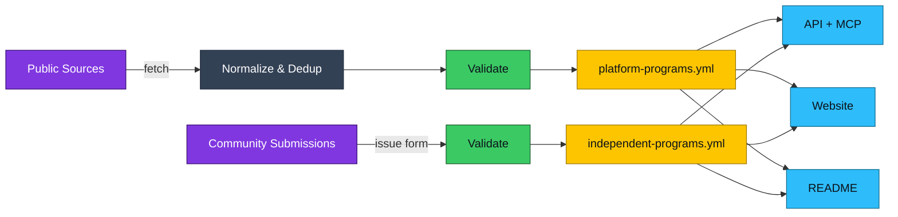

<p align="center">
  <a href="https://bug-bounties.as93.net">
    
  </a>
  <br><br>
  <i>A compiled list of companies who accept responsible disclosure</i><br>
  <a align="center" href="https://bug-bounties.as93.net">🔎 <b>Browse All Programs</b></a> |
  <a align="center" href="https://github.com/Lissy93/bug-bounties/issues/new?template=add.yml">➕ <b>Submit New Program</b><br></a>
</p>

<br>

---

## Top Programs

<!-- bounties-start -->
<!-- bounties-end -->

---

## About

The objective of this repo is to provide a centralized listing of public bounty programs, along with contact details and rewards.
Which can either be browsed via the [website](https://bug-bounties.as93.net) or integrated into your workflow using [MCP server](https://bug-bounties.as93.net/mcp) or [API](https://bug-bounties.as93.net/api).

We maintain a directory of independently-run programs in [`independent-programs.yml`](https://github.com/Lissy93/bug-bounties/blob/main/independent-programs.yml), and we also aggregate data from public sources (such as HackerOne, Bugcrowd, Intigriti, YesWeHack, Federacy, Disclose, etc), which is then normalized, deduplicated, validated against a schema, and merged into [`platform-programs.yml`](https://github.com/Lissy93/bug-bounties/blob/main/platform-programs.yml).



---


## Submitting a Program

To include a new self-managed CVD or bug bounty program to the website, add it to [`independent-programs.yml`](https://github.com/Lissy93/bug-bounties/blob/main/independent-programs.yml) (in alphabetical order by company name).
Either, fork the repo add you entry(s) and then open a PR, or just [open an issue](https://github.com/Lissy93/bug-bounties/issues/new?template=add.yml) or fill in [this form](https://bug-bounties.as93.net/submit), and we will add it for you.

<details><summary><b>Fields reference</b></summary>

Required fields are `company` and `url`, all others are optional

| Field | Type | Required | Description |
|---|---|---:|---|
| `company` | string | Yes | Company or program owner name |
| `url` | URL | Yes | Canonical program or security page URL |
| `contact` | string | No | Contact URL (`mailto:` or `https://`) |
| `rewards` | array | No | Reward types: `*bounty`, `*recognition`, `*swag` |
| `description` | string | No | Short program description (max 500 chars) |
| `program_type` | enum | No | `bounty`, `vdp`, or `hybrid` |
| `status` | enum | No | `active` or `paused` |
| **Scope** |  |  |  |
| `domains` | array | No | In-scope domains (flat list shorthand) |
| `scope` | array | No | Structured targets: `{target, type}` where `type` is one of `web`, `mobile`, `api`, `hardware`, `iot`, `network`, `cloud`, `desktop`, `other` |
| `out_of_scope` | array | No | Explicitly excluded targets or categories |
| **Payouts** |  |  |  |
| `min_payout` | number | No | Minimum payout amount |
| `max_payout` | number | No | Maximum payout amount |
| `currency` | string | No | Payout currency code (for example `USD`) |
| `payout_table` | object | No | Per-severity max amounts: `{critical, high, medium, low}` |
| **Rules** |  |  |  |
| `testing_policy_url` | URL | No | Link to full testing rules |
| `excluded_methods` | array | No | Forbidden techniques such as `dos`, `social_engineering`, `phishing`, `physical_access`, `automated_scanning` |
| `requires_account` | boolean | No | Whether testing requires an account |
| **Disclosure** |  |  |  |
| `safe_harbor` | enum | No | `full` or `partial` |
| `allows_disclosure` | boolean | No | Whether researchers may publish findings |
| `disclosure_timeline_days` | number | No | Coordinated disclosure window in days |
| `response_sla_days` | number | No | Committed acknowledgment time in business days |
| **Legal & Recognition** |  |  |  |
| `legal_terms_url` | URL | No | Link to participation terms |
| `hall_of_fame_url` | URL | No | Link to researcher acknowledgments page |
| `swag_details` | string | No | Description of swag offered (max 200 chars) |
| `reporting_url` | URL | No | Submission endpoint if different from `url` |
| **Communication** |  |  |  |
| `pgp_key` | string | No | URL to PGP key |
| `preferred_languages` | string | No | Preferred report languages |
| `standards` | array | No | Standards followed, for example `ISO 29147`, `disclose.io` |

</details>


<details><summary><b>Example entry</b></summary>

**Bare Minimum:**
```yaml
- company: Example Corp
  url: https://example.com/security
```

**Full:**
```yaml
- company: Example Corp
  url: https://example.com/security
  contact: mailto:security@example.com
  rewards:
  - '*bounty'
  program_type: bounty
  status: active
  min_payout: 100
  max_payout: 10000
  currency: USD
  payout_table:
    critical: 10000
    high: 5000
    medium: 1000
    low: 100
  safe_harbor: full
  allows_disclosure: true
  disclosure_timeline_days: 90
  response_sla_days: 3
  scope:
  - target: '*.example.com'
    type: web
  - target: Example Mobile App
    type: mobile
  out_of_scope:
  - Third-party services
  - Staging environments
  excluded_methods:
  - dos
  - social_engineering
  - phishing
  hall_of_fame_url: https://example.com/security/thanks
  preferred_languages: English
  standards:
  - ISO 29147
  description: Short description of the program scope and rules.
```

</details>

---

## Using the Data

- **Raw** - Download the latest JSON archive from the [Releases Page](https://github.com/lissy93/bug-bounties/releases)
- **API** - Access data programmatically via REST using [`bug-bounties.as93.net/api`](https://bug-bounties.as93.net/api/)
- **MCP** - Integrate the feed into your AI tooling with [`npx bug-bounties-mcp`](https://bug-bounties.as93.net/mcp/)
- **Web** - Browse and view all VDP/bounty programs at [bug-bounties.as93.net](https://bug-bounties.as93.net/)

---

## Mirror

A mirror of this repo and all data is published to CodeBerg, at: **[codeberg.org/alicia/bug-bounties](https://codeberg.org/alicia/bug-bounties)**

---

## Developer Usage

Start by clone the repo with `git clone git@github.com:Lissy93/bug-bounties.git && cd bug-bounties`

#### Data Aggregation
1. `make install` - Setup environment and install dependencies (from [`requirements.txt`](https://github.com/Lissy93/bug-bounties/blob/main/lib/requirements.txt))
2. `make populate` - Fetch the latest directory of programs, format, and write to `platform-programs.yml`
3. `make validate` - Verify and validate [`platform-programs.yml`](https://github.com/Lissy93/bug-bounties/blob/main/platform-programs.yml) and [`independent-programs.yml`](https://github.com/Lissy93/bug-bounties/blob/main/independent-programs.yml) against the [`schema.json`](https://github.com/Lissy93/bug-bounties/blob/main/lib/schema.json)
4. `make readme` - Generate and insert a summarized list of programs into the [`README.md`](https://github.com/Lissy93/bug-bounties/blob/main/.github/README.md)

#### Website
1. `cd web` to navigate into the [`web/`](https://github.com/Lissy93/bug-bounties/tree/main/web) directory
2. `npm i` to install dependencies
3. `npm run dev` to start the development server
4. `npm run build` to build the production site

#### Deployment
- Option 1) Upload the content of `web/dist/` into any web server, static hosting provider or CDN
- Option 2) Import the project into Vercel or Netlify directly, where it will be automatically deployed
- Option 3) For Docker, run `docker run -p 8080:8080 ghcr.io/lissy93/bug-bounties:latest`

Alternatively, all the above tasks can be run directly using GitHub Actions. Simply fork the project, and trigger the workflow(s).

---

## Credits

### Sponsors
Huge thanks to the following kind people, for their ongoing support in funding this, and other of my projects via [GitHub Sponsors](https://github.com/sponsors/lissy93)

[](https://github.com/sponsors/Lissy93)

### Contributors

[](https://github.com/Lissy93/bug-bounties/graphs/contributors)

### Attributions

#### Data Sources
- [arkadiyt/bounty-targets-data](https://github.com/arkadiyt/bounty-targets-data) - HackerOne, Bugcrowd, Intigriti, YesWeHack, Federacy
- [disclose/diodb](https://github.com/disclose/diodb) - Disclose.io vulnerability disclosure database
- [projectdiscovery/public-bugbounty-programs](https://github.com/projectdiscovery/public-bugbounty-programs) - ProjectDiscovery/Chaos
- [trickest/inventory](https://github.com/trickest/inventory) - Trickest asset inventory

#### Core Dependencies
- [Astro](https://astro.build) + [Svelte](https://svelte.dev) - website
- [PyYAML](https://pyyaml.org) - YAML parsing
- [jsonschema](https://python-jsonschema.readthedocs.io) - schema validation
- [rapidfuzz](https://github.com/rapidfuzz/RapidFuzz) - fuzzy deduplication
- [requests](https://requests.readthedocs.io) - HTTP client

---

## License

> _**[Lissy93/Bug-Bounties](https://github.com/Lissy93/bug-bounties)** is licensed under [MIT](https://github.com/Lissy93/bug-bounties/blob/HEAD/LICENSE) © [Alicia Sykes](https://aliciasykes.com) 2023 - 2026._<br>
> <sup align="right">For information, see <a href="https://tldrlegal.com/license/mit-license">TLDR Legal > MIT</a></sup>

<details>
<summary>Expand License</summary>

```
The MIT License (MIT)
Copyright (c) Alicia Sykes <alicia@omg.com> 

Permission is hereby granted, free of charge, to any person obtaining a copy 
of this software and associated documentation files (the "Software"), to deal 
in the Software without restriction, including without limitation the rights 
to use, copy, modify, merge, publish, distribute, sub-license, and/or sell 
copies of the Software, and to permit persons to whom the Software is furnished 
to do so, subject to the following conditions:

The above copyright notice and this permission notice shall be included install 
copies or substantial portions of the Software.

THE SOFTWARE IS PROVIDED "AS IS", WITHOUT WARRANTY OF ANY KIND, EXPRESS OR IMPLIED,
INCLUDING BUT NOT LIMITED TO THE WARRANTIES OF MERCHANT ABILITY, FITNESS FOR A
PARTICULAR PURPOSE AND NON INFRINGEMENT. IN NO EVENT SHALL THE AUTHORS OR COPYRIGHT
HOLDERS BE LIABLE FOR ANY CLAIM, DAMAGES OR OTHER LIABILITY, WHETHER IN AN ACTION
OF CONTRACT, TORT OR OTHERWISE, ARISING FROM, OUT OF OR IN CONNECTION WITH THE
SOFTWARE OR THE USE OR OTHER DEALINGS IN THE SOFTWARE.
```

</details>

<!-- License + Copyright -->
<p  align="center">
  <i>© <a href="https://aliciasykes.com">Alicia Sykes</a> 2026</i><br>
  <i>Licensed under <a href="https://gist.github.com/Lissy93/143d2ee01ccc5c052a17">MIT</a></i><br>
  <a href="https://github.com/lissy93"></a><br>
  <sup>Thanks for visiting :)</sup>
</p>

<!-- Dinosaurs are Awesome -->
<!-- 
                        . - ~ ~ ~ - .
      ..     _      .-~               ~-.
     //|     \ `..~                      `.
    || |      }  }              /       \  \
(\   \\ \~^..'                 |         }  \
 \`.-~  o      /       }       |        /    \
 (__          |       /        |       /      `.
  `- - ~ ~ -._|      /_ - ~ ~ ^|      /- _      `.
              |     /          |     /     ~-.     ~- _
              |_____|          |_____|         ~ - . _ _~_-_
-->

